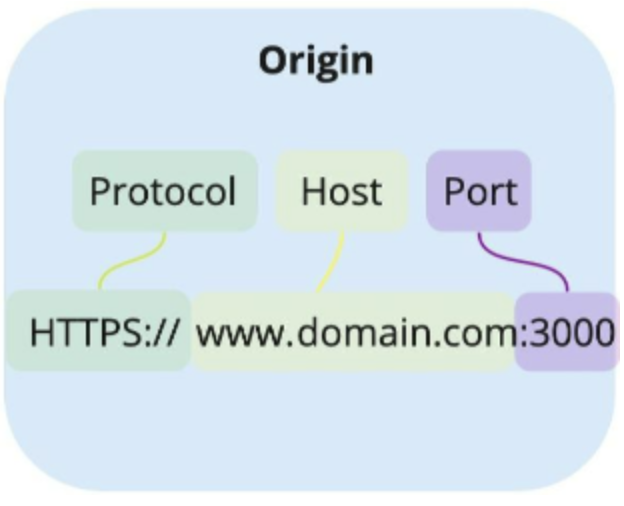
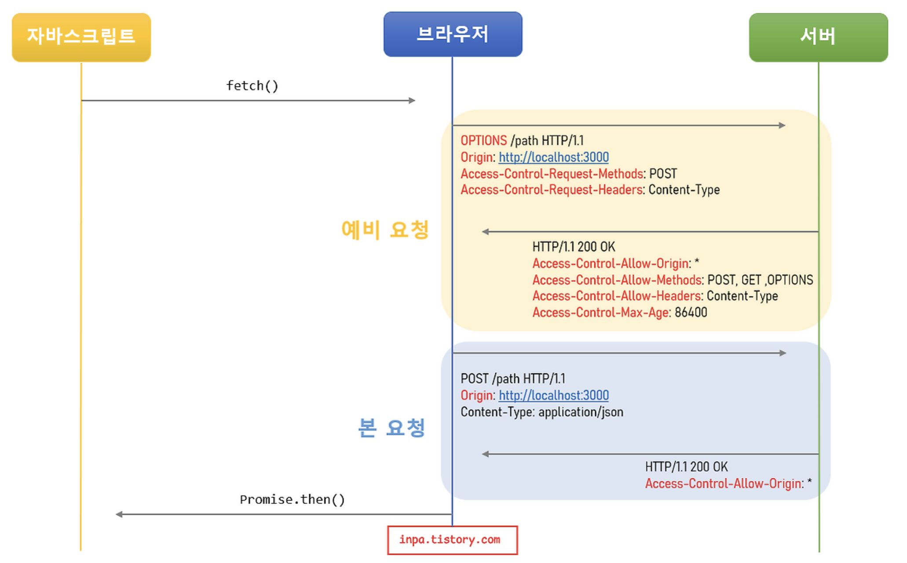

# CORS


## 개념


### 개요

- Cross-Origin Resource Sharing

  - 교차 출처 리소스 공유에 대한 허용/비허용 정책
  - 서로 다른 출처의 웹 페이지나 서버가 자원에 접근할 수 있도록 허용하는 보안 메커니즘

- XMLHttpRequest, Fetch API 스크립트는 기본적으로 Same-Origin 정책을 따름

  - js에서의 요청은 기본적으로 서로 다른 도메인에 대한 요청을 보안상 제한함
  - CSRF(Cross-Site Request Forgery) or XSS(Cross-Site Scripting) 등의 악의적인 방식으로 **다른 출처의 스크립트가 실행되는 것을 방지**

- Origin (출처)

  - Protocol + Host + Port

    


### CORS 작동 3가지 시나리오

1. 예비 요청 (Preflight Request)

   - 크기가 큰 데이터를 담아 보내야하는데 실패하면 안 되니 유효한지 사전에 체크

   

   - `Access-Control-Max-Age` : 예비 요청이 브라우저에 캐시 될 수 있는 시간을 초 단위로 설정

2. 단순요청

   - 예비 요청을 생략하고 바로 서버에 본 요청을 보낸 후, 브라우저가 CORS 정책 위반 여부를 검사

3. 인증된 요청 (Credentailed Request)

   - 자격 인증 정보(Credential)를 실어 요청할때 사용되는 요청

     - Credential : 쿠키(Cookie) 혹은 Authorization 헤더에 설정 토큰

   - [브라우저 설정] `credentials` 옵션 추가

     - 기본적으로 브라우저가 제공하는 요청 API 들은 별도의 옵션 없이 인증 데이터를 함부로 요청 데이터에 담지 않도록 되어있음
     - `credentials` 옵션을 설정하여 어떠한 요청에 인증 정보를 담을 수 있는 지 설정
       - `same-origin` (default) : 같은 출처 간 요청에만
       - `include` : 모든 요청
       - `omit` : 모든 요청에 넣지 않음

   - [서버 설정] 응답 헤더 제약 사항 존재

     - `Access-Control-Allow-Credentials` 항목을 true로 설정

     - `Access-Control-Allow-Origin`의 값에 와일드카드 문자(`*`) 사용 불가

     - `Access-Control-Allow-Methods`의 값에 와일드카드 문자(`*`) 사용 불가

     - `Access-Control-Allow-Headers`의 값에 와일드카드 문자(`*`) 사용 불가

   - Ex) go fiber

     ```go
     router.Use(cors.New(cors.Config{
     		AllowOrigins: "http://www.lomoninvest.shop:50001",
     		AllowHeaders: "Origin, Content-Type, Authorization",
     		AllowMethods: strings.Join([]string{
     			fiber.MethodGet,
     			fiber.MethodPost,
     			fiber.MethodHead,
     			fiber.MethodPut,
     			fiber.MethodDelete,
     			fiber.MethodPatch,
     		}, ","),
     		AllowCredentials: true,
     		MaxAge:           60 * 60 * 1,
     	}))
     ```
   
   - Ex) nginx
   
     ```nginx
     add_header 'Access-Control-Allow-Origin' 'http://mydomain.com' always;
     add_header 'Access-Control-Allow-Methods' 'GET, POST, OPTIONS' always;
     add_header 'Access-Control-Allow-Headers' 'Content-Type, Authorization' always;
     add_header 'Access-Control-Allow-Credentials' 'true' always;
     
     if ($request_method = 'OPTIONS') {
         return 204;
     }
     ```
   
     

[출처](https://inpa.tistory.com/entry/WEB-%F0%9F%93%9A-CORS-%F0%9F%92%AF-%EC%A0%95%EB%A6%AC-%ED%95%B4%EA%B2%B0-%EB%B0%A9%EB%B2%95-%F0%9F%91%8F)

## 실습


### Flutter web

1. [오류 케이스 1] CORS 오류 발생
   - 개요
     - 브라우저로 web 접속 시 front 화면은 잘 불러와 짐. 다만, backend 통신 시 CORS 오류 발생
   - 오류 확인 방법
     - browser > 개발자 도구 > network > 실패한 요청의 header 부분 확인하여 `Origin` 영역 확인하기
     - console 오류 확인해보기
   - 원인
     - request와 response에 찍히는 origin 영역이 다름 => CORS 위반
   - 해결
     - bakcend에 대한 접속을 nginx proxy 로 패스로 접속할 수 있게하여 ORIGIN을 맞춤
2. [오류 케이스 2] net::ERR_CONNECTION_REFUSED 발생
   - 개요
     - 로컬 테스트 시에는 정상적으로 통신
     - 외부 device에서 web에 접속 시, backend 통신에 오류 발생
   - 오류 확인 방법
     - network 탭 & console 탭 확인
   - 원인
     - front에서 backend 호출하는 영역이 `localhost:{port}/{path}` 형식으로 nginx를 부르고 있었음
     - 이로 인해서, front를 localhost로 불렀을 때에는 같은 Origin이었지만, 외부에서는 다른 Origin으로 호출하는 것으로 인식됨
   - 해결
     - front에서 backend 호출하는 url를 외부 url로 설정
   
   :bulb: 결국 backend와 web의 Origin을 일치시키고, 호출도 해당 Origin으로 하면 backend에서 CORS 설정 필요 없음


