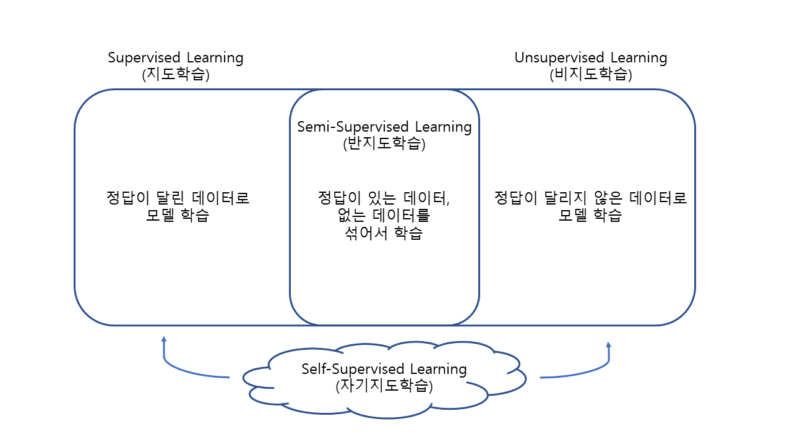

# AI Tech Letter

## 1. 인공지능 첫 걸음

### 인공지능에 대한 오해와 진실

- 오늘날 인공지능의 90% 이상은 지도학습

- 인공지능의 학습 및 추론이란 데이터를 벡터나 매트릭스 형태의 텐서로 만들어 복잡한 행렬 연산을 하는 것

### 인공지능이란

#### 강 인공지능 vs 약 인공지능

- 강 인공지능 = 범 인공지능
  - 명령 없이 스스로 판단하고 결정
  - 다양한 상황에 유연하게 대처
  - 사람과 자연스러운 대화
- 약 인공지능
  - 제한된 환경에서 구체적인 특정 업무 수행
  - ex) 알파고
- 범용성과 전문성은 절대적인게 아니라 정도의 차이

#### 넓은 의미의 AI vs 좁은 의미의 AI

- 넓은 의미 : 자동화 프로그램
- 좁은 의미 : 딥러닝(인공신경망)을 기반으로 데이터만 가지고 인간의 사고/행동 표방 가능
- 기분 기준
  - 판단 방식
  - 특징 추출

- AI : 기계 자동화 > Machine Learning > Deep Learning
  - 기계 자동화
    - 주요 정보 및 판단 규칙을 사람이 설계
    - 규칙 기반 프로그래밍
  - 머신러닝
    - 데이터로부터 의사결정 위한 패턴 학습
    - 특징만 사람이. 판단 모델은 모델링과 학습 통해 구현
  - 딥러닝 
    - 인공신경망 기반의 모델로, 비정형 데이터로브터 특징 추출 및 판단까지 기계가 한번에 수행
    - Raw Data로부터 모델링과 학습으로 모든 것을 구현
    - ex) CNN, RNN

## 2. 기계도 사람처럼 판단할 수 있을까?

### 머신러닝과 딥러닝

- 머신러닝 기반 기술
  - 정형 데이터 처리하는 빅데이터 분석 기법
  - ex)
    - 선형/로지스틱 회귀분석
    - 의사 결정 나무
    - ARMA, ARMIA (시계열)
- 딥러닝
  - 비정형 데이터, raw 데이터

### 모라벡의 역설

- 사람에게 쉬운 것이 기계에게 어렵고, 기계에게 쉬운 것이 사람에게 어렵다

### 인공신경망

- 생물학적 뉴런의 모양을 본따서 만든 것이 인공 뉴런
- 이전 뉴런이 넘겨준 데이터 받아들여 가중합 연산 후 비선형 함수를 적용해 정보를 가공 => 다음 뉴런에 토스

### 딥러닝 유행 배경

- 양질의 데이터를 다량 필요
- 높은 스펙의 하드웨어 필요

## 3. 시각을 얻은 인공지능

### 인공신경망 연산

- 딥러닝 모델은 인공뉴런을 여럿 연결한 인공신경망 기반

- 인공신경망은 가중합과 비선형 함수로 이루어진 연산

  => 입력 데이터로 벡터나 행렬 필요

### 기계의 이미지 인식

- 흑백
  - 2차원 
  - 1, 0
- 컬러
  - 3차원 텐서 (RGB)
  - 3 channel, 3 depth

### CNN (Convolutional Neural Network)

- Feature Extraction 영역

  - 이미지로부터 특징을 추출

  - 컨볼루션 연산과 풀링 연산 수행

    - 컨볼루션 연산

      - 컨볼루션 필터(커널)가 입력 이미지를 상하좌우로 훑으며 주요 특징 찾아냄

      - 필터 多 => 다양한 특징 파악 可

        => Feature Map (Convolved Feature)

    - 풀링 연산
      - Feature Map을 훑으며 핵심적인 정보만을 영역별 샘플링
      - 주로 MaxPooling : 영역 내 가장 큰 값만 남김

    => Feature Leanring

- 태스크 수행 영역

  - 특정 태스크 수행을 위해 덧붙임
  - 종류
    - Classification
    - Detection
    - Segmentation (경계 / 영역)

## 4. 언어를 이해하는 인공지능

### 자연어이해(NLU : Natural Language Understanding)

- NLP > NLU
  - NLP : 언어의 형식, 구몬론 포함
  - NLU : 감성분류, 요약

- 자연어 <=> 인공어

### 텐서 변환

- Tokenizing ( Parsing )
  - 한국어는 교착어로 형태소 단위 or 음절 단위로 자름
  - 뉴스, 논문 => 형태소 / 채팅, SNS => 음절이 좋음
  - 등장 빈도가 높은 N-gram 단위 토크나이징 : 둘의 장점 취함
- 워드 임베딩 (word embedding)
  - 토큰 => 벡터화
  - 종류
    - 원-핫 인코딩
      1. 토큰나이징 후 토큰들 중복 제거 => 사전
      2. 사전 길이만큼 벡터 정의
      3. 벡터에서 토큰의 순서에 해당 위치만 1. 아니면 0
      4. 토큰들을 벡터로 교체.
    - CBOW , SKIPGRAM
      - 단어(토큰)을 특정 길이의 임의 벡터로 생성 (길이는 사람이 지정)
      - CBOW
        - 문장 INPUT => 중간 단어 유추
        - 비슷한 단어들끼리 유사한 벡터 공간으로 임베딩
        - 토큰 끼리의 의미 연산 可
      - SKIPGRAM
        - 토큰 INPUT => 주변 문맥 생성

### 자연어이해 과제들

- 문장/문서 분류
- Sequence-to-Sequence
  - 번역 / 요약 / 자유 대화
- 질의 응답
  - MRC (Machine Reading Comprehension) : 최적 답변 리턴
  - IR (Information Retrieval) : 가장 유산 과거 질문 / 답변 리턴

## 5. 과거의 경험을 통해 현재를 배우는 인공지능

### RNN (Recurrent Neural Network)

- 누적된 과거 정보를 가지고 예측
- 장점
  - 과거 처리 내역 반영 => 더 나은 결정
  - 가변 길이의 데이터 처리 O
  - 다양한 구성의 모델
    - 1:1 ~ 多 : 多
    - 입력 데이터 정보 누적 (인코딩) + 결과 출력(디코딩)

- 단점
  - 느린 연산 속도
    - 병렬 처리 X. 순차적으로 데이터 처리
  - 불안정한 학습
    - Timestep이 길수록 문제 발생 확률 :arrow_up:
    - Gradient Exploding : 인공 신경망이 학습해야 할 값이 폭발적으로 증가
    - Gradient Vanishing : 과거의 이력이 현재 추론에 거의 영향 X
  - 실질적으로 과거 정보 잘 활용 X
    - 장기 종속성 / 의존성 문제 (Long-term dependency)
    - 먼 과거 정보 여러번 압축 + 누적 => 영향 :arrow_double_down:

### 보안책

- LSTM (Long-Short Term Memory)
  - 과거 정보 중 가중치
  - 구성 : 3 Gate
    1. Forget Gate
       - 불필요 정보 폐기
    2. Input Gate
       - 현재 정보 반영 정보 결정
    3. Output Gate
       - 현재 시점 최종 정보를 다음 시점에 얼마나 넘길지 결정
  - 단점 : 느린 속도
  - GRU(Gated Recurrent Unit) 과 유사

:bulb: 전통적인 머신러닝 기법에서는 ARIMA 기법을 통해 데이터 정보 흐름을 파악하고, 주기적으로 반복되는 패턴을 반영하여 분석함

## 6. 헛똑똑이 인공지능 제대로 가르치기

### AI Process

- Offline Process = Training Pipeline

  - 과거 데이터 가공
    - Generate Features (데이터 정제 및 필요 부분 확보)
    - Collect Labels (라벨링)
  - Trani Modles
    - Validate & Select Moldes (좋은 성능 도달까지 학습)
    - 튜닝 (실험 Experiment 반복)

  - Pulish Model
    - 배포 선택

- Online Process

  - 머신/딥러닝 < 개발 영역 (Application)

  - Load Model

    - AI를 운영 환경에 띄움

  - Live Data

    - 기존 정리된 데이터 X

      

### 오버피팅과 일반화 성능

- Generalization

  - 이전에 본적 없는 데이터에 대해서도 잘 수행하는 능력

- Overfitting

  - 훈련 시에만 정상 동작

    

### Training, Validation, Test

- Training : Validation : Test set 비율 = 8:1:1 or 6:2:2
- Training Set
  - 모델 학습에 이용 데이터
  - 최적화
- Validation Set
  - 튜닝에 이용
  - 일반화 성능 판단
- Test Set
  - 학습에 어떤 식으로도 전형 관여 X.
  - 모델 최종 성능 평가 

### 학습 곡선 (Learning Curve)

- 학습이 진행됨에 따라 모델의 성능을 기록

- Training Set과 Validaiton Set의 학습 곡선 확인으로 오버피팅 확인

### Regularization

- 정규화

- 일반화 성능 향상

- 방식

  - 데이터 증강 (Data Augmentation)
    - 과도한 변형 주의
  - Capacity 줄이기
    - 모델의 복잡도 :arrow_down:
    - 필요 이상의 Capacity ~> 데이터 암기

  - 조기 종료 (Early Stopping)
  - 드롭아웃 (Dropout)
    - 학습 과정에서 일정 비율 p 만큼의 노드(인공뉴런) 무작위 끔

## 7. 다시 쓰고 바꿔 쓰자! 인공지능 재활용하기

### 쉽지 않은 인공지능 적용하기
- 구체적이지 않으며 불명확한 태스크
  - 요구사항은 명확한 목표와 함께 하위 기능들로 쪼개어 도출
  - ex) STT(Speech-to-text) 솔루션, 토픽 클러스터링 (Topic Clustering) 활용 등

- 적은 데이터, 낮은 품질의 데이터
  - 학습 특성상 **양질의 다양한 데이터** 필요

- 다른 도메인 환경
  - 도메인 적응 문제 : 추론 환경이 달라지면 기능 수행 X

### Transfer Learning : 한번 만든 인공지능 모델 우려먹기

- 하나의 모델이 이미 배워놓은 지식은 잘 유지하면서, 새로운 태스크에 대해 필요한 지식을 추가로 습득할 수 있게 
- 완전 새로운 모델에 비해 더 적은 학습량으로 더 많은 지식 가짐
- Catastrophic forgetting : 치명적인 기억상실
  - 새로운 정보를 학습할  이전에 배웠던 정보 완전히 잊어버리는 경향

### 더 나은 Transfer Leanrning을 위한 방법

- 레이어 동결 (Layer freezing)
  - 후반부의 신경망 층에 대해서만 파라미터를 학습. 전반분의 파라미터는 학습되지 않도록 고정
  - 학습했던 모델은 학습한 데이터의 기본적인 특성은 이미 알고 있기 때문
- Discriminative fine-tuning
  - 층마다 학습률에 차별을 둠 => 후반부의 인공신경망에 크게 설정
  - 학습률(Learning Rate)
    - 한 번에 인공신경망에 파라미터를 얼마나 업데이트 시킬지에 대한 정도
    - 사람이 설정

### Transfer Learning 모델 이용

- 오픈 도메인 데이터로 학습한 모델을 특정 도메인의 태스크에 적용
- 컴퓨전 비전에서의 Transfer Learning
  - 이미지넷 데이터로 학습 모델
  - ex) GoogleNet, ResNet
- 자연어 이해(NLU)에서의 Transfer Learning
  - ex) KorQuAD : 자사에서 한국어 위키백과 학습시킨 모델

## 8. 준비된 인공지능, Pre-trained AI

### Pre-training : 니가 뭘 요청할지 몰라서 일단 다 공부해놨어

- 여러 태스크에 활용하기 위해 여러 지식을 미리 두루두루 학습해놓은 인공지능
  - **Pre-training(사전 학습)** / **Pre-trained Model (사전학습 모델)**

### 대규모 데이터에 대한 Pre-training

- 대규모의 오픈도메인 데이터에 대해 수행되는 것이 일반적
- 시각 데이터에 대한 사전학습
  - 이미지 : 이미지넷
  - 동영상 : Youtube-8M
- 언어 데이터에 대한 사전학습
  - 위키피디아, 나무위키, 세종말뭉치

### Self-Supervised Learning : 나 혼자 어떻게든 해볼게

- 정답 라벨이 붙어있는 데이터가 부족할 경우, 기계가 시스템적으로 <u>자체 라벨을 만들</u>어서 사용하는 학습 방법
- 관점
  - 사람이 라벨을 만들 필요가 없다 : Unsupervised Learning
  - 자체적으로 라벨을 만들어서 사용한다 : Supervised Learning

- 예시
  - 이미지 : Input 데이터 회전시키며 라벨 부여된 데이터 생성
  - 텍스트 : 라벨링된 데이터에서 텍스트의 중간 단어를 빈칸으로 대체 후 학습
  - Google BERT 
    - 사전 학습 자체가 주인 모델

## 9. 족집게 데이터로 인공지능 학습하기

### Active Learning 

- 개요
  - 기술도 데이터는 많으나, 인공지능을 학습시킬 데이터를 마련하기 힘들 때 사용
  - 라벨링 할 수 있는 인적 자원은 있지만, 많은 수의 라벨링을 수행할 수 없을 때 효과적으로 라벨링 하기 위한 기법
- Motive
  - 모델이 잘 맞추기 어려운 데이터를 찾아 학습한다면, 더 적은 훈련시간으로 더 좋은 성능을 낼 수 있을 것이다.
- Objective
  - Labeling을 위한 예산이 한정되었을 때, 모델의 성능을 극대화할 수 있는 Labeling 대상 데이터 찾기

<=> Passive Learning (수동 학습) : 주어진 라벨 데이터만 가지고 모델을 학습

### Active Learning 절차

1. Training a Model
   - 초기 학습 데이터를 이용해 모델을 학습한다.
2. Select Query
   - 라벨이 되지 않은 데이터 풀로부터 모델에게 도움이 되는 데이터를 선별합니다.
3. Human Labeling
   - 선별한 데이터를 사람이 확인하여 라벨을 태깅합니다.
4. 선별한 라벨 데이터를 기존 학습 데이터와 병합한 후, 다시 모델을 학습

### Query Strategy : 이 데이터를 제게 가르쳐 주십시오

- 쿼리 전략 : Active Learning의 핵심으로 성능 향상에 효과적인 데이터 선별하는 방법
- 종류
  - Uncertainty Sampling
    - 학습된 모델의 판정 값을 기반으로 뽑음
    - 가장 단순한 쿼리 전략
    - AI가 가장 불확실하다 라고 생각하는 데이터 추출하여 라벨링 요청
  - Query by committee
    - 여러 개의 모델을 동시에 학습시키면서 많은 모델이 틀린 데이터 선별
    - 여러 AI 모델가의 의견 불일치를 종합 고려
  - 기타
    - Expected Impact : 데이터가 학습 데이터로 추가될 때, 학습된 모델이 가장 많이 변화하는 데이터를 선별
    - Density weighted method : 데이터가 밀집된 지역의 데이터들을 선별
    - Core-set approach  : 데이터들을 최대한 고르게 뽑아서 전체 분포를 대표할 수 있도록 데이터 선별

## 10. 뭣이 중한지 알아보는 인공지능

### 긴 입력 데이터 처리하기

#### 어텐션 메커니즘 (Attention mechanism)

- 인공신경망이 입력 데이터의 전체 또는 일부를 되짚어 살펴보면서 어떤 부분이 의사결정에 중요한지, 중요한 부분에 **집중**하는 방식
- vs RNN
  - RNN
    - 입력 문장의 단어 하나 하나를 누적 => 압축 => 인코딩 => 전체 문장 인코딩 완료 =>디코딩
    - 해당 벡터는 모든 문장 누적 but, 앞부분 내용은 너무 압축되어 잊어버린 것과 마찬가지
  - Attention
    - <u>현재 디코딩할 단어에 조금 더 집중</u>하여 <u>전체 입력을 다시 한번 재조정</u>한 입력 데이터 인코딩 벡터를 생성

#### 어텐션 스코어 (Attention Score)

- 중요한 단어에 집중 = 어텐션 스코어 계산
- 각 인코딩 timestep마다 계산된 특징(feature)을 가지고 자동으로 계산하는 0~1 사이 값
- 1에 가까울 수록 집중

#### 컨텍스트 벡터 (Context Vector)

- 중요도에 따라 전첵 문맥의 정보를 잘 반영하고 있는 벡터
- 현재 디코딩할 단어와의 <u>관련성을 반영하여 다시 입력 문장 인코딩</u>하며 도출됨

#### 포인트

- 과거의 모든 데이터의 특징을 고려한다
- **스스로 집중할 영역을 파악**한다

### XAI로서의 어텐션

- 설명 가능한 인공지능(eXplainable AI : XAI)로서, 기계가 중요하게 생각하는 부분을 우리에게 알려줌
  - or 해석가능한 인공지능(interpretable AI) 
- 텍스트에서의 어텐션
- 이미지에서의 어텐션

### Attention 전성시대, Transformer

- attention으로만 이루어진 인공신경망 구조

- 특징
  - 입력 데이터끼리의 self-attention을 통해 상호 정보교환을 수행
  - 문자 내의 단어들이 서로서로 정보를 파악 => 주변 단어간의 관계, 문맥 파악
- 장점
  - 순차적 계산 필요 X => RNN보다 빠르면서 맥락 파악 잘함
  - CNN처럼 일부만 X. 전 영역 확인

- 단점
  - 모델의 크기가 큼
  - 고사양의 하드웨어 스펙 요구

## 11. 스스로 진화하는 인공지능, AutoML

### 사람의 손을 필요로 하는 인공지능

- 튜닝 시, 고려대상 너무 많음

### 스스로 진화하는 인공지능, AutoML

- 특정 태스크를 위한 모델 학습에 한하여, 사람이 주기적으로 실험에 개입하지 않아도 AI 스스로가 반복실험을 통해 성능을 개선
- 종류
  1. Feature Engineering 자동화
     - AI 모델을 학습하기 위해 데이터로부터 중요한 특징(feature)을 선택하고 인코딩하는 방식
  2. 하이퍼파라미터를 자동으로 탐색
     - 하이퍼 파라미터 : AI 모델 학습에 필요한 사람의 설정들
  3. 아키텍처 탐색
     - AI 모델의 구조 자체를 더 효율적인 방향으로 탐색

#### 하이퍼파라미터 탐색 자동화

- 하이퍼파라미터 종류

  - 학습률 : 파라미터 업데이트를 얼만큼 큰 단위로 할지
  - 미니배치 사이즈 : 데이터를 얼마나 쪼개어 학습할지
  - 에폭 : 데이터를 몇 번 반복 학습할지
  - etc) 모멘텀, 컨볼루션 필터의 수, 스트라이드

- 하이퍼파라미터 조합 탐색 방법

  - 그리드 서치 (Grid Search)
    - 방식
      1. 최적화할 하이퍼파라미터의 값 구간을 일정 단위로 나눔 
      2. 각 단위 조합을 테스트
      3. 가장 높은 성능을 낸 조합 선택
    - 단점
      - 불필요한 탐색에도 시간 허비
  - 랜덤 서치(Random Search)
    - 랜덤하게 조합 테스트
    - 그리드서치에 비해 비교적 빠르게 최적의 조합 찾음

  :bulb: 그리드 서치, 랜덤 서치는 단수 for문으로도 구현 O

  - Meta Leaner
    - RNN과 강화학습을 활용 => 최적의 하이퍼파라미터 탐색
    - 메타 학습 = Learn to Learn

#### 아키텍처 탐색 자동화 : NAS

- Neural Architecture Search
- RNN과 강화학습 접목한 형식으로 구성
- 인공신경망 아키텍처가 어떻게 구성되면 좋을지 결정, Learner의 태스크 수행 결과를 보상으로 활용

### AutoML 특징

- 사람의 고민 없이, 사람이 고안한 모델 이상의 성능
- 기계가 다양한 시도 해보도록 시간 필요
- 고사양 하드웨어 스펙 필요

### AutoML 서비스

- AWS, Azure, GCP(Google Cloud Platform)와 같은 CSP 업체는 모두 AutoML 서비스 제공
- GCP(Google Cloud Platform) 소개

## 12. 설명 가능한 인공지능, XAI

### 종종 이해할 수 없는 결정을 내리는 AI

- 딥러닝 모델은 어떻게 결과를 도출했는지에 대해 사람의 해석 여지가 매우 부족
  - 룰 기반 모델, 회귀 모형, 의사결정 나무의 경우 해석 여지 O

### 설명 가능한 인공지능, XAI(eXplainable Artificial Intelligence)

- 딥러닝 모델은 알고리즘의 복잡성으로 이해 `블랙박스`로 불림
- 모델에 설명력을 부여 => 사용자가 모델의 최종 결정을 이해 & 결과의 타당성 확인 => 신뢰성 :arrow_up:

#### XAI를 위한 접근법

- DARPA (Defense Advanced Research Projects Agency)
  - 대표 기관
  - 3가지 접근 방식
    1. **기존 AI 모델에 설명할 수 있는 특정 모듈 장착**
       - 어텐션 매커니즘 활용한 XAI
         - 입력 데이터의 어떤 부분에 집중해서 판단했는지 시각화
       - 설명하는 법 학습하기 
         - RNN 모듈 등을 덧붙여 설명 생성
         - 한계 존재 => 널리 사용 X
       - 모듈러 네트워크 방식
         - 판정 결과가 어떤 모듈 경로를 따라 연산되는지 파악
       - Feature Identification
         - 설명 가능한 특징을 학습한 노드를 찾아서, 그 특징에 설명 라벨 부착
    2. **애초에 설명력 있는 모델 생성**
       - ex) 의사결정나무, 선형회귀분석
    3. **인공신경망처럼 복잡한 블랙박스 모델의 일부분을 설명해 줄 수 있는 다른 모델 활용하여 유추**
       - LIME, SP_LIME

