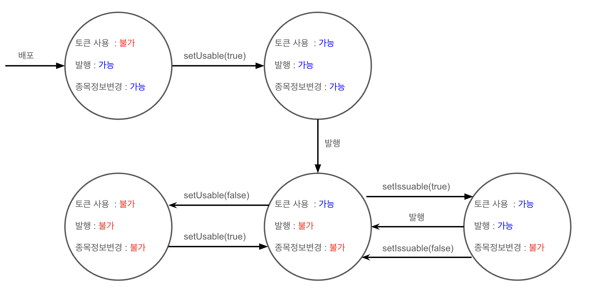
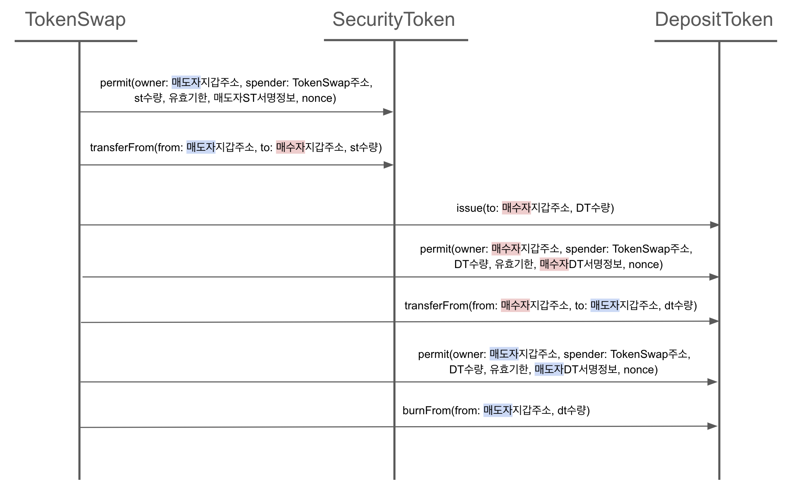
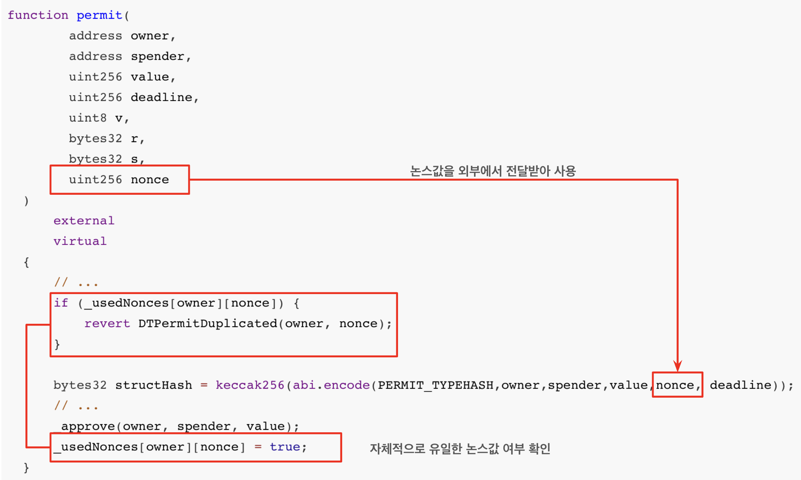
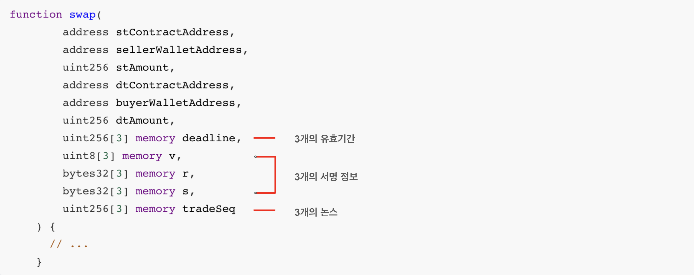

# smart contract


## 컨트랙트 개요

<개요 그림>

- 공통 컨트랙트
  - 정의 : 컨소시엄 내에서 전체적으로 사용될 **기관/고객의 권한 관리**와 상호에게 **공개되어야하는 내용을 기록**을 담당하는 컨트랙트
  - 종류 
    - Whitelist - 기관별 고객의 권한 관리 (토큰 전송 가능 여부 확인)
    - TokenMaster - 컨소시옴 간 토큰 정보 공유
    - Dividend - 배당 정보 저장
    - (InstitutionManagement) - 기관 권한 관리 컨트랙트. 실제 배포되지는 않고, 3개의 공통 컨트랙트가 상속하여 사용
- 고유 컨트랙트
  - 정의 : 각 사의 비지니스 로직에 맞게 종목 관련 로직을 처리하는 컨트랙트
  - 종류
    - SecurityToken - 토큰 증권 컨트랙트
    - DepositToken - 예금 토큰 컨트랙트. ST 매수자의 거래 대금을 나타내며, ST 거래 내역을 블록체인 상에 기록하기 위한 컨트랙트
    - TokenSwap - ST와 DT의 swap 수행
    - Vote - 종목별 투표 결과 저장


## 고유 컨트랙트


### SecurityToken

#### 개요

- 토큰증권 컨트랙트로, 증권성을 띠는 실물자산을 담보로 블록체인 네트워크 상에서 발행된 토큰

#### 구현

<그림 첨부>

- **IERC-1400** : ERC-1400 표준 인터페이스

  - ERC-1410 : Partially Fungible Token Standard

    - 토큰이 partition 단위로 그룹화되어, 세분화된 관리 가능
    - 본 프로젝트에서는 파티션 관련 비지니스 로직이 부재하여  `GENESIS_PARTITION`이라는 이름의 단일 파티션만 사용

  - ERC-1594 : Core Security Token Standard

    - `canTransfer`, `canTransferByPartition` 에서 토큰 transfer 시에 추가적인 검증 절차 수행

    - EIP-1066 기반 상태 코드와 더불어 상세 원인 추가 반환

      ```solidity
      function _canTransferByPartition(...) internal view virtual returns (bytes1, bytes32) {
            if (!_usable) {
                return (0x54, bytes32("transfers halted (unusable)"));
            } else if (_paused) {
                return (0x54, bytes32("transfers halted (paused)"));
            } else if (from == address(0)) {
                return (0x56, bytes32("invalid sender"));
            } // ...
            
            return (0x51, bytes32("SUCCESS")); 
        }
      ```

  - ERC-1643 : Document Management Standard

    - 증권형 토큰에 필요한 문서 작업

  - ERC-1644 : Controller Token Operation Standard

    - 규제 및 법적 감독 대상이기 때문에 특정한 주체(컨트롤러)에게 토큰의 전송을 강제할 수 있는 권한 부여

- **ISecurityToken**

  - 종목 관련 업무 프로세스를 지원하기 위해 컨소시엄 내에서 공통으로 정의한 인터페이스 (목록 하단 참고)

  - 신규 기관이 컨소시엄에 추가될 때는 기존에 협의된 인터페이스를 준수해서 구현하며, 변경 시 컨소시엄 내 협의

  - 공유 영역 정의

    - 공통 이벤트 정의 : 배정(allotment)과 소각(redeem)을 비롯한 기타 공통 이벤트 정의
    - 공통 커스텀 에러 정의 : 오류 처리를 `require`가 아닌 `revert`만을 사용하는 것으로 통일

    => Event와 Custom Error가 정의된 ST Interface를 정의하고 해당 Interface를 각 사에서 구현

    ```solidity
    interface ISecurityToken {
    	// ...
    	event Allotment(address indexed from, address indexed to, uint256 amount);
      	event Burn(address indexed operator, address indexed from, uint256 amount);
    
        error STUnissuableState();
        error STPausedState();
        error STUnusableState();
    }
    ```

- **AccessControl** : 권한 관리를 위한 openzeppelin 라이브러리로, 발행자 권한, 기관 권한, 컨트롤러 권한으로 구분

  - ISSUER_ROLE(발행자 권한)
    - `setPledgedBalance`, `setLimitedBalance`, `setIssuable`, `setPaused`, `setUsable`, `setDocumentWithRealName`, `setTokenSpec`, `setWhitelist`, `allotment`, `burn`, `setLimitedBalanceByPartition`, `issueByPartition`, `issue`, `setDocument`
  - INSTITUTION_ROLE(기관 권한) : `lock`, `unlock`, `lockByPartition`, `unlockByPartition`
  - CONTROLLER_ROLE(컨트롤러 권한) : `controllerTransfer`, `controllerRedeem`

#### 권한

- 컨소시옴 내 기관 주소를 각 사가 모두 소지하며, 종목 배포 시 모든 기관에게 **INSTITUTION_ROLE**과 **CONTROLLER_ROLE** 부여


  - 참여 기관들은 타사의 종목 토큰에 대해 잠금과 강제전송에 대한 권한을 모두 공유하는 것으로 협의

#### ST 상태 다이어그램

- 비지니스 로직 단계에 맞게 ST의 상태를 변화시켜, 무분별한 ST의 수행을 막음



- 이외에도 `setPaused` 함수로 **거래정지여부** 설정 가능
  - 거래 정지 상태에서는 배정(allotment)과 강제전송(controllerTransfer)만 가능
  - 이 외의 `transfer` 포함 함수는 실행 불가


:bulb: **ISecurityToken** 목록

| 함수                             | R/W 구분 | 호출 권한   | 설명                            |
| -------------------------------- | -------- | ----------- | ------------------------------- |
| isin                             | READ     |             | isin 조회                       |
| issuerName                       | READ     |             | 발행자명 조회                   |
| pledgedBalanceOf                 | READ     |             | 질권수량 조회                   |
| isTrust                          | READ     |             | 신탁여부 조회                   |
| trustName                        | READ     |             | 신탁명 조회                     |
| limitedBalanceOf                 | READ     |             | 처분제한 수량 조회              |
| lockedBalanceOf                  | READ     |             | 주문 락 수량 조회               |
| isPaused                         | READ     |             | 거래 정지여부 조회              |
| issuer                           | READ     |             | 발행자 지갑주소 조회            |
| institutionBalanceOf             | READ     |             | 기관별 수량 조회                |
| isUsable                         | READ     |             | 토큰 사용가능여부 조회          |
| getWhitelistAddress              | READ     |             | 화이트리스트 컨트랙트 주소 조회 |
| bundleBalanceOf                  | READ     |             | 잔고/주문락 수량 동시 조회      |
| cantTransferBalanceOf            | READ     |             | 전송불가 수량 조회              |
| balanceOfBatch                   | READ     |             | 잔고 조회 (다건)                |
| pledgedBalanceOfBatch            | READ     |             | 질권수량 조회(다건)             |
| lockedBalanceOfBatch             | READ     |             | 주문 락 수량 조회(다건)         |
| getDocumentWithRealName          | READ     |             | 실제 문서명으로 문서 조회       |
| getTokenSpec                     | READ     |             | 종목 정보 조회                  |
| totalSupplyByPartition           | READ     |             | (파티션) 총량 조회              |
| lockedBalanceOfByPartition       | READ     |             | (파티션) 주문 락 수량 조회      |
| limitedBalanceOfByPartition      | READ     |             | (파티션) 처분제한 수량 조회     |
| cantTransferBalanceOfByPartition | READ     |             | (파티션) 전송불가 수량 조회     |
| setPledgedBalance                | WRITE    | 발행자 권한 | 질권수량 설정                   |
| setLimitedBalance                | WRITE    | 발행자 권한 | 처분제한 수량 설정              |
| lock                             | WRITE    | 기관 권한   | 주문 락 수량 설정               |
| unlock                           | WRITE    | 기관 권한   | 주문 락 수량 해제               |
| setIssuable                      | WRITE    | 발행자 권한 | 발행 가능여부 설정              |
| setPaused                        | WRITE    | 발행자 권한 | 거래 정지여부 설정              |
| setUsable                        | WRITE    | 발행자 권한 | 토큰 사용여부 설정              |
| setDocumentWithRealName          | WRITE    | 발행자 권한 | 실제 문서명으로 문서 등록       |
| setWhitelist                     | WRITE    | 발행자 권한 | 화이트리스트 변경               |
| setTokenSpec                     | WRITE    | 발행자 권한 | 종목 정보 설정                  |
| permit                           | WRITE    | 기관 권한   | 전송 권한 위임                  |
| allotment                        | WRITE    | 발행자 권한 | 배정                            |
| burn                             | WRITE    | 발행자 권한 | 소각                            |
| lockByPartition                  | WRITE    | 기관 권한   | (파티션) 주문 락 수량 설정      |
| unlockByPartition                | WRITE    | 기관 권한   | (파티션) 주문 락 수량 해제      |
| setLimitedBalanceByPartition     | WRITE    | 발행자 권한 | (파티션) 처분제한 수량 설정     |


​    

### DepositToken

- 개요
  - 예금 토큰 컨트랙트로, ST 매수자의 거래 대금을 나타내는 컨트랙트
- 역할
  - 단순 거래 기록 목적으로써 발행
  - swap 발생 시 매수자의 거래 대금만큰 DT를 발행하고, ST와의 교환 이후 바로 소각
- 배포 시 주의사항
  - 배포 시 먼저 배포한 TokenSwap 컨트랙트 주소를 인자로 전달하여, DT에 대한 admin 권한을 TokenSwap에 부여


### TokenSwap

- 개요

  - 체결 결과 정보를 저장
  - 다음 7개의 트랜잭션 일련을 하나의 트랜잭션으로 처리
    - 1.ST approve 2. ST TransferFrom 3. DT Issue 4. DT approve 5. DT TransferFrom 6. DT approve 7. DT burnFrom

- TokenSwap Call Flow

  

- permit 수정으로 성능 개선

  - 기존 permit은 nonce값을 1씩 증가시키는 방식이며 이전 nonce를 사용한 permit 트랜잭션이 성공적으로 수행되어야만 다음 nonce값 사용 가능

    => 여러 개의nonce에 대해 동시 실행이 불가하여 성능 상의 문제 발생

  - permit에서 사용되는 논스를 외부에서 유일한 값으로 전달받아 사용하도록 permit 수정

    

  - Swap시에는 3개의 permit에 필요한 값들(유효기간, 서명정보, 논스)를 list로 전달받아 처리

    

  - 성능 개선 및 거래 채결에 원자성 부여


:bulb: Permit(ERC-2612) 

- 본래 제 3자에 의한 토큰 전송은 `approve`와 `transferFrom`의 두 개의 트랜잭션이 필요

- Permit은 토큰 홀더가 offline에서 서명한 정보를 체결 시점에 전달함으로써 제 3자에 의한 토큰 전송을 하나의 트랜잭션 내에서 가능하게 함

  

### Vote

- 개요
  - 투표 결과 저장/조회
  - map 타입 변수들로 결과 저장
    - 투표 결과 정보 key : 종목컨트랙트, 투표회차
    - 투표 결과 정보 : 투표명, 투표상세, 기준일자, 투표시작일시, 투표종료일시, 총투표수, 찬성수, 반대수, 기권수, 투표구분코드
- 배포 시 주의사항
  - 배포 시 `msg.sender`에 admin 권한 부여하며, 해당 지갑주소로만 저장 가능


## 공통 컨트랙트


### InstitutionManagement

- 계좌기관리기관의 지갑주소를 등록하는 컨트랙트
- **실제로 배포되지는 않으며 공통 컨트팩트(Whitelist, TokenMaster, Dividend)에서 각각 상속받아 사용**
- 하나의 기관이 여러 개의 기관 지갑 주소를 가질 수 있도록, 기관 코드로 권한 관리
- 공통 컨트랙트 배포 시 컨소시엄 참여기관들의 대표지갑주소와 기관코드를 수집하여 일괄적으로 Admin 권한 지정
- 컨소시엄 멤버 추가시, 기 등록된 Admin 권한자에 의해 추가 등록 가능


### TokenMaster

- 개요
  - 컨소시엄 간에 토큰 정보를 공유하기 위한 용도
  - 중목 정보 등록/수정/조회
- 협의사항
  - 신규 종목 생성 시 각 기관이 마스터 정보를 등록
  - 최소 정보만 TokenMaster에 기록하며 상세 정보는 ST  컨트랙트에 저장
  - 컨소시엄 내 제약사항으로 유일한 심볼명 보장


### Whitelist

- 개요

  - 토큰증권 전송이 가능한지 여부를 판단하기 위해 전송이 있을 때마다 whitelist 조회
  - 고객지갑주소 정보 등록/수정/조회

- 협의사항

  - 지갑주소 생성 시 기본적으로 whitelist 컨트랙트에도 동시에 등록
  - 고객지갑주소의 등록여부(true/false)와 고객이 속한 기관의 코드 정보를 관리

  - 계좌관리기관에 속한 고객지갑주소들을 linked list 형태로 관리 (하나증권 요청)

    ```solidity
    mapping(bytes32 => mapping(address => address)) private _insitutionAccounts;
    ```

  - 고객지갑주소를 등록한 기관지갑주소만 해당 주소에 대해 수정 가능


### Dividend

- 개요

  - 배당 정보를 저장하기 위한 용도
  - 배당 공시 정보와 기관별 배당금 정보 기록

- 협의사항

  - 종목을 발행한 기관이 배당 공지와 기관별 배당금 정보를 일괄 등록

  - 배당 구분 코드는 `string` 타입 (unicode)으로 입력

    <구분 코드 캡처>

    - 협의 단계에서는 구분 코드를 01, 02, 03과 같은 형식으로 개발하고 협의
    - 다만, 양 사가 데이터 타입을 다르게 인식
      - 미래에셋에서는 stirng 타입으로 "01", "02", "03"과 같이 입력하는 것으로 개발 (bytes8)
      - 하나증권에서는 hex 타입으로 0x01, 0x02, 0x03 (bytes4)
    - 최종적으로는 string 타입 한 자리로 표기하는 것으로 합의


## 추가

### 업그레이더블 패턴

- 배경
  - 협의 과정에서 업그레이더블 패턴을 사용하지 않기로 결정되어, 미래에셋 프로젝트에서 업그레이더블 패턴은 적용되지 않음
  - 다만, 철수 전 고객의 업그레이더블 패턴 적용 방안 매뉴얼 요구에 따라 매뉴얼만 작성

- 개요
  - Transparent 패턴과 UUPS 패턴 중 `upgradeTo` 로직을 proxy에서 가지는 Transparent 패턴으로 작성
  - 일반 Proxy 모드와 Beacon 모드, 두 가지 경우에 대한 매뉴얼 작성

:bookmark: 업그레이더블 스터디 


