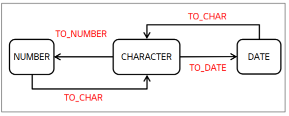
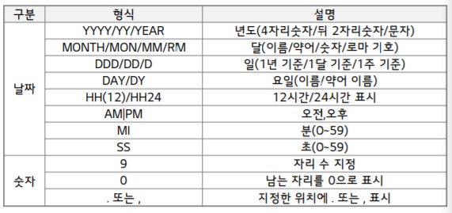
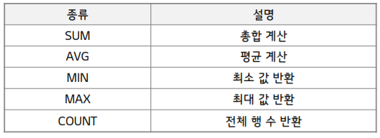

# SQL 함수

## 함수 개요

### 함수의 개념

- 하나의 큰 프로그램에서 반복적으로 사용되는 부분들을 분리한 작은 서브 프로그램
- 반환 결과에 따라 단일 행 함수와 다중 행 함수로 구분
  - 단일 행 함수 : Input N => Output N
  - 다중 행 함수 : Input N => Output 1

### 문자열 함수

- LENGTH
  - 주어진 컬럼 값/문자열 길이를 반환
  - `LENGTH(컬럼)`
- SUBSTR
  - 지정한 위치부터 지정한 개수만큼의 문자열을 잘라내어 반환
  - `SUBSTR(컬럼, 위치, [길이])`  (길이 생략 시 끝까지)
  - 1부터 시작
- REPLACE
  - 일부 문자열을 다른 문자열로 치환 혹은 제거
  - `REPLACE(컬럼 , 변환 대상, [변환 문자열])` ( 생략 시 제거)
- LOWER/UPPER
  - 컬럼 값/문자열을 대문자나 소문자로 변환

### 숫자형 함수

- TRUNC
  - 지정한 자릿수에 버림하는 함수
  - `TRUNC( number, [소수점 자리] )` (생략 시 0에서 버림)
  - 소수점 자리 음수 입력 가능

- ROUND
  - 지정한 자릿수에서 반올림 하는 함수
  - `ROUND( number, [소수점 자리] )`

### 날짜형 함수

- SYSDATE
  - 지정한 형식으로 현재 날짜와 시간을 표시하는 함수

## 데이터 타입 변환 함수

### 종류

- 데이터 타입 변환

  - 암시적 변환 : DB가 자동적으로 유형 변환

    => 성능 저하 및 에러 발생 가능성

  - 명시적 변환 : 변환형 함수로 유형 변환

- 데이터 타입 변환 함수

  

### TO_CHAR

- 숫자나 날짜로 주어진 데이터를 FORMAT형태의 문자열 타입으로 변환
- `TO_CHAR(숫자|날짜,  [,format] )`

​	

- ex) `SELECT EMP_NAME ,TO_CHAR(EFFECTIVE_DATE,‘YY-MM-DD') FROM EMPLOYEE;`
- ex) `SELECT TO_CHAR(123456789, '999,999,999') FROM DUAL;`

### TO_DATE

- 문자열로 주어진 데이터를 FORMAT 형태의 날짜 타입으로 변환하는 함수
- `TO_DATE( 문자열, [,format] )` (문자열을 날짜 표현 방식에 따라 입력) 

- ex) `SELECT EMP_NAME FROM EMPLOYEE WHERE EFFECTIVE_DATE > TO_DATE(‘20150101’,‘YYYYMMDD’) ;`

### TO_NUMBER

- 숫자로 변환될 때 의미 있는 형태의 문자열을 숫자 타입으로 변환하는 함수
- `TO_NUMBER( 문자열, [,format] )` 
- ex `SELECT TO_NUMBER(‘12345’) FROM DUAL ; `

## 집계 함수

### 종류

- 여러 행들의 그룹이 모여서 그룹당 단 하나의 결과를 돌려주는 함수
  - GROUP BY 절과 함께 사용시 소그룹화
  - SELEECT절,  HAVING절, ORDER BY 절에 사용
  - **SUM/AVG의 경우 NULL 값을 제외하고 계산**

- COUNT
  - `COUNT( * | [DISTINCT] 컬럼)`

## GROUPING

### GROUP BY

- 집계함수와 함계 사용되어 **데이터를 소그룹으로 생성**
  - WHERE 절에는 그룹 함수를 사용 할 수 없음

### HAVING

- GROUP BY에 의해 그룹화된 그룹 함수 실행 결과를 제한하기 위해 사용

## 순위 함수

### 종류

- 그룹 내 순위 함수
  - RANK  : 순위 출력 ( 중복 순위 다음은 해당 개수 만큼 건너뛰고 반환)
  - DENSE_RANK : 순위 출력
  - ROW_NUMBER  : 1부터 시작하여 각 로우별 순차적인 값 반환
- 그룹 내 순위 함수
  - FIRST_VALUE
  - LAST_VALUE
  - LAG : 현재 행을 기준으로 이전 값을 참조하는 함수
  - LEAD : 현재 행을 기준으로 이후 값을 참조하는 함수
- 그룹 내 비율 함수
  - CUME_DIST : 파티션별 윈도우의 전체 건수에서 현재 형보다 작거나 같은 건수에 대한 누적백분율 반환
  - PERCENT_RANK : 파티션별 윈도우에서 제일 먼저 나오는 것을 0으로, 제일 늦게 나오는 것을 1로 하여, 값이 아닌 형의 순서별 백분율을 반환
  - NTILE : 파티션별 전체 건수를 ARGUMENT 값으로 N 등분한 결과를 반환
  - RATIO_TO_REPORT : 계산 대상 값 전체에 대한 현재 로우의 상대적인 비율 값을 반환

### RANK

- `RANK() OVER( * expr )`
  - OVER 내부에 ORDER BY (DESC)를 통해 순위 산정의 기준이 되는 컬럼을 지정
- ex) `SELECT EMP_ID , EMP_NAME , L_LEVEL , RANK() OVER(ORDER BY L_LEVEL DESC) AS “순위” FROM EMPLOYEE WHERE DEPT_ID = ‘23’ ;`

### FIRST_VALUE

- `FIRST_VALUE(* expr) OVER( * expr )`
  - OVER 내부에 PARTITION BY를 통해 파티션별 윈도우 지정
  - OVER 내부에 ORDER BY를 통해 구하는 값을 지정
- `SELECT DEPT_ID , L_LEVEL , FIRST_VALUE(L_LEVEL) OVER(PARTITION BY DEPT_ID ORDER BY L_LEVEL DESC) AS "FIRST_VALUE" FROM EMPLOYEE ;`

## NULL 처리

### NVL / NVL2

- NULL을 지정한 값으로 변환하는 함수
  - NVL : NULL 값에 대해서만 지정한 값으로 변환
  - NVL2 : NULL일 때와 NULL이 아닐 때 각각 지정한 값으로 변환
- ` NVL( 컬럼, null일 때 변환값)` , `NVL2( 컬럼, NOT NULL 일 때 변환값, NULL 일때 반환값)`

### NULLIF

- 특정 데이터를 NULL로 변환하는 함수
  - 조건에 맞지 않는 특정 값을 NULL로 대체하는 경우에 유용하게 사용
- `NULLIF ( expr1, expr2 )`
  - expr1 == expr2 : NULL 출력
  - expr1 != expr2 :  expr1 출력
- ex) `SELECT EMP_ID , NULLIF(SKILL_ID, ‘S16’) FROM EMPLOYEE ;`

## IF-THEN 구현

### DECODE

- SELECT 구문으로 IF-THEN 논리를 제한적으로 구현한 오라클 DBMS 전용 함수
  - SQL 비교 연산 기능을 보완

- `DECODE( expr, serach, result, [default] )`
  - expr : 대상 컬럼 또는 문자열
  - search : expr과 비교하려는 값
  - result : expr과 search 비교가 참인 경우 반환 값
  - default : 모든 결과와 일치하지 않는 경우의 기본 반환 값
- ex)  `SELECT EMP_ID , EMP_NAME , DECODE(GENDER, ‘M’,‘남성’,‘F’,‘여성’) AS “성별” FROM EMPLOYEE ;`

### CASE

- DECODE와 같은 기능을 하는 내장 함수
- ` CASE expr WHEN serach THEN result [WHEN.. THEN.. ] [ELSE default] END`
- `SELECT EMP_ID , EMP_NAME , CASE GENDER WHEN ‘M’ THEN ‘남성’ WHEN ‘F’ THEN ‘여성’ AS “성별” ELSE ‘ ’ END AS “성별” FROM EMPLOYEE ;`

