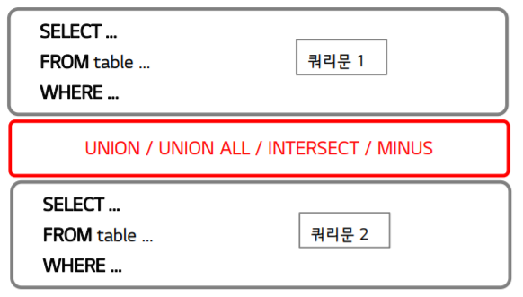

# Join


## Join 개요


### Join 개념

- 서로 다른 테이블에 존재하는 연관된 컬럼들을 한번에 조회하기 위해 사용하는 기법
  - 두 개 이상의 테이블을 연결 또는 결합하여 데이터를 출력


## Join 구문


### 오라클 기본 문법

- `SELECT … FROM table1 A, table2 B, … WHERE A.Column = B.Column`
  - 조회 대상 Table 및 JOIN 컬럼 선정
  - 조회 대상 Table은 FROM절에 “,” 구분하여 작성
  - WHERE절에 각 테이블별 JON 컬럼을 `=`로 조건 명시


### ANSI 기본 문법

- ```SQL
  SELECT EMP_NAME
  , DEPT_NAME
  FROM EMPLOYEE E
  JOIN DEPARTMENT USING ( DEPT_ID ) ;
  
  ```
  
  -  조회 대상 Table 및 JOIN 컬럼 선정
  -  기준 테이블은 FROM절, JOIN 테이블은 JOIN절에 작성
  - USING 또는 ON을 사용하여 JOIN 컬럼 작성 
    - USING : JOIN 조건으로 사용하는 컬럼 이름이 동일한 경우 
    - ON : JOIN 조건으로 사용하는 컬럼 이름이 서로 다른 경우


## OUTER JOIN


### 개념

- JOIN 조건에서 동일한 값이 없는 행도 반환 할 때 사용
  - Oracle : 연산자 ‘+’를 사용하여 구현
  - ANSI : LEFT OUTER / RIGHT OUTER 구문을 활용
  - 만족시키는 행이 없는 테이블 기준으로 사용


### ORACLE

```SQL
SELECT E.EMP_ID
	, D.DEPT_NAME
FROM EMPLOYEE E
	, DEPARTMENT D
WHERE E.DEPT_ID (+) = D.DEPT_ID
ORDER BY EMP_ID DESC ;

```


### ANSI

```SQL
SELECT EMP_ID
	, DEPT_NAME
FROM DEPARTMENT
LEFT OUTER JOIN EMPLOYEE USING (DEPT_ID)
ORDER BY EMP_ID DESC ;

```


- LEFT OUTER JOIN : 만족시키는 행이 없는 테이블이 JOIN 키워드 뒤에 기술된 경우


## SELF JOIN


### 개념

- 동일한 테이블을 두 번 조인하는 유형
-  각 테이블 구분을 위해 별칭(Alias)을 사용


### ORACLE

```sql
SELECT A.DEPT_NAME AS “팀명”
	, B.DEPT_NAME AS “담당명”
FROM DEPARTMENT A
	, DEPARTMENT B
WHERE A.PARENT_DEPT_ID = B.DEPT_ID ;
```


### ANSI

```sql
SELECT A.DEPT_NAME AS “팀명”
	, B.DEPT_NAME AS “담당명”
FROM DEPARTMENT A
JOIN DEPARTMENT B ON (A.PARENT_DEPT_ID = B.DEPT_ID)
;

```


## N개 테이블 JOIN


### 개념

- 다수의 테이블을 JOIN하여 원하는 데이터를 출력하는 방법
  - N개의 테이블을 JOIN 하기 위해서는 N-1 개의 조인 조건 또는 N-1개의 JOIN 키워드가 필요


### ORACLE

```SQL
SELECT E.EMP_NAME
, D.DEPT_NAME
, J.JOB_TITLE
FROM EMPLOYEE E
, DEPARTMENT D
, JOB J
WHERE E.DEPT_ID = D.DEPT_ID
AND E.JOB_ID = J.JOB_ID ;

```

- WHERE 조건이 N-1개 필요


### ANSI

```SQL
SELECT EMP_NAME
, DEPT_NAME
, JOB_TITLE
FROM EMPLOYEE
JOIN DEPARTMENT USING (DEPT_ID)
JOIN JOB USING (JOB_ID) ;

```

- JOIN 키워드 N-1개 필요


## 집합연산자


### 개념

-  두 개 이상의 쿼리 결과를 하나로 결합시키는 연산자
- SELECT 절에 기술하는 컬럼 개수와 데이터 타입은 동일해야 함
- 개념 도식
  - UNION
    - 양쪽 쿼리 결과를 모두 포함 (중복 1번만 표현)
  - UNION ALL
    - 양쪽 쿼리 결과를 모두 포함 (중복 모두 표현)
  - INTERSECT
    - 양쪽 쿼리 결과에 모두 포함되는 행만 표현
  - MINUS
    - 차집합


### 구문 작성 방법



- 컬럼 ALIAS는 첫번째 쿼리문에서만 작성
- ORDER BY는 두번째 쿼리문에서 작성 (첫번째 쿼리문의 ALIAS로 정렬)


