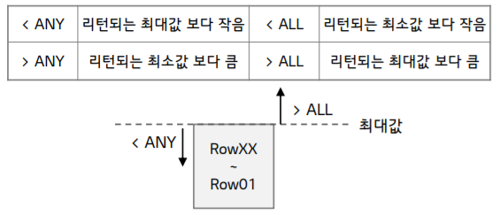

# Subquery


## 서브쿼리 개요


### Subquery 개념

- 하나의 SQL문안에 포함되어 잇는 또 다른 SQL문
  - 내부쿼리는 외부커리에 사용될 값을 반환하는 역할
  - 서브쿼리는 메인쿼리의 컬럼을 모두 사용할 수 있지만, 메인쿼리는 서비쿼리의 컬럼을 사용 할 수 없음


### Subquery 유형

- 단일 행 서브쿼리
  - 단일 행 반환
  - 단일 행 비교연산자 ( =, > 등 ) 사용
- 다중 행 서브쿼리
  - 여러 행 반환
  - 다중 행 비교연산자 (IN, ANY, ALL 등) 사용


### 기본 문법

```SQL
SELECT ...
FROM ...
WHERE expr operator ( SELECT ...
FROM ...
WHERE ... ) ;
```

- 서브쿼리는 일반적인 SQL 구문과 동일
- SELECT, FROM, WHERE, HAVING 절 등에서 사용 가능
  - 서브쿼리는 ()로 묶어서 사용
  - 서브쿼리는 ; 사용 X
  - 서브쿼리는 ORDER BY 사용 X
- 서브쿼리가 반환하는 행/컬럼 수는 expr 또는 Operator의 요구에 맞아야 함
- 유형에 따라 연산자를 구분해서 사용
  - 단일 행 
  - 다중 행
- 서브쿼리 내에서 또 다른 서브쿼리 사용 O


### 작성 방법

1. MAIN QUERY문 작성
2. Subquery문 작성
3. 비교 연산자를 통해 연결


## Subquery 연산자


### 단일행

```sql
SELECT EMP_ID
	, MAIN_SCORE
FROM SKILL_SCORE
WHERE MAIN_SCORE > ( SELECT AVG(MAIN_SCORE)
FROM SKILL_SCORE ) ;
```


### 다중 행 

####  IN, NOT IN

```sql
SELECT EMP_ID
	, MAIN_SCORE
FROM SKILL_SCORE
WHERE EMP_ID IN ( SELECT EMP_ID
FROM EMPLOYEE
WHERE DEPT_ID = ‘22’ )

```


### ANY / ALL

- 어떤 특정한 값이 아닌 범위로 비교 연산을 처리

  - ANY : 서브쿼리에서 리턴되는 어떠한 값이라도 만족시 조건 성립
  - ALL : 서브쿼리에서 리턴되는 모든 값을 만족하면 조건 성립

  

```SQL
SELECT EMP_NAME
	, L_LEVEL
FROM EMPLOYEE
JOIN JOB USING (JOB_ID)
WHERE JOB_TITLE = ‘Professional’
AND L_LEVEL > ALL
(SELECT L_LEVEL
FROM EMPLOYEE
JOIN JOB USING (JOB_ID)
WHERE JOB_TITLE = ‘Specialist’);

```


### EXIST / NOT EXISTS

- 서브쿼리 결과값의 존재 유무를 판단하는 연산자
  - EXISTS : 서브쿼리 결과에 존재하면 TRUE
  - NOT EXISTS : 서브쿼리 결과에 존재하지 않으면 TRUE 반환

```SQL
SELECT EMP_ID
	, EMP_NAME
	, ‘팀장’ AS “구분”
FROM EMPLOYEE E
WHERE EXISTS (SELECT NULL
FROM EMPLOYEE
WHERE E.EMP_ID = SUPERVISOR_EMP_ID)
UNION
SELECT EMP_ID
	, EMP_NAME
	, ‘팀원’
FROM EMPLOYEE EM
WHERE NOT EXISTS (SELECT NULL
FROM EMPLOYEE
WHERE EM.EMP_ID = SUPERVISOR_EMP_ID)
ORDER BY 3 desc, 1;

```

- NULL 사용 이유 : 존재 여부를 확인하는 목적이므로 서브쿼리에서 특정 값을 조회할 필요가 없음
