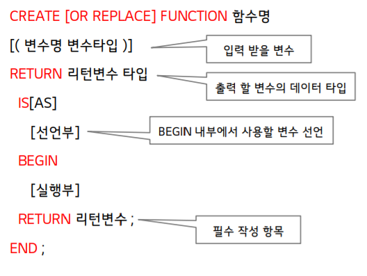

# 절차형 SQL


## 절차형 SQL 개요


### 개념

- 일반 개발 언어처럼 SQL에서 제공하는 절차 지향적인 프로그램 언어
  - SQL문의 연속적인 실행이나 조건에 따른 분기처리를 이용하여 특정 기능을 수행하는 저장 모듈 생성
  - 종류 : PL/SQL (Oracle), SQL/PL(DB2) , T-SQL(SQL server)
- 구조
  - DECLARE : BEGIN-END에서 사용할 변수의 정의/ 데이터 타입 정의
  - BEGIN : 실제 수행되는 SQL문과 필요한 로직 정의
  - EXCEPTION : 에러 처리
  - END


### 특징

- 변수, 상수 등을 선언하여 SQL문장 간 값을 교환
- IF, LOOP 등의 절차형 언어를 사용하여 프로그래밍 가능
- DBMS나 사용자 정의 에러를 정의하여 사용 가능
- 응용프로그램의 `성능 향상` 및 서버 통신량 감소 효과
- 조건문, 반복문 => `연속적인 작업 처리`


### 종류

- Procedure
  - 특정 기능을 수행하는 트랜잭션 언어로 미리 저장해 놓은 SQL 작업 수행 
  - Output 없음
- User Defined Function
  - 프로시저와 유사하게 SQL을 사용하여 작업 처리
  - 종료시 RETURN을 통해 단일값 반환
- Trigger
  - DBMS에서 데이터의 입력, 갱신, 삭제 등의 이벤트 발생시 원하는 작업을 자동으로 수행


## 절차형 SQL 작성 방법


### 변수 선언 (DECLARE)

- 변수

  - `변수명 데이터 타입 ;`

    ```SQL
    DECLARE
    	V_TEST_ID VARCHAR2(10) ;
    BEGIN
    	...
    ```

    

- 상수

  - `상수명 NUMBER (:= 상수) ;`

    ```SQL
    DECLARE
    	V_TEST_NUM NUMBER := 100 ;
    BEGIN
    	...
    ```

    

### BEGIN ~ END

- 선언된 변수를 활용하여 실제 수행될 SQL문을 BEGIN 하위에 구현

```SQL
DECLARE
    V_TEST_NUM NUMBER := 100 ;
    V_TEST_ID VARCHAR2(10) ;
BEGIN
    SELECT V_TEST_NUM + 1
    INTO V_TEST_ID
    FROM DUAL ;
    DBMS_OUTPUT.PUT_LINE(V_TEST_ID);
END ;

```

- INTO : 결과값 입력 
- **DBMS_OUTPUT.PUT_LINE** : 수행된 절차형 SQL의 로그나 결과값을 출력하는 기능


## 절차형 SQL 조건문 사용


### IF-THEN

```SQL
IF 조건 THEN 처리문
ELSIF 조건2 THEN 처리문
ELSE 처리문
END IF ;
```


### CASE

```SQL
CASE WHEN 조건 THEN 처리문
WHEN 조건2 THEN 처리문
ELSE 처리문
END CASE ;
```


## User Defined Function


### 개념

- 특정 기능들을 모듈화, 재사용하는 사용자 정의 함수


### 기본 문법



```sql
CREATE OR REPLACE FUNCTION UF_TEST_MONTH1(
	P_CALDATE DATE					-- 입력 받을 변수 (생략 가능)
)
	RETURN VARCHAR2					-- 출력 변수 데이터 타입
IS
	V_MON VARCHAR2(10);				-- 선언부에서 사용할 변수
BEGIN
    SELECT TO_CHAR(SYSDATE,'MON')	-- 수행되는 sql문
    INTO V_MON
    FROM DUAL ;
    RETURN(V_MON);					-- 리턴 결과
END UF_TEST_MONTH1;

```


