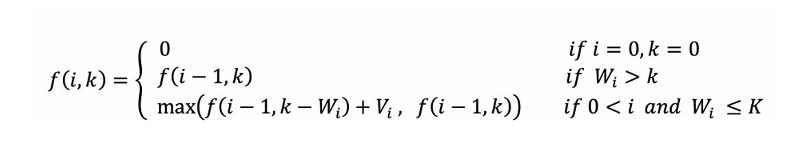

# 알고리즘

## 목차

- 알고리즘
- 그리디 알고리즘
- 너비 우선 탐색
- 누적합
- 동적 계획법
- 모듈러 증명
- 백트래킹
- 보이어-무어
- 브루트포스
- 서로소 집합
- 이분탐색
- 이진 검색(Binary Search)
- 조합
- 최단 거리
- 최소 신장 트리 (MST)
- 페르마의 소정리
- 호제법


## 알고리즘

### 알고리즘

- 유한한 단계를 통해 문제를 해결하기 위한 절차나 방법


### 알고리즘 효율 <=> 복잡도

- 시간적 효율성
  - 하드웨어와 소프트웨어 환경에 따라 다름 => 분석 힘듦
- 공간적 효율성
  - O (Big-Oh) 표기
    - 점근적 상한 
    - n이 증가함에 따라 n0보다 큰 n에 대해서 O(g(n))이 f(n)보다 항상 큼
    - O(n^2) : 단순히 실행시간이 n^2에 비례 하는 알고리즘
  - Ω (Big-Omega) 표기
    - 점근적 하한
    - 최소한 이만한 시간은 걸린다
  - Θ (Theta) 표기
    - O-표기와 Ω-표기가 같은 경우에 사용


## 그리디 알고리즘

- 그리디 알고리즘은 전체 수를 탐색하지 않고, 각 단계에서 가장 최선의 선택을 하는 기법이다. 동적 계획법의 효율성 문제에서 고안되었으며, 모든 문제에서 최선의 해를 도출하진 못한다. 

- 그리디 알고리즘을 사용하기 위해서는, `원문제의 최적해 = 탐욕적 선택 + 하위 문제의 최적해` 임을 증명

- Top-down 방식


## 너비 우선 탐색 (Breadth First Search)

- 탐색 시작점의 인접한 정점들을 먼저 모두 차례로 방문한 후에, 방문했던 정점을 시작점으로 하여 다시 인접한 정점들을 차례로 방문한다.

​	큐를 통한 구현

1. 큐에 시작점 in
2. 큐 맨 앞 pop  
3. 해당 노드에서 할 일 처리하고 해당 노드 방문 표시
4. 해당 노드와 연결된 정점들 중 방문 x 정점들은 큐에 in
5. 큐가 빌 때까지 2~4 과정 반복


## 누적합 (Prefix Sum)

- 누적 합 아이디어는 **배열 에 들어있는 값이 바뀌지 않는다는 점을 이용**
- 배열이 변하지 않으니 구간의 합도 변하지 않기에, 앞에서부터 차례대로 누적된 합을 구해놓고 이를 이용해서 구간의 합을 구함

$$
\displaystyle\sum_{x=i}^{j} arr[x] = \displaystyle\sum_{x=1}^{j} arr[x] - \displaystyle\sum_{x=1}^{i} arr[x]
$$

- 2차원 배열에도 적용 가능

- $$
  S(x_1,y_1) = S(x_1-1,y_1) + S(x_1, y_1-1) - A[x_1][y_1]\quad
  $$

  $$
  Range(x_1, y_1, x_2, y_2) = S(x_2, y_2) - S(x_1, y_2) - S(x_2, y_1) + S(x_1, y_1)
  $$

  


## 동적 계획법

  동적 계획법이란 복잡한 문제를 간단한 여러 개의 하위 문제로 나누어 푼 다음, 이것을 결합하여 최종 목적을 달성하는 방법이다. 각 하위 문제의 결과 값을 저장해 둠으로써, 반복되는 하위 문제를 빠르게 해결함으로써 계산 횟수를 줄인다. 


### 0/1 Knapsack Problem

- 배낭 문제(Knapsack) 중 짐을 쪼갤 수 없는 경우로 DP를 활용하여 해결

  - 짐을 쪼갤 수 있는 경우(Fraction Knapsack Problem), Greedy 사용

- 무게에 대한 탐색과 물건에 대한 탐색이 동시에 이루어져야 원하는 결과값 도출 가능

- 기본 점화식

<<<<<<< HEAD
  
=======
### LIS

- Longest Increase Subsequence

- 방식 1

  - 현재 값보다 작으며 이전 값들의 dp값 최대치 + 1
  - 시간 복잡도 O(N^2)

- 방식 2

  1) LIS 마지막 값보다 크다면 LIS에 추가
  2) LIS 마지막 값보다 작다면, LIS에서 부동호 관계를 해치지 않으며 자신보다 큰 값 대체. (LIS 길이 도출만 가능)
  3) LIS에서의 자신의 Index 위치를 저장. 
  4) 마지막 원소부터 LIS의 길이를 감소시켜 가면서, 처음으로 해당 길이의 index가 나오는 원소 도출 => 역순 (LIS 도출)

  - 시간 복잡도 O(NlogN)

  


### LCS

- Longest Common Subsequence. 가장 긴 공통 부분수열.

- 기본 점화식
  $$
  f(i,j)=f(i-1, j-1)+1\quad if \quad w1_i = w2_j
  $$

  $$
  f(i,j)= max(f(i-1, j), f(i,j-1))\quad if \quad w1_i \neq w2_j
  $$
## 모듈러 증명

- 성질 1

```
(a + b) % m = ((a % m) + (b % m)) % m
```

- 성질 2

```
(a * b) % m = ((a % m) * (b % m)) % m
```


## 보이어-무어

​	문자열에서 패턴 찾기에 활용되는 알고리즘이다. 문자열 비교는 앞부분보다 뒷부분에서 불일치가 일어날 확률이 높다는 성질을 활용한다. 그래서 패턴의 오른쪽 부터 비교를 시작한다. 수행 순서는 다음과 같다.

1. 패턴의 마지막 인덱스의 글자와 본문에서 같은 인덱스에 있는 글자를 비교합니다.
2. 만약 둘 글자가 같다면, 앞의 글자들을 차례대로 같은지 확인합니다.
3. 만약 같지 않고, 본문의 글자가 패턴에 존재하지 않는다면, 패턴의 길이만큼 패턴을 이동시킵니다.
4. 만약 같지 않고, 본문의 글자가 패턴에 존재한다면, 패턴의 오른쪽 끝에서부터 그 문자까지의 칸 수를 세서 그만큼 이동합니다.
5. 이를 반복하며 문자열 끝까지 탐색합니다.


## 백트래킹

 기본적으로 `가능한 모든 방법`을 `효율적으로 탐색` 하는 기법.  대표적인 완전 탐색 방법으로는 깊이 우선 탐석(DFS)가 있지만, 목표 지점에 도달할 가능성이 없는 곳도 탐색한다는 단점이 존재한다. 이에 백트래킹은 가지치기를 통해 `가능성이 있는` 루트만 고려하는 기법

 `수행순서`

1. DFS 수행

2. 유망한 노드 검토 

   : 유망하면 서브트리로 이동 , 유망하지 않으면 백트래킹 수행


## 브루트 포스

- 완전 검색으로 모든 경우의 수를 생성하고 테스트 => 설계가 간단하고 정확도 높음 but 느림
- **우선 완전 검색으로 접근하여 해답을 도출한 후, 성능 개선을 위해 다른 알고리즘 사용하고 해답을 확인하는 것이 바람직**


## 서로소 집합

### 서로소 집합

- 서로소 또는 상호배타 집합들은 서로 중복 포함된 원소가 없는 집합들 (교집합 x)
- 집합에 속한 하나의 특정 멤버를 통해 각 집단을 구분 : 대표자

### 상호배타 집합 연산

- Make-Set( x )
- Find_Set( x )
- Union( x, y )


## 이분 탐색

### Upper Bound 방식

- 상한은 찾고자 하는 값을 **초과한 값**을 처음 만나는 위치
- key와 mid가 같을 때에는 lo를 줄임 (lo = mid +1)


### Lower Bound 방식

- 하한은 찾고자 하는 값 **이상의 값**이 처음으로 나타나는 위치
- key와 mid가 같을 때에는 hi를 줄임 (hi = mid)

:bulb: 탐색 범위는 `lo <= idx < hi` 이기 때문에 hi의 초기 설정값은 최대 가능값 +1 이어야 함


## 이진 검색

​	자료의 가운데에 있는 항목의 키 값과 비교하여 다음 검색의 위치를 검색하고 검색을 계속 진행. 단, 자료가 **정렬**된 상태여야 함


## 조합

- 1번 성질

$$
_{n+1}\mathrm{C}_{r+1} =  _{n}\mathrm{C}_{r} +  _{n}\mathrm{C}_{r+1}
$$

- 2번 성질

$$
_{n}\mathrm{C}_{0} =  _{n}\mathrm{C}_{n} = 1
$$


## 최단 경로

### 최단 경로

- 정의
  - 간선의 가중치가 있는 그래프에서 두 정점 사이의 경로들 중에 간선의 가중치의 합이 최소인 경로
- 하나의 시작 정점에서 끝 정점까지의 최단경로
  - 다익스트라 알고리즘
    - 음의 가중치 허용 x
  - 벨만-포드 알고리즘
    - 음의 가중치 허용
- 모든 정점들에 대한 최단 경로
  - 플로이드-워샬 알고리즘


### 다익스트라 (Dijkstra) 알고리즘

- 시작 정점에서 거리가 최소인 정점을 선택해 나가면서 최단 경로를 구함
- 시작정점(s)에서 끝정점(t)까지의 최단 경로에 정점 x가 존재한다.
- 이때, 최단경로는 s에서 x까지의 최단 경로와 x에서 t까지의 최단경로로 구성된다.
- 탐욕 기법을 사용한 알고리즘으로 MST의 프림 알고리즘과 유사
- 방법
  1. D[v] : s에서 v까지 가능 최소 비용을 뜻함. A : 간선 정보 배열
  2. 모든 v에 대해 D[v] = A[s] [v]
  3. D[w]가 최소이며 아직 방문 x w 선택
  4. w에 인접한 모든 정점 v에 대해 D[v] = min( D[v], D[w]+A[w] [v] )
  5. 모든 곳 방문할 때까지 3,4 반복
  
  - `!! 힙 사용시, 기존 D[v]보다 D[w]+A[w] [v]가 작을 때에만 heap에 넣어줌`
  
    

## 최소 신장 트리 (MST)

### 최소 신장 트리

- 그래프에서 최소 비용 문제
  - 모든 정점을 연결하는 간선들의 가중치의 합이 최소가 되는 트리
  - 두 정점 사이의 최소 비용의 경로 찾기
- 신장 트리
  - n 개의 정점으로 이루어진 무방향 그래프에서 n개의 정점과 n-1개의 간선으로 이루어진 트리
- 최소 신장 트리
  - 무방향 가중치 그래프에서 신장 트리를 구성하는 간선들의 가중치의 합이 최소인 신장 트리


### Prim 알고리즘

- 하나의 정점에서 연결된 간선들 중에 하나씩 선택하면서 MST 만들어 나감
  1. 임의 정점을 하나 선택해서 시작
  2. 선택한 정점과 인접하는 정접들 중의 최소 비용의 간선이 존재하는 정점 선택
     1. 모든 정점이 선택될 때까지 1,2 과정 반복
  
  - `heap을 사용할 경우 1. 넣을 때 MST에 없는 노드만 대상 2. 땔 때, 이미 MST에 있는 친구면 continue 아니면 MST에 추가`
- 서로소인 2개의 집합 정보를 유지
  - 트리 정점들 : MST를 만들기 위해 선택된 정점들
  - 비트리 정점들 : 선택 되지 않은 정점들


### KRUSKAL 알고리즘

- 간선을 하나씩 선택해서 MST를 찾는 알고리즘

  1. 최초, 모든 간선을 가중치에 따라 오름차순으로 정렬

  2. 가중치가 가장 낮은 간선부터 선택하면서 트리를 증가시킴

     - ! `사이클이 존재하면 다음으로 가중치가 낮은 간선 선택`

       <= 서로소 집합으로 사이클 확인

  3. n-1개의 간선이 선택될 때 까지 2 반복


## 페르마의 소정리

`a는 정수, p는 소수이며 a와 p가 서로소일 때`
$$
a^p \equiv a \quad (mod \quad p)
$$

$$
a^{p-1} \equiv 1 \quad (mod \quad p)
$$


## 호제법

 2개의 자연수(또는 정식) a, b에 대해서 a를 b로 나눈 [나머지](https://ko.wikipedia.org/wiki/나머지)를 r이라 하면(단, a>b), a와 b의 최대공약수는 b와 r의 최대공약수와 같다.

```java
 public static int gcd(int p, int q)
 {
	if (q == 0) return p;
	return gcd(q, p%q);
 }
```

