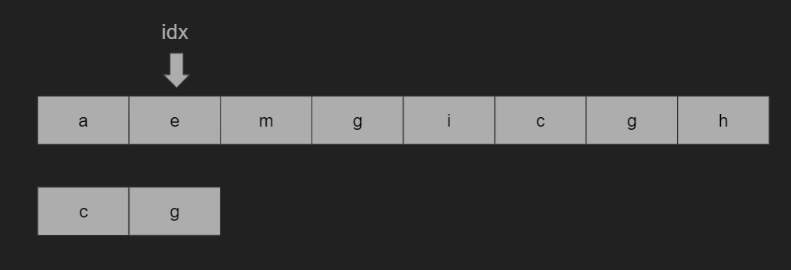
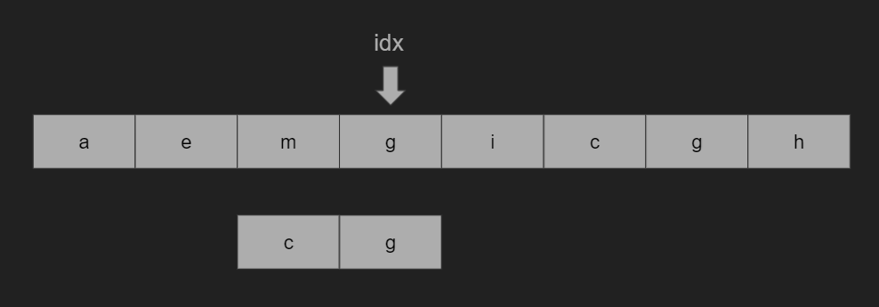
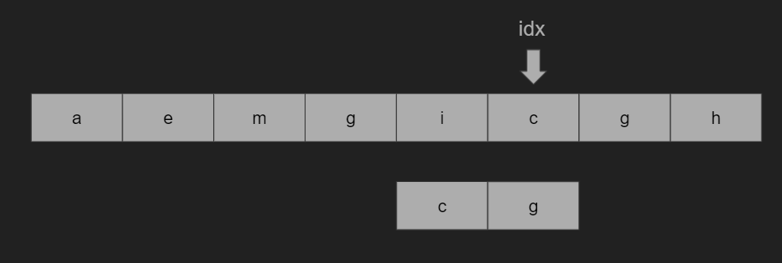
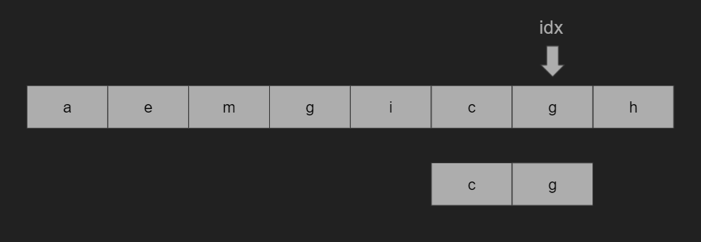

# 파이썬 보이어 무어 탐색 구현


## 보이어 무어 탐색

​	문자열에서 패턴 찾기에 활용되는 알고리즘이다. 문자열 비교는 앞부분보다 뒷부분에서 불일치가 일어날 확률이 높다는 성질을 활용한다. 그래서 패턴의 오른쪽 부터 비교를 시작한다. 수행 순서는 다음과 같다.

1. 패턴의 마지막 인덱스의 글자와 본문에서 같은 인덱스에 있는 글자를 비교합니다.



2. 만약 같지 않고, 본문의 글자가 패턴에 존재하지 않는다면, 패턴의 길이만큼 패턴을 이동시킵니다.



3. 만약 같지 않고, 본문의 글자가 패턴에 존재한다면, 패턴의 오른쪽 끝에서부터 그 문자까지의 칸 수를 세서 그만큼 이동합니다.



4. 만약 둘 글자가 같다면, 앞의 글자들을 차례대로 같은지 확인합니다.



1. 이를 반복하며 문자열 끝까지 탐색합니다.


## 파이썬 코드

```python
# 패턴과 문자열을 입력 받습니다.
pattern = input()
sentence = input()
count = 0

p_len = len(pattern)
idx = p_len - 1

while idx < len(sentence):
    # 문자열을 탐색하다가 패턴의 끝 부분과 일치한다면 앞의 글자들도 일치하는 지 확인합니다.
    if sentence[idx] == pattern[p_len-1]:
        for j in range(p_len):
            # 앞부분 글자를 탐색하다 일치하지 않으면, idx를 pattern 길이만큼 이동합니다.
            if pattern[p_len-j-1] != sentence[idx - j]:
                idx += p_len
                break
        else:
            # 앞부분 글자들도 일치한다면, 패턴과 일치하다고 기록하고 idx를 pattern 길이만큼 이동합니다.
            count += 1
            idx += p_len
    # 일치하지 않는다면, 해당 글자가 패턴안에 있는지 확인합니다.
    else:
        # 해당 글자가 패턴 안에 존재한다면, idx를 패턴에서 일치한 글자 위치와 패턴의 마지막 글자 위치의 차이만큼 이동합니다.
        for j in range(p_len):
            if pattern[p_len - j - 1] == sentence[idx]:
                idx += j
                break
        # 해당 글자가 패턴 안에 존재하지 않는다면, idx를 pattern 길이만큼 이동합니다.
        else:
            idx += p_len
```

