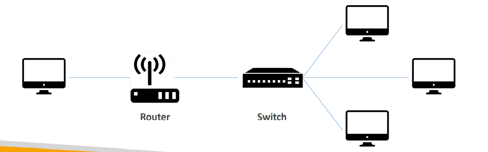
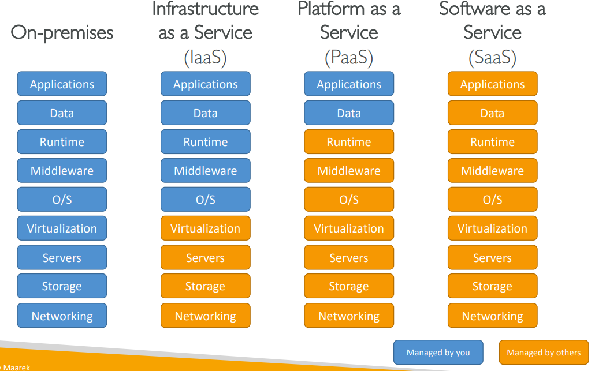

# Intro to Cloud Computing

## How Network Works

### IT Terminology

- Network : 케이블, 라우터, 서버가 서로 연결된 것
- Router : 네트워크에서 목적지로 데이터 패킷을 전송하는 디바이스. 
- Switch : 패킷을 받아, 올바른 서버와 클라이언트에 전송

## What is Cloud Computing

### Deployment Model of the Cloud

- Private
  - 공개되지 x
- Public
- Hybrid
  - keep server on premise extends it by cloud

### 5 Characteristics of Cloud

- On-demand self service

- Broad network access

  - 다양한 클라이언트 플랫폼에서 접근 o

- Multi-tenancy and resource pooling

  - 다수의 고객들이 같은 인프라 공유 + 같은 환경에서 서비스 받음

- Rapid elasticity and scalability

- Measured service

  - pay correctly for what they have used

### Types of Cloud Computing

- IaaS (Infrastructure as a Service)
  - provides networking, computers, data storage space
- PaaS (Platform as a Service)
  - Removes the need for your organization to manage the underlying infrastructure
- SaaS (Software as a Service)
  - Completed product that is run and managed by the service provider

### AWS Pricing

- Compute
- Storage
- Data transfer **out** of the Cloud

### Shared Responsibility 

- Customer

  : Responsibility for the security **in** the cloud

- AWS

  : Responsibility for the security **of** the cloud

