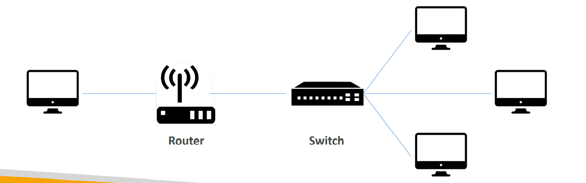

# Ultimate AWS Certified Cloud Practitioner CLF-C02

## Intro to Cloud Computing

### IT Terminology

- Network : 케이블, 라우터, 서버가 서로 연결된 것
- Router : 네트워크에서 목적지로 데이터 패킷을 전송하는 디바이스. 
- Switch : 패킷을 받아, 올바른 서버와 클라이언트에 전송

### Deployment Model of the Cloud

- Private
  - 공개되지 x
- Public
- Hybrid
  - keep server on premise extends it by cloud

### 5 Characteristics of Cloud

- On-demand self service

- Broad network access

  - 다양한 클라이언트 플랫폼에서 접근 o

- Multi-tenancy and resource pooling

  - 다수의 고객들이 같은 인프라 공유 + 같은 환경에서 서비스 받음

- Rapid elasticity and scalability

- Measured service

  - pay correctly for what they have used

### Types of Cloud Computing

- IaaS (Infrastructure as a Service)
  - provides networking, computers, data storage space
- PaaS (Platform as a Service)
  - Removes the need for your organization to manage the underlying infrastructure
- SaaS (Software as a Service)
  - Completed product that is run and managed by the service provider

### AWS Pricing

- Compute
- Storage
- Data transfer **out** of the Cloud

### Shared Responsibility 

- Customer

  : Responsibility for the security **in** the cloud

- AWS

  : Responsibility for the security **of** the cloud

## Identity and Access Management

### IAM 요소

- Root Account 
  - created by default, shouldn’t be used or shared
- Users 
  - people within your organization. 
  - can be grouped or not
  - can belong to multiple groups
- Groups 
  - only contain users

### IAM 역할 : Permission

- Users or Groups can be assigned JSON called policies which define permission

- Least Privilege Principle

  - 필요한 최소한의 권한만 부여

  

### IAM Policies

- Inheritance

  - Group
    - Group의 Policies 적용받음

  - User
    - Inline Policy 적용 ㅇ

- Policies Structure

  - Version

  - Id (optional)

  - Statement

- Statement Structure

  - Sid (optional)

    - Effect
      - whether the statement allows or denies access
      - Allow, Deny

    - Principal
      - account/user/role to which this policy applied to

    - Actions
      - list of actions this policy allows or denies

    - Resource
      - list of resources to which the actions applied to

  - Condition (optional)
    - conditions for when this policy is in effect

### IAM Security

- Password Policy

  - Set a minimum password length

  - Require specific character types

  - Allow all IAM users to change their own password

  - Require users to change their password after some time

  - prevent password re-use

- MFA

  - password you know + security device you own

    => 비밀번호가 탈취되어도 계정이 해킹당하지 않음

  - 종류

    - Virtual MFA device 
      - Google Authenticator
      - Authy
      - Universal 2nd Factor
        - YubiKey 
      - Hardware Key Fob MFA Device
      - Hardware Key Fob MFA Device for AWS GovCloud

### Access AWS

- AWS Management Console
  - password + MFA
- AWS Command Line Interface (CLI)
  - access keys
- AWS Software Developer Kit (SDK)
  - access keys

### AWS CLI

- 설치

  - aws cli download

  - cmd 창에 `aws --version`으로 버전 및 설치 여부 확인

- CLI User Configure

  1. user의 access key 받기
     - root 계정이 아닌, user 계정에서 access key 받음
  2. cli configure
     - cmd 창에 `aws configure`
     - id, key, 지역, format(생략o) 설정. 

  3. 이후 해당 user에게 주어진 권한 작업 수행 o
     - ex) `aws iam list-users`

- AWS CloudShell

  - Aws 자체 제공 cmd 창

  - 개인 클라우드 공간에 파일 생성, 업로드, 다운로드 o

  - 특정 지역 기점으로만 작동 (ex. tokyo)

#### IAM Roles for Services

- 몇몇 AWS service는 사용자를 대신해서 수행함

  => 이 경우, AWS service에 IAM Roles를 부여함으로써 permission 제공

- Common roles

  - EC2 Instance Roles
  - Lambda Function Roles
  - Roles for CloudFormation

### IAM Security Tools

- IAM Credentials Report 

  - account-level
  - lists all your account's users and the status of their various credentials

- IAM Access Advisor

  - user-level

  - shows that service permissions granted to a user and when those services were last accessed

    =>  Least Privilege Principle 실천

# EC2

## AWS Budge Setup

1. 루트 계정 > 내 계정 > 결제 정보에 대한 IAM 사용자 및 역할 액세스 - 편집 > IAM 엑세스 활성화 클릭 > 업데이트
2. 서브 계정 > 내 결제 대시보드 > 청구서 => 비용 청구 내역 확인 or  Budget => 예산 설정

## EC2 Overview

### EC2

- Elastic Compute Cloud = Infrastructure as a Service
- consists in the capability of
  - Renting virtual machines (EC2)
  - Storing data on virtual drives (EBS)
  - Distributing load across machines (ELB)
  - Scaling the services using an auto-scaling group (ASG)

### EC2 sizing & configuration options

- OS : Linux, Windows, Mac OS
- CPU
- RAM
- Storage space
  - Network-attached (EBS & EFS)
  - hardware (EC2 Instance Store)
- Network card : speed of the card, Public IP address
- Firewall rules : **security group**
- Bootstrap script : EC2 User Data

### EC2 User Data

- bootstrap our instances using an EC2 User Data script
  - bootstrap : launching commands when a machine starts
- only **run once** at the instance **first start**
- is used to automate boot tasks such as
  - Installing updates
  - Installing software
  - Downloading common files from the interest
  - Anything you can think of
- The EC2 User Data Script runs with the root user

## EC2 - Elastic Compute Cloud

### Launch EC2 Instance

- Name
  - tag 값에서 key, value 에서 (name, 실제 이름)
- Key pair
  - 해당 instance 접근하기 위한 key 값. 다운로드 후 분실 주의

### EC2 Instance 관리

- 언제든지 실행, 중지, 제거 가능
- Instance 중지 후 재실행하면 public ip 주소 변경 됨

### EC2 Instance Types

- 종류
  - General Purpose
    - Great for a diversity of workloads such as web servers or code repositories
    - Balance between `Compute`, `Memory`, `Networking`
  - Compute Optimized
    - Great for compute-intensive tasks that require high performance processors
    - Use cases
      - Bach processing workloads
      - Media transcoding
      - High performance web servers
      - High performance computing
      - Scientific modeling & machine learning
      - Dedicated gaming servers
  - Memory Optimized
    - Fast performance for workloads that process large data sets in memory
    - Use cases
      - High performance, relational/non-relational databases
      - Distributed web scale cache stores
      - In-memory databases optimized for BI (Business Intelligence)
      - Applications performing real-time processing of big unstructured data
  - Accelerated Computing
  - Storage Optimized
    - Great for storage-intensive tasks that require high, sequential read and write access to large data sets on local storage
    - Use cases
      - High frequency online transaction processing systems (OLTP)
      - Relation & NoSQL databases
      - Cache for in-memory databases
      - Data warehousing applications
      - Distributed file systems
- Instance Features
  - Measuring Instance Performance
- Naming Convention
  - `<instance class>` `<generation>`.`<size within the instance class>`
  - ex) m5.2xlarge

### Security Groups & Class Ports

#### Security Groups

- fundamental of network security in AWS
- control how traffic is allowed into or out of our EC2 instances
- **only contain allow rules**
- securuity groups rules can reference by IP or security group

- acting as a `firewall` on EC2 instances : regulate
  - Access to Ports
  - Authorized IP ranges
  - Control of inbound network ( instance <= other )
  - Control of outbound network ( intance => outher )

#### Security Groups Tip

- can be attached to multiple instances
- Locked down to a region /VPC combination
- live 'outside' the EC2 : traffic is blocked => EC2 instacne won't see it
- **good to maintain one seperate security group for SSH access**
- 오류 코드
  - application is not accessible => security group issue
  - application gives connection refused => application error or not launched
- default traffic policy
  - inbound traffic is blocked
  - outbound traffic is authorized

#### Class Ports

- 22 : SSH (Secure Shell). log into a Linux instacne
- 21 : FTP (File Transfer Protocol). upload files into a file share
- 22 : SFTP (Secure File Transfer Protocol). upload files using SSH
- 80 : HTTP. access unsecured websites
- 443 : HTTPS. access secured websites
- 3389 : RDP (Remote Desktop Protocol). log into a Windows instance

### SSH

#### Using SSH on Windows 10

1. EC2 instance의 identity 파일 있어야 함 (instance 생성시 다운받은 pem 파일)

2. PowerShell > ssh => ssh 존재 확인

3. PowerSheel > ssh -i 'pem파일 경로' ec2-user@'instance의 publid ip'

   @ 만약 오류시 => pem 파일 속성 =>  보안 => 고급 => 소유자 나로 변경 및 다른 유저 권한 삭제

4. ctrl + d => logout

#### EC2 instance connect

- aws 페이지에서 instance 연결하는 방법
- EC2 instance => 연결 => EC2 인스턴스 연결 => 연결

### EC2 Instance Roles

- EC2 Instance와 연결하여 작업을 할 때 절대로 `aws configure`을 통해서 계정 정보 입력 x

  => 다른 EC2 Instance 사용자가 해당 정보 접근

- EC2를 통해 작업 할 때에는 EC2 Instance에 IAM Role을 추가해서 권한 부여 후 사용

- 부여 방법

  1. EC2 Instance => 작업 => 보안 => IAM 역할 수정

### EC2 Instances Purchasing Options
#### On-Demand Instances

- Pay for what you use

  - Linux : 첫 1분 후, 초단위 계산
  - Other : 1시간 단위 계산

- Has the hightest cost but no upfront payment

- No long-term commitment

  => Recommended for `short-term` and `un-interrrupted workloads` when unpredictable
#### Reserved

- ~ 72% DC to On-Demand
- Reservation period : 1년 시 할인 < 3년 시 할인
- Puchasing options : no upfront, partial upfront, All upfront (즉시 낼 수록 할인율 up)
- Reserve a specific instance type
- Recommended for steady-state usage applications
- 종류
  - Convertible Reserved Instance
    - ~45% DC
  - Scheduled Reserved Instances
    - launch within time window you reserve
    - Commitment for 1 year only
#### Spot Instances

- ~ 90% DC

- Instances that you can `lose` at ay point of time if your max price is less than the current spot price

- Most cost-efficient instances

  => Useful for workloads that are resilient to failure

  - Batch jobs
  - Data analysis
  - Any distributed workloads

  `Not suitable for critical jobs and databases`
#### Dedicated Hosts

- phisical server whie EC2 instance capacity fully dedicated to your use.

- can help you address `compliance requirements` and reduce costs by allowing you to `use your existing server-bound software licenses`

- Allocated for your account for a 3-year period reservation

- More expensive

  => Useful for

  - software that have complicated licensing model
  - companies that have strong regulatory or compliance needs
#### Dedicated Instances

- Instances running on hadware that's dedicated to you
- May share hardware with other instances in same account
- No control over instance placement

### Shared Responsiblity Model for EC2

| aws                                                          | user                                                         |
| :----------------------------------------------------------- | :----------------------------------------------------------- |
| - Infrastructure - Isolatioin on physical hosts - Replacing faulty hadware - Compliance validation | - Security Groups rules - Operating-system patches and updates- - Software and utilities installed on the EC2 instance - IAM Roles assigned to EC2 & IAM user access management - Data security on your instances |

## EC2 Instance Storage

### EBS
#### EBS Volume Overview

- is a network drive you can attach to your instances while they run
- it allows your instances to persist data, even after their termination
- only be mounted to one instacne at a time (at CCP level)
- bound to a specific availability zone
- Free tier : 30GB of free EBS Storage of type General Purpose(SSD) of Magnetic per month
#### EBS Volume

- network drive
  - it uses the network to communicate the instance ( 지연 有 )
  - can be detached from an EC2 instance and attached to another one quickly
- locked to an Availability Zone (AZ)
  - EBS Volume in us-east-l a cannot be attached us-east-l b
  - to move a volume across, you first need to snapshot it
- have a provisioned capacity (size in GBs, and IOPS)
  - you get billed for all the provisioned capacity
  - you can increase the capacity of the drive over time
#### EBS - Delete on Termination attribute

- Controls the EBS behavior when an EC2 instance terminates
  - By default, the root EBS volume is deleted( attribute enabled )
  - By default, any other attached EBS volume is not deleted( attribute disabled )

- This can be controlled by the AWS console / AWS CLI
- User case : preserve root volume when instance is terminated
#### EBS Volume 실습

- EC2 => 인스턴스 클릭 => 스토리지 => 볼륨 id 클릭
- 볼륨 생성 => 생성
- 볼륨 위에서 우클릭 => 삭제, 연결 등 작업 가능

### EBS Snapshots
#### EBS Snapshots

- Make a backup(snapshot) of your EBS volume at at point in time
- Not necessary to detach volume to do snapshot, but recommended
- Can copy snapshots across AZ or Region
#### EBS Snapshots 실습

- EC2 => 인스턴스 클릭 => 스토리지 => 볼륨 id 클릭 => 작업 => 스냇샵 생성
- 왼쪽 바 => Elastic Block Store => 스냅샷 
  - 확인
  - Actions => copy, create volume (스냅샷 정보 들고 있는)

