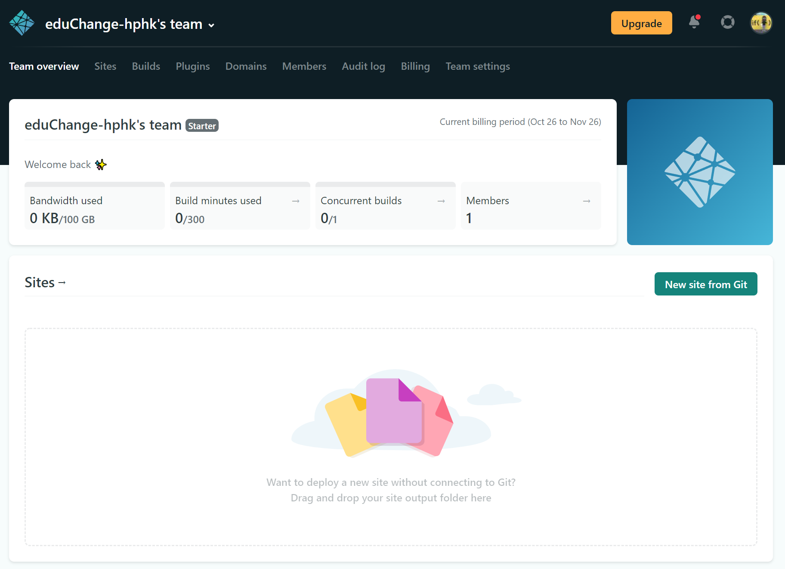
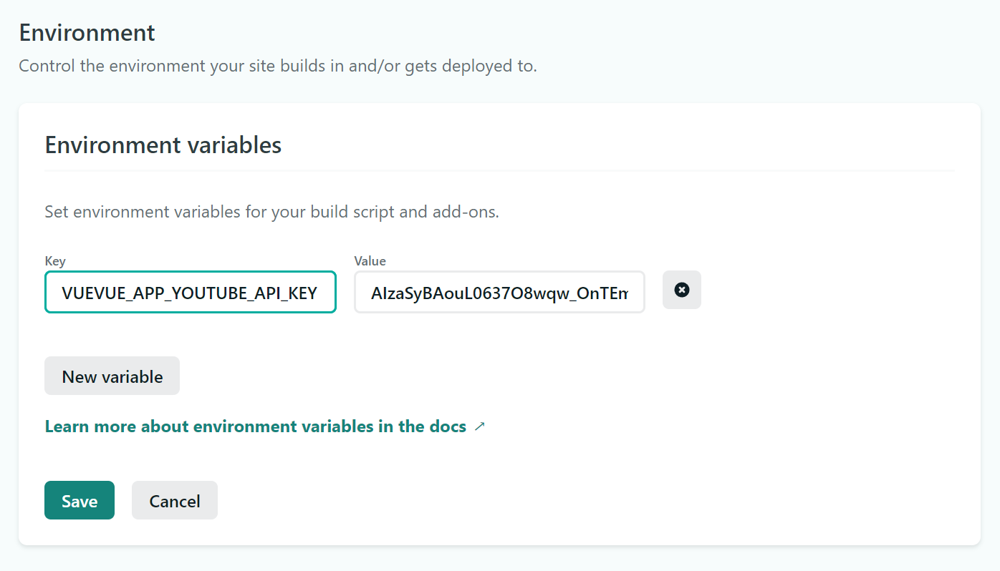
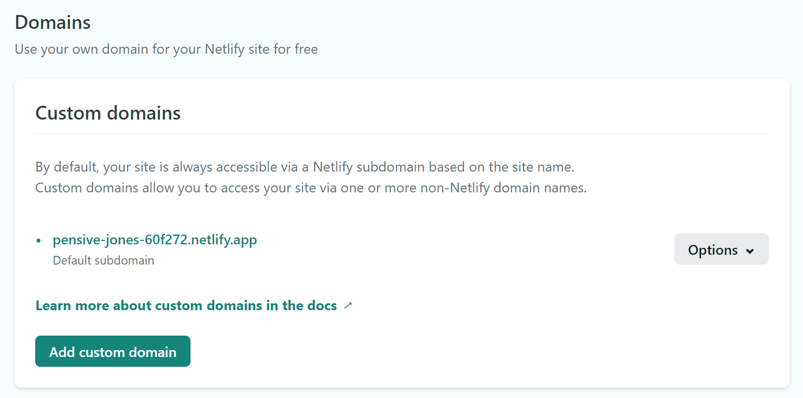
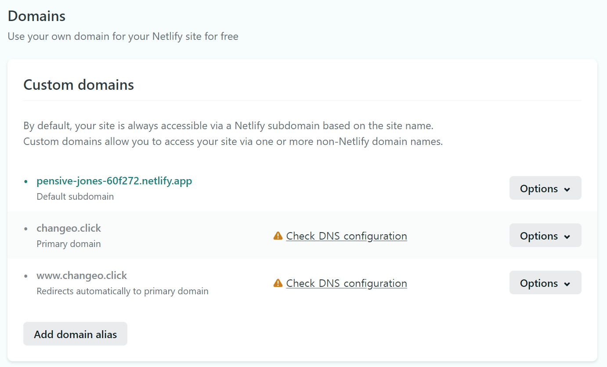
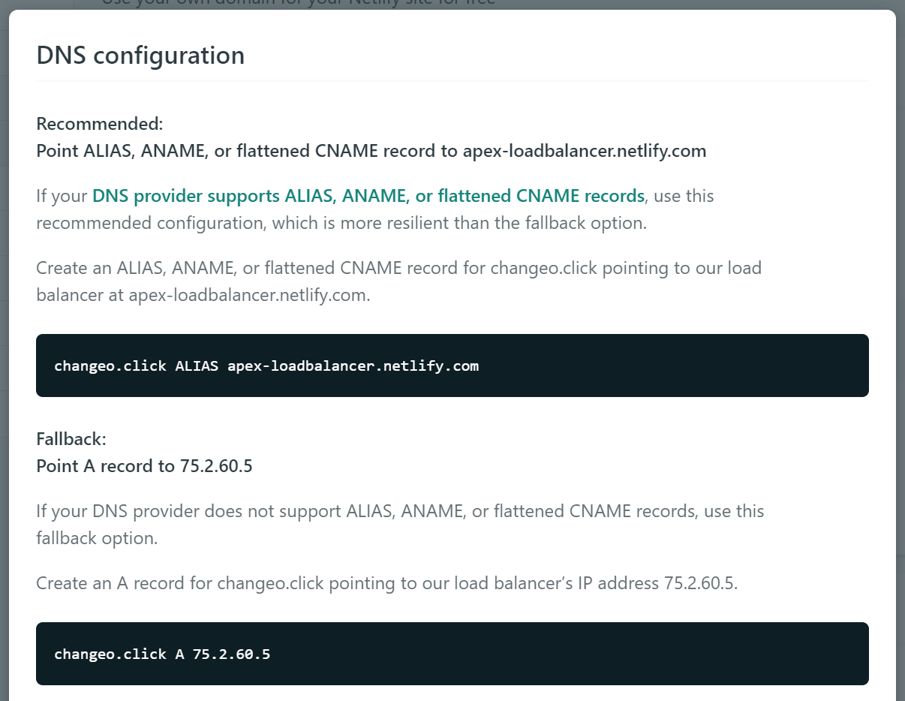
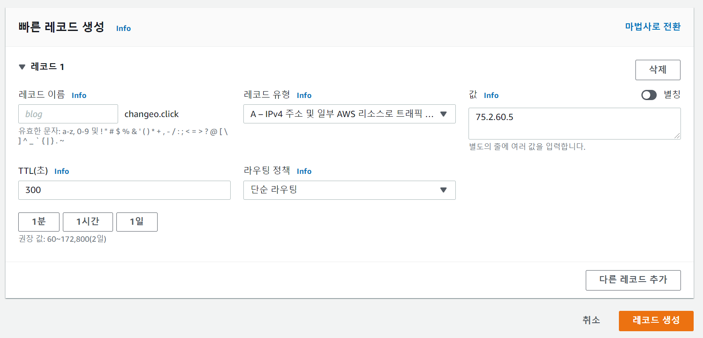
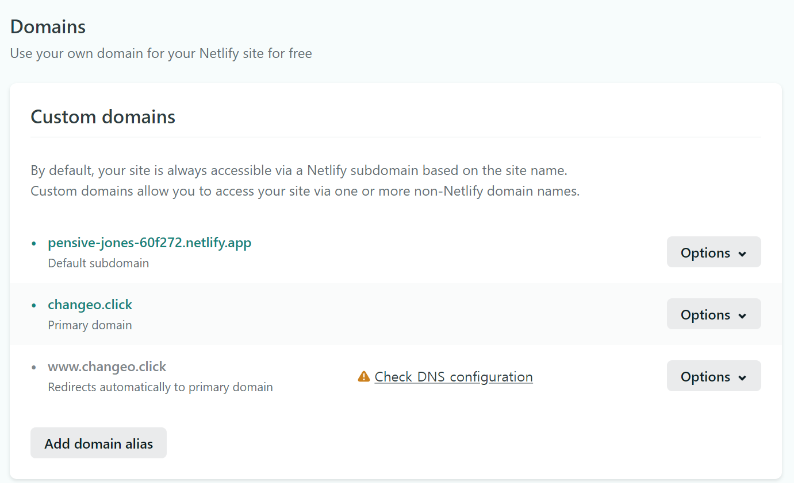
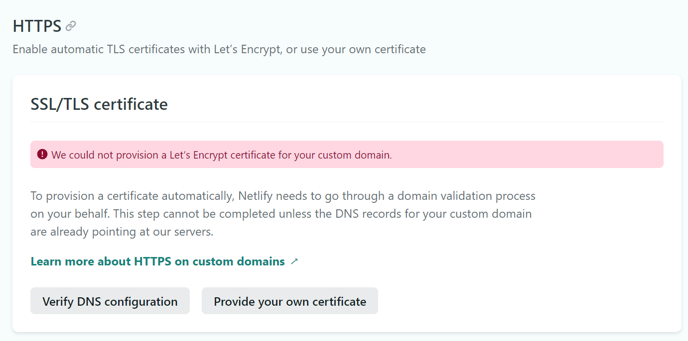
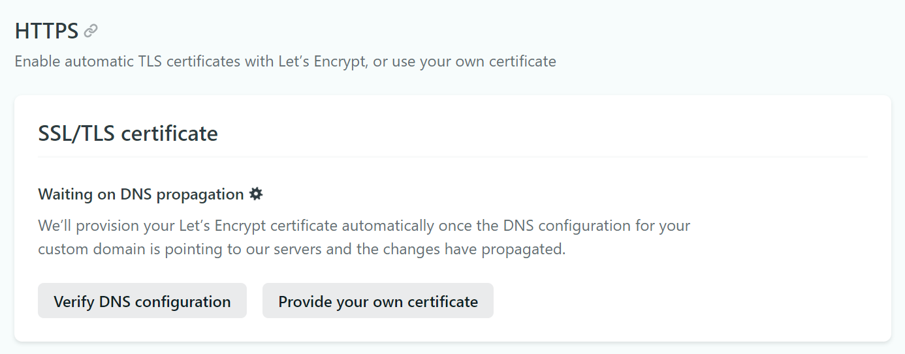

# Deploy Front End

<aside> 💡 Vue 배포 문서

## 준비사항

### Vue project

- 완성된 프로젝트

## deploy

### netlify

- 사이트 로그인

  

### project

- `Site settings` > `Build & deploy` > `Environment`

  

- build

```bash
npm run build
```

- dist 폴더 생성 확인
- dist폴더 업로드

## 도메인연결

- Site settings > Domain management > Domains >Add custom domain

  

- check DNS configuration

  

- IP 주소 확인

  

- route53 설정

  

- 새로고침 후 check 확인

  

- SSL > Verify DNS configuration

  

- 일정시간 후 인증 완료

  