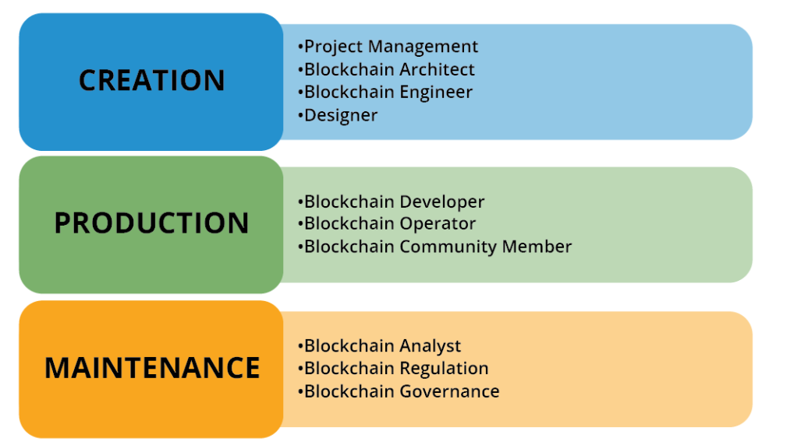
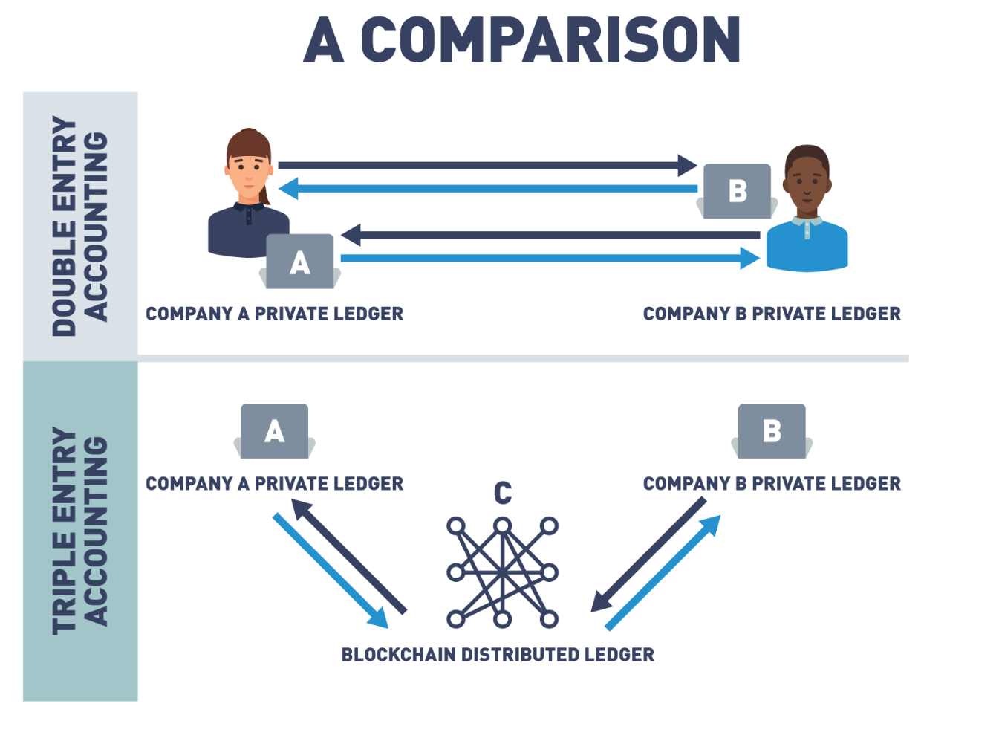

# Blockchain: Understanding Its Uses and Implications


## Introduaction to Blockchain


### Introduction to Blockchain and The Early Internet

Blockchain is a peer-to-peer ledger system that allows peers to transact directly with each other eliminating the need for a central authority. 


At its core, blockchain is a system for recording information about a transaction in a new decentralized way that makes it difficult or impossible to alter. These transactions are stored on sheets or blocks in a digital ledger that is shared among the participants of the network. Consensus on the transactions brings the peer-to-peer network into an agreement. Once agreed upon, these transactions are grouped in blocks, and blocks of transactions are recorded in the immutable ledger.


The Internet can be grouped into three distinct segments characterized by how people interact with this new technology.

- Web 1.0 - Internet of Connection
  - Development of a host of web-based applications, which fostered online services, such as email.
  - Managed by a Central Authority.
  - Read-only, information was “pushed” to users.
- Web 2.0 - Internet of Information
  - User-generated content.
  - Read-write, individuals can interact with information.
  - 
- Web 3.0 - Internet of Value
  - Community interaction
  - More connected, open, and intelligent
  - Identity and information will be held by the individual, breaking data silos.
  - Blockchain will exchange value in the form of tokens (fungible and non-fungible)

The "Internet of Value" represents a world where value is exchanged at the speed at which information moves today. 


### Blockchain Basics


A block on a blockchain can be thought of much like a page in a notebook. Data is stored on a block. the digital ledger doesn't care what kind of information you're putting on it. So, while most of what we're recording today are financial transactions, we could also record things like voting records and results, land titling and medical records, etc. What makes this blockchain notebook incredibly powerful is that all the pages are linked together. So that if you go back and try and change any data on any page anywhere in this notebook, you break a link in a very obvious and easy-to-determine way.


A block on a blockchain can be thought of much like a page in a notebook. Data is stored on a block. This provides immutability and security.


Blockchain is a combination of several other underlying technologies that have never been combined so successfully. Here are some features that make this new technology so revolutionary.


- Distributed Ledger
  - A ledger is a collection of transactions
  - no one owns the ledger. The ledger is distributed among participants in the network, all running the same blockchain protocols
  - It is decentralized in that an identical copy of the ledger exists on every node/computer on the network
- Peer To Peer
  - The ledger is stored, updated, and maintained by a peer network
  - They store, spread and preserve the blockchain data, so a blockchain exists on nodes
  - ll nodes on a network follow the same rules of operation or protocols, but nodes have different roles. 
    - A full node contains a copy of the blockchain protocol, transaction history of the blockchain and aids in the maintenance of the blockchain. 
    - User node interacts with the ledger.
  - With blockchain technology, a lack of a centralized authority is replaced with a peer-to-peer network.
- Transparency
  - we can see all the transactions that have occurred on the shared or distributed ledger
  - Since every node shares a copy of the agreed-upon ledger, there is no friction about the transactions, everyone has the same agreed-upon copy.
  - Centralized systems are not transparent, the information about the ledger is controlled by one authority.
- Consensus
  - Blockchain ledgers are different from centralized ledgers because network participants have an agreement upon what is in the identical ledger. 
  - In order for the blocks to be added, all the nodes in the system come to agree as to what transactions are accurate and should be added to the chain of blocks. 
  - Since there is no central authority telling the nodes which transactions are valid, a new way to reach agreement or come to *consensus* is needed.
- Encryption
  - assure the information on the blockchain is authentic
  - Cryptography and blockchain offer a secure way to prove something is authentic. Instead of relying on third-party, trust is put into cryptographic algorithms that prove the provenance and authenticity of an attestation.
- Immutability
  - Cryptography also plays a part in another powerful feature of blockchain technology, immutability. 
  - What makes blockchain incredibly powerful is that all the blocks are linked together. 
  - With the use of a cryptographic technique called hashing, the linked information is forged so that if you go back and try to change any data on any block anywhere in the shared ledger, the link with the other copies is broken in a very obvious and easy-to-determine way
- Programable
  - Some blockchains offer an additional feature, *smart contracts*, that impose logic into the system
  - you can think of these blockchains as computers
  - The first of these blockchains is Ethereum
  - Ethereum runs the EVM, Ethereum Virtual Machine, which has the ability to impose digital agreements or smart contracts. A smart contract is a program that runs on a blockchain that can impose contractual agreements. Typically, they work as digital agreements that enforce a specific set of rules. These rules are predefined by computer code, which is replicated and executed by all network nodes. Blockchain smart contracts allow for the creation of trustless protocols. This means that two parties can make commitments via blockchain, without having to know or trust each other. They can be sure that if the conditions aren't fulfilled, the contract won't be executed. Other than that, the use of smart contracts can remove the need for intermediaries, reducing operational costs significantly.


### Blockchain Roles

<center>[Stages of a Blockchain Project]</center>



- Creation

  - Project management
    - in charge of determining if a blockchain solution is needed
    - equires leadership to steer a project toward success
  - Blockchian Architect
    - chooses the appropriate blockchain system for a use case
    - the type of blockchain, cost-benefit analysis, and security design consideration 
  - Blockchain Engineer
    - the infrastructure of the blockchain solution, designing and developing a distributed blockchain network
    - Working with open-source code and determining programming languages, algorithms, nodes, data structures, and cryptography, design peer-to-peer networks
  - Designer
    - creates the interfaces that the system needs to interact with participants
- Production
  - Blockchain Developer
    - designs and codes the smart contracts that supply the logic behind business decisions
    - two type
      -  core developer : works on the emerging blockchain protocols that solutions are developed on top of
      -  software developer : charged with developing for specific use cases
  - Blockchin Operator
    - run the software that keeps a full copy of the blockchain and broadcasts transactions across the network
  - Blockchain community Member
    - a node operator or an entity that interacts with the systems
    - a strong community is a vital piece for a successful blockchain project. 
- Maintenance
  - Blockchain Analyst
    - examine the effectiveness of blockchain ledgers, determining areas that could use improvement and developing strategies for implementing changes
  - Blockchain Regulation
    - a wide-open field, with positions being created as the need to govern this new technology arises
  - Blockchain Governance
    - vital to the survival and adaptation of these ledger systems
    - must follow the basic financial guidelines issued by the governments


### Blockchain Use Cases


#### Business to Consumer (B2C)

- Benefits to the consumer are transparency to the consumer, accountability from suppliers, ethical sourcing validation, labor verification, and an immutable shared view.
- Vertical markets see the advantage to the transparency feature in blockchain. Financials, logistics, charity funding, agriculture and ethical sourcing tracking
- ex) IBM Food Trust : food supply chain with a permissioned, permanent, and shared record of the food supply chain that assures food has met with regulatory compliance and origins can be traced.


#### Business to Business (B2B)

- no single groups control the truth; rather, it is agreed upon, leaving no room for distrust

  => sharing information with a newly realized transparency

- blockchain strips the middleman (such as banks and brokers) to facilitate faster, more reliable workflows and less expensive payment systems

- eliminates the need for multiple paper copies that need to be verified and updated frequently

- finance, international trade & commerce, and food supply chains

  => Managed Blockchains eliminate the need for manually provisioning hardware, configuring software, and setting up networking and security components. 


#### Gonvernment To Consumer(G2C) / Government To Gevernment(G2G)

- Public sector organizations leverage blockchain technology to move away from siloed and inefficient centralized systems
- Blockchain networks offer more secure, agile, and cost-effective structures.


:bulb: common characteristc : transparency, traceability, immutability 


## 2. Blockchain Mechanics


### Understanding Ledgers

- **Ethereum**
  Ethereum, like Bitcoin, is a decentralized open-source blockchain. Unlike the Bitcoin Network, the Ethereum Protocol has the ability to run smart contracts. The cryptocurrency running on the Ethereum network is called Ether.
- **Smart Contracts**
  A smart contract is computer code that can be run on a blockchain that executes the conditions of an agreement.
- **Public Blockchains**
  A public blockchain has no barrier to entry. Anyone with a cell phone and a digital wallet can transact on the blockchain.
- **Private Blockchains**
  Private blockchains or permissioned blockchains have a Membership Services piece that grants access to users before they can interact with the blockchain.
- **Digital Wallet**
  A digital wallet is a computer application that represents a traditional wallet. It gives the user the ability to store and transact cryptocurrencies through the Internet.
- **Public Key Infrastructure (PKI)**
  Public Key Infrastructure is the identity management system for instilling trust into the electronic transfers of information or value. It is the technology used to authenticate users and information by issuing a set of key pairs (public and private).


The Ledger

Distributed Ledger Technology is another way to refer to the blockchain. A Ledger is a record of the movement of assets; it is not a collection of assets but a recording of the transactions affecting the assets.


Basic Accounting Systems 

Basic Accounting Systems have acceptable practices in place based on the General Ledger”


Single Entry Ledger

- a one sided entry in either the credit or the debit column
- Single-entry only.
- created the first documented accounting standards.


Double Entry Ledger

- tracks debits and credits.
- Tells the story of a transaction from both/all sides.


Triple Entry Accounting

Instead of keeping separate records based on transaction receipts, companies can write their transactions directly into a joint register, creating an interlocking system of enduring accounting records

Since all entries are distributed and cryptographically sealed, falsifying or destroying them to conceal activity is practically impossible.

- tracks debits and credits.
- Tells the story of a transaction from both/all sides.
- Distributed Ledger Record

third component in the Ledger system, blockchain,



[Double vs. Triple-Entry Accounting Comparison](https://learning.edx.org/course/course-v1:LinuxFoundationX+LFS170x+1T2023/block-v1:LinuxFoundationX+LFS170x+1T2023+type@sequential+block@47866c822c894049af4a2213c7a9d469/block-v1:LinuxFoundationX+LFS170x+1T2023+type@vertical+block@834ecd6eaa744a108a798b69a3f6e282)


Decentralized Ledger

we are entering a new phase where no one centralized authority has control of the details in the ledger; everyone does.

Once consensus is reached, no one can go back and deny a transaction


```
As you start to get more and more into blockchain, one term that you're gonna hear a lot is Byzantine Fault Tolerance.
And if you're wondering what that means, that very strange, cryptic sounding term, that can be explained with a story.
In 1982, a mathematical problem was formulated called the Byzantine Generals Problem,
and without getting too detailed into the mathematics behind it,
essentially, with the Byzantine Generals Problem was a story about two empires fighting a battle.
One Empire exists within the confines of a walled city, the second Empire has several generals surrounding that walled city, each with their armies waiting to attack.
And the balance of power is very, very evenly matched between these two empires.
And it is such that if all the generals agree to attack at the same time, they will have enough power to overcome the empire in the city and win the campaign.
If they, for whatever reason, they're not able to coordinate their attacks simultaneously, and even one general misses the message,
well then, the Empire surrounding the walled city is going to lose the campaign and the war.
So, the Byzantine Generals Problem explored a really key area of cryptography, in fact, the heart of what cryptography is,
which is how do I exchange messages with someone in an environment where they may become corrupt.
You have to understand the only way these generals had to communicate was to send a disguised messenger through the city with a message to deliver to the other generals,
and so, this always posed the risk, if you're a general and you're getting amessage from one of these messengers,
how do you know or how can you believe with greater than random certainty that the message you're getting is reliable and it hasn't been tampered with.
And this, again, was a problem that was postulated back in 1982 and went unsolved until 2008,
when the anonymous Satoshi Nakamoto proposed a solution to this problem.
Essentially, what the solution entails is all of the generals hiring as many mathematicians as they can.
When we talk about Byzantine Fault Tolerance, we're talking about the generals having more access, having more mathematicians, or more computing power on their side than the empire within the city.
So, if I'm the generals and I can hire more mathematicians, then that means that I can encrypt my messages going through the city with greater and greater complexity,
and if the balance of power becomes greatly tipped in the favor of the generals outside the city,
they can use encryption methods which are so complex, that there really is no real chance, or a very small chance that any of the mathematicians inside the city will be able to intercept that message,
decrypt it, change the contents, re-encrypt it, and do so in a time quick enough that the generals don't notice anything has happened.
And so, this is Byzantine Fault Tolerance.
This is the fault tolerance mechanism that we see used in most public blockchain solutions right now,
including Bitcoin, including Ethereum, although Ethereum is working on transitioning to a system called Proof of Stake, which we'll talk about in a later section.
But, when you hear Byzantine Fault Tolerance, often abbreviated as BFT,
all we're talking about is this idea that blockchains become secure if they have more computing power, more hash power in the chain than off the chain.
So, solutions like Ethereum, 16,000 plus nodes, or Bitcoin, the largest blockchain network that there is, with over 30,000 nodes,
offer us a high degree of security and immutability,
because the computing power on those networks is so great that there's really no reasonable chance that an adversary could ever control as much or more computing power to attack the data on that blockchain.
And if someone ever were to, chances are the economics behind it would be such that they would spend more to simultaneously harness all that computing power,
than they could possibly stand to gain.
And so, this is Byzantine Fault Tolerance.
It is the root of cryptography, which is simply the study of how do we send information back and forth securely in the presence of adversaries and bad actors,
and it's what underlies all the security and immutability that we get in blockchain.

```

- **Public Key Cryptography**
  This encryption method uses a pair of keys: an encryption key, and a decryption key, named public key and private key, respectively. The key pair generated by this algorithm consists of a private key and a unique public key that is generated using the same algorithm.
- **Zero-Knowledge Proofs**
  A new approach to protecting digital secrets that prove knowledge of a secret without revealing it.
- **Hash Functions**
  This type of encryption doesn’t make use of keys. It uses a cipher to generate a hash value of a fixed length. The function converts plain text (no matter the size) into a hash of fixed size. It is nearly impossible for the contents of plain text to be recovered from the cipher text. 
- **Merkle Trees**
  A data storage technique that compresses or packs data for storing blockchains with a tamper-free component built in. Merkle trees are built upon hashing principles in that each hash becomes a part of the next hash to build a tamper-resistant data storage model.


Identity in the blockchain is based on public key cryptography. A person’s address on the blockchain is their public key.

Transactions on the blockchain include their public key and are digitally signed with the sender’s private key:

- A digital signature verifies that someone in possession of the private key authorized the transaction.
- Digital signatures can be easily verified using the corresponding public key, which is included in the transaction.

 


1. 첨부된 메시지를 메시지 작성자와 동일한 방법으로 압축하십시오

2. 첨부된 서명을 사용자의 공개키로 확인하다"

```
In blockchain, with cryptocurrencies, it's a little bit different.
The only thing that ever gets kept in here is your private key.
And a private key - public key work together so that I can use a private key to sign, digitally sign, any message.
You can then take the public key, which anyone can know, and use that to verify that my specific private key was the one that actually signed that message.
And so, you can know without a doubt that I'm the one who created that message,
that no one was pretending to be me sending this message.
And this is how it works trading digital currencies back and forth.
If I decide I'm going to pay you three bitcoins and I'm gonna do it out of this hardware wallet or any software wallet, any kind of digital currency,
the only thing that's kept on this device is my private key and it never leaves,
and so, that means if I want to send you some money, all I'm doing is accessing the private key on this device to sign a message that gets transmitted to the blockchain,
that says I'm paying you some bitcoin or some ether or some litecoin,
and my public key is used to verify that that message actually did come from the wallet that says it did.
And this is how we trade cryptocurrencies back and forth,
and that's what makes the concept of a digital wallet a little bit different.
If I happen to lose this, I haven't lost the money that's in it, because there's no money ever in it.
All that money is is just a record on the blockchain, and, as long as I can recover that private key somehow, I can just get a new device,
start using my private key again and keep right on trading.
So, that's how public and private keys fit into blockchain; a very key component just to understand that they're used to sign and verify any transactions that you make.

```


Zero-Knowldege Proof(ZKP)

A zero-knowledge proof (ZKP) is a cryptographic method that allows a party (the prover) to prove to another party (the verifier) that a given statement is true without conveying any additional information.


```
This simple cave door analogy is a Zero-Knowledge proof, and if you can remember this cave door analogy,
then you'll understand why Zero-Knowledge Proofs are so important in blockchain.
For example, a user may make a request to send another user some money.
The blockchain naturally wants to make sure, before it commits this transaction,
that the user sending the money has enough to send.
However, the blockchain doesn't really need to know or care who is spending the money, or how much total money they have.
Being able to answer a question of "Does a user have enough money to send to another user" without knowing who the user is, or exactly how much they have,
is one of the primary use cases for Zero-Knowledge Proofs in blockchain.
So, when you hear about zk-SNARKs, don't get intimidated.
It's not a complex idea. Just think of Zero-Knowledge Proofs and the cave door,
think about how important it is in blockchain to be able to prove a claim without actually revealing the information behind that claim,
and you'll understand Zero-Knowledge Proofs.

```


Hash Functions in Blockchain

With data integrity guaranteed by algorithms, trust becomes part of the system.

Hash functions are featured heavily in blockchain. A hash function is a mathematical equation with four important properties:

1. Hash functions can take anything as input and create an output with a fixed size. This makes it possible to condense anything into a piece of data of a fixed size and is how messages are condensed for digital signatures.
2. It’s easy to calculate a hash but hard to determine a hash input from the output. The best option is to keep trying inputs until one produces the desired output.
3. Inputs that differ by a single bit produce hashes that differ by half of their bits on average. This prevents someone from finding a desired hash input using a “hill climbing”.
4. It is infeasible to find two inputs that produce the same output when hashed. Since a hash can take any input and produce a fixed output, it makes sense that multiple different inputs will create the same output. A good hash function will make it so that you have to try a large number of inputs before finding two that produce the same output.


**Merkle Tree**

A special type of data storage structure based on hash functions is called a *Merkle tree*:

- It is structured as a binary tree; the leaves contain the values to be stored, and each internal node is the hash of its two children.

```
Let's say Alice wants to validate transaction "F".
Alice would only need to send the data of transaction "F" and four hash values to Bob.
Bob would then calculate the hash value based on the given information.
And if the root matches the block, the transaction can be assumed to be valid.
Merkle trees allow for validation of a specific transaction without requiring the entire set of data.

```

https://learning.edx.org/course/course-v1:LinuxFoundationX+LFS170x+1T2023/block-v1:LinuxFoundationX+LFS170x+1T2023+type@sequential+block@5f4fa5704bd0432aad3727d0fb33c66a/block-v1:LinuxFoundationX+LFS170x+1T2023+type@vertical+block@c54aa091cea443968162c869f5c8db21


Key Management

 Public key cryptography is used in the blockchain as a method for managing users’ identities without revealing real-world identities.

In Ethereum, users are identified by an address that is directly related to the user's public key. This provides identity verification while preserving anonymity.


### [Transparency and Immutability](https://learning.edx.org/course/course-v1:LinuxFoundationX+LFS170x+1T2023/block-v1:LinuxFoundationX+LFS170x+1T2023+type@sequential+block@b2327e4750bc4beda267bf03132fbe6c)

Blockchain offers efficiency. It also creates trust and financial benefit through transparency, security, immutability, and accessibility through ownership.


Traditional databases do not retain historical information:

- Only the most recent versions of each value are visible.
- Deleted values are not visible in the database.
- This limits the transparency of data contained in the database.
- Values can be modified or deleted after creation.

The CRUD update model of databases allows data to be changed or removed from the database. This means that the visible data in a database is not an accurate historical record of the database.


The blockchain is designed to be a data structure that only allows appending:

- The past history of the blockchain is visible and immutable.
- Updates to the blockchain can be performed by including them in new blocks added to the blockchain.

The blockchain is designed so that its entire history is visible and unchangeable.

```
The way immutability works is blockchain is, by design, a very, very inefficient solution.
We are asking a large number of nodes, all the nodes on a network, to perform exactly the same work as every other node.
So, essentially, we are duplicating work over and over and over again.
The reason we do this, is because the only way to potentially change data on a blockchain,
is by changing the record on that blockchain for 51% or more of the nodes, or the miners, or the participants trying to come to consensus on the blockchain.

understand that we only have two possible operations on blockchain: we can only read data and we can only add new data.
There's no concept of an edit or delete, and this is what we talk about when we talk about immutability on the blockchain.

```


The blockchain is designed so that immutability is cumulative; each piece is linked to every other piece, creating a cohesive whole that is more difficult for an attacker to modify.

- At the bottom level, transactions are digitally signed by their creators. An attacker can’t forge a transaction unless they steal a private key.
- A block structure is predefined. Attackers can’t modify it to suit their purposes.
- The chain part of the blockchain is achieved using hash functions. Each block includes the hash of the previous block, creating a clear link between each block in the blockchain.
- Each block is digitally signed by its creator. The creator is selected through the blockchain’s consensus protocol, making it difficult for an attacker to be a legitimate creator.

All four of these features help to make the blockchain resistant against changes occurring after the fact.


```

Because this hash is the output of input to a hash function consisting not only of the transaction data, but also of the nonce, changing either one will result in a new hash output which does not match the difficulty.


all it has to do is simply share this nonce value with every other node on the network.

In this way, all nodes can come to consensus or agreement on what the right set of transaction data should be.
When a node thinks it's guessed the right nonce, it simply shares that value with the rest of the network.
If the majority of the network, 51% or more, agree with this nonce, because they have the same transaction data on their copy of the block,
then the miner who guessed this number first, will be rewarded and the network will come to consensus or agree that this is the correct version of the block data.
```


## 3. Blockchain functions


### Smart Contracts

```
well, I might have a smart contract that manages that that defines the rules and the steps that get taken when that particular type of event occurs.

And so this is all smart contracts are.

There's oftentimes a misconception when people hear the word contract that they think of a legally binding agreement between two or more parties.

It's not necessarily the case. Smart contracts don't have to be legally binding and they don't have to involve multiple parties.

In fact, if you come from a programming or development background you can think of a smart contract easily enough as a "class".

They're just a way for us to bake our own logic into block chain solutions to ensure that consistency of execution.

```

Let’s review some basic information about smart contracts:

- They are computer programs that execute an action based on terms and conditions.
- Can also be known as chain code.
- Smart contracts have terms recorded in a computer language instead of legal language. Smart contracts are not necessarily legally binding and do not need multiple participants.
- Each step of a smart contract can only be implemented after the execution of the immediate former step.
- Smart contracts are written in Solidity, a programming language designed for developing smart contracts that run on the Ethereum Virtual Machine.
- The smart contracts act as a foundation to build decentralized applications (DApps).
- Once executed, the information in the smart contract is stored on a blockchain which cannot be altered.


These are some of the features that smart contracts provide:

- **Accuracy**
  Replacing human intermediaries with executable code ensures the process will always be performed the same.
- **Cost Savings**
  Replacing intermediaries often provides significant cost reduction.
- **Efficiency**
  Removing process intermediaries often results in significant process efficiency gains.
- **Backup**
  A blockchain and smart contract deployed to it can provide a permanent record, allowing for auditing, insight, and traceability, even if the creator is no longer in business.
- **Autonomy**
  Smart contracts can be developed by anyone, no need for intermediaries such as lawyers, brokers, or auditors.


Use case : campaign finance & campaign donation

```
Maybe, we want to use blockchain to empower voters to keep their politicians more accountable to the promises they make on the campaign trail.

Blockchain and smart contracts puts this power back in the hand of voters and has the potential to radically reform campaign finance and campaign donations.
```


### Blockchain Security

It takes a very different approach to data storage and processing and requires a very different perspective for security.

In this section, we will discuss some of the ways that security differs in traditional and blockchain environments.


```
In this section, we're gonna talk a bit about how traditional cybersecurity is different than security concerns on the blockchain.
In traditional cybersecurity that we're all used to, we're very perimeter-focused meaning that we put trusted data and assets behind a very, very strict perimeter.
We assume that anybody we let inside that perimeter is trusted, either partially or fully, to see that data and access those resources.
And the brunt of our focus goes into making sure that we keep the right people from getting beyond that perimeter,
that we only let authorized users through, and then we prevent any attackers or strangers from breaching that perimeter and accessing the data and resources we store behind it.
This is very different from blockchain, which runs on a massively decentralized peer-to-peer global network.
Just by its very definition, you can see that there is no perimeter on blockchain, and so our security has to come from somewhere else.
Our security on blockchain comes from the incredible amount of repetition.
The fact that we ask every node to keep the same copy of the ledger and periodically to reach consensus, majority consensus, on what the proper data in that ledger should be.
This makes the amount of work that an attacker would have to do practically impossible, if they wanted to change, hack, or alter the ledger.
Another big difference between traditional cybersecurity and security on the blockchain is with conventional applications and conventional technology.
We either develop all our own code or application parameters in-house or we rely on a single, third-party trusted provider who creates that line of business system for us.
All the code, generally, comes from one place, and if we don't write it ourselves, all we have to have is trust and faith in the third-party organization providing it to us.
In blockchain, things are a little bit different, because oftentimes in blockchain solutions we're writing smart contracts which call code from other smart contracts, which we may or may not write ourselves.
And which may come from a variety of different authors.
So whereas in the traditional cybersecurity space, we really only need to rely on our own due diligence to write secure code or the due diligence of a third-party application provider.
In blockchain, we have to expend a lot more time and energy, making sure that the code and the contracts we're calling is safe and secure.
In other words, we want to make sure that we're not inheriting any security vulnerabilities from other smart contracts that have been written by unknown and potentially untrusted parties.
And the final big difference between conventional cybersecurity and blockchain is that in conventional line of business systems all of our applications either run directly on trusted hardware that we own
as an organization or run on hardware with a high degree of trust provided by a third-party such as Microsoft Azure or Amazon Web Services.
In the blockchain world, all of our code runs on untrusted resources, untrusted hardware that can be owned by anyone, anywhere in the world.
This means that we must ensure that all the trust in a blockchain solution comes from the protocol and the code layer itself,
because it's a much more massively distributed network, and we don't have direct control or access into the hardware that supports it.
So, there are a lot of differences between conventional cybersecurity and security in the blockchain space that you're going to want to understand before you deploy your own blockchain solutions.

```

### Standard Cyber Security ENVIRONMENT

- The traditional computing environment is a company network fully or, at least mostly, under the control of the company's computer security staff.
- While many organizations are making the shift to cloud-based environments, they still have a high degree of control over the security and configuration of their rented systems.
- Traditional networks are highly centralized, and the focus of cybersecurity on these systems is primarily perimeter-focused. All systems and authorized users on the network are trusted or semi-trusted, so the focus is on preventing attackers from entering from outside the network.

### Blockchain Cyber Security Environment

- Blockchains are designed to be decentralized, distributed systems running on untrusted hardware.
- While security in traditional environments is designed to provide security by putting all data in one place and building walls around it, security in blockchain is based on ensuring that data is protected from modification by copying data to as many locations as possible to make modification of all copies infeasible.
- Traditional infrastructure focuses on confidentiality and integrity, while blockchain is designed to provide integrity and availability.


- Denial-of-Service (DoS)
  - A denial-of-service (DoS) attack is when an attacker makes it impossible for a system to serve its users as designed
  - In traditional environments, denial-of-service attacks target a company's web server to prevent customers from accessing the company's services.
  - In blockchain, a denial-of-service attack involves submitting more transactions to the blockchain than it can handle.
    - Since many blockchains have fixed-size blocks created at a fixed rate and are stored in a distributed fashion, they have a maximum capacity

- Endpoint Security
  - 
  - Endpoint security originated to ensure multi-layer prevention against malware, fraud, cyber threats, and attempts to extract private information.
  - In traditional cyber, endpoints are under the control of the enterprise and have some level of heterogeneity.
  - In blockchain, endpoints are the nodes and may be completely homogeneous. While homogeneity means that a flaw in one system is a flaw in all of the systems, blockchains built in trust and data privacy feature guard against such attacks.
- Code Vulnerabilities
  - Computer applications are dependent on reliable code
  - In traditional cyber, the company writes most of the code, and vulnerabilities can arise only from code that the company controls.
  - In blockchain, anyone can write a smart contract, and a flaw in the smart contract or the underlying platform code can have wide-reaching consequences
  - But since smart contracts can be vetted and reused, such inconsistency can be edited from the code

vetted :  일반적으로 특정 표준 또는 요구 사항을 준수하는지 확인하기 위해 철저하게 검사 또는 평가된 것

- Intentional Misuse
  - In traditional cyber, insider attacks or intentional misuse of the system by clients are possible
  - Blockchain systems are set up to incentivize network participants, miners or nodes, to do something that is in their best interest. A weakness is, if more than half of the network's processing power is controlled by a single group, the network is controlled by that group.
- Data Protection
  - In traditional cyber, data is siloed, and access is strictly controlled by the owners, placing responsibility for confidentiality, integrity, and availability in their hands.
  - In blockchain, data is distributed, and the blockchain is relied upon to provide integrity and availability.


### Types of Blockchain


**Different Types of Blockchains**

- **Permissionless Blockchains**
  Public blockchains are permissionless. Anyone can effectively join the blockchain network. No one is prohibited from joining.
- **Permissioned Blockchains**
  In a permissioned blockchain, participation is permissioned by an organization or a consortium of organizations. This empowered entity defines who can participate in certain transactions and consensus on the network.


Public Blockchains 

-  are decentralized where no one has control over the network
- Node operators and users join the network freely by downloading the protocol.
- he anonymity of the public blockchain and its safe and open platform to conduct business properly and efficiently make this type of blockchain attractive to supporters. 
- Public immutable and censorship-resistant networks are ideal for participants who don't trust each other but must still interact.
- ex) Bitcoin , Ethereum 

```
And, if we don't know who a user is, then we really have no way of creating permissions, role-based access and controlling what data they can read or write.
```


Private Blockchains (managed blockchains)

- define a user's rights on the network prior to 
- A central authority in a private network decides who can be a node. 
- Restrictions are placed on activities such as who can write to the ledger and what transaction they can participate in
- not completely de-centralized as a group decides the user’s rights to the network.
- Hyperledger, Corda


Hybrid Model

- mix of both public and private blockchain features where some part is controlled by some organization and other parts are made visible on a public blockchain
- offers a remedy where data is to be accessed publicly but still needs to be shielded privately
- By using the public blockchain, you still maintain integrity, security, and immutability, and by added privacy features, you decide who can see certain transactions.
- Ripple


Consortium (Federated Blockchain)

- the sweet spot between fully open decentralized systems and fully controlled, where trusted consensus comes from multiple organizations having a stake in the outcome
- The consortium is formed out of a need for organizations to solve a common problem where all players can contribute to the results.
- Hyperledger, Quorum (based on Ethereum), R3 Corda.


- **Distributed Ledger**
  With a distributed, decentralized ledger, every user has the same copy of the transactions, with every user having the same authority in validating those transactions. 

- **Immutable**

  When a transaction is committed to the blockchain, it cannot be altered, creating a trust in the information’s accuracy. Once a transaction is recorded on the ledger, it can’t be altered in any way unless most of the validators agree to do so.

- **Anyone can Participate in Consensus**

  Not only are public blockchains open for users to transact, but the system is also open for participants to become a node on the system and participate in the process of reaching consensus to valid transactions.

- **Open Read / Write Access**

  Just like anyone can participate in adding transactions to the blockchain, transactions that have been committed to the blockchain can be viewed by anyone with the proper blockchain explorer application. 

- **Low Barrier to Entry**

  In a public blockchain, no KYC, Know your Customer, or any form of identity check is needed to enter the network. Anyone can join and participate with little effort (internet connection and a cell phone).

- **Secure**

  Since anyone can view and audit data on the blockchain, public DLT networks operate transparently. For that reason, it’s much easier to spot malicious, dishonest, and illicit activities in the ecosystem.


**Private Blockchain**

```
In a public blockchian, We rely on economics and game theory incentives to ensure that everybody in the system behaves honestly and according to the rules.
We set up situations through group consensus, which we discuss in other sections in this course, through which honest participants are economically rewarded,
where dishonest ones only incur work or cost, with no possibility of ever recouping that cost.


In a private permission blockchain, we rely on the fact that we know who a user is.
So, in a corporate scenario, blockchain for the business, blockchain for supply value chains, because we know who an individual is, what organization they're associated with and what their role is,
we also assume that they're going to behave fairly aboveboard, because if not, we know exactly who's misbehaving and they know that they're gonna suffer the consequences for that.

```


- **Scalable**
  A private blockchain has a limited number of validators making the network more efficient, resulting in faster transaction throughput speeds.

- **Access Control**

  Since private networks grant access to users, network participant roles and rights are clearly defined before they can engage in the network. This user-defined, invitation-only access results in complete control over who can join the network. 

- **Cost Savings**

  The network configurations for private blockchains tend to be lighter and more agile. Fewer nodes validating transactions reduces the cost of maintaining the network. 

- **Customizable** 
  Private networks can choose the best consensus model and privileges for users. Private networks can also pivot quicker to regulatory demands than public networks. 


public vs private

```
public blockchains are really good for scenarios where protecting the anonymity of users is important or adds value to the solution

private blockchains being adopted at scale because the concerns are the opposite in a corporate scenario in   business scenario anonymity is a bad thing I want to know exactly who all the participants are and I need  to know who they are because I don't want full transparency
I don't want to share all my business data with all the participants in my business network or the general  public at large I want to control who sees what type of information under what circumstances and I also want to control who is able to contribute that information onto the blockchain

```


**Is Blockchain Right for You?**

consider before deciding if a blockchain solution will solve your business needs. 

- **Deciding on a Blockchain**

  When it comes to decision-making around which blockchain model to use, it's important to determine which platform and data storage structure is right for your business.

- **Intermediaries**
  Blockchain implementations can eliminate middlemen from work processes. Blockchain changes the way we transact, removing unnecessary auditors from your system.

- **Central Authority**

  Some organizations rely on one person having control, with blockchain decentralized workflows without a single point of failure are emerging.

- **Multi-party interaction**

  Blockchain provides a trust layer that opens new opportunities for participation. This type of cooperation is evident in blockchain supply chains where participants along the supply chain rely on the same blockchain platform.

- **Visibility**
  Blockchain transparency reduces dispute over what is in the ledger since agreement occurs before transactions are committed, and everyone can have access to the ledger.

- **Write / Read Access**

  Public permissionless blockchains do not prohibit who can add blocks to the chain, where private permissioned can restrict access. Hybrid solutions can incorporate characteristics of public and private blockchains.

- **Value Transfer**

  Blockchains can differ in the ways participants manage the transfer of value.

Blockchain solutions are worth pursuing if you have multiple parties that don’t necessarily trust each but must transact.


Here are some questions you should ask yourself when deciding to adopt a blockchain strategy for your company.


**Blockchain Considerations**

There is not a “one size fits all” blockchain but rather a well-thought-out approach that considers many options. 


- **Governance**
  Governance of blockchains deals with a system for managing and implementing changes to blockchains. 

- **Smart Contract Functionality**
  Each organization has unique needs when deciding on smart contract functionality. Can smart contracts replace or accentuate current workflows? Can a previously written smart contact fit into the current business model? 

- **Consensus / Algorithms**
  Consensus models change depending on the type of blockchain environment you are creating. In order for a blockchain to work, th**e participants must come to an agreemen**t as to the transactions in the ledger or the state of the ledger. This agreement is called consensus. 

  Public blockchains have miners that are incentivized to reach consensus, whereas private blockchains set up enterprise nodes that agree to the state of the ledger. 

- **Integration**
  Consideration for current workflows and how to bridge blockchain platforms with existing systems are a vital conversation. How can blockchain add value to your current organization while leveraging your existing systems?

- **Cryptocurrency Requirements**
  As mentioned previously, cryptocurrency is a medium of exchange digitally enabled by blockchain.

  Cryptocurrencies secure and keep track of assets on a public blockchain. Enterprise blockchains are incentivized by improved workflow but still need to be able to transfer value. 

  Decisions on if and how your blockchain will exchange value among participants are important discussions that need to occur during the design phase. 

- **Cost Monitoring**

  Options for determining how the nodes will run and how data will be managed with new cloud-based solutions need to be analyzed. 

  New questions arise around consortium-type blockchains; one consideration is how to split the technology cost among the participants in a fair and equitable manner. 


### The Blockchain Transaction


Regardless of the blockchain technology, the flow of data through a blockchain will remain relatively the same, at least at a high level.

1. It will all start with a blockchain user performing an operation that should be stored on the chain.

2. The operation will trigger a smart contract, or it will trigger chaincode.

​	In either case, the code will be executed on the actual blockchain itself.

3. The output of this code will result in a transaction, and that transaction is what we intend to be stored on the blockchain.

4. Next, the blockchain operators using protocols that will be specific to the specific blockchain that's running on will spread that transaction throughout the blockchain network.

5. The block creators will collect all of the transactions and it will create a new block.

​	In most blockchains, this is the job of the miner and is the output of the mining process.

6. The block operators will spread the block through the peer network to update the ledger copies once consensus has been achieved.

7. And this results in the block operators again executing code included in transactions within the block to update their own copy of the internal state of the blockchain.

The users will be notified of an event from a blockchain creation via an event.


### Consensus


Once the page is full, the group of nodes come together and compare the different sheets and select the sheet or the version of paper that the majority agree with. Once agreed, the sheet or block is committed to the chain.


The takeaway point to understand is that consensus is this idea of asking all of these nodes, potentially tens of thousands of nodes, to all repeat the same work and then periodically come together and agree on whatever the majority selects the correct version of the truth to be. That gives blockchain a high level of trust, and that makes it such a secure record store.

there needs to be a final decision at some point on what should and shouldn’t be included in the official record


blockchain consensus algorithms boil down to some kind of vote where the number of votes that a user has is tied to the amount of a limited resource that is under the user’s control


Five Factors should be considered:


- **Throughput**

  Throughput refers to the volume of transactions the blockchain can process. The larger the transaction per second, the greater the blockchain can scale up performance metrics.

- **Latency**

  Latency refers to the amount of time it takes to confirm and commit transactions. Bitcoin protocol takes 10 minutes on average to validate transactions.

- **Node Scalability**

  Node Scalability refers to how many nodes the system can support without compromising performance.

- **Security**

  Security, in this case, refers to how resilient the system is to various security threats. Client onboarding, Digital Signature, Network Attacks, Data Privacy Governance, and Legal Issues fall under security. 

- **Cost**

  How much it costs to build and run a blockchain system. Running costs are calculated as cost per confirmed transaction (CPCT).


**Proof of Work**

- miners compete against each other to complete a math equation on the network, and the first to solve the equation gets a reward
- Users in the blockchain network who want to create the next block (and win the associated reward) are called miners
- When a miner finds an acceptable solution, they create a block and broadcast it to the network, finalizing that block.
- Proof of Work exploits the scarcity of computational resources by choosing a problem that can only be solved by guessing
- incentivizes miners to run as many mining machines as possible to maximize the probability that they are the first to find a solution to the problem. Since mining computers take money to purchase and money to run, the amount of control that a user can exert over the blockchain is limited by the amount of money they have available to invest in mining equipment
- 전기 많이 소요


**Proof of Stake**

- requires less energy and has a lower barrier to entry since no specialized “mining” hardware is required to create blocks
- "stake" or promise not to use the tokens they own
- participants referred to as “validators” lock up a set amount of cryptocurrency or their stake in a smart contract on the blockchain
- In exchange, they get a chance to validate new transactions and earn a reward. But if they act improperly, they could lose their stake as a penalty. 


**Fault Tolerance in the Blockchain**

what happens if all participants in the network don’t agree? How much dissension can be tolerated? 


```
Like any peer-to-peer system, we have an extremely high degree of fault tolerance.

In fact, if we have two or more nodes online in a blockchain system, we still have a working blockchain.

That gives us a tremendous margin for error, for nodes coming and going offline, for network transport issues,

when a node comes online after being offline for a while, all it has to do is sync up, and get all the data that it missed while it's been offline from all of its peers,

it makes blockchain really, really a great platform to use in environments with less than ideal networks and power infrastructure,

In a traditional client-server model, if that server is offline, those clients have no way of getting the data that they requested or performing the operations they'd like to perform.

This is not the case in blockchain.

So if you're looking for a solution platform that offers you that kind of incredible fault tolerance, if you're looking to deploy a solution into areas with less than ideal infrastructure or under conditions where nodes may come online and go offline  requently, then blockchain may be a really good platform to look at.

```


**The Byzantine Generals' Problem**

The problem lies with how to trust all participants to receive the correct message. 

The Byzantine Generals' Problem is a scenario designed to demonstrate the difficulty of multiple parties coming to an agreement when communication can only be accomplished on a one-to-one basis and is untrusted. The goal is to find a way to achieve a consensus on strategy despite the possibility of traitors and false messages. Presumably, all generals will abide by what they believe is the majority consensus. The Byzantine Generals' Problem is solvable if two-thirds of the generals are honest.

Blockchain is designed to be Byzantine Fault Tolerant, meaning that the network will come to a consensus on the official state of the blockchain, even though some members may misbehave. 


Proof of Work 단점

- 느리다 (processing capability)
  - Proof of Work is capable of processing anywhere between 10 and 20 transactions per second worldwide.
  - Visa's payment processing network which can scale up to over 70,000 transactions per second.

- 전기를 많이 쓴다

- 중앙화
  - 전기가 싼 지역이나, 좋은 기기를 가진 그룹에게 집중
  - folks are competing with very various specialized pieces of equipment, specialized hardware, specialized mining rigs, in order to mine most efficiently. And this can be done most efficiently in large data centers where electricity is cheap.


