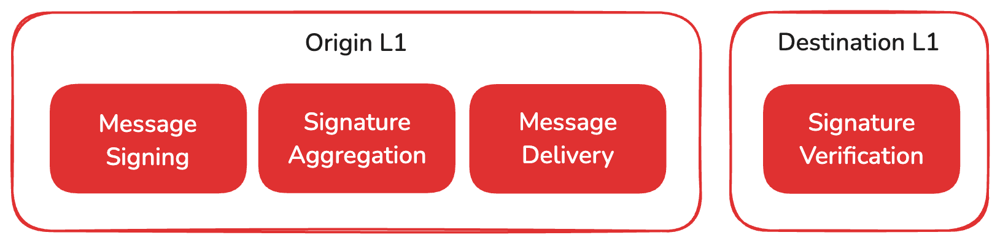

# Avalanche


## Quik start


### Introduction

- 특징
  - quick finality and low latency
    - in less than 2 seconds, a transaction is effectively processed and verified
  - Built to Scale
    -  can build application-specific blockchains with complex rulesets or build on existing private or public Avalanche L1s in any language.
    - Avalanche consensus scales to thousands of concurrent validators without suffering performance degradation making it one of the most secure protocols for internet scaling systems
  - incredibly energy-efficient and can run easily on consumer-grade hardware
    - equivalent to 0.0005% of the amount of energy consumed by Bitcoin.


### Consensus Algorithm: Snowball

- 프로세스
   
   1. asks a small, random subset of validator nodes
   2. Each queried validator replies with the transaction that it prefers, or thinks should be accepted.
   3. The node repeats this sampling process until the validators queried reply with the same answer for a sufficient number of consecutive rounds.

- finalization

  - When a transaction has no conflicts, finalization happens very quickly
  - When conflicts exist, honest validators quickly cluster around conflicting transactions, entering a positive feedback loop until all correct validators prefer that transaction. 

- 알고리즘

  - 변수
    - *n*: number of participants
    - *k* (sample size): between 1 and *n*. `20`
    - α (quorum size): between 1 and *k*. `14`
    - β (decision threshold): >= 1. `20`
  - 동작
    1. query *k* people (the sample size) and ask them what they prefer
    2. If α or more people give the same response, that response is adopted
    3. If the new preference is the same as the old preference, the `consecutiveSuccesses` counter is incremented
    4. repeats this until they get a quorum for the same response β times in a row. (consecutiveSuccesses > β) 

  - liveness & safety
    - α(quorum size) :arrow_up: => safety threshold :arrow_up: & liveness threshold​ :arrow_down:

- Finality
  - In Avalanche, acceptance/rejection are **final and irreversible** and only take a few seconds.

- Validator

  - To become a validator, a node must **bond** (stake) something valuable (**AVAX**). The more AVAX a node bonds, the more often that node is queried by other nodes

    => prevent malicious actors

  - Avalanche has no leader. Any node can propose a transaction

- Two big ideas
  - **subsampling**
    - has low message overhead (validator 수가 증가해도 네트워크 부하 X)
  - **transitive voting**
    - a vote for a block is a vote for all its ancestors
    - Each vote is actually many votes in one (throughput :arrow_up: )


### AVAX Token

- 개요

  - hard-capped (up to 720M)
  - `1 nAVAX` = `0.000000001 AVAX`

- Utility

  - AVAX represents the weight that each node has in network decisions
    - proportional weight through proof of stake (PoS)

  - gas fee
    - The fees used to execute a transaction is burned, or permanently removed from circulating supply.

- Tokenomics
  - 최초에 360M 민팅. 시간이 지남에 따라 조금씩 AVAX가 늘어나는 구조
  - While AVAX is still far away from its supply cap, it will almost always remain an inflationary asset.


## Multi-chain architecture


### Avalanche L1s

- 구성
  - Primary Network
    - a special Avalanche L1 running three blockchains
      - P-Chain : The Platform Chain
        - responsible for all validator and Avalanche L1-level operations
        - rols
          - creation of new blockchains
          - addition of validators
          - staking operations
          - other platform-level operations
      - C-Chain : The Contract Chain
        - implementation of EVM
        - roles
          - deployment and execution of smart contracts written in Solidity
      - X-Chain : The Exchange Chain
        - responsible for operations on digital smart assets(**Avalanche Native Tokens**)
          - A smart asset is a representation of a real-world resource (ex. equity, or a bond) with sets of rules
        - roles
          - creation and trade of Avalanche Native Tokens
  - L1 chains
    - Node operators that validate an Avalanche L1 with multiple chains do not need to run multiple machines for validation
    - Every validator of an Avalanche L1 **must** sync the P-Chain of the Primary Network for interoperability
- Advantages
  - Independent Networks
    - Each L1 is isolated from other L1s
    - L1s can have their own token economics, execution logic and policies
  - Native Interoperability
    - enables native cross-Avalanche L1 communication
    - allows developers to implement arbitrary communication protocols between L1s.
  - Accomodate App-Specific Requirements
    - L1 could require that validators meet certain hardware requirements
  - Control Privacy of On-Chain Data
    - Avalanche L1s are ideal for keeping information private
    - [:link:](https://build.avax.network/docs/nodes/configure/avalanche-l1-configs#private-avalanche-l1)
  - Validator Sovereignty
    - enables validators to concern themselves only with blockchain networks they choose to participate in

- Validator management: choosing between PoA and PoS
  - Proof of Authority
    - Control and Compliance
    - Simplified Governance
  - Proof of Stake
    - Decentralization
    - Security
    - Community Participation


## Interoperability


### Avalanche Interchain Messaging (ICM)

- 개요

  - a low-level messaging protocol which enables native cross-Avalanche L1 communication (AWM보다는 상위)
  - ICM uses the BLS signature scheme, which allows message recipients to verify the authenticity of these messages.

- Use cases

  - Oracle Networks
    - broadcast their data from their origin chain to other Avalanche L1s.
  - Token transfers between Avalanche L1s
  - State Sharding between multiple Avalanche L1s
    - 대규모 데이터베이스를 여러 작은 단위(샤드)로 분할하여 데이터를 분산 저장하는 기술
  - 위 사례들에 국한되지 않고 여러 경우 가능

- Elements of Cross-Avalanche L1 Communication

  

  1. Signing Messages on the Origin Avalanche L1
  
     - Any type of data encoded in an array of bytes can be included in the message
  
     - uses the BLS signature scheme
       - allows message recipients to verify the authenticity of these messages
         - every validator holds a BLS key pair => 공개키로 개인키 서명 검증 가능

  2. Signature Aggregation on the Origin Avalanche L1
     - BLS can aggregate many signatures of different signers in a single multi-signature
  
  3. Delivery of Messages to the Destination Avalanche L1
  
     - can determine how L1s want to transport data from the validators of the origin Avalanche L1 to the validators of the destination Avalanche L1 
  
     - not pass through a central protocol & no record of messages &  no bottleneck
  
  4. Verification of Messages in the Destination Avalanche L1
  
     - BLS verification
  
     - set the combined weight of the validators
       - ex) L1 C-chain은 90% 이상의 stake를 차지하는 account들이 메시지를 서명했을 때 수락


#### BLS

- can aggregate many signatures of different signers in a single multi-signature

  => validators  can now individually sign a message and these signatures are then aggregated into a short multi-signature that can be quickly verified

- The authenticity of the message can be verified using these public keys and the signature.


#### ICM Serialization

```
+---------------+----------+--------------------------+
|      codecID  :  uint16  |                 2 bytes  |
+---------------+----------+--------------------------+
|     networkID :  uint32  |                 4 bytes  |
+---------------+----------+--------------------------+
| sourceChainId : [32]byte |                32 bytes  |
+---------------+----------+--------------------------+
|       payload :   []byte |       4 + size(payload)  |
+---------------+----------+--------------------------+
                           |  42 + size(payload) bytes|
                           +--------------------------+
```

- `payload` provides an arbitrary byte array containing the contents of the message. VMs define their own message types to include in the `payload`


#### Verifying / Receiving ICM 

- 검증 과정
  1. P‑체인에서 source 네트워크의 해당 height 기준 validator set 조회
  2. signers 비트맵 기반 서명자 필터링
  3. 수신 VM이 정의한 가중치 임계값 충족 여부 검증
  4. 공개키 aggregate 후 서명 검증 수행
- 결과 기록
  - 트랜잭션이 블록에 포함되려면, 해당 인터체인 메시지는 반드시 유효성 검증을 통과
  - 블록에 **ICM 검증 결과**를 함께 저장

---

### Avalanche Warp Messaging

- Avalanche Warp Messaging provides a basic primitive for signing and verifying messages between L1s
- Native cross-L1 messaging protocol (low-level)


#### EVM에서 Warp 동작

1. Call the Warp Precompile `sendWarpMessage` function with the arguments for the `UnsignedMessage`
2. Warp Precompile emits an event / log containing the `UnsignedMessage` specified by the caller of `sendWarpMessage`
3. Network accepts the block containing the `UnsignedMessage` in the log, so that validators are willing to sign the message
4. An off-chain relayer queries the validators for their signatures of the message and aggregates the signatures to create a `SignedMessage`
5. The off-chain relayer encodes the `SignedMessage` as the [predicate](https://build.avax.network/docs/cross-chain/avalanche-warp-messaging/evm-integration#predicate-encoding) in the AccessList of a transaction to deliver on blockchain B
6. The transaction is delivered on blockchain B, the signature is verified prior to executing the block, and the message is accessible via the Warp Precompile's `getVerifiedWarpMessage` during the execution of that transaction


### warp precompile

- Warp Messenger : 0x0200000000000000000000000000000000000005 주소에 precomplile 되어있음

---

### ICM contracts


Importantly, a message is still considered delivered on its destination chain even if its execution fails. This allows the relayer of the message to redeem their reward for deliverying the message, because they have no control on whether or not its execution will succeed or not so long as they provide sufficient gas to meet the specified `requiredGasLimit`.


### ICTT

Each token transferrer instance consists of one "home" contract and at least one but possibly many "remote" contracts. 


Home contract instances specify the asset to be transferred as either an ERC20 token or the native token, and they allow for transferring the token to any registered `TokenRemote` instances. 

- `ERC20` -> `ERC20`
- `ERC20` -> `Native`
- `Native` -> `ERC20`
- `Native` -> `Native`


The remote tokens are designed to have compatibility with the token transferrer on the home chain by default, and they allow custom logic to be implemented in addition. For example, developers can inherit and extend the `ERC20TokenRemote` contract to add additional functionality, such as a custom minting, burning, or transfer logic.


The token transferrer also supports "multi-hop" transfers, where tokens can be transferred between remote chains.


