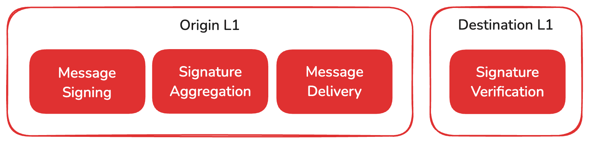
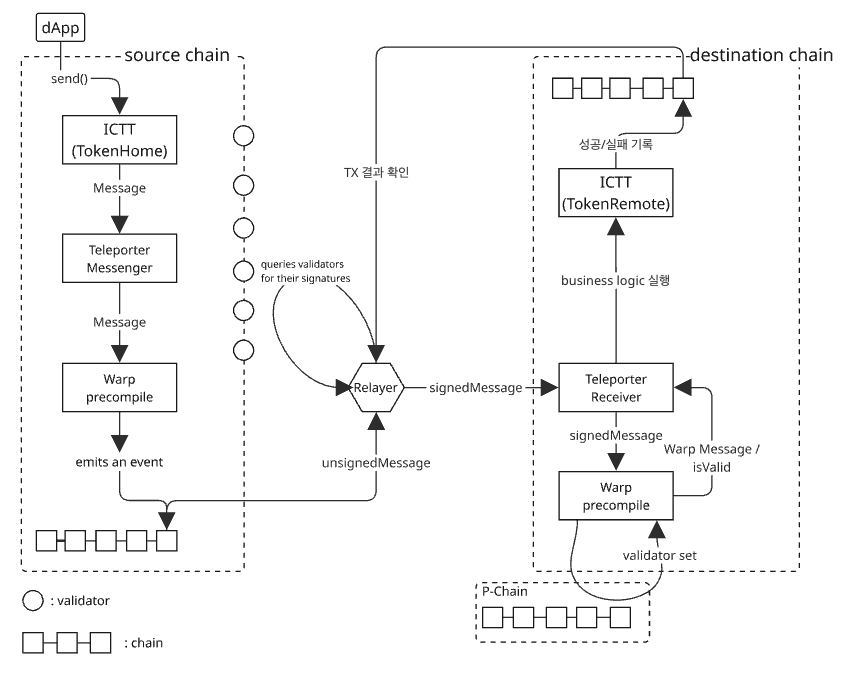

# Avalanche Interoperability


## Avalanche 소개


### Network 구성


- Primary Network
  - P-Chain : The Platform Chain
    - 모든 validators(Mainnet + Subnet 포함)가 등록되어 관리되는 체인
    - 전화번호부
    - 새로운 validator 등록, 새로운 L1 network 생성, staking 등 작업 담당
  - C-Chain : The Contract Chain
    - EVM 계열의 main network
    - 스마트 컨트랙트의 배포와 실행 담당
  - X-Chain : The Exchange Chain
    - Avalanche Native Tokens(AVAX) 의 생성과 전송 담당
    - UTXO 기반으로 빠른 처리 제공
- L1 chains (subnet)
  - VM 종류 및 합의 알고리즘에 제약 없이 생성될 수 있는 별도의 Network
    - EVM, SVM 등 원하는 VM 사용 가능
    - PoA, PoS 중 선택 가능
  - L1 chains만 검증하는 validator들도 모두 P-Chain과 sync되어 있어야 함


### Avalanche 합의 알고리즘: Snowball

- 프로세스
  1. 노드가 소수의 무작위 validator 집합에게 선호하는 트랜잭션을 질의
  2. 각 validator는 자신이 **수락하고 싶은 트랜잭션**을 응답
  3. 동일한 응답이 연속으로 충분히 수집될 때까지 반복
      → 이를 통해 트랜잭션 수락 여부를 **빠르고 분산된 방식으로 결정**
- Finalization
  - **충돌이 없는 트랜잭션**은 거의 즉시 최종화됨
  - **충돌이 있는 경우**, 정직한 validator들은 빠르게 하나의 트랜잭션으로 쏠림 현상을 보이며
     → **양의 피드백 루프**를 통해 하나의 결정으로 수렴함
- 알고리즘 변수

  | 변수 | 설명                          | 예시 값 |
  | ---- | ----------------------------- | ------- |
  | *n*  | 전체 참여 노드 수             | -       |
  | *k*  | 샘플 크기 (질의할 노드 수)    | `20`    |
  | α    | 합의 쿼럼 (같은 응답 수 기준) | `14`    |
  | β    | 최종화 기준 (연속 일치 횟수)  | `20`    |

- 작동 순서
  1. *k*명의 노드에게 질의
  1. α명 이상이 같은 응답 시 → 해당 응답을 채택
  1. 이전 응답과 같다면 `consecutiveSuccesses` +1
  1. 동일 응답이 연속으로 β번 이상 나오면 → **최종 수락**


>  α를 높일수록 Safety은 증가하지만, liveness 속도는 저하
>
> - **Safety** : 노드 간 합의가 발생했다면, 어느 노드가 접근하든 그 값은 동일해야 한다
> - **Liveness** : 합의 대상(Transaction 또는 블록체인에서 블록)에 문제가 없다면, 네트워크 내에서 반드시 합의가 이루어진다


## 상호운용성

### 주요 개념

| 용어                                       | 설명                                                         | 구분     | 범주 |
| :----------------------------------------- | :----------------------------------------------------------- | :------- | :--- |
| Avalanche Warp Messaging (AWM)             | L1 간 메시지를 서명 및 검증하는 저수준(low-level) 네이티브 메시징 프로토콜 | protocol | 범용 |
| Avalanche Interchain Messaging (ICM)       | AWM을 기반으로 하여, 개발자가 사용할 수 있는 상위 레벨의 메시징 프로토콜 | protocol | 범용 |
| Warp Messenger                             | EVM에서 AWM을 사용하기 위해 precompile된 smart contract (`0x0200..05`) | contract | EVM  |
| Relayer                                    | off-chain에 존재하며, 출발지 L1에서 Warp message를 읽어 목적지 L1에 전달 | 노드     | 범용 |
| ICM Contracts                              | ICM을 기반으로 구축된 EVM 호환 smart contract들의 집합 (Teleporter, ICTT 포함) | contract | EVM  |
| Teleporter                                 | ICM contracts를 위한 cross-L1 messaging 인터페이스 제공<br />(Message의 ID 관리, 검증, 생성) | contract | EVM  |
| Avalanche Interchain Token Transfer (ICTT) | ICM을 활용해 L1 간 토큰을 전송하는 smart contract들의 집합   | contract | EVM  |


### ICM Process



1. **원본 L1에서 메시지 생성 및 서명**

   - 바이트 배열 형식의 payload 포함

   - BLS 키쌍을 가진 validator들이 메시지를 개별 서명

2. **서명 집계 (Aggregation)**

   - BLS 방식으로 **다수의 서명을 하나의 멀티서명으로 집계**

   :bulb: BLS(Boneh–Lynn–Shacham) 서명 : 여러 서명을 하나의 짧은 멀티서명으로 집계할 수 있어, 다중 서명의 검증을 효율적으로 수행할 수 있는 암호화 서명 방식

3. **메시지 전달**
  
   - 메시지는 중앙 프로토콜 없이 전달됨 → **병목 없음**, **기록 없음**
   
4. **대상 L1에서 메시지 검증**

   - BLS 공개키 기반 서명 검증

   - L1별로 요구하는 validator 지분(stake) 비율 설정 가능하여, 서명한 validator들의 지분이 기준치 이상인지 검증
      (예: C-Chain은 90% 이상 stake의 서명이 필요)


### ICM Message 구조

```
+---------------+----------+--------------------------+
|      codecID  :  uint16  |                 2 bytes  |
+---------------+----------+--------------------------+
|     networkID :  uint32  |                 4 bytes  |
+---------------+----------+--------------------------+
| sourceChainId : [32]byte |                32 bytes  |
+---------------+----------+--------------------------+
|       payload :   []byte |       4 + size(payload)  |
+---------------+----------+--------------------------+
                           |  42 + size(payload) bytes|
                           +--------------------------+
```

- **codecID**: payload 직렬화에 사용되는 코덱 버전으로, `0x0000`으로 고정됨

- **networkID**: Avalanche 네트워크(Mainnet/Testnet 등)의 고유 ID로, BLS 서명의 재사용 공격을 방지함

- **sourceChainID**: P-체인에서 해당 블록체인을 생성한 트랜잭션의 해시로, 각 블록체인을 고유하게 식별하며 해당 체인만 자신의 ID로 서명 가능

- **payload**: 메시지 내용을 담은 임의의 바이트 배열이며, VM이 자체적으로 정의한 메시지 형식을 포함함


### Cross-chain Messaging Flow

다음은 EVM 환경의 L1 체인에서 ICTT 컨트랙트를 사용하여 다른 체인으로 토큰을 전송할 때의 흐름도이다.

Home 컨트랙트에서 remote 컨트랙트로 전송할 때를 가정하며, 이때는 토큰의 전송을 Home contract에서 토큰을 lock하고 remote 컨트랙트에서 mint하는 방식으로 구현된다.

#### 주요 용어

| 용어              | 설명                                                         |
| ----------------- | ------------------------------------------------------------ |
| Home contract     | ICTT 컨트랙트는 하나의 home 컨트랙트를 가지며, 외부로 전송하고자 하는 하나의 자산을 관리 |
| Remote contract   | ICTT 컨트랙트는 하나 이상의 remote 컨트랙트들을 가지며, home과 다른 L1에서 존재 |
| source chain      | 토큰의 전송이 시작되는 L1 chain                              |
| destination chain | 토큰의 전송을 받는 L1 chain                                  |

#### 프로세스



1. dApp에서 ICTT Home 컨트랙트에 토큰의 전송을 요청한다
2. ICTT Home에서는 전송하고자하는 토큰의 양 만큼 lock 시킨 후, Remote 컨트랙트에서의 mint 요청을 Message로 담아 Teleporter 컨트랙트에 전달한다
3. 해당 Message는 Warp 컨트랙트가 event로 담아 블록에 저장한다
4. Relayer는 블록에서 event를 조회하며, validator들에게 서명을 요청한다
5. 서명들은 수집한 후에는 BLS 서명으로 하나의 멀티서명으로 집계한 다음 목적지 L1에게 전달한다
6. 목적지 체인에서는 서명된 메시지에 대해 검증한 다음 메시지를 Remote 컨트랙트에 전달한다
7. Remote 컨트랙트는 정해진 수량만큼 mint한다
8. 수행 결과는 목적지 L1의 블록체인에 기록되며, Relayer는 성공, 실패 여부를 확인한다
9. 만약 실패했을 경우, Source L1에 실패 여부를 전달하여 사전에 세팅한 실패 처리 로직을 실행하게 한다[^1]

[^1]: 주의. 대상 체인에서 메시지 실행이 실패하더라도 메시지는 대상 체인에 **전달된 것으로 간주된다** 


### [별첨] Teleporter Contract

-  `TeleporterRegistry` 
  - maintains a mapping of `TeleporterMessenger` contract versions to their addresses.
  
  - registry contract for managing different versions of `TeleporterMessenger`.
  - can be deployed to any address
  
- Teleporter Contract

  - `ITeleporterMessenger`, `ITeleporterReceiver` 두 개의 interface로 구분되지만 보통 한 번에  둘 다 상속
