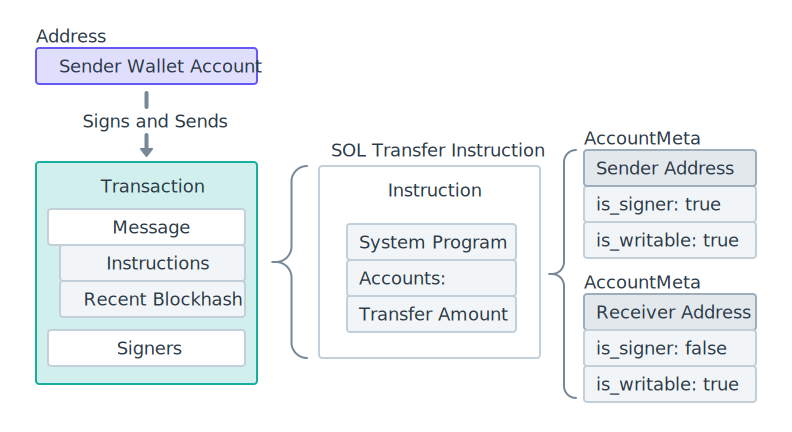

he Solana network adheres to a maximum transmission unit (MTU) size of 1280 bytes

After accounting for the necessary headers (40 bytes for IPv6 and 8 bytes for the fragment header), [1232 bytes remain available for packet data](https://github.com/solana-labs/solana/blob/27eff8408b7223bb3c4ab70523f8a8dca3ca6645/sdk/src/packet.rs#L16-L21), such as serialized transactions.

This means that the total size of a Solana transaction is limited to 1232 bytes. The combination of the signatures and the message cannot exceed this limit.

- Signatures: Each signature requires 64 bytes. The number of signatures can vary, depending on the transaction's requirements.
- Message: The message includes instructions, accounts, and additional metadata, with each account requiring 32 bytes. The combined size of the accounts plus metadata can vary, depending on the instructions included in the transaction.


### Recent Blockhash [#](https://solana.com/docs/core/transactions#recent-blockhash)

All transactions include a [recent blockhash](https://github.com/solana-labs/solana/blob/27eff8408b7223bb3c4ab70523f8a8dca3ca6645/sdk/program/src/message/legacy.rs#L122) to act as a timestamp for the transaction. The blockhash is used to prevent duplications and eliminate stale transactions.

The maximum age of a transaction's blockhash is 150 blocks (~1 minute assuming 400ms block times). If a transaction's blockhash is 150 blocks older than the latest blockhash, it is considered expired. This means that transactions not processed within a specific timeframe will never be executed.

You can use the [`getLatestBlockhash`](https://solana.com/docs/rpc/http/getlatestblockhash) RPC method to get the current blockhash and last block height at which the blockhash will be valid. Here is an example on [Solana Playground](https://beta.solpg.io/661a06e1cffcf4b13384d046).


### Transaction Structure

- `header`: Includes data used to specify the read/write and signer privileges in the `accountKeys` array.
- `accountKeys`: Array including account addresses for all instructions on the transaction.
- `recentBlockhash`: The blockhash included on the transaction when the transaction was created.
- `instructions`: Array including all the instructions on the transaction. Each `account` and `programIdIndex` in an instruction references the `accountKeys` array by index.
- `signatures`: Array including signatures for all accounts required as signers by the instructions on the transaction. A signature is created by signing the transaction message using the corresponding private key for an account.


Instruction

When building an instruction to add to a transaction, each instruction must include the following information:

- **Program address**: Specifies the program being invoked.
- **Accounts**: Lists every account the instruction reads from or writes to, including other programs, using the `AccountMeta` struct.
- **Instruction Data**: A byte array that specifies which [instruction handler](https://solana.com/docs/terminology#instruction-handler) on the program to invoke, plus any additional data required by the instruction handler (function arguments).


```bash
solana-test-validator
```

it is recommended to run a local validator for testing your program


---

### **4. Develop a Smart Contract (Program)**

1. **Write the Program**:

   - Use the **Solana Program Library (SPL)** or write your custom program in Rust.

   - A simple example program:

     ```rust
     use solana_program::{
         account_info::AccountInfo,
         entrypoint,
         entrypoint::ProgramResult,
         msg,
         pubkey::Pubkey,
     };
     
     entrypoint!(process_instruction);
     
     fn process_instruction(
         _program_id: &Pubkey,
         _accounts: &[AccountInfo],
         _instruction_data: &[u8],
     ) -> ProgramResult {
         msg!("Hello, Solana!");
         Ok(())
     }
     ```

2. **Build the Program**: Use the Solana BPF compiler:

   ```bash
   cargo build-bpf
   ```

------

### **5. Deploy the Program**

1. Confirm you have enough SOL for deployment:

   ```bash
   solana balance
   ```

2. Deploy your program:

   ```bash
   solana program deploy <path-to-program>.so
   ```

   - The `deploy` command uploads the `.so` file (compiled program) to the Solana network and returns the program's public key.

------

### **6. Interact with the Program**

After deployment, you can interact with your program:

1. Use the Solana CLI for simple transactions:

   ```bash
   solana program show <PROGRAM_KEY>
   ```

2. Use a custom script or client (in TypeScript or Python) with libraries like `@solana/web3.js` to send instructions to your program.

Example using `@solana/web3.js`:

```javascript
const solanaWeb3 = require('@solana/web3.js');

(async () => {
  const connection = new solanaWeb3.Connection(
    solanaWeb3.clusterApiUrl('mainnet-beta'),
    'confirmed',
  );

  const programId = new solanaWeb3.PublicKey('<PROGRAM_ID>');
  console.log('Program ID:', programId.toBase58());
})();
```

------

### **7. Monitor and Maintain**

- Use block explorers like [Solscan](https://solscan.io/) to monitor your program.
- Regularly update and manage your program as needed. Note that Solana programs are immutable once deployed, so any updates require deploying a new program.

------

By following these steps, you can deploy and interact with your Solana smart contract on the public network. Let me know if you need help with any specific step!

