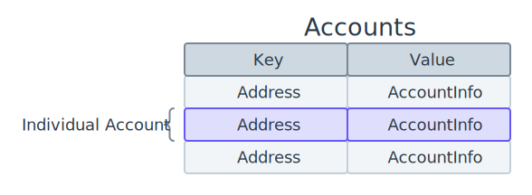
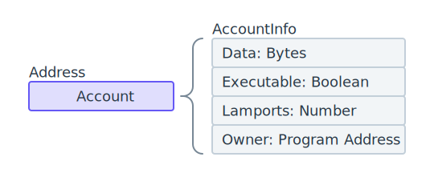
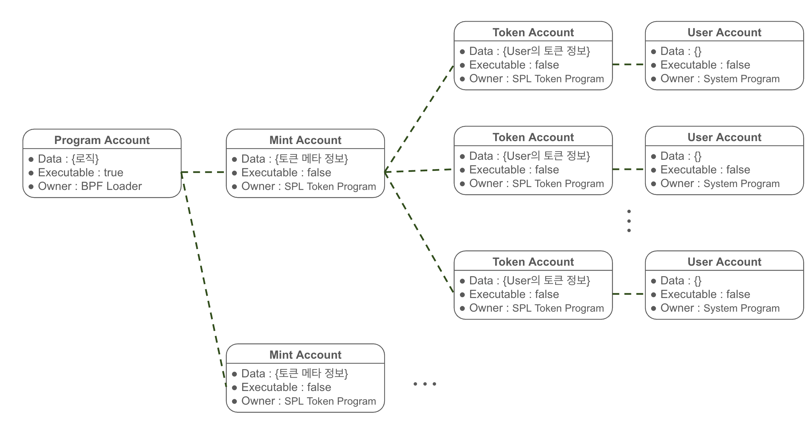

# [solana]  Account & Program (feat. SPL Token)

Solana의 Account와 Program에 대해 정리하고, 더 나아가 Solana에서의 토큰 표준인 SPL Token 구조를 이해하기 위해 정리한 글입니다.

## Account

### **Account**

솔라나에서 모든 데이터는 'accounts'에 저장된다. accounts는 key-value store 형태로, address와 account 정보를 매핑하여 관리한다.

AccountInfo는 4개의 필드로 구성된다.

- `data` : 'account data'로도 불리우며, account의 상태(state) 혹은 실행 가능한 program 코드를 저장 (xor)
- `executable` : account가 program인지 나타내는 bool 값
- `lamports`: account의 lamport 잔고
- `owner` : account를 소유하고 있는 Program의 ID (public key)

📝 program : 솔라나의 smart contract

📝 lamport : SOL의 최소 단위로 1 SOL = 10억(10^9) lamports

여기서 살펴보아야 할 것은, 첫 번째로 account는 상태값을 저장하는 data account와 실행 코드를 저장하는 program으로 나누어진다. 이더리움은 하나의 contract 안에서 상태와 코드 모두를 관리했던 반면에, 솔라나는 상태와 코드를 별도의 account로 분리해서 관리한다.

두번째로, program account를 포함한 모든 account는 자신을 소유하는 program을 가진다. 소유자 program만이 account의 data를 변경하고 lamport 잔고를 줄일 수 있다(단, 잔고를 늘리는 것은 모두가 가능). 이는, account를 관리하는 주체가 user account가 아닌 program임을 의미한다.

마지막으로, account의 data 필드는 byte array 타입으로 **고정된 크기**를 가진다. 이더리움은 메모리를 heap 영역에서 관리해서 contract가 저장한 데이터가 동적으로 계속 증가할 수 있었다. 하지만 솔라나는 고정되고 명확한 데이터 레이아웃을 요구하며, 모든 데이터를 stack에서 처리한다. 이로 인해 더 빠르며 더 적은 리소스 사용만으로 데이터를 처리할 수 있지만, 더 이상 하나의 smart contract에서 저장 데이터를 무한히 늘릴 수 없다.

---

## **Program**

Program은 솔라나에서의 smart contract이다. Program은 3가지 주요한 특징을 가진다.

먼저, Program은 로직을 담당하는 account로 한 번만 배포된다. 이더리움에서는 실행 코드가 매 contract의 배포 때마다 같이 배포되었다. 하지만 솔라나에서는 실행 코드는 한 번만 배포하고 이후 등록된 코드를 꺼내서 쓰는 구조를 가진다. 솔라나에서는 smart contract를 사용하기 위해서는 이미 온체인 상에 있는 program account의 ID 값만 가지고 와서 사용하면 된다.

또한, 솔라나에서 program은 기본적으로 '변경 가능'하다. Program 배포 시 upgrade 권한을 지정할 수 있으며, upgrade 권한이 null이 될 경우 변경 불가능(immutable)해진다.

끝으로, Program의 실행 코드는 'Instruction'이라는 하위 함수들로 조직되어 있다. Instruction은 transaction의 기본 단위가 되어 온체인에 특정 작업을 처리하도록 요청하는데 사용된다. 요청자는 여러 Instruction을 하나의 transaction으로 묶어 순차적이고 원자성을 보장하는 요청을 보낼 수 있다.

Solana의 주요 프로그램 종류로는 다음과 같이 있다.

- Native Program
    - **System Program** : Account의 생성 및 Owner Program 지정 수행
    - **BPF Loader** : Native Program이 아닌 모든 Program의 owner로, program의 배포, 수정, 실행을 담당
- **SPL Program** : Solana 커뮤니티가 관리하는 표준 프로그램들의 집합
- **Custom Program** : 사용자 정의 프로그램

여기서 프로그램의 사용을 이더리움의 ERC-20과 같은 토큰 사용에 국한해서 살펴보겠다.

Solana 커뮤니티는 Solana에서의 여러 가지 표준 프로그램들을 모아 SPL(Solana Program Library)로 관리한다. SPL의 일환으로 SPL Token 프로그램이 제공되어, 신규 토큰 생성자는 SPL Token Program의 ID만 가지고 와서 쉽게 신규 토큰을 생성해서 사용할 수 있다. 

### **SPL Token**

SPL Token을 생성해서 사용하게 된다면, 다음과 같은 account 구조가 나오게 된다.

- Program Account
    - SPL Token Program account로, Token의 실행 로직이 들어있다.
- Mint Account
    - 생성된 토큰 그 자체를 나타내는 account
    - 토큰에 대한 메타 정보 (mintAuthority, freezeAuthority, totalBalance 등)을 저장한다.
    - **💡** 단, 누가 얼마큼을 가지고 있는지는 저장하고 있지 않다.
- Token Account
    - 개개인이 들고 있는 토큰의 수량 정보 및 메타 정보를 저장한다.
    - 주로 랜덤한 주소가 아닌, user account의 주소와 mint account의 주소를 해시하여 ata(Associated Token Address) 계정을 생성한다.
- User Account
    - system account 혹은 native account라고 불리면 일반적인 사용자의 account를 의미한다.

🔊 Program account에 대한 설명은 편의상 약식으로 표현하였다. 

이더리움에서 ERC-20 토큰을 사용할 때에는 하나의 컨트랙트를 배포하고, 해당 컨트랙트 안에서 관련된 모든 상태와 정보를 관리하였다. 하지만 솔라나에서는 위와 같이 여러 개의 account들이 생성되고, 상태와 정보들을 각자가 나누어서 관리함을 알 수 있다.

이러한 차이는 1. solana의 데이터와 로직의 분리와 2.고정된 account의 크기 3.SVM의 병렬처리로 인해서 발생한다. Solana의 빠른 성능을 위해서 스마트 컨트컨트가 접근하는 메모리가 역할에 따라서 분리된 것이다.

💡 솔라나의 병렬처리 : 솔라나의 SVM(Sealeve VM)은 트랜잭션들이 같은 account data를 덮어쓰지 않는다면 parallel로 처리한다.

따라서, 사실상 smart contract를 이더리움과 동일하게 동작하도록 작성하는 것은 불가능할 것이다(매우 권장되지 않는다). 또한 Solana에서 Solana의 높은 성능을 최대한 활용하면서 비지니스 로직을 구현하기 위해서는 이러한 account 구조를 이해하고 구현해야 할 것이다.

---

### [별첨] Program Account

Program도 실행 로직만 가지는 것이 아닌 Program의 public key나 권한과 같은 메타 정보들도 들고 있어야한다. 따라서, 엄밀히 말하면 메타정보만을 들고 있는 Program Account와 실행 로직만을 들고 있는 Program Executable Data Account로 나뉘어 구성된다. 

Program Account가 들고있는 meta 정보에 pointer가 있어서, user는 사실상 Program Account만 알고 있으면 된다.

### [별첨] **PDA (**Program Derived Addresses)

PDA(프로그램 파생 주소)는 프로그램 ID와 사전 정의된 시드(seed)들을 조합해서 결정론적으로 주소를 생성한다.

이렇게 생성된 주소는 다른 일반 account과는 다르게 **연결된 private key를 가지지 않는다**. 대신 **Program이 PDA에 대해 서명할 수 있도록 한다**.

위의 언급된 ata(Associated Token Address)이 PDA에 해당된다.

SPL Token의 Program id와 시드로 mint account 주소와 user account 주소를 사용해서 결정론적으로 token account의 주소를 생성한다.

ata를 사용한다면, 특정 유저가 특정 토큰에 대한 지갑을 들고 있는지 사전적으로 확인할 수 있다.