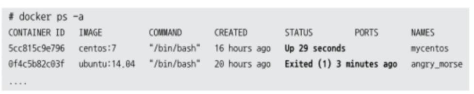
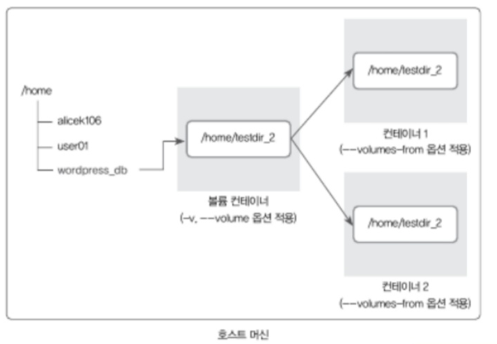
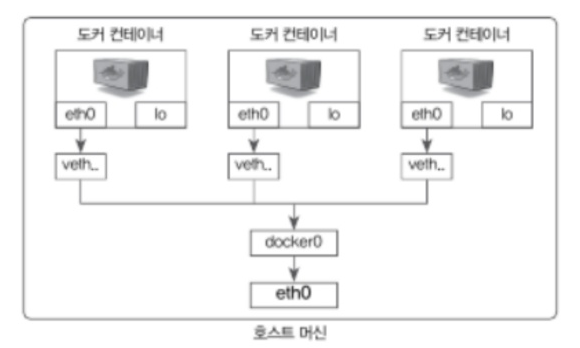

# 시작하세요! 도커/쿠버네티스

## 1부 도커

### 01 도커란?

#### 도커 개요

- 정의
  - 도커는 애플리케이션을 컨테이너로서 좀 더 쉽게 사용할 수 있게 만들어진 오픈소스 프로젝트
- 주목 이유
  - 가상화 방법인 가상 머신과 달리 성능의 손실이 거의 없음
  - 차세대 클라우드 인프라 솔루션으로 적합
- 도커 엔진
  - 일반적으로 도커 = 도커 엔진
    - 도커 엔진
      - 컨테이너를 생성하고 관리하는 주체
      - 자체로도 컨테이너를 제어 O & 다양한 기능을 제공하는 도커의 주 프로젝트
    - 기타 도커 프로젝트들은 도커 엔진을 좀 더 효율적으로 사용하기 위한 것에 불과

#### 1.1 가상 머신과 도커 컨테이너

- 기존 가상화 기술

  - 방식
    - 하이퍼바이저를 이용해 여러 개의 운영체제를 하나의 호스트에서 생성
    - 여러 개의 운영체제는 가상 머신이라는 단위로 구별됨 (가상 머신에 우분투, CentOS 등 운영체제 설치)
    - 각 게스트 운영체제는 완전히 독립된 공간과 시스템 자원을 할당받아 사용
      - 게스트 운영체제 : 하이퍼바이저에 의해 생성되고 관리되는 운영체제

  - 장점
    - 완벽한 운영체제를 생성할 수 있음
  - 단점
    - 하이퍼바이저를 반드시 거치기 때문에 일반 호스트에 비해 성능의 손실이 발생
    - 가상 머신은 게스트 운영체제를 사용하기 위한 라이브러리, 커널 등 전부 포함 => 배포 이미지의 용량 大
- 도커 컨테이너
  - 방식
    - 리눅스의 자체 기능인 chroot, 네임스페이스, cgroup 사용 =>  프로세스 단위의 격리 환경
      - chroot : 현재 실행중인 프로세스와 자녀 프로세스의 루트 디렉토리를 변경하는 작업
      - 네임스페이스 : 리눅스 커널에서 제공하는 **프로세스 구별(격리)** 기술
      - cgroup : 프로세스 그룹이 사용하는 시스템의 자원 제한, 관리, 격리시키는 리눅스 커널 기능
    - 호스트의 커널을 공유해 사용하고, 컨테이너 안에는 애플리케이션을 구동하는 데 필요한 라이브러리 및 실행 파일만 존재
  - 장점
    - 성능 손실이 거의 없음
    - 이미지의 용량 또한 가상 머신에 비해 대폭 줄어들음

:bulb: 커널

- 커널은 운영 체제의 핵심 부분으로 하드웨어와 소프트웨어 간의 인터페이스 역할을 하며, 시스템 자원을 관리하여 프로세스 실행과 장치 제어를 조율한다. 
- 주요 기능 : **메모리 관리**, **프로세스 관리**, **장치 드라이버**, **시스템 호출 및 보안**

#### 1.2 도커를 시작해야 하는 이유

- 애플리케이션의 개발과 배포의 편의성

  - 독립된 개발 환경을 보장
    - 컨테이너와 호스트 OS는 상호 독립적
      - 도커 컨테이너는 호스트 OS 위에서 실행되는 격리된 공간
        - 호스트 OS : 서버를 부팅할 때 실행되는 운영체제
      - 컨테이너 자체에 특별한 권한을 주지 않는 한, 호스트 OS에 영향 X

  - 배포 환경에서의 의존성을 걱정할 필요 없음
    - 컨테이너를 '도커 이미지'라고 하는 일종의 패키지로 만들어 운영 서버에 전달
    - 각종 라이브러리 설치 등 운영 서버에서 새롭게 패키지를 설치할 필요도 없음

  - 작은 이미지 크기

    - 커널을 포함하고 있지 않기 때문에 이미지 크기가 그다지 크지 않음

  - 이미지 재사용 가능

    - 이미지 내용을 레이어 단위로 구성하고 중복되는 레이어를 재사용할 수 있음

    - 배포 속도가 매우 빨라져

- 여러 애플리케이션의 독립성과 확장성이 높아짐
  - 마이크로서비스 구조는 여러 모듈을 독립된 형태로 구성 => 언어에 종속되지 않고 변화에 빠르게 대응 O
  - 여러 모듈에게 독립된 환경을 동시에 제공 
    - 각 모듈의 관리가 쉬워짐
    - 마이크로서비스 구조에서 가장 많이 사용

:bulb: Docker Desktop

- 윈도우와 맥 OS X에서 설치하는 도커

- 단, 도커에서 제공하는 네트워크, 볼륨 기능 등이 일부 지원되지 않을 수 있으며,예상치 못한 버그를 마주칠 가능성이 높음

=> 완전한 리눅스 환경에서 도커를 사용하는 것을 권장

### 02. 도커 엔진

#### 2.1 도커 이미지와 컨테이너

- 도커 이미지

  - 개요

    - 이미지는 여러 개의 계층으로 된 바이너리 파일로 존재

    - 컨테이너를 생성하고 실행할 때 읽기 전용으로 사용

  - 형식

    - 이미지 이름 : `[저장소 이름]/[이미지 이름]:[태그]`

      - 저장소 : 저장된 장소. 생략 시, 기본적으로 도커 허브 뜻함

      - 이미지 이름 : 해당 이미지가 어떤 역할을 하는지 나타냄

      - 태그 : 리비전 관리

- 도커 컨테이너

  - 특징

    - 컨테이너는 이미지를 읽기 전용으로 사용하되, 변경되 사항만 컨테이너 계층에 저장

    - 컨테이너에서 무엇을 하든지 원래 이미지는 영향 받지 않음

    - 각기 독립된 파일시스템을 제공받으며 호스트와 분리

    - 특정 컨테이너에서 어떤 애플리케이션을 설치하거나 삭제해도 다른 컨테이너와 호스트는 변화 없음

#### 2.2 도커 컨테이너 다루기

- 도커 버전 확인
  - `docker -v`

- 컨테이너 생성 

  - `docker run -i -t {이미지}`
    - 컨테이너를 생성하고 실행
    - 옵션
      - `-i` or `--interactive` : 컨테이너와 상호작용할 수 있도록 표준 입출력 활성화
      - `-t` or `--tty` : 컨테이너와 터미널을 연결
      - `-p` 
        - 호소트의 포트와 컨테이너의 포트 바인딩
        - 입력 형식 : `[호스트 포트]:{컨테이너 포트}`
          - 특정 IP 사용 시 포트와 함께 IP도 같이 입력
        - 여러 개의 포트를 외부에 개방하려면 -p 옵션 여러 번 사용
      - `-d`
        - Detached 모드로 실행하여, 백그라운드에서 실행
        - 프로그램이 터미널을 차지하는 포그라운드(foreground)로 실행
          - 입출력이 없는 상태
        - 포그라운드 프로그램이 실행되지 않으면 컨테이너 종료
      
      - `-e`
        - 컨테이너 내부의 환경변수를 설정
        - ex) `docker run -e MYSQL_ROOT_PASSWORD={패스워드} {이미지}`
      - `-v`
        - 볼륨 설정
    - 이미지가 도커 엔진에 존재하지 않을 경우, 도커 허브에서 자동으로 이미지 내려 받음
      - 도커 허브 : 도커 중앙 이미지 저장소
    - `= docker pull + create + start + attach`
    
  - 컨테이너 나오기
    - `exit` 입력 or `Ctrl + D`
      - 컨테이너 정지 후 나오기
    - `Ctrl + P,Q`
      - 정지 X, 컨테이너 셀만 나옴
  - `docker pull {이미지}`
    - 이미지를 내려받음
    - 태그 미지정 시, latest
  - `docker images`
    - 도커 엔진에 존재하는 이미지의 목록 출력
  - `docker create -i -t --name {이름} {이미지}`
    
    - 컨테이너 생성
    - 옵션
      - `-i` : 컨테이너와 상호작용할 수 있도록 표준 입출력 활성화
      - `-t` : 컨테이너와 터미널을 연결
      - `--name {이름}` : 컨테이너 이름 설정
    - 이미지가 도커 엔진에 존재하지 않을 경우, 도커 허브에서 자동으로 이미지 내려 받음
  - `docker inspect {컨테이너}`
    - 컨테이너 상세 정보 확인
    - `{컨테이너}` : 컨테이너 id or 컨테이너 이름
  - `docker start {컨테이너}`
    - 컨테이너 시작
  - `docker attach {컨테이너}`
    - 컨테이너 내부로 들어감

​	:bulb: 컨테이너 지정 시, 컨테이너의 이름 혹은 ID를 사용할 수 있음. ID는 유일하게 구분할 수 있다면, 앞의 2 ~3자만 입력 O

- 컨테이너 확인

  - `docker ps`
    - 정지되지 않은 컨테이너 목록 확인
    - 옵션
      - `-a` : 정지된 컨테이너 포함 모든 컨테이너 출력
      - `-q` : 컨테이너의 ID만 출력 
  
  
  
  - CONTARING ID : 컨테이너 고유 ID
  
  - IMAGE : 이미지 이름
  
  - COMMAND : 컨테이너가 시작될 때 실행될 명령어 
  
    ​			(내장된 커맨드는 docker run / create 시 명령어 끝에 입력해서 덮어쓰기 가능)
  
  - CREATED : 생성된 시간
  
  - STATUS : 컨테이너 상태.
  
    - Up : 실행중
    - Exited : 종료
    - Pause : 일시 중지
  
  - PORTS : 컨테이너가 개방한 포트와 호스트에 연결한 포트 나열
  
  - NAMES : 컨테이너 고유 이름. (이름 미 지정시, 무작위 설정)
    - `docker rename {컨테이너} {새이름}`으로 재설정 가능

- 컨테이너 삭제
  - `docker rm {컨테이너}`
    - 실행 중인 컨테이너는 삭제 X : 정지 or 강제 삭제 필요
    - 옵션
      - `-f` : 강제 삭제
      - `prune` : 모든 컨테이너 삭제
    - 조합
      - `docker rm -f $(docker ps -a -q)` : 모든 컨테이너 강제 삭제
- 컨테이너 외부 노출
  - 가상 IP 주소 할당 방식
    - 172.17.0.x의 IP를 순차적으로 할당
  - 컨테이너 내부에서 네트워크 인터페이스 확인
    - 컨테이너 내부에서 `ifconfig` 실행 결과
      - eth() 인터페이스
        - 도커의 NAT IP 할당받은 영역
      - lo 인터페이스
        - 로컬 호스트 영역
  - 노출 방식
    1. IP:PORT를 직접 명시하여 연결
       - ex) `docker run -i -t --name {이름}  -p 80:80 {이미지}`
         - eth() IP와 포트를 호스트 IP와 포트에 바인딩
    2. 도커 브리지 네트워트 이용
       - `--link` 옵션은 deprecated

- 컨테이너 조작

  - `docker exec -i -t {컨테이너} {명령어}`

    - 컨테이너 내부에서 명령어를 실행한 뒤 그 결과값을 반환 받을 수 있음

    - 옵션

      - `-i -t` : 상호 입출력

    - ex) `docker exec -i -t wordpressdb /bin/bash` : wordpressdb 컨테이너에 들어가서 bash 실행 후 입출력 지속

      :bulb: 이 경우에는 `exit`을 사용하여도, bash만 종료되고, 포그라운드로 실행되는 컨테이너는 종료되지 않음

#### 도커 볼륨

- 개요

  - 이미지는 읽기 전용이며, 컨테이너 운용하면서 변경된 정보는 컨테이너에 별도로 저장
    - 이미 생성된 이미지는 어떠한 경우로도 변경되지 않음
    - 컨테이너 계층에 원래 이미지에서 변경된 파일시스템 등을 저장-
  - 컨테이너 삭제하면 컨테이너 계층에 저장돼 있던 정보도 삭제

  => 데이터를 영속적 데이터로 활용할 수 있는 방법 중 대표 : 볼륨

- 볼륨 활용 방법
  1. 호스트와 볼륨을 공유
     - `docker run -v [호스트의 공유  디렉토리]:[컨테이너의 공유 디렉토리] {이미지}`
       - 호스트 공유 디렉터리는 생성되어 있지 않다면, 도커가 자동으로 생성
       - 컨테이너의 디렉토리는 호스트의 디렉토리로 덮어씌워짐 (호스트 디렉토리를 컨테이너에 마운트)
       - 동시에 여러 개의 `-v` 옵션 O
  
  2. 볼륨 컨테이너 활용
  
     - `docker run -v --volumes-from {컨테이너} {이미지}`
       - `-v` or `--volumne` 옵션을 적용한 컨테이너의 볼륨 디렉터리를 공유
  
     
  
     [그림 2.13] 볼륨 컨테이너 구조
  
  3. 도커가 관리하는 볼륨 생성
  
     - 볼륨 명령어
  
       - 볼륨 생성
         - `docker volume create --name {볼륨이름}`
           - 플러그인 => 여러 종류의 스토리지 백엔드 사용 O
           - 기본적으론 local
       - 볼륨 목록 확인
         - `docker volume ls`
  
     - 볼륨 연결
  
       - `docker run -v {볼륨}:[컨테이너의 공유 디렉토리]`
  
         - local 드라이버로 사용할 경우, 호스트 연결과 마찬가지로 호스트에 데이터가 저장되지만, 파일이 실제로 어디에 저장 되는지는 알 필요 X
  
       - `docker run -v [컨테이너의 공유 디렉토리] {이미지}`
  
         - 해당 디렉터리에 대한 볼륨 자동으로 생성 => `docker container inspect {컨테이너}`로 연결된 볼륨 확인 O
  
       -  상세 정보 확인
  
         - `docker inspect --type {타입} {대상}`
  
           - `--type` : image, volume 등 입력 O
  
           :bulb: 모든 도커 명령어는 docker 접두어 다음에 container, image, volume 등 명시로 특정 구성 단위 제어 O
  
     - 볼륨 삭제
  
       - `docker volumne prune`
         - 사용되지 않는 볼륨을 한꺼번에 삭제 (컨테이너 삭제해도 연결 볼륨은 자동 삭제 X)
  
- stateless vs stateful

  - stateless
    - 컨테이너 자체는 상태가 없고, 상태를 결정하는 데이터는 외부로부터 제공받음
    - 권장

  - stateful
    - 컨테이너가 데이터를 저장하고 있어 상태가 있는 경우
    - 지양

- mount 옵션

  - `-v`와 `--mount` 옵션은 서로 기능은 같지만, 볼륨의 정보를 나타내는 방법이 다름
  - `docker run --mount type=volume, source=myvolumne, target=[컨테이너의 공유 디렉토리] {이미지}`
  - `docker run --mount type=bind, source=[호스트 공유 디렉토리], target=[컨테이너의 공유 디렉토리] {이미지}`

#### 도커 네트워크

- 도커 네트워크 구조
  - 

내부 IP를 순차적으로 할당

재시작할 때마다 변경될 수 있음

컨테이너를 시작할 때마다 호스테어 `veth`라는 네트워크 인터페이스를 생성

컨테이너마다 가상 네트워크 인터페이스를 호스트에 생성

인터페이스의 이름은 veth로 시작. v는 virtual을 뜻한다. 

도커 엔진이 자동으로 생성

eth() 공인IP 또는 내부 IP가 할당되어 실제로 외부와 통신할 수 있는 호스트의 네트워크 인터페이스

veth로 시작하는 인터페이스는 컨테이너를 시작할 때 생성

각 컨테이너의 eth()와 연결

docker()라는 브리지도 존재 veth 인터페이스와 바인딩돼 호스트의 eth() 인터페이스와 이어주는 역할

컨테이너와 호스트의 네트워크는 아래 그림과 같음

컨테이너의 eth() 인터페이스는 호스트의 veth 라는 인터페이스와 연결 veth 인터페이스는 docker() 브리지와 바인딩돼 외부와 통신

[그림 2.15] 도커 네트워크의 구조

eth0은 첫번째 이더넷 카드를 말하고 lo는 Loopback 주소이다.eth0는 공유기에서 할당받은 사설 네트워크 대역의 IP(192.168.0.0/16)을 받았고 lo는 Loopback 주소인 127.0.0.1을 받았다.

