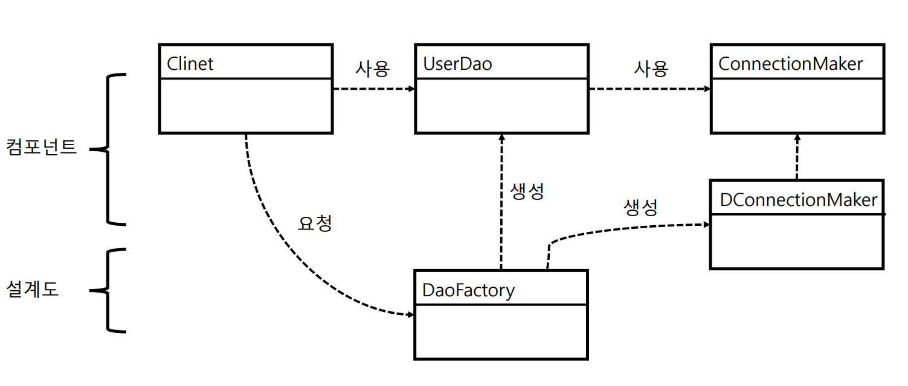
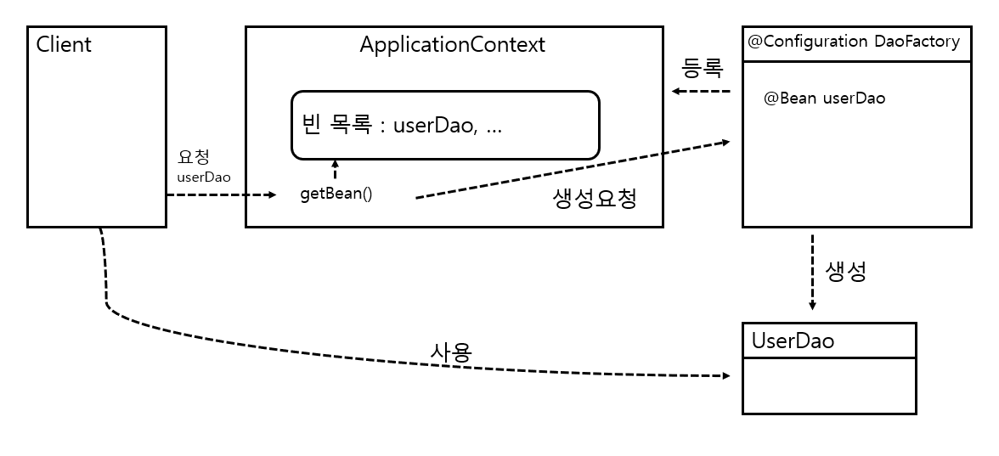
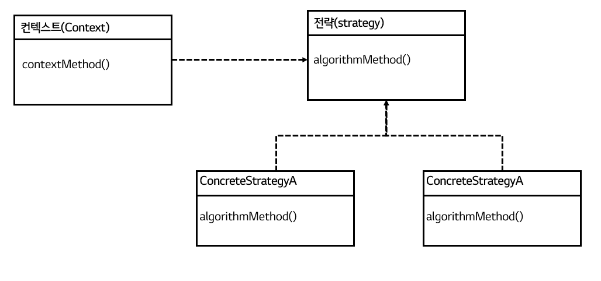
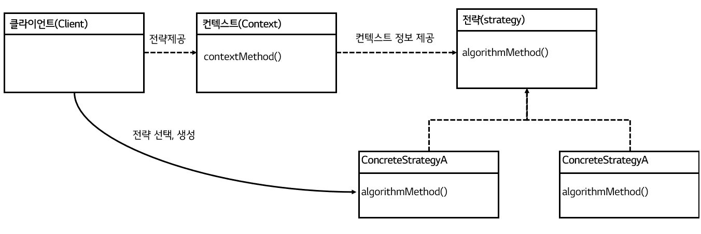

# 토비의 스프링 1


## 들어가며


### 스프링이란 무엇인가

- **애플리케이션 기본 틀** : 스프링 컨테이너

  - 스프링 런타임 엔진
  - 설정 정보를 참고로 해서 애플리케이션 구성하는 오브젝트를 생성하고 관리

- **공통 프로그래밍 모델** : IoC/DI, 서비스 추상화, AOP

  - 코드가 어떻게 작성되어야 하는지 기준 제시

  1. IoC/DI
     - 오브젝트의 생명주기와 의존관계에 대한 프로그래밍 모델
  2. 서비스 추상화
     - 환경/서버/기술에 종속되지 않고 이식성이 뛰어나며, 유연한 애플리케이션 개발 
  3. AOP
     - 부가적인 기능을 독립적으로 모듈화하는 프로그래밍 모델

- **기술 API** 

  - 방대한 양의 기술 API 제공


### 스프링의 성공 요인

- 단순함
  - 가장 단순한 객체지향적인 개발 모델인 POJO 프로그래밍
- 유연성
  - 여러 프레임워크를 함께 사용하게 해줌 => 접착 프레임워크


## 1장. 오브젝트와 의존관계


### 1.1 초난감 DAO


### 1.2 DAO의 분리

- 관심사의 분리
  - 요구사항은 끊임없이 바뀌고 발전 => 어떻게 대비?
    - 변화의 폭을 최소한으로 줄여주는 것
    - 분리와 확장을 고려한 설계
    - 변화는 대체로 집중된 한 가지 관심에 대해 일어남
    - 관심이 같은 것끼리는 모으고, 관심이 다른 것은 따로 떨어져 있게 하는 것
- UserDao 관심사항
  - DB와 연결을 위한 커넥션을 어떻게 가져올까라는 관심
  - 사용자 등록을 위해 DB에 보낼 SQL 문장을 담을 Statement를 만들고 실행
  - 작업이 끝나면 resources close
- 상속을 통한 확장
  - 같은 클래스에 다른 메소드로 분리됐던 DB 커넥션 연결이라는 관심을 상속을 통해 서브클래스로 분리
  - 클래스 계층구조를 통해 두 개의 관심이 독립적으로 분리되면서 변경 작업 용이
  - 템플릿 메소드 패턴
    - 슈퍼클래스에 기본적인 로직의 흐름 (커넥션 가져오기, SQL 생성, 실행, 변환)을 만들고, 그 기능의 일부를 추상 메소드나 오버라이딩이 가능한 protected 메소드 등으로 생성. 서브클래스에서 구현
  - 팩토리 메소드 패턴
    - 서브클래스에서 구체적인 오브젝트 생성 방법을 결정
  - UserDao는 Connection 오브젝트가 만들어지는 방법과 내부 동작 방식에는 상관없이, Connection 인터페이스를 통해 사용
  - 상속의 한계
    - 다중상속 X
    - (상하위 클래스끼리 )두 가지 다른 관심사에 대해 긴밀한 결합


### 1.3 DAO 확장

- 변화의 성격이 다르다는 건, 변화의 이유와 시기, 주기 등이 다름-

- 클래스의 분리

  - 상속 X. 완전히 독립적인 클래스로 분리
  - UserDao가 SimpleConnectionMaker라는 특정 클래스와 그 코드에 종속적이기 때문에 앞으로 납품 후에 고객이 DB 커넥션을 가져오는 방법을 자유롭게 확장하기가 힘들어졌다.

- 인터페이스의 도입

  - 추상화란 어떤 것들의 공통적인 성격을 뽑아내어 이를 따로 분리해내는 작업

    => 인터페이스

- 관계설정 책임의 분리

  - DAO 생성자 내부의 ` new DConnectionmaker()`라는 코드는 매우 짧고 간단하지만 그 자체로 충분히 독립적인 관심사를 담고 있음

  - 사용되는 오브젝트를 서비스, 사용하는 오브젝트를 클라이언트

  - UserDao의 클라이언트가 제 3 관심사항인 UserDao와 ConnectionMaker 구현 클래스의 관계를 결정해주는 기능을 분리해서 두기에 적절한 곳

  - 다형성을 통한 인터페이스 타입으로 참조

    - 클래스 사이의 관계는 코드에 다른 클래스 이름이 나타나기 때문에 생성

      =>  인터페이스 타입으로 참조 시, 느슨한 관계

    - 런타임 시점에는 모델링 시에 없었던(관계가 보이지 않던) 관계가 생성

  - 런타임 오브젝트 관계를 갖는 구조를 만들어주는 것이 클라이언트의 책임

  - 개방 폐쇄 원칙

    - 클래스나 모듈은 확장에는 열려 있고, 변경에는 닫혀 있어야 함

  - 높은 응집도와 낮은 결합도

    - 응집도가 높다는 건 하나의 모듈, 클래스가 하나의 책임 또는 관심사에만 집중
    - 낮은 결합도
      - 책임과 관심사가 다른 오브젝트과는 느슨하게 연결된 형태를 유지
      - 최소한의 방법으로 간접적인 형태로 제공, 나머지는 서로 독립적이고 알 필요 없게 만들어주는 것
      - 확장하기에도 매우 편리

  - 전략 패턴

    - 개방 폐쇄 원칙의 실현에도 가장 잘 들어맞는 패턴

    - 자신의 기능 맥락에서 필요에 따라 변경이 필요한 알고리즘을 인터페이스를 통해 통째로 외부로 분리

    - 구현한 구체적인 알고리즘 클래스를 필요에 따라 바꿔서 사용

      : 대체 가능한 전략


### 1.4 제어의 역전

- 팩토리
  - 객체의 생성 방법을 결정하고 반환
  - != 추상 팩토리 패턴 / 팩토리 메소드 패턴

- 설계도로서의 팩토리

  

  [토비의 스프링 그림 1-8 오브젝트 팩토리를 활용한 구조]

  - DaoFactory를 분리했을 때의 장점
    - 컴포넌트 역할을 하는 오브젝트와 애플리케이션 구조를 결정하는 오브젝트를 분리 O

- 제어권의 이전을 통한 제어관계 역전

  - 프로그램의 제어 흐름 구조가 뒤바뀌는 것

  - **능동적 주체 => 수동적 주체**

    - 모든 오브젝트가 능동적으로 자신이 사용할 클래스를 결정, 언제/어떻게 그 오브젝트를 만들지를 스스로 관장

      => 모든 제어 권한을 자신이 아닌 다른 대상에게 위임

  - 라이브러리 vs 프레임워크

    - 라이브러리 : 사용하는 애플리케이션 코드는 애플리케이션 흐름을 직접 제어

    - 프레임워크 : 애플리케이션 코드가 프레임워크에 의해 사용. 프레임워크가 흐름을 주도

      => 프레임워크에는 분명한 제어의 역전 개념이 적용되어야 함


### 1.5 스프링의 IoC

- 오브젝트 팩토리를 이용한 스프링 IoC

  - 애플리케이션 컨텍스트와 설정정보

    - **빈** : 스프링이 제어권을 가지고 직접 만들고 관계를 부여하는 오브젝트
    - **빈 팩토리** : 빈의 생성과 관계 생성 같은 제어를 담당
    - **애플리케이션 컨텍스트** : IoC 방식을 따라 만들어진 일종의 빈 팩토리. 
      - = 빈 팩토리

  - DaoFactory를 사용하는 애플리케이션 컨텍스트

    - 어노테이션

      - `@Configuration` : 빈 팩토리를 위한 오브젝트 설정을 담당하는 클래스
      - `@Bean` : 오브젝트 만들어주는 메소드

    - 애플리케이션 컨텍스트를 적용한 UserDaoTest

      ```java
      public class UserDaoTest {
          public static void main(String[] args) throws ClassNotFoundException, SQLException {
              Application context = new AnnotationConfigApplicationContext(DaoFactory.class);
              UserDao dao = context.getBean("userDao", UserDao.class);
              // ...
          }
      }
      ```

      - `DaoFactory`에서 `@Bean` 어노테이션을 `userDao` 메소드에 부착 => 메소드 이름  = 빈 이름
      - `getBean()`은 기본적으로 Object 타입으로 리턴 => 다시 캐스팅

- 애플리케이션 컨텍스트의 동작방식

  - 애플리케이션 컨텍스트 ≈ IoC 컨테이녀 ≈ 스프링 컨테이너 ≈ 빈 팩토리

    

    [토비의 스프링 1. 그림 1-9 애플리케이션 컨텍스트가 동작하는 방식]

  - 장점

    - 클라이언트는 구체적인 팩토리 클래스를 알 필요가 없다
    - 애플리케이션 컨텍스트는 종합 IoC 서비스를 제공해준다.
    - 애플리케이션 컨텍스트는 빈을 검색하는 다양한 방법을 제공한다


### 1.6 싱글톤 레지스트리와 오브젝트 스코프

- 오브젝트의 동일성과 동등성

  - 동일성 : 동일한 오브젝트 (`==`)
  - 등등성 : 동일한 정보를 담고있는 오브젝트 (`equals()`)

- 애플리케이션 컨텍스트가 싱글톤 레지스트리인 이유

  - 스프링 = 앤터프라이트 서버환경 => 요청마다 새로운 오브젝트 생성 ~> 서버 부하

- 자바에서의 싱글톤 구현 한계

  - 구현 방식
    - 생성자를 private
    - 자신과 같은 스태틱 필드 정의
    - 스태택 팩토리 메소드인 `getInstance()` 정의 후 해당 메소드를 통해 객체 반환
  - 한계
    - private 생성자 => 상속 X
      - 상속과 다형성과 같은 객체 지향적 특징 적용  X
    - 테스트의 어려움
      - 생성 방식이 제한적이기 때문에 목 오브젝트 등으로 대체 X
    - 서버 환경에서는 하나만 생성되는 것을 보장 X
      - 클래스 로드의 구성에 따라 하나 이상의 오브젝트 생성 O
      - 여러 개의 JVM에 분산돼서 설치 => 각각 독립적으로 오브젝트 생성
    - 바람직 하지 못한 전역 상태
      - 스태틱 메소드 => 언제든지 싱글톤에 접근 O

- 싱글톤 레지스트리

  - 스프링은 직접 싱글톤의 형태 오브젝트 만들고 관리

    => public 생성자 O + 디자인 패턴 제약 X

- 스프링 빈의 스코프

  - **빈의 스코프**
    - 빈이 생성되고 존재하고 적용되는 범위
  - 종류
    - 프로토타입 : 컨테이너에 빈 요청시 마다 새로 생성
    - 요청 스코프 : HTTP 요청시 마다 생성
    - 세션 스코프 : 웹의 세션과 스코프가 유사


### 1.7 의존관계 주입 (DI)

- 제어의 역전(IoC)과 의존관계 주입
  - DI의 핵심
    - 오브젝트 레퍼런스를 외부로부터 주입받고 이를 통해 여타 오브젝트와 다이내믹하게 의존관계가 만들어짐
    - 제 3자의 도움을 통해 두 오브젝트 사이의 유연한 관계가 설정되도록 만드는 것
  
- 런타임 의존관계 설정

  - 의존 : 의존대상이 변하면, 자신에게 영향이 미치는 관계

  - 인터페이스에 대한 의존관계

    => 인터페이스 구현 클래스와의 느슨한 관계

    => 변화에 낮은 영향 = 낮은 결합도

  - 의존관계 주입의 3가지 조건
    1. 클래스 모델이나 코드에는 런타임 시점의 의존관계가 드러나지 X
    2. 런타임 시점의 의존관계는 컨테이너나 팩토리 같은 제 3의 존재가 결정
    3. 사용할 오브젝트에 대한 레퍼런스를 외부에서 제공

- 의존관계 검색과 주입

  - 의존관계 검색

    - 런타임 시에 의존관계 결정 

    - 외부로부터 주입 X, **스스로 검색**을 이용 

      ```java
      public UserDao(){
          DaoFacotry daoFactory = new DaoFactory();
          this.connectionMaker = daoFactory.connectionMaker(); // ConnectionMaker는 인터페이스
      }
      ```

      - 여전히 구체적인 connectionMaker는 알지 못하지만, IoC 컨테이너인 DaoFacotry에 요청
      - 스프링의 애플리케이션 컨텍스트라면 미리 정해놓은 이름을 전달해서 그 이름에 해당되는 오브젝트 반환
      - 코드 안에 오브젝트 팩토리 클래스 or 스프링 API 등장 => 의존관계 생성 (=> 대게는 주입 방식 권장)

    - 필요 경우

      - 서버 시 main()역할을 하는 서블릿에서 스프링 컨테이너에 담긴 오브젝트를 사용하기 위해서는 한 번은 검색 필요

    - 차이점

      - 검색의 경우, 검색하는 오브젝트는 자신이 스프링 빈일 필요가 없음. (UserDao는 빈일 필요 X)
      - 주입의 경우, UserDao도 반드시 빈 오브젝트
        - UserDao에 주입하기 위해선, UserDao에 대한 생성/초기화 권한 필요 => IoC 방식으로 생성되는 빈 오브젝트

  - 의존관계 주입 응용
    - 기능 구현의 교환
      - 테스트와 운영시 다른 DB 사용시 DAO가 connection 정보와 직접적으로 의존하면, 환경 변경 때 대규모 수정 필요
      - DI의 설정정보에 해당하는 DaoFactory만 다르게 만들어두면, 나머지 코드들은 수정 X, 각각 다른 런타임 오브젝트에 의존관계 생성 O
    - 부가기능 추가
      - connection 횟수를 counting 하고 싶다면 UserDao -> CountingConnectionMaker -> ConnectionMaker 의 의존관계를 통해, UserDao와 ConnectionMaker의 소스 수정없이 구현 O
      - DI의 장점은 관심사의 분리를 통해 얻어지는 높은 응집도
  - 메소드를 이용한 의존관계 주입
    - 수정자 메소드
    - 일반 메소드
      - 한번에 한개의 파라미터만 가질 수 있는 제약 회피 O


### 개념 사전

- DAO

  - 데이터를 조회하거나 조작하는 기능을 전담 오브젝트

- javaBean(자바빈)

  - 두 가지 관례를 따라 만들어진 오브젝트

    - 디폴트 생성자

      - 툴이나 프레임워크에서 리플렉션을 이용해 오브젝트 생성

    - 프로퍼티

      - 이름을 가진 속성

      - getter/setter을 통해 조회/수정

- 디자인 패턴

  - 자주 만나는 문제를 해결 => 재사용 가능한 솔루션
  - 언급만으로 의도와 해결책을 함께 설명 O

- 템플릿 메소드 패턴

  - 상속을 통해 슈퍼클래스의 기능을 확장 시, 변하지 않는 기능은 슈퍼클래스에 두고, 자주 변경되면 확장할 기능은 서브클래스에서 구현
  - 훅(hook) 메소드 : 슈퍼클래스에서 디폴트 기능을 정의, 서브클래스에서 **선택적으로** 오버라이드할 수 있는 메소드

- 팩토리 메소드 패턴
  - 상속을 통해 확장하게 하는 패턴
  - 슈퍼클래스 코드에서는 서브클래스에서 구현할 메소드를 호출해서 인터페이스 타입의 오브젝트를 가져와 사용
  - 서브클래스에서 오브젝트 생성 방법과 클래스를 결정할 수 있도록 미리 정의해둔 메소드를 팩토리 메소드
- 팩토리 메소드 (별도)
  - 오브젝트를 생성하는 기능을 가진 메소드


## 테스트


### 테스트 필요성

- 복잡해져가는 애플리케이션에 대한 대응 전략

  1. 객체지향

     - 확장과 변화를 고려한 설계

       => IoC/DI

  2. 테스트

     - 코드에 대한 확신

  => 변화에 유연하게 대처 O


### 2.1 UserDaoTest 다시 보기

- 웹을 통한 DAO 테스트 방법의 문제점

  - 다른 모든 레이어의 기능 생성 후 테스트 가능
    - DAO 뿐만 아니라 서비스 클래스, 컨트롤러, JSP 뷰 등 
  - 어디서 문제 생겼는지 빠르게 확인 X

- 작은 단위의 테스트 : `단위 테스트`

  - 관심사의 분리 원리 적용 

    ​	=> 테스트의 관심이 다르다면, 테스트할 대상을 분리하고 집중해서 접근 필요

  - 충분히 하나의 관심에 집중해서 효율적으로 테스트할 만한 범위의 단위

  - 통제할 수 없는 외부의 리소스에 의존하는 테스트는 단위 테스트 X라고 보기도 함

- 자동수행 테스트 코드

  - 테스트는 자동으로 수행되도록 코드로 만들어지는 것이 중요

  - 자동 수행의 장점

    - 자주 반복 O

    - 빠르게 실행 O

      => 언제든지 코드를 수정하고 테스트

      => 지속적인 개선과 점진적인 개발 O

- UserDaoTest 문제점 ( main 메소드에서 print문을 통해 결과 확인하는 방법)

  - 수동 확인 작업의 번거로움
    - 콘솔에 나온 값을 보고 등록과 조회가 성공적으로 되는지 사람이 확인 
    - 양 / 복잡도 증가시 피로도 증가
    - 미세한 차이 식별 힘듦
  - 실행 작업의 번거러움
    - DAO 수만큼 main 메소드도 그만큼 생성
    - 각각의 main 메소드 수동 실행


### 2.2 UserDaoTest 개선

- 테스트 검증의 자동화

  - 테스트 결과 종류

    - 테스트 에러
      - 에러 발생
    - 테스트 실패
      - 기대한 결과값과 상이

- JUnit 테스트 전환 : 테스트의 효율적인 수행과 결과 관리

  - 테스트 메소드 전환
    - 제어권을 직접 가지는 main() 메소드 => JUnit의 형식의 일반 메소드
      1. public 메소드
      2. @Test 어노테이션 부착

  - 검증 코드 전환

    - `assertThat` 스태틱 메소드

      ```java
      assertThat(user2.getName(), is(user.getName()));
      ```

      - 매처(matcher)라는 조건으로 비교해서 일치 시, 패스
      - `is()` : `equals()`로 비교해주는 매처


### 2.3 개발자를 위한 테스팅 프레임워크 JUnit

-  테스트 결과의 일관성

  - 코드에 변경사항이 없다면, 테스트는 항상 동일한 결과를 내야함

    - 테스트는 외부 상태/이전 테스트에 독립적이어야 함

      - ex) 이전 테스트로 DB에 데이터 Insert 했을 시, 재테스트에는 중복에러 발생

      => deleteAll, getCount 기능 추가로 독립성 유지

    - 모든 테스트는 실행 순서에 상관없이 독립적으로 항상 동일한 결과를 낼 수 있도록 작성

- 예외조건에 대한 테스트

  - 특정 예외가 던져지면 테스트 성공 / 정상 시, 실패라 판단해야 하는 경우

    ```java
    @Test(expected=EmptyResultDataAccessException.class)
    public void getUserFailure() throws SQLException {
        // dao 테스트 코드
    }
    ```

    - `@Test(expected =  )` 안에  테스트 중에 발생할 것으로 기대하는 예외 클래스 지정
    - :heavy_check_mark: [Junit5]  assertThrows에 필요한 클래스를 등록하고 람다식으로 예외를 던질 실행문을 작성

- 포괄적인 테스트

  - "항상 네거티브 테스트를 먼저 만들라" by 로드 존슨(스프링 창시자) 
  - 부정적인 케이스를 먼저 작성하는 습관 필요

- 테스트가 이끄는 개발 (TDD)

  - 기능설계를 위한 테스트

    | 구분 | 단계               | 내용                                      | 코드                                                     |
    | ---- | ------------------ | ----------------------------------------- | -------------------------------------------------------- |
    | 조건 | 어떤 조건을 가지고 | 가져올 사용자 정보가 존재하지 않는 경우에 | dao.deleteAll();<br />assertThat(dao.getCount(), is(0)); |
    | 행위 | 무엇을 할 때       | 존재하지 않는 id로 get()을 실행하면       | get("unknown_id");                                       |
    | 결과 | 어떤 결과가 나온다 | 특별한 예외가 던져진다                    | @Test(expected=EmptyResultDataAccessException.class)     |

    [표2-1 getUserFailure() 테스트 코드에 나타난 기능]

  - 테스트 주도 개발

    - = 테스트 우선 개발(Test First Development)

    - 기본 원칙 : "실패한 테스트를 성공시키기 위한 목적이 아닌 코드는 만들지 않는다"

      => 모든 코드는 빠짐없이 테스트로 검증

    - 테스트의 작성과 테스트를 성공시키는 코드 작성의 주기를 최대한 짧게 유지

      => 개발한 코드의 오류를 빨리 발견

    - 장점

      - 전체적인 개발 속도 증진
        - 테스트는 상대적으로 작성하기 쉬움
        - 빠른 오류 해결 속도

  - 테스트 코드 개선

    - `@Before`

      - `@Test` 메소드가 실행되기 전에 먼저 실행돼야 하는 메소드를 정의

      - `@Test` 메소드에서 공통적으로 등장하는 변수는 인스턴스 변수로 선언한 후, `@Before`에서 정의

        => 반복적인 코드 제거

      - :heavy_check_mark: [JUnit5] `@BeforeEach` : 테스트 케이스 마다 실행,  `@BeforeAll` : 테스트 클래스를 초기화시, 딱 `1`회 수행
      
      ```java
      public class UserDaoTest{
          private UserDao dao;
          
          @Before
          public ovid setUp(){
              ApplicationContext context = new GenericXmlApplicationContext("applicationContext.xml");
              this.dao = context.getBean("userDao", UserDao.class);
          }
      }
      ```

    :bulb: JUnit 테스트 클래스 수행 방법 요약
    
    	1. 테스트 클래스에서 @Test 붙은 public이며, void형이고, 파라미터가 없는 테스트 메소드 모두 탐색
    	1. 테스트 클래스의 오브젝트 하나 생성
    	1. @Before 메소드 실행
    	1. @Test 붙은 메소드 한개 실행 및 결과 저장
    	1. @After 메소드 실행
    	1. 나머지 @Test 메소드들에 대해 2~5번 반복
    	1. 테스트 결과 종합하여 반환

    - 테스트 오브젝트

      - @Before, @Test, @After는 서로 독립적으로 수행 (서로가 서로를 호출 X)

        => 주고받을 정보는 인스턴스 변수 활용

      - 각 테스트 메소들 실행할 때 마다 새로운 테스트 클래스 오브젝트 생성

        => 각 테스트가 독립적으로 실행됨을 보장

    - 픽스처
    
      - 테스트를 수행하는 데 필요한 정보나 오브젝트
        - ex) User 객체들
      - 일반적으로 반복 사용 => @Before로 생성


:bulb: junit5 변경점

```
In JUnit 5, the default behavior is different. By default, JUnit 5 does not create a new instance of the test class for each test method. Instead, the same test class instance is reused across multiple test methods within the same test class.

This change in behavior was introduced to improve performance and reduce the overhead of creating new instances for each test method. Reusing the test class instance can be beneficial when the tests are stateless or when the state is properly managed within the test methods.

However, if you want to ensure test method isolation and have a fresh instance of the test class for each test method, you can use the @TestInstance annotation with the Lifecycle.PER_METHOD parameter. By annotating the test class with @TestInstance(Lifecycle.PER_METHOD), JUnit 5 will create a new instance of the test class for each test method, similar to the behavior of JUnit 4.
```


### 2.4 스프링 테스트 적용

- 애플리케이션 컨텍스트 생성 

  - 방식
    - 모든 싱글톤 빈 오브젝트 초기화
  - 단점
    - 빈이 할당한 리소스 깔끔하게 정리 안될 경우 다음 테스트에 영향 
    - 많은 시간과 자원 소모

- 테스트를 위한 애플리케이션 컨텍스트 관리

  - JUnit을 이용하는 테스트 컨텍스트 프레임워크 => 모든 테스트가 공유 O

  ```java
  @RunWith(SpringJUnit4ClassRunner.class)
  @ContextConfiguration(locations="/applicationContext.xml")
  public class UserDaoTest{
      @Autowired
      private Application context;
      
      // ...
      
      @Before
      public void setUp(){
          this.dao = this.context.getBean("userDao", UserDao.class);
          // ...
      }
          
  }
  ```

  [리스트 2-17 스프링 테스트 컨텍스트를 적용한 UserDaoTest]

  - `@RunWith(SpringJUnit4ClassRunner.class)`

    - JUnit용 테스트 컨텍스트 프레임워크 확장 클래스 지정

  - `@ContextConfiguration` 
    - 애플리케이션 컨텍스트 설정파일 위치 지정

  - `@Autowired`
    - 스프링의 DI에 사용되는 특별한 애노테이션
    - 스프링 애플리케이션 컨텍스트는 초기화 시, 자기 자신도 빈으로 등록 => Autowired 사용 O

    

:bulb: JUnit 5 + ApplicationContext가 xml 파일이 아닌, `@SpringBootApplication`을 통해 bean을 자동 등록하는 경우

```java
@SpringBootTest
@ExtendWith(SpringExtension.class)
@ContextConfiguration(classes = SpringApplication.class)
public class UserDaoTest{
    
    @Autowired
    private Application context;
```

:heavy_check_mark:  `@SpringBootTest` : 테스트에 Spring Application Context를 가져오기 위해 사용 

:heavy_check_mark: `@ExtendWith(SpringExtension.class)` : `@RunWith` 대체.  JUnit5과 Spring testing 기능 통합

:heavy_check_mark: `@ContextConfiguration` : SpringApplication 부분에 `@SpringBootApplication`가 붙은 시작클래스를 넣음

:heavy_check_mark:[참고] `@SpringBootApplication` = `@Configuration` + `@EnableAutoConfiguration` + `@ComponentScan`


- 테스트 코드에 의한 DI

  ```java
  @DirtiesContext
  public class UserDaoTest{
      @Autowired
      UserDao dao;
      
      @Before
      public void setUp(){
          // ...
          DataSource dataSource = new SingleConnectionDataSource("jdbc:mysql://localhost/testdb", "spring", "book", true);
          dao.setDataSource(dataSource);
          
          
      }
  }
  ```

  - `@DirtiesContext` 
    - 테스트 메소드에서 애플리케이션 컨텍스트의 구성이나 상태를 변경함을 테스트 컨텍스트 프레임워크에 알려줌
    - 테스트 컨텍스트는 해당 애노테이션이 붙은 테스트 클래스(혹은 메소드)에는 애플리케이션 컨텍스트 공유 X
    - 단점 > 장점
      - 애플리케이션 컨텍스트의 구성/상태를 테스트 내에서 변경하지 X 것이 원칙

  - :bulb: SingleConnectionDataSource
    - 스프링이 제공하는 가장 빠른 DataSource
    - DB 커넥션을 하나만 만들어두고 계속 사용

- 테스트를 위한 별도의 DI 설정

  - 테스트 전용 설정파일 생성

- 컨테이너 없는 DI 테스트

  - 스프링 컨테이너에서 UserDao가 동작하는지는 UserDaoTest의 기본 관심사 X
  - 스프링 컨테이너 없이 테스트 할 수 있는 방법을 가장 우선적으로 고려

  ```java
  public class UserDaoTest{
      UserDao dao;
      
      @Before
      public void setUp(){
          // ...
          dao = new UserDao();
          DataSource dataSource = new SingleConnectionDataSource("jdbc:mysql://localhost/testdb", "spring", "book", true);
          dao.setDataSource(dataSource);
      }
  }
  ```

  - UserDao도 유연한 테스트가 가능하게끔 설계
  - :bulb: 침투적 기술과 비침투적 기술
    - 침투적 기술
      - 애플리케이션 코드에 기술 관련 API 등장 or 특정 인터페이스나 클래스의 사용 강제
      - 기술에 종속적
    - 비침투적 기술
      - 애플리케이션 로직을 담은 코드에 아무런 영향 X 적용 가능
      - 기술에 비종속적 

  

### 2.5 학습 테스트로 배우는 스프링

- 학습 테스트
  - 자신이 만들지 않은 프레임워크, 라이브러리에 대한 테스트 작성
  - 목적
    - 사용 방법 학습
    - 이해와 사용 방법에 대한 검증
- 학습 테스트의 장점
  - 다양한 조건에 따른 기능을 손쉽게 확인
  - 학습 테스트 코드를 개발 중에 참고 O
    - 다양한 기능과 조건에 대한 테스트 코드를 개별적으로 만들고 남겨둘 수 있음
  - 프레임워크나 제품을 업그레이드할 때 호환성 검증 O
  - 테스트 작성에 대한 좋은 훈련
- 버그 테스트
  - 오류를 가장 잘 드러내줄 수 있는 테스트
  - 버그가 원인이 되어 테스트가 일단 실패하도록 만들어야 함
  - 필요성 및 장점
    - 테스트의 완성도 :arrow_up:
      - 불충분했던 테스트 보완
    - 버그의 내용을 명확하게 분석
      - 어떤 이유 때문에 문제가 생겼는지 명확히 파악 O
      - 동등분할, 경계값 분석 적용 O
    - 기술적인 문제를 해결하는데 도움


### 2.6 정리

- 테스트는 자동화돼야 하고, 빠르게 실행할 수 있어야 함
- 테스트 결과는 일관성이 있어야 함
- 포과적으로 작성
- 코드 작성과 테스트 수행의 간격이 짧을수록 효과적
- 테스트하기 쉬운 코드가 좋은 코드
- @Before, @After를 사용해서 공통 준비 작업 처리
- 학습테스트, 버그 테스트 활용


## 3. 템플릿


### 템플릿이란

- 변경이 거의 일어나지 않으며, 일정한 패턴으로 유지되는 특성을 가지는 부분을 자유롭게 변경되는 성질을 가진 부분으로부터 독립시켜서 효과적으로 활용할 수 있도록 하는 방법


### 3.2 변하는 것과 변하지 않는 것

- JDBC try/catch/finally 코드의 문제점

  - 어떤 상황에서도 리소스 반환을 위해, try/catch/finally 구문 사용을 권장함
  - 많은 곳에서 중복되는 코드와 로직에 따라 자꾸 확장되고 자주 변하는 코드를 잘 분리 필요

  ```java
  public void deleteAll() throws SQLException {
      Connection c = null;
      PreparedStatement ps = null;
  
      try {
          c = dataSource.getConnection();
          ps = c.preparedStatement("delete from users"); // 변하는 부분
          ps.executeUpdate();
      } catch(SQLException e){
          throw e;
      } finally {
          if(ps != null) {try {ps.close();} catch (SQLException e) {}}
          if(c != null) {try {c.close();} catch(SQLException e) {}}
      }
  }
  ```

  [리스트 3-4] 개선할 deleteAll() 메소드

- 메소드 추출

  - 변하는 부분 혹은 변하지 않는 부분을 메소드로 추출함

    - 이 경우, 변하지 않는 부분이 변하는 부분을 감싸고 있어 추출이 어려우므로, 변하는 부분을 추출

      ```java
      private PreparedStatement makeStatement(Connection c) throws SQLException{
      	PreparedStatement ps;
      	ps = c.prepareStatement("delete from users");
      	return ps;
      }
      ```

    - 재사용이 필요한 코드가 분리된 것이 아닌, 분리시키고 남은 코드가 재사용이 필요하여 유용성 :arrow_down:

- 템플릿 메소드 패턴의 적용

  - 템플릿 메소드 패턴

    - 상속을 통해 기능을 확장해서 사용
    - 변하지 않는 부분은 슈퍼클래스에 두고, 변하는 부분은 추상 메소드로 정의해둬서 서브클래스에서 오버라이딩하여 새롭게 정의

  - UserDao를 추상 클래스 선언 및 `makeStatement`를 추상 메소드로 선언

    ```java
    abstract protected PreparedStatement makeStatement(Connection c) throws SQLException;
    ```

    ```java
    public class UserDaoDeleteAll extends UserDao {
         protected PreparedStatement makeStatement(Connection c) throws SQLException{
             PreparedStatement ps= c.prepareStatement("delete from users");
    		 return ps;
         }
    }
    ```

  - 단점

    - 템플릿 메소드 패턴으로의 접근은 제한이 많음
      - DAO 로직마다 상속을 통해 새로운 클래스를 만들어야 함
    - 확장 구조가 설계하는 시점에서 고정
      - 컴파일 시점에 이미 그 관계가 결정되어 있음
      - 관계에 대한 유연성 :arrow_down:

- 전략 패턴의 적용

  - 전략 패턴

    - 오브젝트를 아예 둘로 분리하고, 클래스 레벨에서는 인터페이스를 통해서만 의존 => 유연하고 확장성 뛰어남

    - 변하는 부분을 별도의 클래스로 만들어 추상화된 인터페이스를 통해 위임

    - 좌측에 있는  Context에서 일정한 구조로 동작 + 특정 확장 기능은  Strategy 인터페이스를 통해 외부의 독립된 전략 클래스에 위임

      

      [그림 3-2] 전략 패턴의 구조

  - 적용

    ```java
    public interface StatementStrategy {
        PreparedStatement makePreparedStatement(Connection c) throws SQLException;
    }
    ```

    [리스트 3-8] StatementStrategy 인터페이스

    
    
    ```java
    public class DeleteAllStatement implements StatementStrategy {
        public PreparedStatement makePreparedStatement(Connection c) throws SQLException {
            PreparedStatement ps= c.prepareStatement("delete from users");
    		 return ps;
        }
    }
    ```

    [리스트3-9] deleteAll() 메소드의 기능을 구현한 StatementStrategy 전략 클래스
    
    
    
    ```java
    public void deleteAll() throws SQLException {
        Connection c = null;
        PreparedStatement ps = null;
    
        try {
            c = dataSource.getConnection();
            StatementStrategy strategy = new DeleteAllStatement();
            ps = strategy.makePreparedStatement(c);
            ps.executeUpdate();
        } catch(SQLException e){
            throw e;
        } finally {
            if(ps != null) {try {ps.close();} catch (SQLException e) {}}
            if(c != null) {try {c.close();} catch(SQLException e) {}}
        }
    }
    ```
    
    [리스트3-10] 전략 패턴을 따라 DeleteAllStatement가 적용된 deleteAll() 메소드
    
    - 하지만 아직 컨텍스트 안에 이미 구체적인 전략 클래스가 명시되어 있는 단점이 있다.

- DI 적용을 위한 클라이언트/컨텍스트 분리

  - 전략 패턴에 따르면, Context가 어떤 전략을 사용하게 할 것인가는 앞단의 **Client가 결정**하는 것이 일반적

    

    [그림 3-3] 전략 패턴에서 Client의 역할
  
  - DI의 구조와 동일
  
    - DI란 전략 패턴의 장점을 일반적으로 활용할 수 있도록 만든 구조
  
    ```java
    public void jdbcContextWithStatementStrategy(StatementStrategy strategy) throws SQLException {
        Connection c = null;
        PreparedStatement ps = null;
    
        try {
            c = dataSource.getConnection();
            ps = strategy.makePreparedStatement(c);
            ps.executeUpdate();
        } catch(SQLException e){
            throw e;
        } finally {
            if(ps != null) {try {ps.close();} catch (SQLException e) {}}
            if(c != null) {try {c.close();} catch(SQLException e) {}}
        }
    }
    ```
  
    [리스트 3-11] 메소드로 분리한 try/catch/finally 컨텍스트 코드
  
    
  
    ```java
    public void deleteAll throws SQLException {
        StatementStrategy st = new DeleteAllStatement();
        jdbcContextWithStatementStrategy(st);
    }
    ```
  
    [리스트 3-12] 클라이언트 책임을 담당할 deleteAll() 메소드

​	:bulb: 마이크로 DI (수동 DI) :  IoC 컨테이너의 도움 없이 코드 내에서 적용한 경우 


### 3.3 JDBC 전략 패턴의 최적화

- 전략 클래스의 추가 정보

  ```java
  public class AddStatement implements StatementStrategy {
      User user;
      
      public AddStatement(User user){
          this.user = user;
      }
      
      public PreparedStatement makePreparedStatement(Connection c) throws SQLException {
          PreparedStatement ps = c.preparedStatement("insert into users(id, name, password) values(?,?,?)");
          ps.setString(1, user.getId());
          ps.setString(2, user.getName());
          ps.setString(3, user.getPassword());
          
          return ps;
      }
  }
  ```

  [리스트3-14] User 정보를 생성자로부터 제공받도록 만든 AddStatement

  - add() 메소드의 PreparedStatement 생성 로직을 분리한 클래스
  -  `user`란 부가정보가 필요하기 때문에, 클라이언트로부터 생성자를 통해 User 타입 오브젝트 제공 받음

  ```java
  public void add(User user) throws SQLException {
      StatementStrategy st = new AddStatement(user);
      jdbcContextWithStatementStrategy(st);
  }
  ```

- 전략과 클라이언트의 동거

  - 현재 구조의 단점

    1. DAO 메소드마다 새로운 StatementStrategy 구현 클래스를 만들어야 한다
    2. DAO 메소드에서 StatementStrategy에 전달할 User와 같은 부가적인 정보가 있을 경우, 오브젝트를 전달받는 생성자와 이를 저장할 인스턴스 변수를 생성해야 함

  - 로컬 클래스

    - UserDao 밖에서 사용되지 않는 StatementStrategy 전략 클래스를 UserDao 클래스 내의 내부 클래스로 정의

      => 1번 단점 해결 O

    ```java
    public void add(final User user) throws SQLException {
        public class AddStatement implements StatementStrategy {
            public PreparedStatement makePreparedStatement(Connection c) throws SQLException {
                PreparedStatement ps 
                    = c.preparedStatement("insert into users(id, name, password) values(?,?,?)");
                ps.setString(1, user.getId());
                ps.setString(2, user.getName());
                ps.setString(3, user.getPassword());
    
                return ps;
            }
        }
        StatementStrategy st = new AddStatement(user);
        jdbcContextWithStatementStrategy(st);
    }
    ```

    [리스트 3-17] add() 메소드의 로컬 변수를 직접 사용하도록 수정한 AddStatement

    - add() 메소드 내의 로컬 클래스로 이전한 AddStatement

    - 내부 메소드는 자신이 정의된 메소드의 로컬 변수에 직접 접근 O

      - 내부 클래스에서 외부의 변수를 사용할 때는 외부 변수를 반드시 final로 선언

      - 생성자와 인스턴스 변수 제거 O 

        => 2번 단점 해결 O

  - 익명 내부 클래스

    - 정의

      - 이름을 갖지 않는 클래스로, 클래스 선언와 오브젝트 생성이 결합된 형태로 만들어짐
      - 클래스 재사용 X, 구현한 인터페이스 타입((or 상속할 클래스)으로만 사용할 경우 유용

      - `new 인터페이스이름() { 클래스 본문 }`

    ```java
    StatementStrategy st = new StatementStrategy() {
        public PreparedStatement makePreparedStatement(Connection c) throws SQLException {
                PreparedStatement ps 
                    = c.preparedStatement("insert into users(id, name, password) values(?,?,?)");
                ps.setString(1, user.getId());
                ps.setString(2, user.getName());
                ps.setString(3, user.getPassword());
    
                return ps;
            }
    }
    ```

    [리스트 3-18] AddStatement를 익명 내부 클래스로 전환

    ```java
    public void add(final User user) throws SQLException {
        jdbcContextWithStatementStrategy(new StatementStrategy() {
            public PreparedStatement makePreparedStatement(Connection c) throws SQLException {
                    PreparedStatement ps 
                        = c.preparedStatement("insert into users(id, name, password) values(?,?,?)");
                    ps.setString(1, user.getId());
                    ps.setString(2, user.getName());
                    ps.setString(3, user.getPassword());
    
                    return ps;
                }
    		}
        );
    }
    ```

    [리스트3-19] 메소드 파라미터로 이전한 익명 내스

:bulb: 중첩 클래스

- 의미
  - 다른 클래스 내부에 정의되는 클래스를 중첩 클래스
- 종류
  - 스태틱 클래스 : 독립적으로 오브젝트로 만들어질 수 있음
  - 내부 클래스 : 자신이 정의된 클래스의 오브젝트 안에서만 만들어질 수 있음
    - 멤버 내부 클래스 : 오브젝트 레벨
    - 로컬 클래스 : 메소드 레벨.  선언된 메소드 내에서만 사용 O
    - 익명 내부 클래스 : 이름 X


### 3.4 컨텍스트와 DI

- JdbcContext의 분리

  ```java
  public class JdbcContext {
      private DataSource dataSource;
      
      public void setDataSource(DataSource dataSource){
          this.dataSource = dataSource;
      }
  
      public void workWithStatementStrategy(StatementStrategy strategy) throws SQLException {
          Connection c = null;
          PreparedStatement ps = null;
  
          try {
              c = dataSource.getConnection();
              ps = strategy.makePreparedStatement(c);
              ps.executeUpdate();
          } catch(SQLException e){
              throw e;
          } finally {
              if(ps != null) {try {ps.close();} catch (SQLException e) {}}
              if(c != null) {try {c.close();} catch(SQLException e) {}}
          }
      }
  }
  ```

  [리스트 3-21] JDBC 작업 흐름을 분리해서 만든 JdbcContext 클래스

  - Context를 UserDao에서 독립적인 Class로 분리시킴

  ```java
  public class UserDao{
      ...
      private JdbcContext jdbcContext;
      
      public void setJdbcContext(JdbcContext jdbcContext){
          this.jdbcContext = jdbcContext;
      }
      
      public void add(final User user) throws SQLException {
          this.jdbcContext.workWithStatementStrategy( new StatementStrategy(){...});
      }
      
      public void deleteAll() throws SQLException {
          this.jdbcContext.workWithStatementStrategy( new StatementStrategy(){...});
      }
  }
  ```

  [리스트 3-22] JdbcContext를 DI 받아서 사용하도록 만든 UserDao

- JdbcContext의 특별한 DI
  - 인터페이스를 사용하지 않고 DI 적용
  
  - 스프링 빈으로 DI
    - 온전한 DI
      - 인터페이스를 사이에 둬서, 의존관계가 고정되지 않고, 런타임 시에 다이나믹하게 주입
    - 넓은 의미의 스프링 DI
      - IoC 개념 포괄 : 객체의 생성과 관계 설정에 대한 제어권한을 오브젝트에서 제거 +외부 위임
  
    - UserDao와 JdbcContext의 DI 구조 필요성
      1. JdbcContext를 싱글톤 빈으로 관리하기 위함
         - JdbcContext는 서비스 오브젝트로써, 싱글톤으로 등록되어 여러 오브젝트에서 공유해 사용되는 것이 이상적
      2. JdbcContext가 DI를 통해 다른 빈에 의존
         1. DI를 위해서는 주입되는 오브젝트와 주입받는 오브젝트 모두 스프링 빈으로 등록이 필요함
  
    - 인터페이스 X DI
      - 매우 긴밀한 관계로 강한 응집도를 가질 때 사용
  
  - 코드를 이용하는 수동 DI
  
    - JdbcContext의 싱글톤 관리 포기 + JdbcContext의 dataSource 주입을 DAO에서 담당하는 방식으로 수동 DI 가능
    - DAO 하나당 JdbcContext를 가지게 되지만, 리소스 부담 X
      - 상태 정보 X => 메모리 부담 X
      - 자주 생성 및 삭제 X => GC 부담 X

### 3.5 템플릿과 콜백

- 템플릿/콜백 패턴
  - 스프링에서 익명 내부 클래스를 활용하는 전략 패턴을 부르는 방식
  - 템플릿
    - 전략 패턴에서의  Context
  - 콜백 
    - 특정 로직을 담은 메소드가 실행되는 것을 목적으로 다른 오브젝트의 메소드에 전달되는 오브젝트
    - 전략 패턴에서의  익명 내부 클래스로 만들어지는 오브젝트
    - = 펑셔별 오브젝트
- 특징 (vs 전략 패턴)
  - 주로 단일 메소드 인터페이스 사용
    - 전략 패턴 : 여러 개의 메소드를 가진 일반적인 인터페이스 사용
  - 주로 파라미터 존재
    - 컨텍스트 정보 전달 받음
  - 매번 메소드 단위로 사용할 오브젝트를 새롭게 전달받음
  - 클라이언트와 콜백이 강하게 결합
  - 


