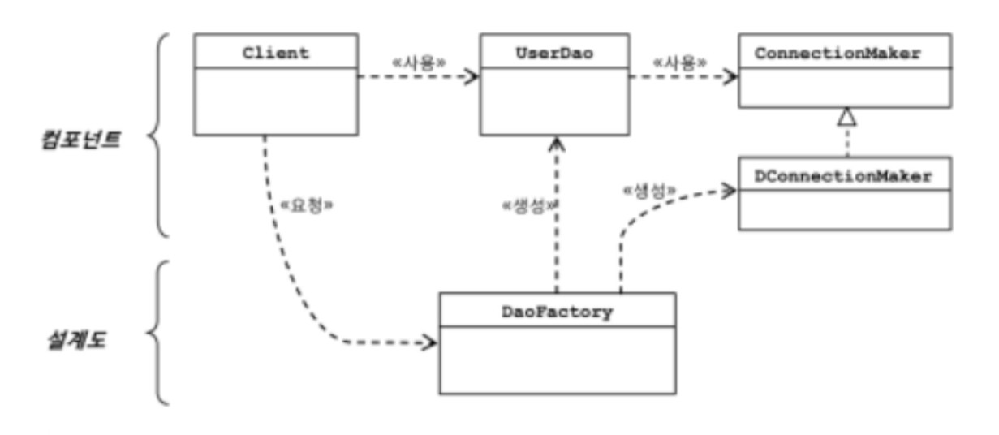
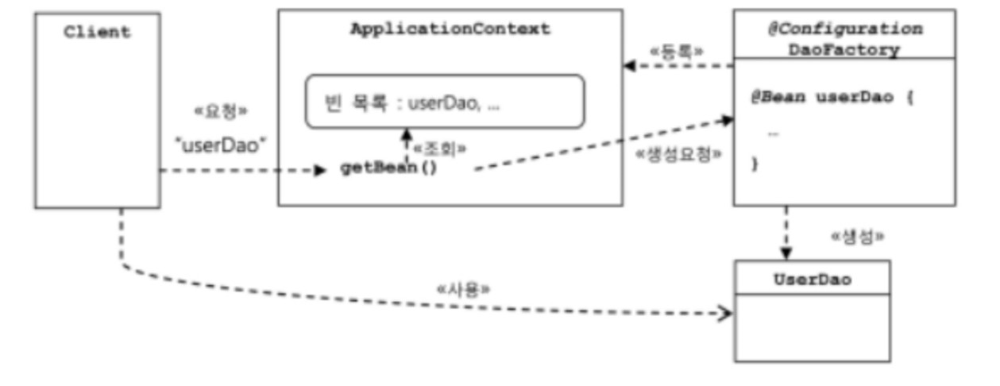

# 토비의 스프링 1


## 들어가며


### 스프링이란 무엇인가

- **애플리케이션 기본 틀** : 스프링 컨테이너

  - 스프링 런타임 엔진
  - 설정 정보를 참고로 해서 애플리케이션 구성하는 오브젝트를 생성하고 관리

- **공통 프로그래밍 모델** : IoC/DI, 서비스 추상화, AOP

  - 코드가 어떻게 작성되어야 하는지 기준 제시

  1. IoC/DI
     - 오브젝트의 생명주기와 의존관계에 대한 프로그래밍 모델
  2. 서비스 추상화
     - 환경/서버/기술에 종속되지 않고 이식성이 뛰어나며, 유연한 애플리케이션 개발 
  3. AOP
     - 부가적인 기능을 독립적으로 모듈화하는 프로그래밍 모델

- **기술 API**

  - 방대한 양의 기술 API 제공


### 스프링의 성공 요인

- 단순함
  - 가장 단순한 객체지향적인 개발 모델인 POJO 프로그래밍
- 유연성
  - 여러 프레임워크를 함께 사용하게 해줌 => 접착 프레임워크


## 1장. 오브젝트와 의존관계


### 1.1 초난감 DAO


### 1.2 DAO의 분리

- 관심사의 분리
  - 요구사항은 끊임없이 바뀌고 발전 => 어떻게 대비?
    - 변화의 폭을 최소한으로 줄여주는 것
    - 분리와 확장을 고려한 설계
    - 변화는 대체로 집중된 한 가지 관심에 대해 일어남
    - 관심이 같은 것끼리는 모으고, 관심이 다른 것은 따로 떨어져 있게 하는 것
- UserDao 관심사항
  - DB와 연결을 위한 커넥션을 어떻게 가져올까라는 관심
  - 사용자 등록을 위해 DB에 보낼 SQL 문장을 담을 Statement를 만들고 실행
  - 작업이 끝나면 resources close
- 상속을 통한 확장
  - 같은 클래스에 다른 메소드로 분리됐던 DB 커넥션 연결이라는 관심을 상속을 통해 서브클래스로 분리
  - 클래스 계층구조를 통해 두 개의 관심이 독립적으로 분리되면서 변경 작업 용이
  - 템플릿 메소드 패턴
    - 슈퍼클래스에 기본적인 로직의 흐름 (커넥션 가져오기, SQL 생성, 실행, 변환)을 만들고, 그 기능의 일부를 추상 메소드나 오버라이딩이 가능한 protected 메소드 등으로 생성. 서브클래스에서 구현
  - 팩토리 메소드 패턴
    - 서브클래스에서 구체적인 오브젝트 생성 방법을 결정
  - UserDao는 Connection 오브젝트가 만들어지는 방법과 내부 동작 방식에는 상관없이, Connection 인터페이스를 통해 사용
  - 상속의 한계
    - 다중상속 X
    - (상하위 클래스끼리 )두 가지 다른 관심사에 대해 긴밀한 결합


### 1.3 DAO 확장

- 변화의 성격이 다르다는 건, 변화의 이유와 시기, 주기 등이 다름-

- 클래스의 분리

  - 상속 X. 완전히 독립적인 클래스로 분리
  - UserDao가 SimpleConnectionMaker라는 특정 클래스와 그 코드에 종속적이기 때문에 앞으로 납품 후에 고객이 DB 커넥션을 가져오는 방법을 자유롭게 확장하기가 힘들어졌다.

- 인터페이스의 도입

  - 추상화란 어떤 것들의 공통적인 성격을 뽑아내어 이를 따로 분리해내는 작업

    => 인터페이스

- 관계설정 책임의 분리

  - DAO 생성자 내부의 ` new DConnectionmaker()`라는 코드는 매우 짧고 간단하지만 그 자체로 충분히 독립적인 관심사를 담고 있음

  - 사용되는 오브젝트를 서비스, 사용하는 오브젝트를 클라이언트

  - UserDao의 클라이언트가 제 3 관심사항인 UserDao와 ConnectionMaker 구현 클래스의 관계를 결정해주는 기능을 분리해서 두기에 적절한 곳

  - 다형성을 통한 인터페이스 타입으로 참조

    - 클래스 사이의 관계는 코드에 다른 클래스 이름이 나타나기 때문에 생성

      =>  인터페이스 타입으로 참조 시, 느신한 관계

    - 런타임 시점에는 모델링 시에 없었던(관계가 보이지 않던) 관계가 생성

  - 런타임 오브젝트 관계를 갖는 구조를 만들어주는 것이 클라이언트의 책임

  - 개발 폐쇄 원칙

    - 클래스나 모듈은 확장에는 열려 있고, 변경에는 닫혀 있어야 함

  - 높은 응집도와 낮은 결합도

    - 응집도가 높다는 건 하나의 모듈, 클래스가 하나의 책임 또는 관심사에만 집중
    - 낮은 결합도
      - 책임과 관심사가 다른 오브젝트과는 느슨하게 연결된 형태를 유지
      - 최소한의 방법한 간접적인 형태로 제공, 나머지는 서로 독립적이고 알 필요 없게 만들어주는 것
      - 확장하기에도 매우 편리

  - 전략 패턴

    - 개방 폐쇄 원칙의 실현에도 가장 잘 들어맞는 패턴

    - 자신의 기능 맥락에서 필요에 따라 변경이 필요한 알고리즘을 인터페이스를 통해 통째로 외부로 분리

    - 구현한 구체적인 알고리즘 클래스를 필요에 따라 바꿔서 사용

      : 대체 가능한 전략


### 1.4 제어의 역전

- 팩토리
  - 객체의 생성 방법을 결정하고 반환
  - != 추상 팩토리 패턴 / 팩토리 메소드 패턴

- 설계도로서의 팩토리

  

  [토비의 스프링 그림 1-8 오브젝트 팩토리를 활용한 구조]

  - DaoFactory를 분리했을 때의 장점
    - 컴포넌트 역할을 하는 오브젝트와 애플리케이션 구조를 결정하는 오브젝트를 분리 O

- 제어권의 이전을 통한 제어관계 역전

  - 프로그램의 제어 흐름 구조가 뒤바뀌는 것

  - 능동적 주체 => 수동적 주체

    - 모든 오브젝트가 능동적으로 자신이 사용할 클래스를 결정, 언제/어떻게 그 오브젝트를 만들지를 스스로 관장

      => 모든 제어 권한을 자신이 아닌 다른 대상에게 위임

  - 라이브러리 vs 프레임워크

    - 라이브러리 : 사용하는 애플리케이션 코드는 애플리케이션 흐름을 직접 제어

    - 프레임워크 : 애플리케이션 코드가 프레임워크에 의해 사용. 프레임워크가 흐름을 주도

      => 프레임워크에는 분명한 제어의 역전 개념이 적용되어야 함


### 1.5 스프링의 IoC

- 오브젝트 팩토리를 이용한 스프링 IoC

  - 애플리케이션 컨텍스트와 설정정보

    - **빈** : 스프링이 제어권을 가지고 직접 만들고 관계를 부영하는 오브젝트
    - **빈 팩토리** : 빈의 생성과 관계생성 같은 제어를 담당
    - **애플리케이션 컨텍스트** : IoC 방식을 따라 만들어진 일종의 빈 팩토리. 
      - = 빈 팩토리

  - DaoFactory를 사용하는 애플리케이션 컨텍스트

    - 어노테이션

      - `@Configuration` : 빈 팩토리를 위한 오브젝트 설정을 담당하는 클래스
      - `@Bean` : 오브젝트 만들어주는 메소드

    - 애플리케이션 컨텍스트를 적용한 UserDaoTest

      ```java
      public class UserDaoTest {
          public static void main(String[] args) throws ClassNotFoundException, SQLException {
              Application context = new AnnotationConfigApplicationContext(DaoFactory.class);
              UserDao dao = context.getBean("userDao", UserDao.class);
              // ...
          }
      }
      ```

      - `DaoFactory`에서 `@Bean` 어노테이션을 `userDao` 메소드에 부착 => 메소드 이름  = 빈 이름
      - `getBean()`은 기본적으로 Object 타입으로 리턴 => 다시 캐스팅

- 애플리케이션 컨텍스트의 동작방식

  - 애플리케이션 컨텍스트 ≈ IoC 컨테이녀 ≈ 스프링 컨테이너 ≈ 빈 팩토리

    

    [토비의 스프링 1. 그림 1-9 애플리케이션 컨텍스트가 동작하는 방식]

  - 장점

    - 클라이언트는 구체적인 팩토리 클래스를 알 필요가 없다
    - 애플리케이션 컨텍스트는 종합 IoC 서비스를 제공해준다.
    - 애플리케이션 컨텍스트는 빈을 검색하는 다양한 방법을 제공한다


### 1.6 싱글톤 레지스트리와 오브젝트 스코프

- 오브젝트의 동일성과 동등성

  - 동일성 : 동일한 오브젝트 (`==`)
  - 등등성 : 동일한 정보를 담고있는 오브젝트 (`equals()`)

- 애플리케이션 컨텍스트가 싱글톤 레지스트리인 이유

  - 스프링 = 앤터프라이트 서버환경 => 요청마다 새로운 오브젝트 생성 ~> 서버 부하

- 자바에서의 싱글톤 구현 한계

  - 구현 방식
    - 생성자를 private
    - 자신과 같은 스태틱 필드 정의
    - 스태택 팩토리 메소드인 `getInstance()` 정의 후 해당 메소드를 통해 객체 반환
  - 한계
    - private 생성자 => 상속 X
      - 상속과 다형성과 같은 객체 지향적 특징 적용  X
    - 테스트의 어려움
      - 생성 방식이 제한적이기 때문에 목 오브젝트 등으로 대체 X
    - 서버 환경에서는 하나만 생성되는 것을 보장 X
      - 클래스 로드의 구성에 따라 하나 이상의 오브젝트 생성 O
      - 여러 개의 JVM에 분산돼서 설치 => 각각 독립적으로 오브젝트 생성
    - 바람직 하지 못한 전역 상태
      - 스태틱 메소드 => 언제든지 싱글톤에 접근 O

- 싱글톤 레지스트리

  - 스프링은 직접 싱글톤의 형태 오브젝트 만들고 관리

    => public 생성자 O + 디자인 패턴 제약 X

- 스프링 빈의 스코프

  - **빈의 스코프**
    - 빈이 생성되고 존재하고 적용되는 범위
  - 종류
    - 프로토타입 : 컨테이너에 빈 요청시 마다 새로 생성
    - 요청 스코프 : HTTP 요청시 마다 생성
    - 세션 스코프 : 웹의 세션과 스코프가 유사


### 1.7 의존관계 주입 (DI)

- 제어의 역전(IoC)과 의존관계 주입
  - DI의 핵심
    - 오브젝트 레퍼런스를 외부로부터 주입받고 이를 통해 여타 오브젝트와 다이내믹하게 의존관계가 만들어짐

- 런타임 의존관계 설정

  - 의존 : 의존대상이 변하면, 자신에게 영향이 미치는 관계

  - 인터페이스에 대한 의존관계

    => 인터페이스 구현 클래스와의 느슨한 관계

    => 변화에 낮은 영향 = 낮은 결합도

  - 의존관계 주입의 3가지 조건
    1. 클래스 모델이나 코드에는 런타임 시점의 의존관계가 드러나지 X
    2. 런타임 시점의 의존관계는 컨테이너나 팩토리 같은 제 3의 존재가 결정
    3. 사용할 오브젝트에 대한 레퍼런스를 외부에서 제공

- 의존관계 검색과 주입

  - 의존관계 검색

    - 런타임 시에 의존관계 결정 

    - 외부로부터 주입 X, **스스로 검색**을 이용 

      ```java
      public UserDao(){
          DaoFacotry daoFactory = new DaoFactory();
          this.connectionMaker = daoFactory.connectionMaker(); // ConnectionMaker는 인터페이스
      }
      ```

      - 여전히 구체적인 connectionMaker는 알지 못하지만, IoC 컨테이너인 DaoFacotry에 요청
      - 스프링의 애플리케이션 컨텍스트라면 미리 정해놓은 이름을 전달해서 그 이름에 해당되는 오브젝트 반환
      - 코드 안에 오브젝트 팩토리 클래스 or 스프링 API 등장 => 의존관계 생성 (=> 대게는 주입 방식 권장)

    - 필요 경우

      - 서버 시 main()역할을 하는 서블릿에서 스프링 컨테이너에 담긴 오브젝트를 사용하기 위해서는 한 번은 검색 필요

    - 차이점

      - 검색의 경우, 검색하는 오브젝트는 자신이 스프링 빈일 필요가 없음. (UserDao는 빈일 필요 X)
      - 주입의 경우, UserDao도 반드시 빈 오브젝트
        - UserDao에 주입하기 위해선, UserDao에 대한 생성/초기화 권한 필요 => IoC 방식으로 생성되는 빈 오브젝트

  - 의존관계 주입 응용
    - 기능 구현의 교환
      - 테스트와 운영시 다른 DB 사용시 DAO가 connection 정보와 직접적으로 의존하면, 환경 변경 때 대규모 수정 필요
      - DI의 설정정보에 해당하는 DaoFactory만 다르게 만들어두면, 나머지 코드들은 수정 X, 각각 다른 런타임 오브젝트에 의존관계 생성 O
    - 부가기능 추가
      - connection 횟수를 counting 하고 싶다면 UserDao -> CountingConnectionMaker -> ConnectionMaker 의 의존관계를 통해, UserDao와 ConnectionMaker의 소스 수정없이 구현 O
      - DI의 장점은 관심사의 분리를 통해 얻어지는 높은 응집도
  - 메소드를 이용한 의존관계 주입
    - 수정자 메소드
    - 일반 메소드
      - 한번에 한개의 파라미터만 가질 수 있는 제약 회피 O


### 개념 사전

- DAO

  - 데이터를 조회하거나 조작하는 기능을 전담 오브젝트

- javaBean(자바빈)

  - 두 가지 관례를 따라 만들어진 오브젝트

    - 디폴트 생성자

      - 툴이나 프레임워크에서 리플렉션을 이용해 오브젝트 생성

    - 프로퍼티

      - 이름을 가진 속성

      - getter/setter을 통해 조회/수정

- 디자인 패턴

  - 자주 만나는 문제를 해결 => 재사용 가능한 솔루션
  - 언급만으로 의도와 해결책을 함께 설명 O

- 템플릿 메소드 패턴

  - 상속을 통해 슈퍼클래스의 기능을 확장 시, 변하지 않는 기능은 슈퍼클래스에 두고, 자주 변경되면 확장할 기능은 서브클래스에서 구현
  - 훅(hook) 메소드 : 슈퍼클래스에서 디폴트 기능을 정의, 서브클래스에서 **선택적으로** 오버라이드할 수 있는 메소드

- 팩토리 메소드 패턴
  - 상속을 통해 확장하게 하는 패턴
  - 슈퍼클래스 코드에서는 서브클래스에서 구현할 메소드를 호출해서 인터페이스 타입의 오브젝트를 가져와 사용
  - 서브클래스에서 오브젝트 생성 방법과 클래스를 결정할 수 있도록 미리 정의해둔 메소드를 팩토리 메소드
- 팩토리 메소드 (별도)
  - 오브젝트를 생성하는 기능을 가진 메소드


