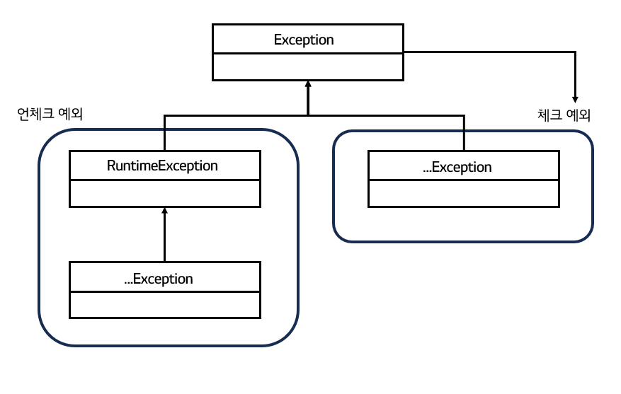
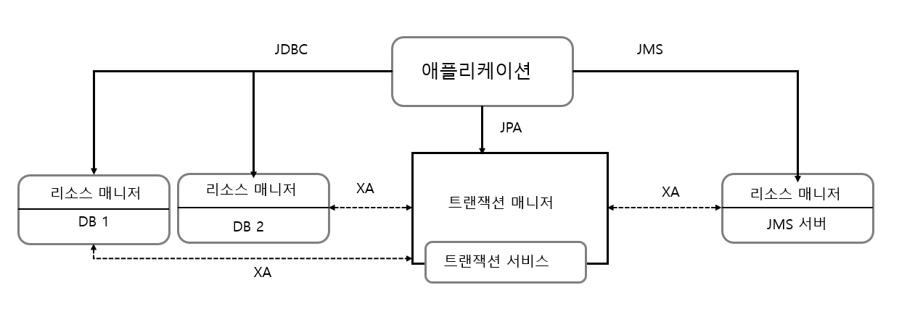
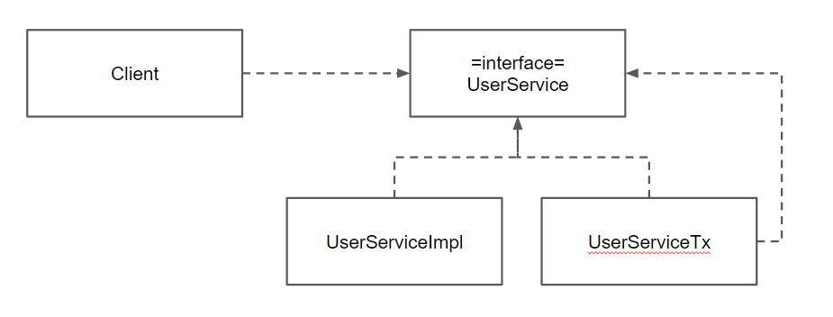
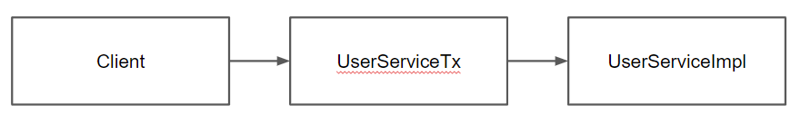
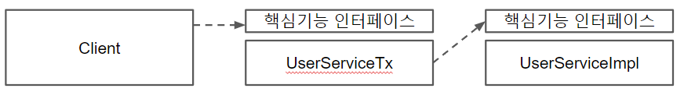
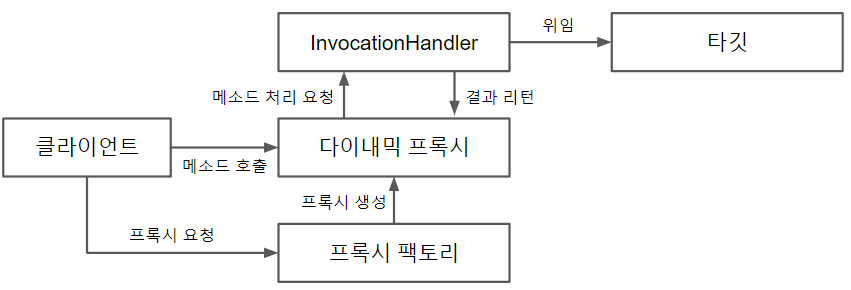
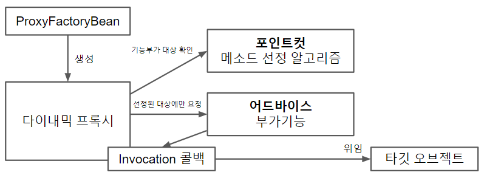
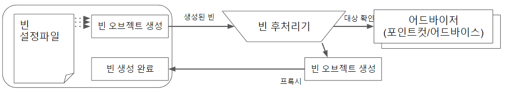
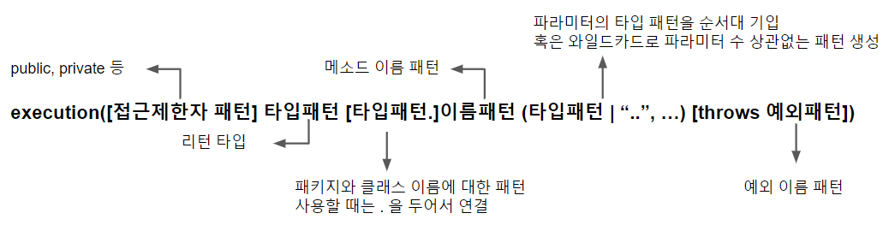
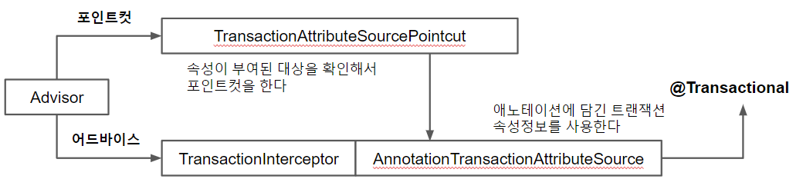

# 토비의 스프링 1


## 들어가며


### 스프링이란 무엇인가

- **애플리케이션 기본 틀** : 스프링 컨테이너

  - 스프링 런타임 엔진
  - 설정 정보를 참고로 해서 애플리케이션 구성하는 오브젝트를 생성하고 관리

- **공통 프로그래밍 모델** : IoC/DI, 서비스 추상화, AOP

  - 코드가 어떻게 작성되어야 하는지 기준 제시

  1. IoC/DI
     - 오브젝트의 생명주기와 의존관계에 대한 프로그래밍 모델
  2. 서비스 추상화
     - 환경/서버/기술에 종속되지 않고 이식성이 뛰어나며, 유연한 애플리케이션 개발 
  3. AOP
     - 부가적인 기능을 독립적으로 모듈화하는 프로그래밍 모델

- **기술 API** 

  - 방대한 양의 기술 API 제공


### 스프링의 성공 요인

- 단순함
  - 가장 단순한 객체지향적인 개발 모델인 POJO 프로그래밍
- 유연성
  - 여러 프레임워크를 함께 사용하게 해줌 => 접착 프레임워크


## 1장. 오브젝트와 의존관계


### 1.1 초난감 DAO


### 1.2 DAO의 분리

- 관심사의 분리
  - 요구사항은 끊임없이 바뀌고 발전 => 어떻게 대비?
    - 변화의 폭을 최소한으로 줄여주는 것
    - 분리와 확장을 고려한 설계
    - 변화는 대체로 집중된 한 가지 관심에 대해 일어남
    - 관심이 같은 것끼리는 모으고, 관심이 다른 것은 따로 떨어져 있게 하는 것
- UserDao 관심사항
  - DB와 연결을 위한 커넥션을 어떻게 가져올까라는 관심
  - 사용자 등록을 위해 DB에 보낼 SQL 문장을 담을 Statement를 만들고 실행
  - 작업이 끝나면 resources close
- 상속을 통한 확장
  - 같은 클래스에 다른 메소드로 분리됐던 DB 커넥션 연결이라는 관심을 상속을 통해 서브클래스로 분리
  - 클래스 계층구조를 통해 두 개의 관심이 독립적으로 분리되면서 변경 작업 용이
  - 템플릿 메소드 패턴
    - 슈퍼클래스에 기본적인 로직의 흐름 (커넥션 가져오기, SQL 생성, 실행, 변환)을 만들고, 그 기능의 일부를 추상 메소드나 오버라이딩이 가능한 protected 메소드 등으로 생성. 서브클래스에서 구현
  - 팩토리 메소드 패턴
    - 서브클래스에서 구체적인 오브젝트 생성 방법을 결정
  - UserDao는 Connection 오브젝트가 만들어지는 방법과 내부 동작 방식에는 상관없이, Connection 인터페이스를 통해 사용
  - 상속의 한계
    - 다중상속 X
    - (상하위 클래스끼리 )두 가지 다른 관심사에 대해 긴밀한 결합


### 1.3 DAO 확장

- 변화의 성격이 다르다는 건, 변화의 이유와 시기, 주기 등이 다름-

- 클래스의 분리

  - 상속 X. 완전히 독립적인 클래스로 분리
  - UserDao가 SimpleConnectionMaker라는 특정 클래스와 그 코드에 종속적이기 때문에 앞으로 납품 후에 고객이 DB 커넥션을 가져오는 방법을 자유롭게 확장하기가 힘들어졌다.

- 인터페이스의 도입

  - 추상화란 어떤 것들의 공통적인 성격을 뽑아내어 이를 따로 분리해내는 작업

    => 인터페이스

- 관계설정 책임의 분리

  - DAO 생성자 내부의 ` new DConnectionmaker()`라는 코드는 매우 짧고 간단하지만 그 자체로 충분히 독립적인 관심사를 담고 있음

  - 사용되는 오브젝트를 서비스, 사용하는 오브젝트를 클라이언트

  - UserDao의 클라이언트가 제 3 관심사항인 UserDao와 ConnectionMaker 구현 클래스의 관계를 결정해주는 기능을 분리해서 두기에 적절한 곳

  - 다형성을 통한 인터페이스 타입으로 참조

    - 클래스 사이의 관계는 코드에 다른 클래스 이름이 나타나기 때문에 생성

      =>  인터페이스 타입으로 참조 시, 느슨한 관계

    - 런타임 시점에는 모델링 시에 없었던(관계가 보이지 않던) 관계가 생성

  - 런타임 오브젝트 관계를 갖는 구조를 만들어주는 것이 클라이언트의 책임

  - 개방 폐쇄 원칙

    - 클래스나 모듈은 확장에는 열려 있고, 변경에는 닫혀 있어야 함

  - 높은 응집도와 낮은 결합도

    - 응집도가 높다는 건 하나의 모듈, 클래스가 하나의 책임 또는 관심사에만 집중
    - 낮은 결합도
      - 책임과 관심사가 다른 오브젝트과는 느슨하게 연결된 형태를 유지
      - 최소한의 방법으로 간접적인 형태로 제공, 나머지는 서로 독립적이고 알 필요 없게 만들어주는 것
      - 확장하기에도 매우 편리

  - 전략 패턴

    - 개방 폐쇄 원칙의 실현에도 가장 잘 들어맞는 패턴

    - 자신의 기능 맥락에서 필요에 따라 변경이 필요한 알고리즘을 인터페이스를 통해 통째로 외부로 분리

    - 구현한 구체적인 알고리즘 클래스를 필요에 따라 바꿔서 사용

      : 대체 가능한 전략


### 1.4 제어의 역전

- 팩토리
  - 객체의 생성 방법을 결정하고 반환
  - != 추상 팩토리 패턴 / 팩토리 메소드 패턴

- 설계도로서의 팩토리

  

  [토비의 스프링 그림 1-8 오브젝트 팩토리를 활용한 구조]

  - DaoFactory를 분리했을 때의 장점
    - 컴포넌트 역할을 하는 오브젝트와 애플리케이션 구조를 결정하는 오브젝트를 분리 O

- 제어권의 이전을 통한 제어관계 역전

  - 프로그램의 제어 흐름 구조가 뒤바뀌는 것

  - **능동적 주체 => 수동적 주체**

    - 모든 오브젝트가 능동적으로 자신이 사용할 클래스를 결정, 언제/어떻게 그 오브젝트를 만들지를 스스로 관장

      => 모든 제어 권한을 자신이 아닌 다른 대상에게 위임

  - 라이브러리 vs 프레임워크

    - 라이브러리 : 사용하는 애플리케이션 코드는 애플리케이션 흐름을 직접 제어

    - 프레임워크 : 애플리케이션 코드가 프레임워크에 의해 사용. 프레임워크가 흐름을 주도

      => 프레임워크에는 분명한 제어의 역전 개념이 적용되어야 함


### 1.5 스프링의 IoC

- 오브젝트 팩토리를 이용한 스프링 IoC

  - 애플리케이션 컨텍스트와 설정정보

    - **빈** : 스프링이 제어권을 가지고 직접 만들고 관계를 부여하는 오브젝트
    - **빈 팩토리** : 빈의 생성과 관계 생성 같은 제어를 담당
    - **애플리케이션 컨텍스트** : IoC 방식을 따라 만들어진 일종의 빈 팩토리. 
      - = 빈 팩토리

  - DaoFactory를 사용하는 애플리케이션 컨텍스트

    - 어노테이션

      - `@Configuration` : 빈 팩토리를 위한 오브젝트 설정을 담당하는 클래스
      - `@Bean` : 오브젝트 만들어주는 메소드

    - 애플리케이션 컨텍스트를 적용한 UserDaoTest

      ```java
      public class UserDaoTest {
          public static void main(String[] args) throws ClassNotFoundException, SQLException {
              Application context = new AnnotationConfigApplicationContext(DaoFactory.class);
              UserDao dao = context.getBean("userDao", UserDao.class);
              // ...
          }
      }
      ```

      - `DaoFactory`에서 `@Bean` 어노테이션을 `userDao` 메소드에 부착 => 메소드 이름  = 빈 이름
      - `getBean()`은 기본적으로 Object 타입으로 리턴 => 다시 캐스팅

- 애플리케이션 컨텍스트의 동작방식

  - 애플리케이션 컨텍스트 ≈ IoC 컨테이녀 ≈ 스프링 컨테이너 ≈ 빈 팩토리

    

    [토비의 스프링 1. 그림 1-9 애플리케이션 컨텍스트가 동작하는 방식]

  - 장점

    - 클라이언트는 구체적인 팩토리 클래스를 알 필요가 없다
    - 애플리케이션 컨텍스트는 종합 IoC 서비스를 제공해준다.
    - 애플리케이션 컨텍스트는 빈을 검색하는 다양한 방법을 제공한다


### 1.6 싱글톤 레지스트리와 오브젝트 스코프

- 오브젝트의 동일성과 동등성

  - 동일성 : 동일한 오브젝트 (`==`)
  - 등등성 : 동일한 정보를 담고있는 오브젝트 (`equals()`)

- 애플리케이션 컨텍스트가 싱글톤 레지스트리인 이유

  - 스프링 = 앤터프라이트 서버환경 => 요청마다 새로운 오브젝트 생성 ~> 서버 부하

- 자바에서의 싱글톤 구현 한계

  - 구현 방식
    - 생성자를 private
    - 자신과 같은 스태틱 필드 정의
    - 스태택 팩토리 메소드인 `getInstance()` 정의 후 해당 메소드를 통해 객체 반환
  - 한계
    - private 생성자 => 상속 X
      - 상속과 다형성과 같은 객체 지향적 특징 적용  X
    - 테스트의 어려움
      - 생성 방식이 제한적이기 때문에 목 오브젝트 등으로 대체 X
    - 서버 환경에서는 하나만 생성되는 것을 보장 X
      - 클래스 로드의 구성에 따라 하나 이상의 오브젝트 생성 O
      - 여러 개의 JVM에 분산돼서 설치 => 각각 독립적으로 오브젝트 생성
    - 바람직 하지 못한 전역 상태
      - 스태틱 메소드 => 언제든지 싱글톤에 접근 O

- 싱글톤 레지스트리

  - 스프링은 직접 싱글톤의 형태 오브젝트 만들고 관리

    => public 생성자 O + 디자인 패턴 제약 X

- 스프링 빈의 스코프

  - **빈의 스코프**
    - 빈이 생성되고 존재하고 적용되는 범위
  - 종류
    - 프로토타입 : 컨테이너에 빈 요청시 마다 새로 생성
    - 요청 스코프 : HTTP 요청시 마다 생성
    - 세션 스코프 : 웹의 세션과 스코프가 유사


### 1.7 의존관계 주입 (DI)

- 제어의 역전(IoC)과 의존관계 주입
  - DI의 핵심
    - 오브젝트 레퍼런스를 외부로부터 주입받고 이를 통해 여타 오브젝트와 다이내믹하게 의존관계가 만들어짐
    - 제 3자의 도움을 통해 두 오브젝트 사이의 유연한 관계가 설정되도록 만드는 것
  
- 런타임 의존관계 설정

  - 의존 : 의존대상이 변하면, 자신에게 영향이 미치는 관계

  - 인터페이스에 대한 의존관계

    => 인터페이스 구현 클래스와의 느슨한 관계

    => 변화에 낮은 영향 = 낮은 결합도

  - 의존관계 주입의 3가지 조건
    1. 클래스 모델이나 코드에는 런타임 시점의 의존관계가 드러나지 X
    2. 런타임 시점의 의존관계는 컨테이너나 팩토리 같은 제 3의 존재가 결정
    3. 사용할 오브젝트에 대한 레퍼런스를 외부에서 제공

- 의존관계 검색과 주입

  - 의존관계 검색

    - 런타임 시에 의존관계 결정 

    - 외부로부터 주입 X, **스스로 검색**을 이용 

      ```java
      public UserDao(){
          DaoFacotry daoFactory = new DaoFactory();
          this.connectionMaker = daoFactory.connectionMaker(); // ConnectionMaker는 인터페이스
      }
      ```

      - 여전히 구체적인 connectionMaker는 알지 못하지만, IoC 컨테이너인 DaoFacotry에 요청
      - 스프링의 애플리케이션 컨텍스트라면 미리 정해놓은 이름을 전달해서 그 이름에 해당되는 오브젝트 반환
      - 코드 안에 오브젝트 팩토리 클래스 or 스프링 API 등장 => 의존관계 생성 (=> 대게는 주입 방식 권장)

    - 필요 경우

      - 서버 시 main()역할을 하는 서블릿에서 스프링 컨테이너에 담긴 오브젝트를 사용하기 위해서는 한 번은 검색 필요

    - 차이점

      - 검색의 경우, 검색하는 오브젝트는 자신이 스프링 빈일 필요가 없음. (UserDao는 빈일 필요 X)
      - 주입의 경우, UserDao도 반드시 빈 오브젝트
        - UserDao에 주입하기 위해선, UserDao에 대한 생성/초기화 권한 필요 => IoC 방식으로 생성되는 빈 오브젝트

  - 의존관계 주입 응용
    - 기능 구현의 교환
      - 테스트와 운영시 다른 DB 사용시 DAO가 connection 정보와 직접적으로 의존하면, 환경 변경 때 대규모 수정 필요
      - DI의 설정정보에 해당하는 DaoFactory만 다르게 만들어두면, 나머지 코드들은 수정 X, 각각 다른 런타임 오브젝트에 의존관계 생성 O
    - 부가기능 추가
      - connection 횟수를 counting 하고 싶다면 UserDao -> CountingConnectionMaker -> ConnectionMaker 의 의존관계를 통해, UserDao와 ConnectionMaker의 소스 수정없이 구현 O
      - DI의 장점은 관심사의 분리를 통해 얻어지는 높은 응집도
  - 메소드를 이용한 의존관계 주입
    - 수정자 메소드
    - 일반 메소드
      - 한번에 한개의 파라미터만 가질 수 있는 제약 회피 O


### 개념 사전

- DAO

  - 데이터를 조회하거나 조작하는 기능을 전담 오브젝트

- javaBean(자바빈)

  - 두 가지 관례를 따라 만들어진 오브젝트

    - 디폴트 생성자

      - 툴이나 프레임워크에서 리플렉션을 이용해 오브젝트 생성

    - 프로퍼티

      - 이름을 가진 속성

      - getter/setter을 통해 조회/수정

- 디자인 패턴

  - 자주 만나는 문제를 해결 => 재사용 가능한 솔루션
  - 언급만으로 의도와 해결책을 함께 설명 O

- 템플릿 메소드 패턴

  - 상속을 통해 슈퍼클래스의 기능을 확장 시, 변하지 않는 기능은 슈퍼클래스에 두고, 자주 변경되면 확장할 기능은 서브클래스에서 구현
  - 훅(hook) 메소드 : 슈퍼클래스에서 디폴트 기능을 정의, 서브클래스에서 **선택적으로** 오버라이드할 수 있는 메소드

- 팩토리 메소드 패턴
  - 상속을 통해 확장하게 하는 패턴
  - 슈퍼클래스 코드에서는 서브클래스에서 구현할 메소드를 호출해서 인터페이스 타입의 오브젝트를 가져와 사용
  - 서브클래스에서 오브젝트 생성 방법과 클래스를 결정할 수 있도록 미리 정의해둔 메소드를 팩토리 메소드
- 팩토리 메소드 (별도)
  - 오브젝트를 생성하는 기능을 가진 메소드


## 테스트


### 테스트 필요성

- 복잡해져가는 애플리케이션에 대한 대응 전략

  1. 객체지향

     - 확장과 변화를 고려한 설계

       => IoC/DI

  2. 테스트

     - 코드에 대한 확신

  => 변화에 유연하게 대처 O


### 2.1 UserDaoTest 다시 보기

- 웹을 통한 DAO 테스트 방법의 문제점

  - 다른 모든 레이어의 기능 생성 후 테스트 가능
    - DAO 뿐만 아니라 서비스 클래스, 컨트롤러, JSP 뷰 등 
  - 어디서 문제 생겼는지 빠르게 확인 X

- 작은 단위의 테스트 : `단위 테스트`

  - 관심사의 분리 원리 적용 

    ​	=> 테스트의 관심이 다르다면, 테스트할 대상을 분리하고 집중해서 접근 필요

  - 충분히 하나의 관심에 집중해서 효율적으로 테스트할 만한 범위의 단위

  - 통제할 수 없는 외부의 리소스에 의존하는 테스트는 단위 테스트 X라고 보기도 함

- 자동수행 테스트 코드

  - 테스트는 자동으로 수행되도록 코드로 만들어지는 것이 중요

  - 자동 수행의 장점

    - 자주 반복 O

    - 빠르게 실행 O

      => 언제든지 코드를 수정하고 테스트

      => 지속적인 개선과 점진적인 개발 O

- UserDaoTest 문제점 ( main 메소드에서 print문을 통해 결과 확인하는 방법)

  - 수동 확인 작업의 번거로움
    - 콘솔에 나온 값을 보고 등록과 조회가 성공적으로 되는지 사람이 확인 
    - 양 / 복잡도 증가시 피로도 증가
    - 미세한 차이 식별 힘듦
  - 실행 작업의 번거러움
    - DAO 수만큼 main 메소드도 그만큼 생성
    - 각각의 main 메소드 수동 실행


### 2.2 UserDaoTest 개선

- 테스트 검증의 자동화

  - 테스트 결과 종류

    - 테스트 에러
      - 에러 발생
    - 테스트 실패
      - 기대한 결과값과 상이

- JUnit 테스트 전환 : 테스트의 효율적인 수행과 결과 관리

  - 테스트 메소드 전환
    - 제어권을 직접 가지는 main() 메소드 => JUnit의 형식의 일반 메소드
      1. public 메소드
      2. @Test 어노테이션 부착

  - 검증 코드 전환

    - `assertThat` 스태틱 메소드

      ```java
      assertThat(user2.getName(), is(user.getName()));
      ```

      - 매처(matcher)라는 조건으로 비교해서 일치 시, 패스
      - `is()` : `equals()`로 비교해주는 매처


### 2.3 개발자를 위한 테스팅 프레임워크 JUnit

-  테스트 결과의 일관성

  - 코드에 변경사항이 없다면, 테스트는 항상 동일한 결과를 내야함

    - 테스트는 외부 상태/이전 테스트에 독립적이어야 함

      - ex) 이전 테스트로 DB에 데이터 Insert 했을 시, 재테스트에는 중복에러 발생

      => deleteAll, getCount 기능 추가로 독립성 유지

    - 모든 테스트는 실행 순서에 상관없이 독립적으로 항상 동일한 결과를 낼 수 있도록 작성

- 예외조건에 대한 테스트

  - 특정 예외가 던져지면 테스트 성공 / 정상 시, 실패라 판단해야 하는 경우

    ```java
    @Test(expected=EmptyResultDataAccessException.class)
    public void getUserFailure() throws SQLException {
        // dao 테스트 코드
    }
    ```

    - `@Test(expected =  )` 안에  테스트 중에 발생할 것으로 기대하는 예외 클래스 지정
    - :heavy_check_mark: [Junit5]  assertThrows에 필요한 클래스를 등록하고 람다식으로 예외를 던질 실행문을 작성

- 포괄적인 테스트

  - "항상 네거티브 테스트를 먼저 만들라" by 로드 존슨(스프링 창시자) 
  - 부정적인 케이스를 먼저 작성하는 습관 필요

- 테스트가 이끄는 개발 (TDD)

  - 기능설계를 위한 테스트

    | 구분 | 단계               | 내용                                      | 코드                                                     |
    | ---- | ------------------ | ----------------------------------------- | -------------------------------------------------------- |
    | 조건 | 어떤 조건을 가지고 | 가져올 사용자 정보가 존재하지 않는 경우에 | dao.deleteAll();<br />assertThat(dao.getCount(), is(0)); |
    | 행위 | 무엇을 할 때       | 존재하지 않는 id로 get()을 실행하면       | get("unknown_id");                                       |
    | 결과 | 어떤 결과가 나온다 | 특별한 예외가 던져진다                    | @Test(expected=EmptyResultDataAccessException.class)     |

    [표2-1 getUserFailure() 테스트 코드에 나타난 기능]

  - 테스트 주도 개발

    - = 테스트 우선 개발(Test First Development)

    - 기본 원칙 : "실패한 테스트를 성공시키기 위한 목적이 아닌 코드는 만들지 않는다"

      => 모든 코드는 빠짐없이 테스트로 검증

    - 테스트의 작성과 테스트를 성공시키는 코드 작성의 주기를 최대한 짧게 유지

      => 개발한 코드의 오류를 빨리 발견

    - 장점

      - 전체적인 개발 속도 증진
        - 테스트는 상대적으로 작성하기 쉬움
        - 빠른 오류 해결 속도

  - 테스트 코드 개선

    - `@Before`

      - `@Test` 메소드가 실행되기 전에 먼저 실행돼야 하는 메소드를 정의

      - `@Test` 메소드에서 공통적으로 등장하는 변수는 인스턴스 변수로 선언한 후, `@Before`에서 정의

        => 반복적인 코드 제거

      - :heavy_check_mark: [JUnit5] `@BeforeEach` : 테스트 케이스 마다 실행,  `@BeforeAll` : 테스트 클래스를 초기화시, 딱 `1`회 수행
      
      ```java
      public class UserDaoTest{
          private UserDao dao;
          
          @Before
          public ovid setUp(){
              ApplicationContext context = new GenericXmlApplicationContext("applicationContext.xml");
              this.dao = context.getBean("userDao", UserDao.class);
          }
      }
      ```

    :bulb: JUnit 테스트 클래스 수행 방법 요약
    
    	1. 테스트 클래스에서 @Test 붙은 public이며, void형이고, 파라미터가 없는 테스트 메소드 모두 탐색
    	1. 테스트 클래스의 오브젝트 하나 생성
    	1. @Before 메소드 실행
    	1. @Test 붙은 메소드 한개 실행 및 결과 저장
    	1. @After 메소드 실행
    	1. 나머지 @Test 메소드들에 대해 2~5번 반복
    	1. 테스트 결과 종합하여 반환

    - 테스트 오브젝트

      - @Before, @Test, @After는 서로 독립적으로 수행 (서로가 서로를 호출 X)

        => 주고받을 정보는 인스턴스 변수 활용

      - 각 테스트 메소들 실행할 때 마다 새로운 테스트 클래스 오브젝트 생성

        => 각 테스트가 독립적으로 실행됨을 보장

    - 픽스처
    
      - 테스트를 수행하는 데 필요한 정보나 오브젝트
        - ex) User 객체들
      - 일반적으로 반복 사용 => @Before로 생성


:bulb: junit5 변경점

```
In JUnit 5, the default behavior is different. By default, JUnit 5 does not create a new instance of the test class for each test method. Instead, the same test class instance is reused across multiple test methods within the same test class.

This change in behavior was introduced to improve performance and reduce the overhead of creating new instances for each test method. Reusing the test class instance can be beneficial when the tests are stateless or when the state is properly managed within the test methods.

However, if you want to ensure test method isolation and have a fresh instance of the test class for each test method, you can use the @TestInstance annotation with the Lifecycle.PER_METHOD parameter. By annotating the test class with @TestInstance(Lifecycle.PER_METHOD), JUnit 5 will create a new instance of the test class for each test method, similar to the behavior of JUnit 4.
```


### 2.4 스프링 테스트 적용

- 애플리케이션 컨텍스트 생성 

  - 방식
    - 모든 싱글톤 빈 오브젝트 초기화
  - 단점
    - 빈이 할당한 리소스 깔끔하게 정리 안될 경우 다음 테스트에 영향 
    - 많은 시간과 자원 소모

- 테스트를 위한 애플리케이션 컨텍스트 관리

  - JUnit을 이용하는 테스트 컨텍스트 프레임워크 => 모든 테스트가 공유 O

  ```java
  @RunWith(SpringJUnit4ClassRunner.class)
  @ContextConfiguration(locations="/applicationContext.xml")
  public class UserDaoTest{
      @Autowired
      private Application context;
      
      // ...
      
      @Before
      public void setUp(){
          this.dao = this.context.getBean("userDao", UserDao.class);
          // ...
      }
          
  }
  ```

  [리스트 2-17 스프링 테스트 컨텍스트를 적용한 UserDaoTest]

  - `@RunWith(SpringJUnit4ClassRunner.class)`

    - JUnit용 테스트 컨텍스트 프레임워크 확장 클래스 지정

  - `@ContextConfiguration` 
    - 애플리케이션 컨텍스트 설정파일 위치 지정

  - `@Autowired`
    - 스프링의 DI에 사용되는 특별한 애노테이션
    - 스프링 애플리케이션 컨텍스트는 초기화 시, 자기 자신도 빈으로 등록 => Autowired 사용 O

    

:bulb: JUnit 5 + ApplicationContext가 xml 파일이 아닌, `@SpringBootApplication`을 통해 bean을 자동 등록하는 경우

```java
@SpringBootTest
@ExtendWith(SpringExtension.class)
@ContextConfiguration(classes = SpringApplication.class)
public class UserDaoTest{
    
    @Autowired
    private Application context;
```

:heavy_check_mark:  `@SpringBootTest` : 테스트에 Spring Application Context를 가져오기 위해 사용 

:heavy_check_mark: `@ExtendWith(SpringExtension.class)` : `@RunWith` 대체.  JUnit5과 Spring testing 기능 통합

:heavy_check_mark: `@ContextConfiguration` : SpringApplication 부분에 `@SpringBootApplication`가 붙은 시작클래스를 넣음

:heavy_check_mark:[참고] `@SpringBootApplication` = `@Configuration` + `@EnableAutoConfiguration` + `@ComponentScan`


- 테스트 코드에 의한 DI

  ```java
  @DirtiesContext
  public class UserDaoTest{
      @Autowired
      UserDao dao;
      
      @Before
      public void setUp(){
          // ...
          DataSource dataSource = new SingleConnectionDataSource("jdbc:mysql://localhost/testdb", "spring", "book", true);
          dao.setDataSource(dataSource);
          
          
      }
  }
  ```

  - `@DirtiesContext` 
    - 테스트 메소드에서 애플리케이션 컨텍스트의 구성이나 상태를 변경함을 테스트 컨텍스트 프레임워크에 알려줌
    - 테스트 컨텍스트는 해당 애노테이션이 붙은 테스트 클래스(혹은 메소드)에는 애플리케이션 컨텍스트 공유 X
    - 단점 > 장점
      - 애플리케이션 컨텍스트의 구성/상태를 테스트 내에서 변경하지 X 것이 원칙

  - :bulb: SingleConnectionDataSource
    - 스프링이 제공하는 가장 빠른 DataSource
    - DB 커넥션을 하나만 만들어두고 계속 사용

- 테스트를 위한 별도의 DI 설정

  - 테스트 전용 설정파일 생성

- 컨테이너 없는 DI 테스트

  - 스프링 컨테이너에서 UserDao가 동작하는지는 UserDaoTest의 기본 관심사 X
  - 스프링 컨테이너 없이 테스트 할 수 있는 방법을 가장 우선적으로 고려

  ```java
  public class UserDaoTest{
      UserDao dao;
      
      @Before
      public void setUp(){
          // ...
          dao = new UserDao();
          DataSource dataSource = new SingleConnectionDataSource("jdbc:mysql://localhost/testdb", "spring", "book", true);
          dao.setDataSource(dataSource);
      }
  }
  ```

  - UserDao도 유연한 테스트가 가능하게끔 설계
  - :bulb: 침투적 기술과 비침투적 기술
    - 침투적 기술
      - 애플리케이션 코드에 기술 관련 API 등장 or 특정 인터페이스나 클래스의 사용 강제
      - 기술에 종속적
    - 비침투적 기술
      - 애플리케이션 로직을 담은 코드에 아무런 영향 X 적용 가능
      - 기술에 비종속적 

  

### 2.5 학습 테스트로 배우는 스프링

- 학습 테스트
  - 자신이 만들지 않은 프레임워크, 라이브러리에 대한 테스트 작성
  - 목적
    - 사용 방법 학습
    - 이해와 사용 방법에 대한 검증
- 학습 테스트의 장점
  - 다양한 조건에 따른 기능을 손쉽게 확인
  - 학습 테스트 코드를 개발 중에 참고 O
    - 다양한 기능과 조건에 대한 테스트 코드를 개별적으로 만들고 남겨둘 수 있음
  - 프레임워크나 제품을 업그레이드할 때 호환성 검증 O
  - 테스트 작성에 대한 좋은 훈련
- 버그 테스트
  - 오류를 가장 잘 드러내줄 수 있는 테스트
  - 버그가 원인이 되어 테스트가 일단 실패하도록 만들어야 함
  - 필요성 및 장점
    - 테스트의 완성도 :arrow_up:
      - 불충분했던 테스트 보완
    - 버그의 내용을 명확하게 분석
      - 어떤 이유 때문에 문제가 생겼는지 명확히 파악 O
      - 동등분할, 경계값 분석 적용 O
    - 기술적인 문제를 해결하는데 도움


### 2.6 정리

- 테스트는 자동화돼야 하고, 빠르게 실행할 수 있어야 함
- 테스트 결과는 일관성이 있어야 함
- 포과적으로 작성
- 코드 작성과 테스트 수행의 간격이 짧을수록 효과적
- 테스트하기 쉬운 코드가 좋은 코드
- @Before, @After를 사용해서 공통 준비 작업 처리
- 학습테스트, 버그 테스트 활용


## 3. 템플릿


### 템플릿이란

- 변경이 거의 일어나지 않으며, 일정한 패턴으로 유지되는 특성을 가지는 부분을 자유롭게 변경되는 성질을 가진 부분으로부터 독립시켜서 효과적으로 활용할 수 있도록 하는 방법


### 3.2 변하는 것과 변하지 않는 것

- JDBC try/catch/finally 코드의 문제점

  - 어떤 상황에서도 리소스 반환을 위해, try/catch/finally 구문 사용을 권장함
  - 많은 곳에서 중복되는 코드와 로직에 따라 자꾸 확장되고 자주 변하는 코드를 잘 분리 필요

  ```java
  public void deleteAll() throws SQLException {
      Connection c = null;
      PreparedStatement ps = null;
  
      try {
          c = dataSource.getConnection();
          ps = c.preparedStatement("delete from users"); // 변하는 부분
          ps.executeUpdate();
      } catch(SQLException e){
          throw e;
      } finally {
          if(ps != null) {try {ps.close();} catch (SQLException e) {}}
          if(c != null) {try {c.close();} catch(SQLException e) {}}
      }
  }
  ```

  [리스트 3-4] 개선할 deleteAll() 메소드

- 메소드 추출

  - 변하는 부분 혹은 변하지 않는 부분을 메소드로 추출함

    - 이 경우, 변하지 않는 부분이 변하는 부분을 감싸고 있어 추출이 어려우므로, 변하는 부분을 추출

      ```java
      private PreparedStatement makeStatement(Connection c) throws SQLException{
      	PreparedStatement ps;
      	ps = c.prepareStatement("delete from users");
      	return ps;
      }
      ```

    - 재사용이 필요한 코드가 분리된 것이 아닌, 분리시키고 남은 코드가 재사용이 필요하여 유용성 :arrow_down:

- 템플릿 메소드 패턴의 적용

  - 템플릿 메소드 패턴

    - 상속을 통해 기능을 확장해서 사용
    - 변하지 않는 부분은 슈퍼클래스에 두고, 변하는 부분은 추상 메소드로 정의해둬서 서브클래스에서 오버라이딩하여 새롭게 정의

  - UserDao를 추상 클래스 선언 및 `makeStatement`를 추상 메소드로 선언

    ```java
    abstract protected PreparedStatement makeStatement(Connection c) throws SQLException;
    ```

    ```java
    public class UserDaoDeleteAll extends UserDao {
         protected PreparedStatement makeStatement(Connection c) throws SQLException{
             PreparedStatement ps= c.prepareStatement("delete from users");
    		 return ps;
         }
    }
    ```

  - 단점

    - 템플릿 메소드 패턴으로의 접근은 제한이 많음
      - DAO 로직마다 상속을 통해 새로운 클래스를 만들어야 함
    - 확장 구조가 설계하는 시점에서 고정
      - 컴파일 시점에 이미 그 관계가 결정되어 있음
      - 관계에 대한 유연성 :arrow_down:

- 전략 패턴의 적용

  - 전략 패턴

    - 오브젝트를 아예 둘로 분리하고, 클래스 레벨에서는 인터페이스를 통해서만 의존 => 유연하고 확장성 뛰어남

    - 변하는 부분을 별도의 클래스로 만들어 추상화된 인터페이스를 통해 위임

    - 좌측에 있는  Context에서 일정한 구조로 동작 + 특정 확장 기능은  Strategy 인터페이스를 통해 외부의 독립된 전략 클래스에 위임

      

      [그림 3-2] 전략 패턴의 구조

  - 적용

    ```java
    public interface StatementStrategy {
        PreparedStatement makePreparedStatement(Connection c) throws SQLException;
    }
    ```

    [리스트 3-8] StatementStrategy 인터페이스

    
    
    ```java
    public class DeleteAllStatement implements StatementStrategy {
        public PreparedStatement makePreparedStatement(Connection c) throws SQLException {
            PreparedStatement ps= c.prepareStatement("delete from users");
    		 return ps;
        }
    }
    ```

    [리스트3-9] deleteAll() 메소드의 기능을 구현한 StatementStrategy 전략 클래스
    
    
    
    ```java
    public void deleteAll() throws SQLException {
        Connection c = null;
        PreparedStatement ps = null;
    
        try {
            c = dataSource.getConnection();
            StatementStrategy strategy = new DeleteAllStatement();
            ps = strategy.makePreparedStatement(c);
            ps.executeUpdate();
        } catch(SQLException e){
            throw e;
        } finally {
            if(ps != null) {try {ps.close();} catch (SQLException e) {}}
            if(c != null) {try {c.close();} catch(SQLException e) {}}
        }
    }
    ```
    
    [리스트3-10] 전략 패턴을 따라 DeleteAllStatement가 적용된 deleteAll() 메소드
    
    - 하지만 아직 컨텍스트 안에 이미 구체적인 전략 클래스가 명시되어 있는 단점이 있다.

- DI 적용을 위한 클라이언트/컨텍스트 분리

  - 전략 패턴에 따르면, Context가 어떤 전략을 사용하게 할 것인가는 앞단의 **Client가 결정**하는 것이 일반적

    

    [그림 3-3] 전략 패턴에서 Client의 역할
  
  - DI의 구조와 동일
  
    - DI란 전략 패턴의 장점을 일반적으로 활용할 수 있도록 만든 구조
  
    ```java
    public void jdbcContextWithStatementStrategy(StatementStrategy strategy) throws SQLException {
        Connection c = null;
        PreparedStatement ps = null;
    
        try {
            c = dataSource.getConnection();
            ps = strategy.makePreparedStatement(c);
            ps.executeUpdate();
        } catch(SQLException e){
            throw e;
        } finally {
            if(ps != null) {try {ps.close();} catch (SQLException e) {}}
            if(c != null) {try {c.close();} catch(SQLException e) {}}
        }
    }
    ```
  
    [리스트 3-11] 메소드로 분리한 try/catch/finally 컨텍스트 코드
  
    
  
    ```java
    public void deleteAll throws SQLException {
        StatementStrategy st = new DeleteAllStatement();
        jdbcContextWithStatementStrategy(st);
    }
    ```
  
    [리스트 3-12] 클라이언트 책임을 담당할 deleteAll() 메소드

​	:bulb: 마이크로 DI (수동 DI) :  IoC 컨테이너의 도움 없이 코드 내에서 적용한 경우 


### 3.3 JDBC 전략 패턴의 최적화

- 전략 클래스의 추가 정보

  ```java
  public class AddStatement implements StatementStrategy {
      User user;
      
      public AddStatement(User user){
          this.user = user;
      }
      
      public PreparedStatement makePreparedStatement(Connection c) throws SQLException {
          PreparedStatement ps = c.preparedStatement("insert into users(id, name, password) values(?,?,?)");
          ps.setString(1, user.getId());
          ps.setString(2, user.getName());
          ps.setString(3, user.getPassword());
          
          return ps;
      }
  }
  ```

  [리스트3-14] User 정보를 생성자로부터 제공받도록 만든 AddStatement

  - add() 메소드의 PreparedStatement 생성 로직을 분리한 클래스
  -  `user`란 부가정보가 필요하기 때문에, 클라이언트로부터 생성자를 통해 User 타입 오브젝트 제공 받음

  ```java
  public void add(User user) throws SQLException {
      StatementStrategy st = new AddStatement(user);
      jdbcContextWithStatementStrategy(st);
  }
  ```

- 전략과 클라이언트의 동거

  - 현재 구조의 단점

    1. DAO 메소드마다 새로운 StatementStrategy 구현 클래스를 만들어야 한다
    2. DAO 메소드에서 StatementStrategy에 전달할 User와 같은 부가적인 정보가 있을 경우, 오브젝트를 전달받는 생성자와 이를 저장할 인스턴스 변수를 생성해야 함

  - 로컬 클래스

    - UserDao 밖에서 사용되지 않는 StatementStrategy 전략 클래스를 UserDao 클래스 내의 내부 클래스로 정의

      => 1번 단점 해결 O

    ```java
    public void add(final User user) throws SQLException {
        public class AddStatement implements StatementStrategy {
            public PreparedStatement makePreparedStatement(Connection c) throws SQLException {
                PreparedStatement ps 
                    = c.preparedStatement("insert into users(id, name, password) values(?,?,?)");
                ps.setString(1, user.getId());
                ps.setString(2, user.getName());
                ps.setString(3, user.getPassword());
    
                return ps;
            }
        }
        StatementStrategy st = new AddStatement(user);
        jdbcContextWithStatementStrategy(st);
    }
    ```

    [리스트 3-17] add() 메소드의 로컬 변수를 직접 사용하도록 수정한 AddStatement

    - add() 메소드 내의 로컬 클래스로 이전한 AddStatement

    - 내부 메소드는 자신이 정의된 메소드의 로컬 변수에 직접 접근 O

      - 내부 클래스에서 외부의 변수를 사용할 때는 외부 변수를 반드시 final로 선언

      - 생성자와 인스턴스 변수 제거 O 

        => 2번 단점 해결 O

  - 익명 내부 클래스

    - 정의

      - 이름을 갖지 않는 클래스로, 클래스 선언와 오브젝트 생성이 결합된 형태로 만들어짐
      - 클래스 재사용 X, 구현한 인터페이스 타입((or 상속할 클래스)으로만 사용할 경우 유용

      - `new 인터페이스이름() { 클래스 본문 }`

    ```java
    StatementStrategy st = new StatementStrategy() {
        public PreparedStatement makePreparedStatement(Connection c) throws SQLException {
                PreparedStatement ps 
                    = c.preparedStatement("insert into users(id, name, password) values(?,?,?)");
                ps.setString(1, user.getId());
                ps.setString(2, user.getName());
                ps.setString(3, user.getPassword());
    
                return ps;
            }
    }
    ```

    [리스트 3-18] AddStatement를 익명 내부 클래스로 전환

    ```java
    public void add(final User user) throws SQLException {
        jdbcContextWithStatementStrategy(new StatementStrategy() {
            public PreparedStatement makePreparedStatement(Connection c) throws SQLException {
                    PreparedStatement ps 
                        = c.preparedStatement("insert into users(id, name, password) values(?,?,?)");
                    ps.setString(1, user.getId());
                    ps.setString(2, user.getName());
                    ps.setString(3, user.getPassword());
    
                    return ps;
                }
    		}
        );
    }
    ```

    [리스트3-19] 메소드 파라미터로 이전한 익명 내스

:bulb: 중첩 클래스

- 의미
  - 다른 클래스 내부에 정의되는 클래스를 중첩 클래스
- 종류
  - 스태틱 클래스 : 독립적으로 오브젝트로 만들어질 수 있음
  - 내부 클래스 : 자신이 정의된 클래스의 오브젝트 안에서만 만들어질 수 있음
    - 멤버 내부 클래스 : 오브젝트 레벨
    - 로컬 클래스 : 메소드 레벨.  선언된 메소드 내에서만 사용 O
    - 익명 내부 클래스 : 이름 X


### 3.4 컨텍스트와 DI

- JdbcContext의 분리

  ```java
  public class JdbcContext {
      private DataSource dataSource;
      
      public void setDataSource(DataSource dataSource){
          this.dataSource = dataSource;
      }
  
      public void workWithStatementStrategy(StatementStrategy strategy) throws SQLException {
          Connection c = null;
          PreparedStatement ps = null;
  
          try {
              c = dataSource.getConnection();
              ps = strategy.makePreparedStatement(c);
              ps.executeUpdate();
          } catch(SQLException e){
              throw e;
          } finally {
              if(ps != null) {try {ps.close();} catch (SQLException e) {}}
              if(c != null) {try {c.close();} catch(SQLException e) {}}
          }
      }
  }
  ```

  [리스트 3-21] JDBC 작업 흐름을 분리해서 만든 JdbcContext 클래스

  - Context를 UserDao에서 독립적인 Class로 분리시킴

  ```java
  public class UserDao{
      ...
      private JdbcContext jdbcContext;
      
      public void setJdbcContext(JdbcContext jdbcContext){
          this.jdbcContext = jdbcContext;
      }
      
      public void add(final User user) throws SQLException {
          this.jdbcContext.workWithStatementStrategy( new StatementStrategy(){...});
      }
      
      public void deleteAll() throws SQLException {
          this.jdbcContext.workWithStatementStrategy( new StatementStrategy(){...});
      }
  }
  ```

  [리스트 3-22] JdbcContext를 DI 받아서 사용하도록 만든 UserDao

- JdbcContext의 특별한 DI
  - 인터페이스를 사용하지 않고 DI 적용
  
  - 스프링 빈으로 DI
    - 온전한 DI
      - 인터페이스를 사이에 둬서, 의존관계가 고정되지 않고, 런타임 시에 다이나믹하게 주입
    - 넓은 의미의 스프링 DI
      - IoC 개념 포괄 : 객체의 생성과 관계 설정에 대한 제어권한을 오브젝트에서 제거 +외부 위임
  
    - UserDao와 JdbcContext의 DI 구조 필요성
      1. JdbcContext를 싱글톤 빈으로 관리하기 위함
         - JdbcContext는 서비스 오브젝트로써, 싱글톤으로 등록되어 여러 오브젝트에서 공유해 사용되는 것이 이상적
      2. JdbcContext가 DI를 통해 다른 빈에 의존
         1. DI를 위해서는 주입되는 오브젝트와 주입받는 오브젝트 모두 스프링 빈으로 등록이 필요함
  
    - 인터페이스 X DI
      - 매우 긴밀한 관계로 강한 응집도를 가질 때 사용
  
  - 코드를 이용하는 수동 DI
  
    - JdbcContext의 싱글톤 관리 포기 + JdbcContext의 dataSource 주입을 DAO에서 담당하는 방식으로 수동 DI 가능
    - DAO 하나당 JdbcContext를 가지게 되지만, 리소스 부담 X
      - 상태 정보 X => 메모리 부담 X
      - 자주 생성 및 삭제 X => GC 부담 X

### 3.5 템플릿과 콜백

- 템플릿/콜백 패턴
  - 스프링에서 익명 내부 클래스를 활용하는 전략 패턴을 부르는 방식
  - 템플릿
    - 전략 패턴에서의  Context
  - 콜백 
    - 특정 로직을 담은 메소드가 실행되는 것을 목적으로 다른 오브젝트의 메소드에 전달되는 오브젝트
    - 전략 패턴에서의  익명 내부 클래스로 만들어지는 오브젝트
    - = 펑셔별 오브젝트

- 특징 (vs 전략 패턴)
  - 주로 단일 메소드 인터페이스 사용
    - 전략 패턴 : 여러 개의 메소드를 가진 일반적인 인터페이스 사용
  - 주로 파라미터 존재
    - 컨텍스트 정보 전달 받음
  - 매번 메소드 단위로 사용할 오브젝트를 새롭게 전달받음
  - 클라이언트와 콜백이 강하게 결합

- 편리한 콜백의 재활용

  - 익명 내부 클래스 단점

    - 상대적으로 불편한의 코드 작성과 읽기
    - 많은 중첩된 괄호

    => 복잡한 익명 내부 클래스의 사용 최소화

  - 바뀌지 않는 모든 부분을 빼내서 executeSql()메소드 생성

    - `deleteAll()` 처럼 파라마터가 필요 없는 모든 쿼리들에 적용 O


  ```java
  public Class JdbcContext {
      ...
      private void executeSql(final String query) throws SQLException {
          workWithStatementStrategy(
              new StatementStrategy(){
                  public PreparedStatement makePreparedStatement(Connection c) throws SQLException {
                      return c.prepareStatement(query);
                  }
              })
  	}
  }
  
  ```

  [리스트 3-28] JdbcContext로 옮긴 executeSql() 메소드

- 제넥릭스를 이용한 콜백 인터페이스
  - 컨텍스트와 콜백에 제네릭스를 적용하면, 타입에 더 유연한 설계가 가능해짐


### 스프링의 JdbcTemplate

- 개요

  - 스프링은 거의 모든 종류의 JDBC 코드에 사용 가능한 템플릿과 콜백 제공
  - JdbcTemplate은 생성자의 파라미터로 DataSource 주입

  ```java
  public class UserDao{
      private JdbcTemplate jdbcTemplate;
      
      public void setDataSource(DataSource dataSource){
          this.jdbcTemplate = new JdbcTemplate(dataSource);
      }
  }
  ```

  [리스트 3-45] JdbcTemplate의 초기화를 위한 코드

- update

  - JdbcTemplate 콜백
    - PreparedStatementCreator 인터페이스의 createPreparedStatement() 메소드 
  - 파라미터가 없는 SQL문 실행

  ```java
  public void deleteAll(){
      this.jdbcTemplate.update("delete from users");
  }
  ```

  [리스트 3-46] JdbcTemplate을 적용한 deleteAll() 메소드

  - 파라미터를 가진 SQL문 실행
    - 치환자(`?`)를 가진 SQL로 PreparedStatement 생성
    - 파라미터를 순서대로 입력

  ```java
  public void deleteAll(){
      this.jdbcTemplate.update("insert into users(id, name, password) values (?,?,?)", user.getId(), user.getName(), user.getPassword());
  }
  ```

- `queryForInt()`

  - JdbcTemplate 콜백

    - PreparedStatementCreator 
      - 템플릿으로부터 Connection을 받고, PreparedStatement 반환
    - ResultSetExtractor
      - ResultSet을 받고, 추출한 결과 반환
      - 제네릭스 타입 파라미터를 가짐

  - SQL문 실행

    ```java
    public int getCount(){
        return this.jdbcTemplate.queryForInt("select count(*) from users")
    }
    ```

- `queryForObject()`

  - 콜백
    - PreparedStatementCreator 
    - RowMapper
      - ResultSet을 받고, 추출한 결과 반환
      - ResultSet의 로우 하나를 매핑하기 위해 사용되기 때문에 여러 번 호출 O

  - RowMapper 적용 예시

  ```java
  public User get(String id){
      return this.jdbcTemplate.queryForObject("select * from users where id = ?",
                                             new Object[] {id},	
                                             new RowMapper<User>(){
                                                 public User mapRow(ResultSet rs, int rowNum) throws SQLException {
                                                     User user = new User();
                                                     user.setId(rs.getString("id"));
                                                     user.setName(rs.getString("name"));
                                                     user.setPassword(rs.getString("password"));
                                                     return user;
                                                 }
                                             });
  }
  ```

  [리스트 3-51] queryForObject()와 RowMapper를 적용한 get() 메소드

  - 파라미터
    1. PreparedStatement 생성을 위한 SQL
    2. 바인딩할 값
       - 뒤에 다른 파라미터가 존재하기 때문에 가변인자 대신 Object 타입 배열
    3. RowMapper 콜백
  - 예외 처리
    - 로우의 개수가 하나가 아니라면 `EmptyResultDataAccessException` 발생

- `query()`

  - 개요
    - 여러 개의 로우가 결과로 나오는 일반적인 경우에 사용 O
    - `List<T>` 타입을 return하며, 제네릭 타입은 `RowMapper<T>` 에서 결정됨
    - ResultSet의 모든 로우를 열람하면서 로우마다 RowMapper 콜백을 호출함

  - RowMapper 적용 예시

  ```java
  public List<User> getAll(String id){
      return this.jdbcTemplate.queryForObject("select * from users order by id",
                                             new RowMapper<User>(){
                                                 public User mapRow(ResultSet rs, int rowNum) throws SQLException {
                                                     User user = new User();
                                                     user.setId(rs.getString("id"));
                                                     user.setName(rs.getString("name"));
                                                     user.setPassword(rs.getString("password"));
                                                     return user;
                                                 }
                                             });
  }
  ```

  [리스트 3-53] getAll() 메소드

  - 파라미터
    - 바인딩할 파라미터가 없다면 생략 가능 O

- 중복 제거
  - `queryForObject()`와 `query()` 같이 사용한다면, 익명 내부 클래스 => 클래스의 필드로 초기화


### 정리

- 일정한 작업 흐름이 반복되면서, 일부 기능만 바뀌는 코드가 존재한다면 전략 패턴 이용
  - 바뀌지 않은 부분은 컨텍스트. 바뀌는 부분은 전략으로 생성
- 템플릿/콜백 패턴
  - 단일 전략 메소드를 갖는 전략 패턴이면서 익명 내부 클래스를 사용해서 매번 전략을 새로 만들어 사용하고, 컨텍스트 호출과 동시에 전략 DI를 수행하는 방식
- 템플릿과 콜백의 타입이 다양하게 바뀔 수 있다면 제네릭스 이용한다.


## 4. 예외


### 예외 처리 원칙

- 핵심 원칙
  - 모든 예외는 적절하게 복구 or 작업을 중단시키고 분명하게 통보돼야 한다.
  
- 무의미한 예외 처리 

  - 예외를 잡고서 아무것도 수행하지 않음

  - 무의미하고 무책임한 throws
    - 모든 예외를 무조건 던져버리는 선언을 모든 메소드에 기계적으로 넣음


### 예외의 종류와 특징

- Error
  - 시스템에 뭔가 비정상적인 상황이 발생했을 경우
    - 주로 자바 VM에서 발생
  - 애플리케이션 코드에서 처리 X
    - 시스템 레벨의 처리 필요
  - ex) OutOfMemoryError, ThreadDeath
- Exception
  - 애플리케이션 코드의 작업 중에 예외 상황 발생했을 경우
  - 구분
    - 체크 예외
      - Exception 클래스의 서브클래스이면서, RuntimeException 클래스를 상속 X
      - 일반적인 예외
      - 예외 처리 강제
    - 언체크 예외
      - RuntimeException 클래스를 상속
      - 명시적인 예외처리를 강제하지 X
      - ex) NullPointerException, IllegalArgumentException



[그림 4-1] Exception의 두 가지 종류


### 예외 처리 방법

- 예외 복구

  - 예외 상황을 파악하고 문제를 해결 => 정상 상태로 복구
  - 다른 작업 흐름으로 자연스럽게 유도 or 재시도

- 예외처리 회피

  - 자신이 담당하지 않고 자신을 호출한 쪽으로 던져버리는 것
  - ex) 템플릿-콜백 관계에서는 콜백에서 SQLException을 처리하지 않고, 템플릿에 던져버림
  - 긴말하게 역할을 분담하고 있는 관계가 아니라면 무책임한 회피일 수 있음
  - 예외를 회피하는 것 또한 복구하는 것처럼 의도가 분명해야 함

- 예외 전환

  - 적절한 예외로 전환해서 메소드 밖으로 던져버리는 것

  - 목적

    1. 분명한 의미를 가지는 예외로 전환

       - 의미가 분명한 예외가 던져지면 서비스 계층 오브젝트에는 적잘한 복구 작업 시도 O

       - 중첩 예외 사용 권장

         - 전환하는 예외에 원래 발생한 예외 담음

         ```java
         catch(SQLException e){
             throw DuplicateUserIdException(e); 
         }
         ```

         ```java
         catch(SQLException e){
             throw DuplicateUserIdException().initCause(e);
         }
         ```

    2. 포장 처리

       - 예외를 처리하고 쉽고 단순하게 만듦

       - 주로 체크 예외를 언체크 예외로 바꾸는 경우에 사용

         ```java
         try{
             OrderHome orderHome = EJBHomeFactory.getInstance().getOrderHome();
             Order order = orderHome.findByPrimaryKey(Integer id);
         } catch (NamingException ne){
             throw new EJBException(ne);
         }
         ```

         - 런타임 Exception throw => 시스템 exception으로 인식 => 트랜잭션 자동 롤백
         - :bulb: `EJBExcpetoin` : 예상치 못한 에러로 인해, 비지니스 메소드 혹은 콜백 메소드가 정상적으로 수행되지 못 했음을 알리는 Exception 클래스
       
       - 어차피 복구 불가능한 예외의 경우, 런타임 예외로 포장하여 불필요한 throws 선언 방지


:bulb: 중첩 예외 생성을 위한 생성자 추가

```java
public class DuplicateUserIdException extends RuntimeException {
    public DuplicateUserIdException(Throwalbe cause){
        super(cuase);
    }
}
```


### 예외처리 전략

- 런타임 예외의 보편화
  - 자바 서버 환경에서의 예외 처리
    - 사용자의 각 요청은 독립적인 작업 취급 => 하나의 요청 처리 중 예외 발생 시, 해당 작업만 중단
    - 체크 예외의 활용도와 가치 :arrow_down:
      - 대응이 불가능한 체크 예외라면 런타임 예외로 전환
      - 항상 복구 가능 예외 X라면, 런타임 예외로 전환
  - 낙관적 예외 처리 기법
    - 복구할 예외는 없다고 가정, 시스템 레벨의 처리 기대
  - 예시 : JdbcTemplate에서의 SQLException 처리
    - 99%의 SQLException 은 코드레벨에서 복구 X => 런타임 예외인 DataAccessException으로 포장
- 애플리케이션 예외
  - 애플리케이션 자체 로직에 의해 의도적으로 발생 => 반드시 catch해서 조치
  - 비관적 접근 방법
  - 설계 방법 : 은행 계좌 출금
    - 정상적인 출금 처리 시, 요청 금액 리턴
    - 예외상황 발생 시, 비지니스적인 의미를 띤 **체크 예외**를 던짐


### Spring 예외 전략 : DataAccessException

- JDBC 한계

  - 비표준 SQL
    - 대부분의 DB는 비표준 SQL 지원 => DAO가 특정 DB에 종속
    - 해결 : SQL을 외부로 독립시켜 DI 적용 : 7장에서 소개

  - 호환성 없는 SQLException의 DB 에러 정보
    - 여러 SQL 예외 (SQL 문법 오류, DB 커넥션, PK 중복 등) 가 하나의 SQLException에 담김
    - SQLException의 `getErrorCode()`
      - DB에러 코드 가져올 수 있지만, DB에러 코드는 DB별로 상이
    - SQLException의 `getSQLSate()`
      - Open Group의 XOPEN SQL 스펙에 정의 SQL 상태 코드를 따름
      - But, JDBC에서 정확한 상태 코드 생성 X => 신뢰도 :arrow_down:

- Spring의 DataAccessException

  - 특징

    - 런타임 예외 => 예외 처리 강제 X

    - 세분화된 서브 클래스

      - BadSqlGrammarException : SQL 문법 오류
      - DataAccessResourceFailureException : DB 커넥션 오류
      - DataIntegrityViolationException : 제약조건 위배
      - DuplicateKeyException : PK 중복

    - 서브클래스에 매핑된 DB별 에러코드

      - DB의 에러코드를 DataAccessException 계층구조의 클래스 중 하나로 매핑

        => DB에 종속되지 않은 일관된 예외 처리 O


- 장점
    - JdbcTemplate과 같이 스프링의 데이터 엑세스 지원 기술을 이용해 DAO를 만들면 사용 기술에 독립적인 일관성 있는 예외 사용 O
    - 독립적인 이상적인 DAO Interface 구현
      -  `throws` 생략 가능한 런타임 예외 사용하여, DB에 독립적인 메소드 정의. 
        - 인터페이스의 메소드 선언에는 없는 예외를 구현 클래스의 메소드의 throws에 넣을 수 없음
        - 모든 예외를 다 받아주는 `throws Exception`은 무책임한 선언

- 주의사항


  - `DuplicateKeyException`은 JDBC 사용할 때만 발생


    - JPA, Hibernate 등 각 기술에서 재정의한 예외의 경우, 세분화되어 있지 않아 변환 X
    
    => 직접 정의한 에러코드로 변환함으로써, DB에 독립적인 에러처리 가능

:bulb: 현재는 JPA와 Hibernate 사용 시의 에러도 `DataAccessException`로 전환 가능한 것으로 확인됨.


## 5장. 서비스 추상화


### 사용자 레벨관리 기능 추가

- Enum 활용

  - Level 필드 추가 시, "BASIC", "SILVER", "GOLD"와 같이 문자로 DB 입력시, DB 용량 비효율 발생

    => 코드화 해서 숫자로 입력

  - JAVA 소스에서 코드화된 숫자 자체로 사용할 경우, 코드 외 숫자 입력 가능성  존재

    => Enum으로 관리

- SQL 테스트

  - JAVA 소스 내의 SQL문은 단순 문자열 인식 => 실행 전까진 오류 확인 X

    => DB까지의 테스트 필요

  - JDBC 테스트 점검 방법

    1. 리턴값 활용
       - UPDATE, DELETE 수행 후에는 영향받은 컬럼 수 반환 => 의도한 개수만큼인지 테스트로 확인
    2. 타겟한 정보 외 변경되지 않았음을 확인하는 테스트 코드 작성


### :bulb: 코드 개선 질문

- 코드에 중복된 부분은 없는가
- 코드가 무엇을 하는 것인지 이해하기 불편하지 않은가
- 코드가 자신이 있어야 할 자리에 있는가
- 앞으로 변경이 일어난다면 어떤 것이 있을 수 있고, 그 변화에 쉽게 대응할 수 있게 작성되어 있는가


### Service 다중 역할 개선 코드

```java
private void upgradeLevel(User user){
    if(user.getLevel() == Level.BASIC){
        user.setLevel(Level.SILVER);
    } else if (user.getLevel() == Level.SILVER) {
        user.setLevel(Level.GOLD);
    }
    userDao.update(user);
}
```

[리스트5-25] 레벨 업그레이드 작업 메소드

- 개선사항
  - 다중 역할 수행 : 다음 단계가 무엇인가 하는 로직과 사용자 level 변경 로직이 함께 존재
  - 예외 상황 처리 X
  
- 개선방안
  - 레벨의 순서와 다음 단계 레벨이 무엇인지 결정 ~> Level

    ```java
    public enum Level {
        GOLD(3, null), SILVER(2,GOLD), BASIC(1,SILVER);
        private final int value;
        private final Level next;
    
        // ...
        public Level nextLevel(){
            return this.next;
        }
    }
    ```
  
  - 사용자 정보 수정 및 예외 처리 ~> User
  
    ```java
    public void upgradeLevel(){
    	Level nextLevel = this.level.nextLevel();
        if(nextLevel == null) {
            throw new IllegalStateException();
        } else {
            this.level = nextLevel;
        }
    }
    ```
  
  - 각 주체들에게 요청 ~> Service
  
    ```java
    private void upgradeLevel(User user){
    	user.upgradeLevel();
        userDao.update(user);
    }
    ```
  
    

### :bulb: 중복의 기준

- 한 가지 변경 이유가 발생했을 때, 여러 군데를 고치게 만든다면 중복

  => 테스트와 애플리케이션 코드에서 등장하는 숫자 중복도 개선 대상


### :bulb: 테스트를 위한 소스 수정

- 가급적 테스트를 위한 소스 수정은 지양
  - 특히, 비지니스 로직을 담은 메소드
- 테스트 용 클래스를 상속을 통해 새로 생성하는 경우, 기존 코드는 private => protected  와 같이 범위 지정 정도만 수정


### 트랜잭션 서비스 추상화

- 트랜잭션

  - 더 이상 나눌 수 없는 작업 단위 : 원자성

  - 커넥션보다 존재 범위가 짧음

     => 메소드 단위로 connection을 반환하는 구조에서는 여러 메소드를 한 트랜잭션으로 처리 X

- 비지니스 로직 내 트랜잭션 경계 설정

  - DAO 안에 비지니스 로직을 옮길 경우, 여러 역할과 책임이 한 곳에 집중되어 버려 바람직 하지 X

    => 경계 설정 작업은 `Service`의 몫

  - DAO가 Service에서 Connection을 파라미터 전달받을 경우 문제점

    - JdbcTemplate 활용 X
    - Service와 DAO 메소드들에 Connection 파라미터 일괄 추가
    - Connection 파라미터 추가 시, 데이터 엑세스 기술에 종속적
      - JPA / Hibernate의 경우, Connection 객체가 아닌 EntityManager 혹은 Session 필요

- 스프링의 **트랜잭션 동기화**

  - 방식

    1. 트랜잭션을 시작하기 위해 만든 Connection 오브젝트를 특별한 저장소에 보관
    2. 호출되는 DAO의 메소드에서 저장된 Connection을 가져다가 사용

  - 특징

    - 작업 스레드 마다 독립적으로 Connection 오브젝트를 저장

      => 멀티스레드 환경에서도 충돌  X

  - 적용

    ```java
    class UserService {
        private DataSource dataSource;
        
        public void setDataSource(DataSource dataSource){
            this.dataSource = dataSource ; // Connetion 생성시 사용할 DataSource DI 받음
        }
        
        public void upgradeLevels() throws Exception {
            TransactionSynchronizationManager.initSynchronizaition(); // 동기화 작업 초기화
            Connection c = DataSourceUtils.getConnection(datasource);
            c.setAutoCommit(false);
            
            try {
                List<User> users = userDao.getAll();
                for(User user : users){
                    if(canUpgradeLevel(user)){
                        upgradeLevel(user);
                    }
                }
                c.commit();
            } catch(Exception e) {
                c.rollback();
                throw e;
            } finally {
                // 스프링 유틸리티 메소드를 이용해 DB 커넥션 안전하게 닫기
                DataSourceUtils.releaseConnection(c,dataSource);
                // 동기화 작업 종료 및 정리
                TransactionSynchronizationManager.unbindResource(this.dataSource);
                TransactionSynchronizationManager.clearSynchronization();
                    
            }
            
        }
    }
    ```
    
    [리스트 5-41] 트랜잭션 동기화 방식을 적용한 UserService

- 트랜잭션 서비스 추상화

  - 글로벌 트랜잭션

    - 트랜잭션 관리자를 통해 트랜잭션을 관리
    - 배경
      - JDBC Connection을 이용한 로컬 트랜잭션으로는 여러 개의 DB를 조작하는 작업에 대한 트랜잭션 X
      - 로컬 트랜잭션은 하나의 DB에 대한 트랜잭션만 관리

    - JTA
      - 글로벌 트랜잭션 지원하는 트랜잭션 매니저 API
      - JDBC, JMS API가 직접 트랜잭션 제어 X, JTA에 위임
      - 트랜잭션 매니저가 실제 DB와 메시징 서버의 트랜잭션을 종합적으로 제어



​				[그림 5-4] JTA를 통한 글로벌/분산 트랜잭션 관리

​				:bulb: XA : 2PC(2 phase commit)을 통한 분산 트렌젝션 처리를 위한 X-Open에서 명시한 표준

  - 트랜잭션 API의 의존관계 문제와 해결책

    - 트랜잭션 관리를 위한 Connection 파라미터 추가 시, Service layer도 데이터 엑세스 기술에 종속적으로 변함

      - UserService는 UserDao에만 의존하였음

    - Hibernate의 경우, Connection이 아닌 Session 사용 및 독자적인 트랜잭션 관리 API 사용

    - 스프링의 트랜잭션 서비스 추상화

      - `PlatformTransactionManager` 
        - 스프링이 제공하는 트랜잭션 경계설정을 위한 추상 인터페이스
        - DAO를 수정했다면, 그에 맞게 `PlatformTransactionManager` 구현 클래스만 변경하면 됨
        - `Service` 수정 필요 X
      
      ```java
      public class UserService {
          private PlatformTransactionManager transactionManager;
          
          // 추후 PlatformTransactionManager은 bean으로 등록 후 @Autowired를 통해 주입 받음
          public void setTransactionManager(PlatformTransactionManager transactionManager){
          	this.transactionManager =transactionManager;
          }
          
          public void upgradeLevels(){
              TransactionStatus status = this.transactionManager.getTransaction(new DefaultTransactionDefinition());
              try{
                  List<User> users = userDao.getAll();
                  for(User user : users){
                      upgradeLevel(user); 	
                  }
      	        this.transactionManger.commit(status);
              } catch(RuntimeException e) {
                  this.transactionManager.rollback(status);
                  throw e;
              }
      
          }
      }
      ```
      
      [리스트 5-46] 트랜잭션 매니저를 빈으로 분리시킨 UserService

:bulb: `TransactionSynchronizationManager` vs `@Transactional`

| 측면          | TransactionSynchronizationManager                            | @Transactional                                               |
| ------------- | ------------------------------------------------------------ | ------------------------------------------------------------ |
| 정의          | 트랜잭션 동기화 콜백을 위한 중앙 레지스트리 역할             | 메서드나 클래스에 트랜잭션을 표시하는 선언적 어노테이션      |
| 목적          | 트랜잭션 라이프사이클의 다양한 단계에서 실행되는 동기화 콜백 등록<br />ex) beforeCommit, afterCommit, afterCompletion, ... | 트랜잭션 경계를 정의하고 트랜잭션 관리를 자동화하는 선언적 방식 |
| 추상화 수준   | 동기화에 대한 더 많은 제어를 제공하는 저수준 API             | 저수준 트랜잭션 세부사항을 추상화한 고수준의 개념.           |
| customization | 다양한 트랜잭션 단계에서 사용자 정의 동작 제공               | 비즈니스 로직에 집중하며 저수준 트랜잭션 세부사항은 추상화.  |
| 사용          | 트랜잭션 동기화에 세밀한 제어와 다양한 사용자 정의 로직 필요 시 사용 | 표준 시나리오에 대한 자동 트랜잭션 관리에 주로 사용          |
| 일반적 사용   | 직접적으로 사용되는 경우는 드묾<br />주로 사용자 정의 동기화에 활용 | 일반적인 트랜잭션 관리에 자주 사용                           |
| 개발자 포커스 | 트랜잭션 동기화 세부사항에 더 많은 주의 필요                 | 트랜잭션 처리의 추상화 <br />=> 비즈니스 로직에 집중 가능    |


### 수직, 수평 계층관계와 의존관계

- 수평적 분리
  - 기능적 관심에 따라 분리 => 서로 불필요한 영향 X, 독자적으로 확장 O
  - 같은 계층에서의 분리
- 수직적 분리
  - 로직과 기술이라는 다른 계층 특성의 갖는 코드를 분리

=> 결합도 :arrow_down: , 자유로운 확장 구조 생성


### 정리

- 비지니스 로직을 담은 코드는 데이터 엑세스 로직을 담은 코드와 깔끔하게 분리되는 것이 바람직

- 인터페이스와  DI를 잘 활용해서 결합도를 낮춰야 한다.

- 단위 작업을 보장해주는 트랜잭션이 필요하다

- 트랜잭션의 시작과 종료를 지정하는 일을 트랜잭션 경계 설정이라 하며, 주로 비지니스 로직 내에서 발생한다.

- 트랜잭션 경계설정 코드가 비지니스 로직 코드에 영향을 주지 않게 하려면, 스프링이 제공하는 트랜잭션 서비스 추상화를 사용한다

  

## 6. AOP


### 트랜잭션 코드의 분리

- 트랜잭션 경계설정과 비지니스 로직이 공존하는 메소드

  - `[리스트 5-46] 트랜잭션 매니저를 빈으로 분리시킨 UserService`를 보면, 뚜렷하게 두 가지 종류의 코드로 구분 가능
    - 트랜잭션 경계 & 비지니스 로직 
    - 두 코드간 서로 주고 받는 정보가 없는 서로 독립적인 코드
    - 비지니스 수행 코드가 트랜잭션 시작과 종료 사이에 수행되어야 한다는 원칙만 지켜진다면 분리 O

- DI 적용을 이용한 트랜잭션 분리

  - 동일 인터페이스 트랜잭션의 **경계설정이라는 책임만**을 맡은 구현 클래스 생성

  

  [그림 6-3] 트랜잭션 경계설정을 위한 UserServiceTx의 도입

  - 비지니스 로직 담당 클래스 : UserServiceImpl

    - 기존 UserService 클래스  내용 대부분 그대로 유지

    ```java
    public class UserServiceImpl implements UserService {
        UserDao userDao;
        MailSender mailSender;
        
        public void upgradeLevels(){
            List<User> users = userDao.getAll();
            for(User user : users) {
                if(canUpgradeLevel(user)) {
                    upgradeLevel(user);
                }
            }
        }
    }
    ```

    [리스트 6-4] 트랜잭션 코드를 제거한 UserSerivce 구현 클래스

    - 트랜잭션을 고려하지 않고 로직만을 구현했던 처음 모습으로 돌아옴

  - 트랜잭션 로직 담당 클래스 : UserServiceTx

    ```java
    publci class UserServiceTx implements UserService {
        UserService userService;
        PlatformTransactionManager transactionManager;
        
        public void setTransactionManager(PlatformTransactionManager transactionManager){
            this.transactionManager = transactionManager;
        }
        
        // UserSerivce를 구현한 다른 오브젝트는 DI 받는다
        public void setUserService(UserService userService) {
            this.userService = userService;
        }
        
        // ...
        
        public void upgradeLevels(){
            TransactionStatus status = this.transactionManger.getTransaction(new DefaultTransactionDefinition());
            try {
                userService.upgradeLevels(); // 비지니스 로직은 DI 받은 오브젝트에 위임
                this.transactionManger.commit(status);
            }catch (RuntimeException e){
                this.transactionManger.rollback(status);
                throw e;
            }
        }
    }
    ```

    [리스트 6-5] 위임 기능을 가진 UserServiceTx 클래스

    - Client가 UserService 인터페이스를 통해 사용자 관리 로직을 실행할 때, 트랜잭션 담당 오브젝트가 사용돼서 선 트랜잭션 작업 후 실제 비지니스 오브젝트를 통해 로직을 수행함

    

    [그림 6-4] 트랜잭션 기능의 오브젝트가 적용된 의존관계

- 특징

  - 비지니스 로직을 담당하는 `UserServiceImple` 코드 작성 시에는 트랜잭션과 같은 기술적 내용은 신경 X

  - 부가기능 담당 클래스는 부가기능 외의 모든 기능은 핵심 기능을 가진 클래스에게 위임

  - 핵심 기능 클래스는 부가 기능 클래스의 존재 자체를 모름

  - 클라이언트는 인터페이스를 통해서만 핵심기능을 사용

    => 중간의 부가기능 클래스를 통해 핵심 기능이 이용되는지 알 수 없음

    

    [그림 6-9] 핵심기능 인터페이스 적용


### 고립된 단위 테스트

- 단위테스트 기준
  - 하나의 단위에 초점을 맞춘 테스트. (여기서 단위의 기준은 정하기 나름)
  - 여기선, 외부의 리소스를 사용하지 않도록 고립시켜서 테스트하는 것
  - <=> 통합 테스트 : 성격이나 계층이 다른 두 개 이상의 오브젝트 혹은 외부 리소스가 참여하는 테스트
- 테스트 결정 가이드라인
  - 항상 단위 테스트를 고려
  - 외부 리소스를 사용해야만 가능한 테스트는 통합테스트
    - DAO와 같이 단위 테스트가 어려운 코드 대상
  - 다만, 외부 리소스를 스텁 혹은 목 오브젝트로 미리 대체 후 단위테스트를 수행한다면, 통합 테스트 시 오류의 확률 :arrow_down: 
  - 단위 테스트를 만들기 너무 복잡하다고 판단되는 코드는 처음부터 통합 테스트로 고려


### 다이내믹 프록시와 팩토리 빈

- 프록시와 타깃
  - 프록시
    - 클라이언트가 사용하려는 실제 대상인 것처럼 위장해서 요청을 받는 대리자, 대리인
    - 타깃과 같은 인터페이스를 구현
    - 프록시가 타깃을 제어
  - 타깃 (실체)
    - 프록시를 통해 최종적으로 요청을 위임받아 처리하는 실제 오브젝트

- 프록시 구분 기준 : 사용 목적
  1. 타깃에 부가적인 기능을 부여 => 데코레이터 패턴
  2. 클라이언트가 타깃에 접근하는 방법을 제어 => 프록시 패턴

- 데코레이터 패턴

  - 특징
    - 타깃에 부가적인 기능을 런타임 시에 다이내믹하게 부여
    - 코드 상, 어떤 방법과 순서로 프록시와 타깃이 연결되어 있는지 정해져 있지 X
    - 프록시가 한 개로 제한 X => 여러 개의 프록시를 순서를 정해서 단계적으로 위임
  - 예시
    - `InputStream is = new BufferedInputStream(new FileInputStream("a.txt"));`
      - `InputStream` 인터페이스를 구현한 `FileInputStream` 타깃에 버퍼 읽기 제공해주는 `BufferedInputStream` 데코레이터 적용

- 프록시 패턴

  - 용어구분
    - 일반적인 프록시 : 클라이언트와 사용 대상 사이에 대리 역할을 맡은 오브젝트를 두는 방법의 총칭
    - 디자인패턴 프록시 : 타깃에 대한 접근 방법을 제어하는 목적
  - 특징
    - 타깃의 기능을 확장 / 추가하지 않으며, 클라이언트가 접근하는 방식만 변경
    - 프록시는 코드에서 자신이 만들거나 접근해야 할 타깃에 대한 정보를 알고 있는 경우 多
  - 예시
    1. 타깃 오브젝트 생성 시점 연기
       - 타깃 오브젝트가 생성하기 복잡하거나 당장 필요하지 X는 경우에는 꼭 필요 시점까지 생성 시점 미루는 것이 이득
       - 타깃 오브젝에 대한 레퍼런스는 미리 넘겨야 하는 경우, 프록시를 미리 넘겨줌
       - 타깃이 실제로 호출 되었을 때, 프록시가 타깃 오브젝트를 생성하고 요청을 위임
    2. 원격 오브젝트 사용
       - RMI, EJB, 각종 리모팅 기술을 이용해 다른 서버의 오브젝트 사용 시, 원격 오브젝트에 대한 프록시로 대체
       - 로컬에 존재하는 오브젝트처럼 사용 O
    3. 접근제어
       - 수정 가능한 오브젝트지만, 특정 레이어로 넘어가서는 읽기전용으로만 동작해야 하는 경우
       - 해당 레이어에는 타깃이 아닌 프록시를 넘김
       - 수정 가능한 메소드를 호출하는 경우 프록시가 예외 발생시킴

- 다이내믹 프록시

  - 프록시 작성의 문제점

    - 프록시는 두 가지 기능으로 구성

      - 타깃과 같은 메소드를 구현하고 있다가 타깃 오브젝트로 위임
      - 지정된 요청에 대해서는 부가기능 수행

      => 메소드 수 :arrow_up: ~> 구현 메소드 수 :arrow_up: & 부가 기능 코드 중복

  - 다이내믹 프록시

    - 리플렉션

      - 정의

        - 자바의 코드 자체를 추상화해서 접근하도록 만든 것
        - Class 타입의 오브젝트를 통해 클래스 코드에 대한 메타 정보 가져오거나 오브젝트 조작 O

      - 사용 예시 

        ```java
        // 리플렉션 API 중 Method 인터페이스 이용
        String name = "Spring";
        Method lengthMethod = String.class.getMethod("length");
        int length = lengthMethod.invoke(name); // int length = name.length(); 소스와 동일
        ```

        - Method 인터페이스의 `invoke()` 메소드
          - 대상 오브젝트와 파라미터 목록을 받아서 메소드 호출 후 Object 타입으로 반환 
          - `public Object invoke(Object obj, Object... args)`

    - 리플렉션 기능을 이용한 프록시 생성

      

      [그림 6-13] 다이내믹 프록시의 동작방식

      - 다이내믹 프록시 : 프록시 팩토리에 의해 런타임 시 다이내믹하게 만들어지는 오브젝트
      - 인터페이스를 모두 구현해가면서 클래스를 정의하는 수고를 덜 수 있음
      - 프록시로서 필요한 부가기능 제공 코드는 직접 작성 필요

    - 예시

      ```java
      public class UppercaseHandler implements InvocationHandler {
          Object target;
          public UppercaseHandler(Obejct target){
              this.target= target;
          }
          
          public Object invoke(Obejct proxy, Method method, Obejct[] args) throws Throwable {
              Object ret = method.invoke(target, args);
              if(ret instanceof String){
                  return ((String)ret).toUpperCase();
              } else {
                  return ret;
              }
          }
      }
      ```

      [리스트 6-25] 확장된 UppercaseHandler

      ```java
      Hello proxiedHello = (Hello) Proxy.newProxyInstance( // 프록시 생성 후 Hello 타입으로 캐스팅
      		getClass().getClassLoader(),// 동적으로 생성되는 다이내믹 프록시 클래스의 로딩에 사용할 클래스 로더
      		new Class[]{Hello.class},	// 구현할 인터페이스
      		new UppercaseHandler(new HelloTarget()) // 부가기능과 위임 코드를 담은 InvocationHandler
      );
      ```

      [리스트 6-24] 프록시 생성

  - 팩토리 빈을 통한 빈 등록

    - 일반적인 스프링 빈 등록 방법으로는 부가기능을 담은 UppercaseHandler 및 다이내믹 프록시를 빈 등록 X

      => 스프링 DI 활용 X
      
    - 스프링을 대신해서 오브젝트의 생성로직을 담당하도록 만들어진 팩토리 빈을 활용하여 빈으로 등록

  - 한계

    - 한 번에 여러 개의 클래스에 공통적인 부가기능을 제공하는 일은 불가능
    - Hanlder 오브젝트가 프록시 팩토리 빈 개수만큼 만들어짐
      - 타깃 오브젝트를 프로퍼티로 들고 있음 => 부가 기능은 동일해도 타깃 오브젝트 만큼의 오브젝트 필요


  #### :bulb: 빈 생성 방법

  - 기본 방법

    - 리플랙션 API 이용 => 빈 정의에 나오는 클래스 이름을 가지고 빈 오브젝트 생성
    - `Class`의 `newInstance()`로 해당 클래스의 파라미터가 없는 생성자 호출 & 결과 반환

  - 팩토리 빈

    - 스프링을 대신해서 오브젝트의 생성로직을 담당하도록 만들어진 특별한 빈

    - `FactoryBean` 인터페이스 구현

      ```java
      public interface FactoryBean<T> {
          T getObject throws Exception;		// 빈 오브젝트 생성해서 반환
          Class<? extends T> getObjectType(); // 생성되는 오브젝트의 타입을 알려준다
          boolean isSingleton();				// getObejct가 항상 같은 싱글톤 오브젝트인지 알려준다
      }
      ```

    - 예시

      ```java
      public class Message {
          String text;
          
          private Message(String text){	// private 생성자로 외부에서 생성자로 오브젝트 생성 X
              this.text = text;
          }
          
          public String getText(){
              return text;
          }
          
          public static Message newMessage(String text){
              return new Message(text);
          }
      }
      ```

      - private 생성자인 클래스의 빈 등록
        - private 생성자를 가진 클래스 또한 빈으로 등록하면 리플렉션을 이용해 오브젝트 생성 O
        - But, 생성자를 private 만들었다는 것은 중요한 이유가 있기 때문에 이를 무시하고 오브젝트를 강제로 생성하는 것은 위험
        - 또한 바르게 동작하지 않을 가능성 有

      [리스트 6-30] 생성자를 제공하지 않는 클래스

      ```java
      public class MessageFactoryBean implements FactoryBean<Message>{
      	String text;
          
          // 오브젝트를 생성할 때 필요한 정보를 팩토리 비의 프로퍼티로 설정해서 대신 DI 받을 수 있게 한다.
          // 주입된 정보는 오브젝트 생성 중에 사용된다.
          public void setText(String text){
              this.text = text;
          }
          
          // 실제 빈으로 사용될 오브젝트를 직접 생성한다. 
          // 코드를 이용하기 때문에 복잡한 형식의 오브젝트 생성과 초기화 작업도 가능하다.
          public Message getObejct() throws Exception {
              return Message.newMessage(this.text);
          }
          
          public Class<? extends Message> getObjectType(){
              return Message.class;
          }
          
          // getObject() 메소드가 돌려주는 오브젝트가 싱글톤인지 알려준다.
          // 이 팩토리 빈은 매번 요청할 때마다 새로운 오브젝트를 만드므로 false로 설정
          public boolean isSingleton(){
              return false;
      	}
          
      }
      ```

      - `getObejct()`를 통해 가져온 오브젝트를 `getObjectType()`에서 지정된 타입으로 빈 등록

    - 빈 가져오기

      ```java
      
      Object factory = context.getBean("&message"); // &를 앞에 붙여줄 경우 팩토리 빈 자체 반환
      ```

      


### ProxyFactoryBean

- `MethodInterceptor` 구현

  - `MethodInterceptor ` vs `InvocationHanlder`

    | MethodInterceptor                                            | InvocationHanlder                                            |
    | ------------------------------------------------------------ | ------------------------------------------------------------ |
    | 타깃 오브젝트의 정보까지 함께 제공 받음 <br />=> 독립적인 구현<br />=> 타깃이 다른 여러 프록시와 함께 사용 O | 타깃 오브젝트의 정보 제공 X <br />=> target에 종속적인 Hanlder 구현<br />=> 타깃이 다른 여러 프록시와 함께 사용 X |

- `ProxyFactoryBean`

  ```java
  @Test
  public void pointcutAdvisor(){
      public void proxyFactoryBean() {
          ProxyFactoryBean pfBean = new ProxyFactoryBean();
          pfBean.setTarget(new HelloTarget());
          
          NameMatchMethodPointcut pointcut = new NameMatchMethodPointcut();
          pointcut.setMappedName("sayH*");
          
          pfBean.addAvisor(new DefaultPointcutAdvisor(pointcut, new UppercaseAdvice()));
      }
  
      
      static class UppercaseAdvice implements MethodInterceptor {
          public Object invoke(MethodInvocation invocation) throws Throwable {
              String ret = (String) invocation.proceed();
              return ret.toUpperCase();
          }
      }
  }
  
  ```

  - 구성

    - 어드바이스(advice)

      - 정의

      - 타깃 오브젝트에 적용하는 부가기능을 담은 오브젝트

      - `MethodInvocation` 구현

      - 메소드 정보와 타깃 오브젝트가 담긴 오브젝트

        => `MethodInterceptor`은 `MethodInvocation`을 전달받기에 target에 독립적이게 부가기능에만 집중 O

      - 일종의 콜백 오브젝트로 `proceed()` 메소드를 통해 타깃 오브젝트의 메소드를 내부적으로 실행

    - 포인트 컷

      - 정의

      - 메소드 선정 알고리즘을 담은 오브젝트

      - `MethodInvocation`은 타깃에 독립적이게 순수 부가기능을 가지고 있음

        => 포인트 컷을 통해 프록시에 부가기능 적용 메소드를 선택하는 기능 추가

    - Advisor

      - 어드바이스 + 포인트 컷 조합

      - `addAvisor` 메소드를 통해서 여러 개의 조합 등록 O
    
        =>  하나의 `ProxyFactoryBean`으로 여러 개의 부가기능 제공하는 프록시 생성 O
    
    - 동작
      
  
  - 실제 위임 대상인 타깃 오브젝트의 레퍼런스를 갖고 있고, 타깃 메소드를 직접 호출하는 것은 프록시가 메소드 호출에 따라 만드는 Invocation 콜백의 역할
    - 전형적인 템플릿/콜백 구조
      - Advice : 템플릿
      - MethodInvocation : 콜백
  
  
  - 한계
    - ProxyFactoryBean의 반복적인 설정 작업 필요

- 빈 후처리기

  - 정의

    - `BeanPostProcessor` 인터페이스 구현
    - 스프링 빈 오브젝트로 만들어지고 난 후에, 빈 오브젝트를 다시 가공할 수 있게 함
    - 빈 후처리기 자체를 빈으로 등록 => 빈 오브젝트가 생성될 때마다 빈 후처리리기에 보내서 후처리 작업을 요청

  - 가능 작업

    - 빈 오브젝트의 프로퍼티 강제 수정
    - 별도의 초기화 작업
    - 빈 오브젝트 자체 바꿔치기
    - **빈 오브젝트의 일부를 프록시로 포장 => 프록시를 빈으로 대신 등록**

  - `DefaultAdvisorAutoProxyCreator`

    - 작업 순서

      

      1. 빈으로 등록된 모든 어드바이저 내의 포인트컷 이용 => 전달받은 빈이 포록시 적용 대상인지 확인
      2. 프록시 적용 대상이면 ,그때는 내장된 프록시 생성기에 현재 빈에 대한 프록시 생성 요청 및 어드바이저 연결
      3. 컨테이너는 최종적으로 빈 후처리기가 반환한 프록시를 빈으로 등록


### AspectJ 포인트컷 표현식

- 방식

  - 기존 방식
    - 두개의 분리된 클래스 필터와 메소드 매처 메소드 사용

  - AspectJ 포인트컷 표현식
    - `AspectJExpressionPointcut` 클래스 활용
      - 클래스와 메소드 선정 알고리즘을 한 번에 지정 O

- 문법

  

  :bulb: `[]` 는 옵션항목으로 생략 가능 , `|` 는 OR 조건

  - 접근제한자 패턴
    - 생략 시, 이 항목에 대해서 조건을 부여 X
  - 타입 패턴
    - 필수 항목
    - 하나의 타입 지정 또는 `*`로 모든 타입 다 선택
  - 패키지 및 클래스 이름 패턴
    - 생략 시, 모든 타입 다 허용
    - 패키지,클래스, 인터페이스 이름에 `*` 사용 O
    - `..`로 한 번에 여러 개의 패티지 선택
    - :bulb: 타입을 명시하는 자리 이므로, 해당 클래스의 이름 뿐만 아니라, 슈퍼 클래스 및 인터페이스 이름으로도 적용 O
  - 메소드 이름 패턴
    -  `*`로 모든 메소드 선택 O
  - 파라미터 패턴
    - 파라미터의 타입을 `,`로 구분하면서 순서대로 기입
    - 파라미터 없는 메소드는 `()`로 작성
    - `..`로 모두 다 허용하는 패턴 작성 O

- 추가 포인트컷

  - `bean()`

    - 빈의 이름으로 비교

    - ex) `bean(*Service)` => Service로 끝나는 모든 빈 선택

  - `@annotation()`

    - 특정 어노테이션이 적용되어 있는 메소드 선정


### AOP (Aspect Oriented Programming)

- Aspect
  - 핵심기능을 담고 있지는 않지만,중요 구성 요소로, 부가기능 담당 모듈

- 정의

  - 부가기능을 Aspect라는 독특한 모듈로 만들어서 설계하고 개발하는 방법
  - 타깃이 존재해야만 의미 있는 부가 기능을 독립적인 모듈로 구분해 내어, 독립적인 설계와 개발 O

  - 에스트펙트는 이후 다이내믹하게 참여 => 객체지향적 개발 보조

- 구성
  - 어드바이스(부가기능 정의) + 포인트컷(적용대상 정의)


- AspectJ

  - 바이트코드 생성과 조작을 통한 AOP

  - 직접 타깃 오브젝트를 뜯어고쳐서 부가기능을 직접 넣어주는 방법 사용

  - JVM에 로딩되는 시점을 가로채서 바이트 코드 조작

  - 장점

    - 스프링과 같은 DI 컨테이너 도움 필요 X
    - 프록시 방식보다 훨씬 강력하고 유연한 AOP
      - 프록시 AOP : 클라이언트가 호출하는 메소드로 제한 (:bulb: 타깃 내에서 메소드 호출 시 적용 X)
      - 바이트코드 조작 AOP : 오브젝트 생성, 필드값 조작, 스태틱 초기화 등 다양한 작업 가능

  - 단점

    - 번거로움 작업 수반
      - JVM 실행 옵션 변경, 별도 바이트코드 컴파일러 등

    => 대부분의 부가기능은 프록시 AOP로 충분


:bulb: 프록시 방식 AOP의 경우, 타깃 내에서 메소드 호출 시 부가기능 적용 X

프록시 방식의 AOP는 부가기능이 직접 타깃에 추가되는 것이 아닌, 타깃을 부가기능으로 감싼 프록시를 타깃 대신 클라이언트에 주입하는 방식 => 타깃 내에서 메소드를 호출한다면, 부가기능이 추가되지 않은 메소드가 호출


### TransactionDefinition 인터페이스

- 트랜잭션의 동작 방식에 영향을 줄 수 있는 네 가지 속성 정의

1. 트랜잭션 전파

   - 정의
     - 트랜잭션의 경계에서 이미 진행 중인 트랜잭션이 있을 때 혹은 없을 때 어떻게 동작할 것인지를 결정하는 방식

   - 속성

     - `PROPAGATION_REQUIRED`
     - 진행 중인 트랜잭션 없으면 새로 시작, 있을 경우 참여
       - 가장 많이 활용
     
   - `PROPAGATION_REQUIRES_NEW`
     
     - 항상 새로운 트랜잭션 시작
       - 독자적으로 동작
     
   - `PROPAGATION_NOT_SUPPORTED`
     
     - 트랜잭션 없이 동작하도록 만들며, 진행 중인 트랜잭션이 있어도 무시
     
     - 특정 메소드만 트랜잭션 적용에서 예외 처리 할 때 사용
   
2. 격리수준

   - 정의
     - 트랜잭션들이 순차적으로 독립적이게 실행될 것인지, 한꺼번에 동시에 진행할 것이지에 대한 정도
     - 성능 상, 가능한 한 많은 트랜잭션을 동시에 진행시키면서도 문제가 발생하지 않게 제어가 필요

   - 속성
     - `ISOLATION_DEFAULT`
       - DataSource에 설정되어 있는 디폴트 격리 수준 따름

3. 제한시간
   - 정의
     - 트랜잭션 수행의 제한시간
     - 기본 설정은 제한시간 없음
   - 특징
     - 처음 트랜잭션이 시작할 때만 적용 (그 이후 속성 무시)
4. 읽기전용
   - 정의
     - 트랜잭션 내 데이터를 조작하는 시도 막음
     - 데이터 엑세스 기술에 따라서 성능 향상
   - 특징
     - 처음 트랜잭션이 시작할 때만 적용 (그 이후 속성 무시)


### TransactionInterceptor

- 정의
  - 스프링 제공의 트랜잭션 경계설정 어드바이스
  - 트랜잭션 정의를 메소드 이름 패턴을 이용해서 다르게 지정할 수 있는 방법 추가 제공
- 프로퍼티
  - PlatformTransactionManager
  - transactionAttributes (TransactionAttribute 인터페이스 구현)
    - TransactionDefinition의 네 가지 기본 항목
    - `rollbackOn()`
      - 어떤 예외가 발생할면 롤백할 것인지 결정

- 예외 처리 방식
  - Default
    - 런타임 예외 => 롤백 / 체크 예외 => 커밋 (한 가지 의미 있는 리턴 방식으로 해석)
  - 사용자 지정
    - `rollbackOn()`


:bulb: 같은 오브젝트 안에서의 호출은 새로운 트랜잭션 속성을 부여하지 못함


### 트랜잭션 애노테이션

- 트랜잭션 속성을 이용하는 포인트컷

  

  - `TransactionInterceptor`는 `AnnotationTransactionAttributeSource` 를 통해 `@Transactional` 애노테이션의 엘리먼트에서 트랜잭션 속성을 가져옴
  - `TransactionAttributeSourcePointcut`는 `@Transactional`가 부여된 오브젝트들을 포인트컷 대상으로 지정

- 대체 정책
  - 4단계에 걸쳐 `@Trasactional`이 적용됐는지 확인하고, 가장 먼저 발견되는 속성 정보 사용
  - 타깃 메소드 => 타깃 클래스 => 선언 메소드 => 선언 타입(클래스, 인터페이스)
- 권장 적용 대상
  - 클래스에 `@Trasactional` 적용되는 방법 권장
    - Interface가 가장 바람직하나, 프록시 방식이 아닌 AOP 적용 시 무시됨
- 선언적 트랜잭션 vs 프로그램에 의한 트랜잭션
  - 선언적 트랜잭션
    - AOP를 이용해 코드 외부에서 트랜잭션 기능 부여 및 속성 지정
  - 프로그램에 의한 트랜잭션
    - `TransactionTemplate`등을 직접 코드 안에서 사용하는 방법


### 트랜잭션 지원 테스트

- 테스트 단위 트랜잭션 지원

  - 테스트 클래스 또는 메소드에 `@Transactional` 애노테이션을 부여하면, 타깃 클래스나 인터페이스에 적용된 것처럼 테스트 메소드에 트랜잭션 경계가 자동으로 설정

    => 모든 트랜잭션 작업을 하나로 묶어 줄 수 있음 (`PROPAGATION_REQUIRED`에 한하여)

  - 자동 롤백

    - 테스크 클래스,메소드에 부여한 `@Transactional`  테스트용 트랜잭션이 테스트 종료 후 자동으로 롤백 수행

      => 테스트로 인한 데이터 변경 X 데이터 유지 가능

- 사용자 롤백 지정

  - `@Rollback`
    - 메소드 단위 지정 가능
    - `@Rollback(false)`
  - `@TransactionConfiguration`
    - 클래스 레벨 지정 가능
    - `@TransactionConfiguration(defaultRollback=false)`

- 테스트 트랜잭션 제외

  - `@Transactional(propagation= Propagation.NEVER)`
  - 클래스 대부분의 트랜잭션 적용 필요하고, 일부에 제외가 필요할 경우 사용
  - 단, 트랜잭션 테스트와 비 트랜잭션 테스트를 아예 클래스 단위로 구분하는 것을 권장


