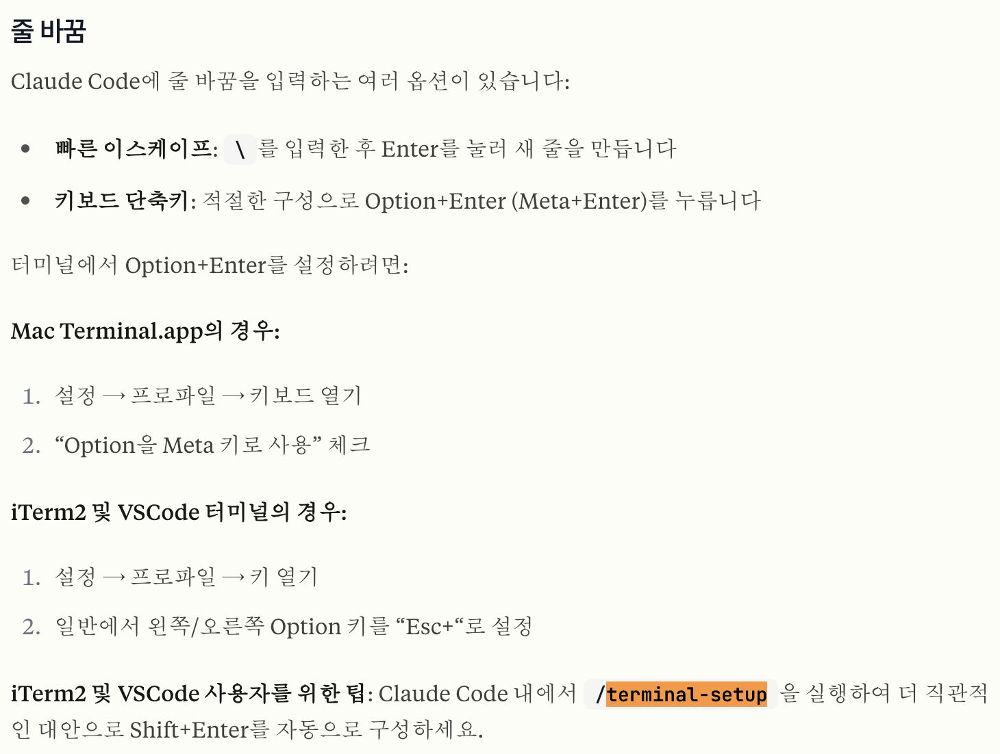

# Claude Code


## 설치


1. **Node.js 및 npm** 설치
2. 클로드 코드 설치

```bash
npm install -g @anthropic-ai/claude-code
```

3. 인증

```bash
cd {project path}
claude
```


## 세팅


CLAUDE.md 파일은 Claude Code가 프로젝트를 이해하는 데 사용하는 "메모리" 역할을 한다

프로젝트 루트에 CLAUDE.md가 있으면 매번 컨텍스트를 설명할 필요가 없다. 팀원들과 공유해서 모든 사람이 같은 컨텍스트로 Claude Code를 사용할 수 있다


### 줄 바꿈




## 사용


###  Git 작업

Git 작업 흐름 관리는 시간이 많이 소요될 수 있지만, 클로드 코드는 커밋 만들기, 병합 충돌 해결 및 풀 리퀘스트(프리퀀스) 생성과 같은 **Git 작업을 자동화**할 수 있습니다.

```bash
commit
```


### 자연어 명령

**자연어 명령**을 사용하여 작업을 수행

```bash
> explain what the function in file.js does
```


