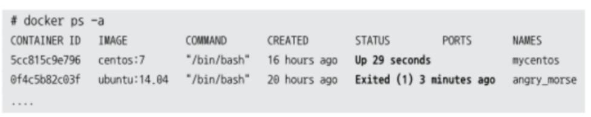
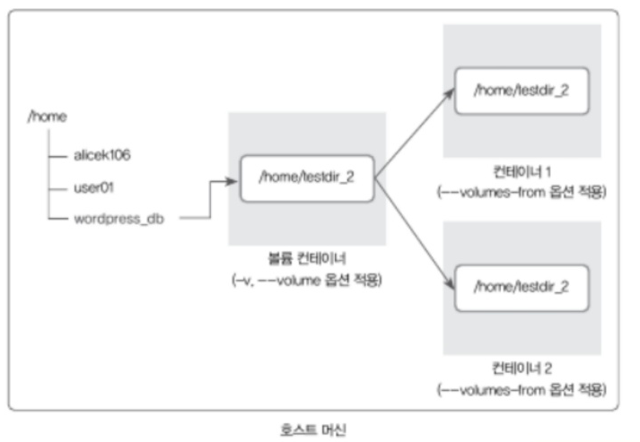
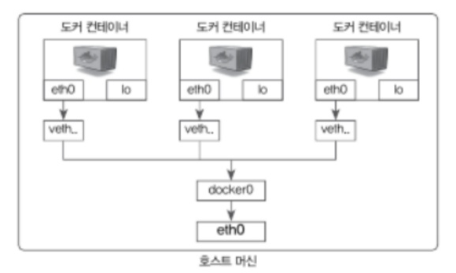

# 시작하세요! 도커/쿠버네티스


# 1부 도커

## 01 도커란?


### 도커 개요

- 정의
  - 도커는 애플리케이션을 컨테이너로서 좀 더 쉽게 사용할 수 있게 만들어진 오픈소스 프로젝트
- 주목 이유
  - 가상화 방법인 가상 머신과 달리 성능의 손실이 거의 없음
  - 차세대 클라우드 인프라 솔루션으로 적합
- 도커 엔진
  - 일반적으로 도커 = 도커 엔진
    - 도커 엔진
      - 컨테이너를 생성하고 관리하는 주체
      - 자체로도 컨테이너를 제어 O & 다양한 기능을 제공하는 도커의 주 프로젝트
    - 기타 도커 프로젝트들은 도커 엔진을 좀 더 효율적으로 사용하기 위한 것에 불과


### 1.1 가상 머신과 도커 컨테이너

- 기존 가상화 기술

  - 방식
    - 하이퍼바이저를 이용해 여러 개의 운영체제를 하나의 호스트에서 생성
    - 여러 개의 운영체제는 가상 머신이라는 단위로 구별됨 (가상 머신에 우분투, CentOS 등 운영체제 설치)
    - 각 게스트 운영체제는 완전히 독립된 공간과 시스템 자원을 할당받아 사용
      - 게스트 운영체제 : 하이퍼바이저에 의해 생성되고 관리되는 운영체제

  - 장점
    - 완벽한 운영체제를 생성할 수 있음
  - 단점
    - 하이퍼바이저를 반드시 거치기 때문에 일반 호스트에 비해 성능의 손실이 발생
    - 가상 머신은 게스트 운영체제를 사용하기 위한 라이브러리, 커널 등 전부 포함 => 배포 이미지의 용량 大
- 도커 컨테이너
  - 방식
    - 리눅스의 자체 기능인 chroot, 네임스페이스, cgroup 사용 =>  프로세스 단위의 격리 환경
      - chroot : 현재 실행중인 프로세스와 자녀 프로세스의 루트 디렉토리를 변경하는 작업
      - 네임스페이스 : 리눅스 커널에서 제공하는 **프로세스 구별(격리)** 기술
      - cgroup : 프로세스 그룹이 사용하는 시스템의 자원 제한, 관리, 격리시키는 리눅스 커널 기능
    - 호스트의 커널을 공유해 사용하고, 컨테이너 안에는 애플리케이션을 구동하는 데 필요한 라이브러리 및 실행 파일만 존재
  - 장점
    - 성능 손실이 거의 없음
    - 이미지의 용량 또한 가상 머신에 비해 대폭 줄어들음


:bulb: 커널

- 커널은 운영 체제의 핵심 부분으로 하드웨어와 소프트웨어 간의 인터페이스 역할을 하며, 시스템 자원을 관리하여 프로세스 실행과 장치 제어를 조율한다. 
- 주요 기능 : **메모리 관리**, **프로세스 관리**, **장치 드라이버**, **시스템 호출 및 보안**


### 1.2 도커를 시작해야 하는 이유

- 애플리케이션의 개발과 배포의 편의성

  - 독립된 개발 환경을 보장
    - 컨테이너와 호스트 OS는 상호 독립적
      - 도커 컨테이너는 호스트 OS 위에서 실행되는 격리된 공간
        - 호스트 OS : 서버를 부팅할 때 실행되는 운영체제
      - 컨테이너 자체에 특별한 권한을 주지 않는 한, 호스트 OS에 영향 X

  - 배포 환경에서의 의존성을 걱정할 필요 없음
    - 컨테이너를 '도커 이미지'라고 하는 일종의 패키지로 만들어 운영 서버에 전달
    - 각종 라이브러리 설치 등 운영 서버에서 새롭게 패키지를 설치할 필요도 없음

  - 작은 이미지 크기

    - 커널을 포함하고 있지 않기 때문에 이미지 크기가 그다지 크지 않음

  - 이미지 재사용 가능

    - 이미지 내용을 레이어 단위로 구성하고 중복되는 레이어를 재사용할 수 있음

    - 배포 속도가 매우 빨라져

- 여러 애플리케이션의 독립성과 확장성이 높아짐
  - 마이크로서비스 구조는 여러 모듈을 독립된 형태로 구성 => 언어에 종속되지 않고 변화에 빠르게 대응 O
  - 여러 모듈에게 독립된 환경을 동시에 제공 
    - 각 모듈의 관리가 쉬워짐
    - 마이크로서비스 구조에서 가장 많이 사용


:bulb: Docker Desktop

- 윈도우와 맥 OS X에서 설치하는 도커

- 단, 도커에서 제공하는 네트워크, 볼륨 기능 등이 일부 지원되지 않을 수 있으며,예상치 못한 버그를 마주칠 가능성이 높음

=> 완전한 리눅스 환경에서 도커를 사용하는 것을 권장


## 02. 도커 엔진


### 2.1 도커 이미지와 컨테이너

- 도커 이미지

  - 개요

    - 이미지는 여러 개의 계층으로 된 바이너리 파일로 존재

    - 컨테이너를 생성하고 실행할 때 읽기 전용으로 사용

  - 형식

    - 이미지 이름 : `[저장소 이름]/[이미지 이름]:[태그]`

      - 저장소 : 저장된 장소. 생략 시, 기본적으로 도커 허브 뜻함

      - 이미지 이름 : 해당 이미지가 어떤 역할을 하는지 나타냄

      - 태그 : 리비전 관리


- 도커 컨테이너

  - 특징

    - 컨테이너는 이미지를 읽기 전용으로 사용하되, 변경되 사항만 컨테이너 계층에 저장

    - 컨테이너에서 무엇을 하든지 원래 이미지는 영향 받지 않음

    - 각기 독립된 파일시스템을 제공받으며 호스트와 분리

    - 특정 컨테이너에서 어떤 애플리케이션을 설치하거나 삭제해도 다른 컨테이너와 호스트는 변화 없음


### 2.2 도커 컨테이너 다루기

- 도커 버전 확인
  - `docker -v`


#### 컨테이너 생성 : `docker run -i -t {이미지}`

- 개요

  - 컨테이너를 생성하고 실행
  - 이미지가 도커 엔진에 존재하지 않을 경우, 도커 허브에서 자동으로 이미지 내려 받음
    - 도커 허브 : 도커 중앙 이미지 저장소
  - `= docker pull + create + start + attach`

- 옵션

  - `-i` or `--interactive` : 컨테이너와 상호작용할 수 있도록 표준 입출력 활성화

  - `-t` or `--tty` : 컨테이너와 터미널을 연결

  - `-p` 

    - 호소트의 포트와 컨테이너의 포트 바인딩
    - 입력 형식 : `[호스트 포트]:{컨테이너 포트}`
      - 특정 IP 사용 시 포트와 함께 IP도 같이 입력
    - 여러 개의 포트를 외부에 개방하려면 -p 옵션 여러 번 사용

  - `-d`

    - Detached 모드로 실행하여, 백그라운드에서 실행
    - 프로그램이 터미널을 차지하는 포그라운드(foreground)로 실행
      - 입출력이 없는 상태
    - 포그라운드 프로그램이 실행되지 않으면 컨테이너 종료

    :bulb: `-i -t -d`옵션을 같이 사용하면, 내부에서 셀을 실행하지만 내부로 들어가지 않으며 컨테이너도 종료되지 않음 

  - `-e`

    - 컨테이너 내부의 환경변수를 설정
    - ex) `docker run -e MYSQL_ROOT_PASSWORD={패스워드} {이미지}`

  - `-v`

    - 볼륨 설정

- 연관 명령어

  - 컨테이너 나오기

    - `exit` 입력 or `Ctrl + D`

      - 컨테이너 정지 후 나오기

    - `Ctrl + P,Q`

      - 정지 X, 컨테이너 셀만 나옴

      :bulb: docker run -it  로 실행하지 않았다면 ctrl + p + q 로 빠져나오는거 안됨

  - `docker pull {이미지}`

    - 이미지를 내려받음
    - 태그 미지정 시, latest

  - `docker images`

    - 도커 엔진에 존재하는 이미지의 목록 출력

  - `docker create -i -t --name {이름} {이미지}`

    - 컨테이너 생성
    - 옵션
      - `-i` : 컨테이너와 상호작용할 수 있도록 표준 입출력 활성화
      - `-t` : 컨테이너와 터미널을 연결
      - `--name {이름}` : 컨테이너 이름 설정
    - 이미지가 도커 엔진에 존재하지 않을 경우, 도커 허브에서 자동으로 이미지 내려 받음

  - `docker inspect {컨테이너}`

    - 컨테이너 상세 정보 확인
    - `{컨테이너}` : 컨테이너 id or 컨테이너 이름

  - `docker start {컨테이너}`

    - 컨테이너 시작

  - `docker attach {컨테이너}`

    - 컨테이너 내부로 들어감

​		:bulb: 컨테이너 지정 시, 컨테이너의 이름 혹은 ID를 사용할 수 있음. ID는 유일하게 구분할 수 있다면, 앞의 2 ~3자만 입력 O

#### 컨테이너 확인 : `docker ps`

- 개요

  - 정지되지 않은 컨테이너 목록 확인
  - 옵션
    - `-a` : 정지된 컨테이너 포함 모든 컨테이너 출력
    - `-q` : 컨테이너의 ID만 출력 

- 예시

  

  - CONTARING ID : 컨테이너 고유 ID


  - IMAGE : 이미지 이름


  - COMMAND : 컨테이너가 시작될 때 실행될 명령어 

    ​			(내장된 커맨드는 docker run / create 시 명령어 끝에 입력해서 덮어쓰기 가능)


  - CREATED : 생성된 시간
    - STATUS : 컨테이너 상태.

      - Up : 실행중
      - Exited : 종료
      - Pause : 일시 중지


  - PORTS : 컨테이너가 개방한 포트와 호스트에 연결한 포트 나열


  - NAMES : 컨테이너 고유 이름. (이름 미 지정시, 무작위 설정)
    - `docker rename {컨테이너} {새이름}`으로 재설정 가능

#### 컨테이너 삭제 : `docker rm {컨테이너}`

- 실행 중인 컨테이너는 삭제 X : 정지 or 강제 삭제 필요
- 옵션
  - `-f` : 강제 삭제
  - `prune` : 모든 컨테이너 삭제
- 조합
  - `docker rm -f $(docker ps -a -q)` : 모든 컨테이너 강제 삭제

#### 컨테이너 외부 노출

- 가상 IP 주소 할당 방식

  - 172.17.0.x의 IP를 순차적으로 할당

- 컨테이너 내부에서 네트워크 인터페이스 확인

  - 컨테이너 내부에서 `ifconfig` 실행 결과
    - eth0 인터페이스
      - Ethernet or 무선 LAN 인터페이스로, 외부 네트워크와 통신하기 위해 사용
    - lo 인터페이스
      - Loopback 인터페이스로 시스템 내부에서만 통시하는 데 사용
      - 주로 네트워크 소프트웨어를 테스트하거나, 로컬 호스트 간의 통신을 위해 사용

- 노출 방식

  1. IP:PORT를 직접 명시하여 연결
     - ex) `docker run -i -t --name {이름}  -p 80:80 {이미지}`
       - eth() IP와 포트를 호스트 IP와 포트에 바인딩
  2. 도커 브리지 네트워트 이용
     - `--link` 옵션은 deprecated

- 컨테이너 조작

  - `docker exec -i -t {컨테이너} {명령어}`

    - 컨테이너 내부에서 명령어를 실행한 뒤 그 결과값을 반환 받을 수 있음

    - 옵션

      - `-i -t` : 상호 입출력

    - ex) `docker exec -i -t wordpressdb /bin/bash` : wordpressdb 컨테이너에 들어가서 bash 실행 후 입출력 지속

      :bulb: 이 경우에는 `exit`을 사용하여도, bash만 종료되고, 포그라운드로 실행되는 컨테이너는 종료되지 않음

#### 도커 볼륨

- 개요

  - 이미지는 읽기 전용이며, 컨테이너 운용하면서 변경된 정보는 컨테이너에 별도로 저장

    - 이미 생성된 이미지는 어떠한 경우로도 변경되지 않음
    - 컨테이너 계층에 원래 이미지에서 변경된 파일시스템 등을 저장

  - 컨테이너 삭제하면 컨테이너 계층에 저장돼 있던 정보도 삭제

    => 데이터를 영속적 데이터로 활용할 수 있는 방법 중 대표 : 볼륨

- 볼륨 활용 방법

  1. 호스트와 볼륨을 공유

     - `docker run -v [호스트의 공유  디렉토리]:[컨테이너의 공유 디렉토리] {이미지}`
       - 호스트 공유 디렉터리는 생성되어 있지 않다면, 도커가 자동으로 생성
       - 컨테이너의 디렉토리는 호스트의 디렉토리로 덮어씌워짐 (호스트 디렉토리를 컨테이너에 마운트)
       - 동시에 여러 개의 `-v` 옵션 O

  2. 볼륨 컨테이너 활용

     - `docker run -v --volumes-from {컨테이너} {이미지}`
       - `-v` or `--volumne` 옵션을 적용한 컨테이너의 볼륨 디렉터리를 공유

     

     [그림 2.13] 볼륨 컨테이너 구조

  3. 도커가 관리하는 볼륨 생성

     - 볼륨 명령어

       - 볼륨 생성

         - `docker volume create --name {볼륨이름}`
           - 플러그인 => 여러 종류의 스토리지 백엔드 사용 O
           - 기본적으론 local

       - 볼륨 목록 확인

         - `docker volume ls`

       - 상세 정보 확인

         - `docker inspect --type {타입} {대상}`

           - `--type` : image, volume 등 입력 O

           :bulb: 모든 도커 명령어는 docker 접두어 다음에 container, image, volume 등 명시로 특정 구성 단위 제어 O

         - 볼륨이 실제로 어디에 저장되는지 확인 O

     - 볼륨 연결

       - `docker run -v {볼륨}:[컨테이너의 공유 디렉토리] {이미지}`

     - local 드라이버로 사용할 경우, 호스트 연결과 마찬가지로 호스트에 데이터가 저장되지만, 파일이 실제로 어디에 저장 되는지는 알 필요 X

       - `docker run -v [컨테이너의 공유 디렉토리] {이미지}`

         - 해당 디렉터리에 대한 볼륨 자동으로 생성 => `docker container inspect {컨테이너}`로 연결된 볼륨 확인 O

     - 볼륨 삭제

       - `docker volumne prune`
         - 사용되지 않는 볼륨을 한꺼번에 삭제 (컨테이너 삭제해도 연결 볼륨은 자동 삭제 X)

- stateless vs stateful

  - stateless
    - 컨테이너 자체는 상태가 없고, 상태를 결정하는 데이터는 외부로부터 제공받음
    - 권장


  - stateful
    - 컨테이너가 데이터를 저장하고 있어 상태가 있는 경우
    - 지양

- mount 옵션

  - `-v`와 `--mount` 옵션은 서로 기능은 같지만, 볼륨의 정보를 나타내는 방법이 다름
  - `docker run --mount type=volume, source=myvolumne, target=[컨테이너의 공유 디렉토리] {이미지}`
  - `docker run --mount type=bind, source=[호스트 공유 디렉토리], target=[컨테이너의 공유 디렉토리] {이미지}`

#### 도커 네트워크

- 도커 네트워크 구조

  - 네트워크 할당

    - 내부 IP를 순차적으로 할당하며, 재시작할 때마다 변경될 수 있음
  - veth

    - 컨테이너마다 호스트에 `veth`라는 네트워크 인터페이스를 도커 엔진이 자동으로 생성
    - v는 virtual로, 가상 네트워크 인터페이스를 의미

    - veth는 각 컨테이너의 eth0와 연결
  - docker0 브리지
    - veth 인터페이스와 바인딩돼 호스트의 eth0 인터페이스와 이어주는 역할

  => 컨테이너의 eth0 인터페이스는 호스트의 veth와 연결되며,  veth인터페이스는 docker() 브리지와 바인딩돼 외부와 통신



<center>[그림 2.15] 도커 네트워크의 구조</center>

- 도커 네트워크 기능

  - 네트워크 드라이버

    - 여러 네트워크 드라이버 사용 O
      - 도커 자체 제공
        - 브리지, 호스트 (host), 논 (none), 컨테이너, 오버레이
      - 서드파티 플러그인
        - weave, flannel, openvswitch
    - 네트워크 목록 확인
      - `docker network ls`
    - 네트워크 상세 정보
      - `docker network inspect {네트워크}` or `docker inspect --type network {네트워크}`

  - 주요 네트워크

    - 브리지 네트워크

      - 개요

        - docker0이 아닌 사용자 정의 브리지를 새로 생성해 각 컨테이너에 연결하는 네트워크 구조

      - 생성

        - `docker network create --driver bridge {브리지이름}`
          - 새로운 브리지 타입의 네트워크 생성

      - 사용

        - 생성 시 연결

          - `docker run --net {브리지이름} {이미지}`
            - `--net` : 네트워크 사용 설정

        - 컨테이너 연결

          - `docker network connect {브리지이름} {컨테이너}`

        - 컨테이너 연결 해제

          - `docker network disconnect {브리지이름} {컨테이너}`

        - :heavy_check_mark: connect/disconnect는 브리와 오버레이처럼 특정 IP 대역을 가지는 모드에서만 사용 가능 (논, 호스트에서 사용 X)

        - 서브넷, 게이트웨이, IP 할당 범위 설정

          ```bash
          docker network create --driver=bridge \
          	--subnet=172.72.0.0/16		\
          	--ip-range=172.72.0.0/24	\
          	--gateway=172.72.0.1 		\
          {브리지이름}
          ```

          - `--subnet` : Docker 네트워크의 IP 주소 범위를 지정

          - `--ip-range` : 네트워크에서 컨테이너에 할당할 수 있는 IP 주소 범위를 제한

            => `--ip-range`는 `--subnet` 범주 안의 대역이어야 함

    - 호스트 네트워크

      - 개요
        - 호스트의 네트워크 환경을 그대로 사용
          - 컨테이너 내부의 애플리케이션을 별도의 포트 포워딩 없이 바로 서비스 O
          - 실제 호스트에서 애플리케이션을 외부로 노출하는 것과 같음
        - 별도로 생성할 필요 없이, 기존의 host라는 이름의 네트워크 사용
      - 사용
        - `docker run --net host {이미지}`

    - 논 네트워크

      - 개요
        - none은 아무런 네트워크를 쓰지 않는 것을 의미
        - 외부와 연결이 단절
      - 사용
        - `docker run --net none {이미지}`

    - 컨테이너 네트워크

      - 개요
        - 다른 컨테이너의 네트워크 네임스페이스 환경을 공유
          - 공유되는 속성은 내부 IP, 네트워크 인터페이스의 맥(MAC) 주소 등
        - 내부 IP를 새로 할당받지 않으며, 호스트에 veth로 시작하는 가상 네트워크 인터페이스도 생성 X
      - 사용
        - `docker run --net container:{컨테이너} {이미지}`

      [그림 2.16] 컨테이너 네트워크의 구조

  - 브리지 네트워크와 `--net-alias`

    - 개요

      - 브리지 네트워크와 run 명령어의 `--net-alias` 옵션을 함께 쓰면, 특정 호스트 이름으로 컨테이너 여러 개에 접근 o
      - 해당 브리지 네트워크를 사용하는 컨네이너들 중 alias를 공유하는 컨테이너들만 별도로 접근 O

    - 사용

      - `docker run --net {브리지} --net-alias {별칭} {이미지}`

    - 예시

      ```bash
      docker run -i -t -d --name container1 -- net mybridge --net-alias alias1 ubuntu:14.04
      docker run -i -t -d --name container2 -- net mybridge --net-alias alias1 ubuntu:14.04
      docker run -i -t -d --name container3 -- net mybridge --net-alias alias1 ubuntu:14.04
      
      ping -c 1 alias1
      ping -c 1 alias1
      ping -c 1 alias1
      ```

      - 3개의 컨테이너 IP만 각각 다른 IP를 가짐

      - alias1 별칭으로 ping을 보냈을 때, 각각의 컨테이터에 ping이 전송됨

        - ping을 보낼 때마다 IP가 달라지는데, 이는 라운드 로빈 방식으로 결정

          :memo: 라운드 로빈 : 하나의 중앙처리장치를 여러 프로세스들이 우선순위 없이 돌아가며 할당받아 실행되는 방식

      - 도커 엔진에 내장된 DNS가 해당 별칭 값으로 --net-alias 옵션을 설정한 컨테이너로 변환(resolve)

        - 컨테이너의 IP가 변경돼도 별칭으로 컨테이너를 찾을 수 있게 DNS에 의해 자동으로 관리됨
        - `--link`도 같은 원리

      [그림 2.17] 브리지 네트워크의 --net-alias와 도커 DNS의 작동 구조

  - MacVLAN 네트워크

    - 개요

      - 호스트의 네트워크 인터페이스 카드를 가상화해 물리 네트워크 환경을 컨테이너에게 동일하게 제공
      - 컨테이너는 물리 네트워크 상에서 가상의 맥(MAC) 주소를 가지며, 네트워크에 연결된 다른 장치와의 통신이 가능해짐
        - 기본적으로 할당 받는 172.17.X.X가 아닌 네트워크 장비의 IP를 할당 받음
      - MacVLAN을 사용하려면 적어도 1개의 네트워크 장비와 서버가 필요함

      :bulb: MacVLAN 네트워크를 사용하는 컨테이너는 기본적으로 호스트와 통신이 불가능함 (그림에서 컨테이너 A는 서버2와는 가능하지만 서버1 과는 X)

      - [그림 2.18] MacVLAN 네트워크

    - 사용

      ```bash
      docker network create -d macvland \
      	--subnet=192.168.0.0/24		\
      	--ip-range=192.168.0.64/28	\
      	--gateway=192.168.0.1 		\
      	-o macvlan_mode=bridge		\
      	-o parent=eth0 {macvlan 이름}
      ```

      - `-o` : 추가 옵션 설정
        - `-o macvlan_mode=bridge -o parent=eth0` => MacVLAN으로 생성될 컨테이너 네트워크 인터페이스의 부모 인터페이스를 eht0으로 지정

**:bulb: 서브넷, 게이트웨이, IP** 

https://rangerang.tistory.com/49

- IP(Internet Protocol)

  - 개념
    - IP는 인터넷에 연결된 컴퓨터의 고유주소
    - 네트워크 IP 주소 체계는 IPv4
      - 255.255.255.255 와 같은 식으로 각 자리마다 0~255의 숫자 네개
  - 종류
    - 공인 ip
      - 공인기관에서 인증한 공개형 ip주소로 **전세계에서 유일한 주소**
    - 사설 ip
      - 공유기는 하나의 공인 ip를 할당받고 연결된 기기는 공유기로부터 ip주소(사설 ip)를 할당받아 인터넷 망에 접속
        - ip부족으로, 핸드폰, 노트북, 컴퓨터 등 인터넷을 사용할때마다 공인 ip를 부여할 수 없음
      - 공인되지 않은 ip주소이고 폐쇄형으로 외부에 공개되지 않음
      - 자신의 **네트워크 망 안에서만 유일한 주소**
      - CMD 창에 IPCONFIG 또는 IFCONFIG를 치면 IPv4에 나오는 주소

- 게이트웨이

  - 라우터가 가지는 사설 ip
    - 라우터는 네트워크와 네트워크를 연결해주는 장비
    - 라우터에는 공인 ip와 사설 ip 둘다 가질 수 있다. 이때 라우터가 가지는 사설 ip가 바로 게이트웨이
  - 라우터에 연결되어있는 컴퓨터들은 라우터의 게이트웨이 주소를 통해 데이터를 보낸다
    - 라우트에 연결된 기기는 라우트(공유기)의 게이트웨이 주소로 데이터를 보내고, 라우터는 데이터를 받아서 목적지 서버로 전송

- 서브넷 마스크

  - IP주소(192.168.0.1)는 네트워크 식별자, 호스트 식별자로 이루어져 있다

    -  ip에서 네트워크 식별자가 같다면 같은 네트워크 안에 있다는 뜻이고, 호스트 식별자는 같은 네트워크안에서 각각의 컴퓨터를 구분하는 주소
    -  서브넷 마스크는 어디까지가 네트워크 식별자고, 어디까지가 호스트 식별자인지 알려준다.
       - 255.255.255.0는 255로 이루어진 앞의 3칸은 네트워크 식별자이고, 0으로 이루어진 마지막 칸은 호스트 식별자로 쓰겠다는 뜻

    

  - CIDR 표기법

    - 개요
      - IP 주소와 그와 관련된 라우팅 정보를 표현
      - IP 주소 뒤에 `/숫자`를 붙여서 표현하며, 숫자는 네트워크 주소 부분의 비트 수를 나타냄
    - 예시
      - `172.72.0.0/16` 
        - 앞에서부터 16비트 만큼이 네트워크 주소를 의미함
        - 앞의 2개가 네트워크 식별자이며, 뒤의 2개가 호스트 식별자가 됨
        - 따라서, 172.72.0.0 ~ 172.72.255.255까지의  IP 주소 범위를 가진 네트워크를 나타냄


#### 컨테이너 로깅

- json-file 로그

  - docker 로깅 개요

    - 컨테이너의 표준 출력(StdOut)과 에러(StdErr) 로그를 별도의 메타데이터 파일로 저장
    - 확인하는 명령어 제공

  - json-file 로깅 개요

    - default 로깅 드라이버
    - `--log-driver` 옵션으로 별도 드라이버 지정 O

  - 로그 확인

    - 명령어: `docker logs {컨테이너}`

      - 옵션
        - `--tail {줄 수}` : 마지막 로그 줄부터 출력할 줄의 수 설정
        - `--since {유닉스 시간}` : 특정 시간 이후의 로그 확인
        - `-t` : 타임스탬프 표시
        - `-f` : 로그를 스트림으로 확인
        - `--log-opt`
          - `--log-opt max-size={파일 크기 숫자}k` : 로그 파일의 최대 크기 지정
          - `--log-opt max-file={파일 개수}` : 로그 파일 최대 개수 시정

    - 정제되지 않은 JSON 확인

      - 컨테이너 로그는 JSON 형태로 도커 내부에 저장

      - `cat /var/lib/docker/containers/{container id}/{container id}-json.log`

- syslog

  - 개요
    - 유닉스 계열 운영체제에서 로그를 수집하는 표준 중 하나
    - 유닉스 계열 운영 체제에서는 syslog를 사용하는 인터페이스 동일 => 체겨적 수집 및 분석 O
  - docker run 옵션으로 `--log-driver=syslog` 지정
    - 로그를 syslog로 보내 저장하도록 설정
    - 우분투의 경우 `/var/log/syslog` 에 저장
  - rsyslog
    - 로그 정보를 원격 서버로 이동
    - 중앙 컨테이너에서 여러 컨테이너의 로그를 통합하여 저장, 관리 O 
    - p.65 참고

- fluentd 로깅

  - 개요

    - 각종 로그를 수집하고 저장할 수 있는 기능을 제공하는 오픈소스 도구
    - 데이터 포맷으로 JSON 사용하여 쉽게 사용 O
    - 수집 데이터를 다양한 저장소에 저장 O

  - 예제 : mongoDB에 로그 저장

    1. `fluent.conf` 파일 저장

       ```
       <source>
       	@type forward
       </source>
       
       <match docker.**>
       	@type mongo
       	database nginx
       	collection access
       	host 192.168.0.102
       	port 27017
       	flush_intervals 10s
       	user {user id}
       	password {password}
       </match>
       ```

       - `<match docker.**>` : 로그의 태그가 docker로 시작하면 MongoDB로 전달
       - `database`, `collection` : mongodb 내 DB, table 이름
       - `host`, `port` : mongodb 서버 ip
       - `flush_intervals` : 로그 전달 주기

    2. fluentd 컨테이터 실행

       ```bash
       docker run -d -name fluentd -p 24224:24224 \
       -v {pwd}/fluentd.conf:/fluentd/etc/fluent.conf \
       -e FLUENTD_CONF=fluent.conf \
       alicek106/fluentd:mongo
       ```

       - `alicek106/fluentd:mongo` : 공시 fluentd 이미지에 몽고DB 플러그인 설치된 버전

    3. 로그 생성 컨테이터 실행

       ```bash
       docker run -p 80:80 -d \
       --log-driver=fluentd \
       --log-opt fluentd-address={fluentd server ip}
       --log-opt tag={tag} \
       {이미지}
       ```

       - tag 예시 : `docker.nginx.webserver`

- 아마존 클라우드워치 로그

  - AWS에서 로그 및 이벤트 등을 수집하고 저장해 시각적으로 보여주는 도구
  - 도커를 AWS EC2에서 사용할 경우 유용
  - p.71 참고

#### 컨테이너 자원 할당 제한

- 개요

  - 컨테이너의 자원 할당량을 조정
  - 자원을 제한하여 호트스와 다른 컨테이너의 동작을 방해하지 않게 설정

- 제한 확인

  - `docker inspect {컨테이너}`

- 기존 컨테이너의 자원 제한 변경

  - `docker update {변경할 자원 제한} {컨테이너}`

- docker run 옵션

  - memory 제한

    - `--memory={제한단위}`

      - 단위 : m(megabyte), g(gigabyte)
      - 제한 최소 메모리 : 4m
      - 할당된 메모리를 초과하면 컨테이너는 자동으로 종료

    - `--memory-swap={제한단위}`

      :bulb: swap memory : 컨테이너의 물리적인 메모리(RAM)가 제한까지 다 사용될 경우 사용되는 가상 메모리로, disk space를 사용하여 느림

      - 기본적으로 swap 메모리는 메모리의 2배로 설정

  - CPU 제한

    - `--cpu-shares {비중}`
      - CPU를 상대적으로 얼마나 사용할지를 나태는 가중치 결정
      - default 값은 1024로, CPU 할당에서 1의 비중을 의미
      - 설정된 **비중의 비율에 따라** 컨테이너가 CPU를 사용
      - ex) 두 컨테이너가 cpu-shares를 각각 1024, 512로 설정했다면, CPU를 2:1의 비율로 사용
    - `--cpuset-cpu={cpu 인덱스}`
      - 호스트에 CPU가 여러 개 있을 때, 특정 CPU만 사용하도록 설정
      - 인덱스는 0부터 시작
      - `"0,3"` or `"0-3"` 처럼 다중 지정 O
      - 병렬 처리를 위한 CPU를 많이 소모하는 워크로드 수행 시 권장
      - 특정 CPU에서만 동작하는 CPU 친화성 보장
      - CPU 캐시 미스 or 컨텍스트 스위칭과 같이 성능 하락 요인 최소화
    - `--cpu-period={ms 시간}` , `--cpu-quota={ms 시간}`
      - cpu-period에 설정된 시간 중 cpu-quota 만큼 CPU 스케줄리에 할당
      - ex) `--cpu-period=100000 `& `--cpu-quota=25000` => CPU 주기가 1/4로 줄어들어 CPU 성능이 1/4로 감소
    - `--cpus={cpu 점유 비중}`
      - 직관적으로 CPU의 개수 지정
      - ex) `--cpus=0.5` : CPU 점유 비중(성능) 1/2로 감소

  - Block I/O 제한

    - 컨테이터 내부에서 파일을 읽고 쓰는 대역폭 제한
    - `--device-write-bps` , `--device-read-bps`, `--device-write-iops`, `--device-read-iops` 
    - Direct I/O에만 제한되며, Buffered I/O는 제한 X


### 도커 이미지

- docker hub
  - 주로 도커 허브(Docker Hub)라는 중앙 이미지 저장소에서 이미지를 내려 받음
  - `docker search {이미지}` : 명령어로 docker hub 검색
    - 도커 허브 이미지임을 명시하기 위해 `docker.io` 접두어를 사용 할 수 있음
    - 미명시할 시, 도커 허브 이미지임을 의미
- 이미지 생성
  - `docker commit [OPTIONS] {컨테이너} [REPOSITORY[:TAG]]`
  - 태그 미 입력 시, latest 설정
  - 옵션
    - `-a "{작성자}"` : author로 이미지의 작성자를 나타내는 메타데이터를 이미지에 포함
    - `-m {메시지}` : 커밋 메시지
- 이미지 구조
  - Layer 구조
    - 이미지를 커밋할 때 컨테이너에서 변경된 사항만 새로운 레이어로 저장
    - 그 레이어를 포함해 새로운 이미지를 생성하는 구조
  - 확인
    - `docker inspect {이미지} ` => Layers 항목 확인
      - 검색 대상의 이름이 중복될 경우, container를 우선적으로 지정. `-type` 옵션 지정 필요
    - `docker history {container}` 
      - 어떤 레이어로 생성됐는지 출력
- 이미지 삭제 
  - `docker rmi {image}`
    - 이미지를 사용 중인 컨테이너 존재 시 삭제 X
  - 댕글링 이미지
    - `-f` 옵션으로 강제로 삭제할 경우, image 이름이 `<none>`으로 변경 
    - 조회 : `docker images -f dangling=true`
    - 전체 삭제 : `docker image prune` 
  - leaf node에 해당되는 이미지만 삭제 가능
    - 이미지를 기반으로 하는 하위 이미지가 존재할 경우, 해당 이미지는 삭제되지 않고 레이어에 부여된 이름만 삭제 (Untagged 결과 반환)
- 이미지 추출
  - `save & load` : 이미지 추출 및 로드
    - `docker save -o {파일이름}.tar {image}`
      - 컨테이너의 모든 메타데이터를 포함해 하나의 파일로 추출
      - 컨테이너 커맨드, 이미지 이름, 태그 등
      - `-o` 옵션 : 추출될 파일명 
    - `docker load -i {파일}.tar`
      - 도커에 다시 로드
  - `export & import`  : 컨테이터 추출 및 로드
    - `docker export -o {파일이름}.tar {컨테이너}` 
      - 컨테이너의 파일 시스템을 tar 파일로 추출. 
      - 설정 정보 저장 X (Environment variables, Port mappings, Volume mounts, Network settings 등등 포함 X)
    - `docker import {파일이름}.tar {image 이름}`
  - 주의! 이미지를 단일 파일로 저장하는 것은 효율적인 방법 X
    - 레이어 구조가 아닌 단일 파일 => 여러 버전의 이미지를 추출 시, 이미지 용량을 각기 차지
- 이미지 배포
  - 도커 허브 이미지 저장소 사용
    - docker push, docker pull 로 간편하게 이용
    - 단, public 환경
    - private에는 제약 및 비용 존재
  - 도커 사설 레지스트리 생성
    - p.104 참고


### Dockerfile

- 개요

  - 빌드 명령어 제공
  - 설치해야 하는 패키지, 추가해야 하는 소스코드, 실행해야 하는 명령어, 셸 스크립트 등을 하나의 파일에 기록
  - 작업을 수행한 뒤 이미지로 만들어 냄
  - 애플리케이션의 빌드 및 배포 자동화

- 예시

  ```dockerfile
  # Start from the official Go image
  FROM golang:1.21-alpine
  
  # Add labels for metadata
  LABEL maintainer="yourname@example.com" \
        version="1.0" \
        description="A simple Go web application"
  
  # Set the working directory inside the container
  WORKDIR /app
  
  # Copy go.mod and go.sum files
  COPY go.mod go.sum ./
  
  # Download dependencies
  RUN go mod download
  
  # Copy the rest of the source code
  COPY . .
  
  # Build the Go app
  RUN go build -o main .
  
  # Expose the port the app runs on
  EXPOSE 8080
  
  # Run the binary
  CMD ["./main"]
  
  ```

- 명령어

  - 개요

    - Dockerfile 내의 각 줄이 하나의 명령어
    - 명령어는 소문자로 표기해도 동작하지만 대문자가 convention

  - 종류

    - `FROM {이미지}`

      - 생성될 이미지의 베이스가 될 이미지
      - 반드시 한 번 이상 입력 필요

    - `LABEL {키}={값}`

      - 이미지에 메타데이터를 추가
      - `docker images --filter "lable={메타데이터}"`로 label 필터링하여 조회 가능

    - `RUN {명령어}` or `RUN ["{실행 가능한 파일}", "명령줄 인자 1", "명령줄 인자 2", ... ]`

      - 컨테이너 내부에서 명령어를 실행

      - 단, Dockerfile을 이미지로 빌드하는 과정에서는 별도의 입력이 불가능

        => 별도의 입력이 있는 경우에는 오류

      :bulb: 일반 형식 vs Json 배열 형식 : 일반 형태의 경우 자동으로 명령어 앞에 `/bin/sh -c`가 추가되어 있음

    - `COPY {파일} {컨테이너 경로}` or `COPY ["{추가할 파일1}", "{추가할 파일2}", ... , "{컨테이너 경로}"]`

      - 컨텍스트에 있는 파일을 지정된 컨테이너의 경로에 복사
      - 로컬 이미지만 추가 가능

    - `ADD {파일} {컨테이너 경로}` or `ADD ["{추가할 파일1}", "{추가할 파일2}", ... , "{컨테이너 경로}"]`

      - 컨텍스트에 있는 파일을 지정된 컨테이너의 경로에 넣음
      - 외부 URL 및 tar 파일 해제시키며 추가 가능
      - 권장 X (직관성 :arrow_down: )

    - `WORKDIR {경로}`

      - = `cd`

    - `EXPOSE {port}`

      - 생성된 이미지에서 노출할 포트 설정
      - 호스트와 바인딩을 의미 X
      - `docker run`시 `-P` 를 통해서 호스트의 사용 가능한 포트들에 자동 바인딩 수행 O (`docker port {컨테이너}`로 확인)

    - `CMD {명령어}` or `CMD ["{실행 가능한 파일}", "명령줄 인자 1", "명령줄 인자 2", ... ]`

      - 컨테이너가 시작될 때 실행할 명령어 설정
      - 한 번만 사용
      - `docker run` 에서 새 커맨드 지정 시 덮어쓰여짐

    - `ENTRYPOINT`

      - 컨테이너가 시작될 때 실행할 명령어 설정
      - 커맨드를 인자로 받아 사용 O => 스크립트 사용에 활용
      - 주의
        - `ENTRYPOINT` 와 `CMD` 둘 다 설정되어 있는 경우 : CMD 명령어가 ENTRYPOINT 인자로 사용됨
        - `ENTRYPOINT` 와 `CMD` 둘 다 없는 경우 : 오류

    - `ENV {변수} {값}`

      - 환경변수 지정
      - 환경변수 존재 여부에 따른 디폴트 값 지정
        - `${{변수명}:-value}` : 변수 설정이 되지 않았다면 해당 변수에 value 사용
        - `${{변수명}:+value}` : 변수 설정이 되어 있다면 해당 변수에 value 사용. 없다면 빈 문자열 사용

    - `VOLUME {내부 디렉토리1} {내부 디렉토리2} ...` or `VOLUME ["{내부 디렉토리1}", "{내부 디렉토리2}", ...]`

      - 호스트와 공유할 컨테이너 내부의 디렉토리 설정

    - `ARG {변수명}[={기본값}]`

      - build 명령어를 실행할 때 추가로 입력을 받아 변수의 값을 설정
        - `docker build` 시, `--build-arg {키}={값}`

    - `USER {사용자}`

      - 컨테이너 내에서 사용될 사용자 계정의 이름/UID 설정
      - 일반적으로 RUN으로 사용자 그룹 및 계정을 생성 후 사용

    - `ONBUILD {명령어}` 

      - 빌드된 이미지를 기반으로 하는 다른 이미지가 Dockerfile로 생성될 때 실행할 명령어
      - 자식 이미지에만 적용되며, 자신 이미지는 `ONBUILD` 속성을 상속 받지 X (이외 속성들은 상속 받음)

    - `STOPSIGNAL {시스템 콜}`

      - 컨테이너가 정지될 때 사용될 시스템 콜의 종류를 지정
        - ex)  `STOPSIGNAL SIGKILL`
      - 기본 값 : `SIGTERM`

    - `HEALTHCHECK {태그} {명령어}`

      - 컨터네이너에서 동작하는 애플리케이션의 상태를 체크
      - ex) `HEALTHCHECK --interval=1m --timeout=3s --retries=3 CMD curl -f http://localhost || exit 1`

    - `SHELL ["{실행 셀 파일}"]`

      - 사용하려는 셀을 따로 지정
      - 리눅스 : `/bin/sh -c` , 윈도우 : `cmd /S /C`가 기본

- 빌드 : `docker build -t {이미지 이름} ./`

  - -`t` : 생성될 이미지의 이름을 설정
  - build 명령어 끝에는 Dockerfile이 저장된 경로 입력

- 빌드 컨텍스트

  - Dockerfile이 위치한 디렉터리
  - 이미지를 생성하는 데 필요한 각종 파일, 소스코드, 메타데이터 등을 담고 있는 디렉터리
    - 하위 디렉터리도 전부 포함 => 이미지 빌드에 필요한 파일만 있는 것이 바람직
  - `.dockerignore` 
    - 빌드 시 이 파일에 명시된 이름의 파일을 컨텍스트에서 제외
    - `*` : 임의의 여러 문자 | `?` : 임의의 1자리 문자 | `!` : 제외하지 않음

- 컨테이너의 생성과 커밋

  - Dockerfile 활용

    - 빌드 시 Step은 각 명령어를 의미
    - Step만큼 레이어가 존재하며, 컨테이너도 같은 수만큼 생성되고 삭제

  - 캐시 이용

    - 이전과 같은 빌드 시, 이미지 빌드에서 사용했던 캐시를 사용
    - build 명령어에 `--no-cache` 옵션 추가 => 캐시 미사용

  - 캐시 (및 불필요 데이터) 삭제

    - `docker system prune`
    
  - 멀티 스테이지

    - 하나의 Dockerfile 안에 여러 개의 FROM 이미지를 정의함으로써 빌드 완료 시 최종적으로 생성될 이미지의 크기를 줄임192.168.219.130

      => 반드시 필요한 실행 파일만 최종 이미지 결과물에 포함시킴

    - ex) COPY 명령어로 첫 번째 FROM에서 사용된 이미지의 최종 상태를 두 번째 이미지에 복사

      ```docker
      # -------- Stage 1: Build --------
      FROM golang:1.21-alpine AS builder
      
      # Copy go.mod and go.sum, then download dependencies
      COPY go.mod go.sum ./
      RUN go mod download
      
      # Build the app (static binary)
      RUN CGO_ENABLED=0 GOOS=linux go build -o main
      
      # -------- Stage 2: Final --------
      FROM alpine:latest
      
      # Copy binary from builder stage
      COPY --from=builder /app/main .
      
      # Expose app port
      EXPOSE 8080
      
      # Run the binary
      CMD ["./main"]
      ```

      - `--from=0` : 첫 번째 FROM에서 빌드된 이미지의 최종 상태 의미
      - `--from={name}` : 이전 FROM에서 해당 {name}으로 지정된 이미지의 최종 상태 의미

- TIP

  - 하나의 명령어가 길어질 경우 `\`를 사용해서 가독성을 높여라
  - 필요한 경우, RUN 명령어들을 `&&` 로 묶어서 불필요한 레이어 생성을 막아라


### 도커 데몬

- 도커 구조

  1. 도커 서버

     - 컨테이너 생성/실행, 이미지 관리 주체
     - dockerd 프로세스로 동작
     - API 입력을 받아 기능 수행

  2. 도커 클라이언트

     - API를 사용할 수 있도록 CLI를 제공

     - `/var/run/docker.sock`에 위치한 유닉스 소켓 활용

- 데몬 실행

  - 시작/정지

    ```bash
    service docker start
    serivce docker stop
    ```

  - 자동 실행 활성화

    ```bash
    systemctl enable docker
    ```

    - ubuntu에서는 설치시 자동으로 등록되어짐

- 데몬 설정 및 제어

  - p.153 참고

- 도커 데몬 모니터링

  - 데몬 디버그 모드 실행

    - `dockers -D`
      - 모든 명령어를 로그로 출력
      - 단점) 너무 많은 정보 출력 및 포그라라운드 실행 필요

  - 명령어 활용

    - `docker events`

      - 도커 데몬에 어떤 일이 일어나고 있는지를 실시간 스트림 로그로 출력
      - 데몬이 수행한 명령어의 결과를 실시간 확인 O
      - `--filter 'type={타입}'`  태그로, container, image, volumen, network, plugin, daemon 중 지정 O

    - `docker stats`

      - 모든 컨테이너의 자원 사용량을 스트림으로 출력
      - `--no-stream` 태그로, 단건 출력 O

    - `system df`

      | TYPE | TOTAL | ACTIVE    | SIZE | RECLAIMABLE           |
      | ---- | ----- | --------- | ---- | --------------------- |
      | 종류 | 개수  | 사용 여부 | 크기 | 삭제 시 확보되는 공간 |

      - `docker {type} prune` 으로 미사용 전체 삭제 가능

  - 모니터링 도구 사용

    - CAdvisor
      - 구글이 만든 모니터링 도구
      - p 184

- Remote API 라이브러리 이용

  - 언어별 오픈소스 라이브러리 사용


### 도커 스웜

- 개요
  - 여러 대의 도커 서버를 클러스터로 만들어 컨테이너 생성
  - 신규 서버 발견, 스케줄러, 로드밸런서, 고가용성 지원 등
  - 자원을 병렬로 확장
- 종류
  - 스웜 클래식 (이전 버전)
    - 여러 대의 도커 서버를 하나의 지점에서 사용하도록 단일 접근점을 제공
  - 스웜 모드
    - MSA 컨테이너를 다루기 위한 클러스터링 기능에 초점
    - 같은 컨테이너를 동시에 여러 개 생성해 필요에 따라 유동적으로 컨테이너의 수 조절
    - 로드밸런싱 기능 등 클러스터링을 위한 도구들이 자체에 내장
- 사용
  - p.200


### 도커 컴포즈

- 개요
  - 여러 개의 컨테이너가 하나의 서비스로 정의해 컨테이너 묶음으로 관리
  - 컨테이너를 순차적으로 생성
  - 각 컨테이너의 의존성, 네트워크, 볼륨 등을 함께 정의
- TIP
  - YAML 파일의 탭 인식 X => space 2칸 사용
  - 컨테이너 이름 구조 : `{프로젝트 이름}_{서비스 이름}_{서비스 내 컨테이너 번호}`

#### YAML 파일 구성

```yaml
version: '3.8'

services:
  web:
    image: nginx:latest
    ports:
      - "80:80"
    volumes:
      - ./nginx.conf:/etc/nginx/nginx.conf
    depends_on:
      - api
    networks:
      - external_net

  api:
    build: ./api
    ports:
      - "8080:8080"
    environment:
      - DB_HOST=db
      - DB_USER=postgres
      - DB_PASSWORD=secret
      - DB_NAME=myapp
    depends_on:
      - db
    command: ./main
    networks:
      - external_net

  db:
    image: postgres:15
    ports:
      - "5432:5432"
    environment:
      - POSTGRES_USER=postgres
      - POSTGRES_PASSWORD=secret
      - POSTGRES_DB=myapp
    volumes:
      - db_data:/var/lib/postgresql/data
    networks:
      - external_net

networks:
  external_net:
    external: true
    name: my_external_network # 이미 생성된 my_external_network 네트워크를 external_net이란 이름으로 가져와 그대로 사용

volumes:
  db_data:
```

-  `version`
   - YAML 파일 포맷 버전
   - :spiral_notepad: **DEPRECATED**! 이제는 자동으로 버전 감지
-  `name`
   - 프로젝트 이름
-  `services`
   - 개요
     - 서비스 정의로, 생성될 컨테이너들을 묶어놓은 단위
       - 컨테이너들은 하나의 프로젝트로서 도커 컴포즈에 의해 관리
     - 하위 항목으로 각 서비스의 이름 정의
       - 각 서비스는 컨테이너로 구현
       - 컨테이너의 옵션은 서비스 이름의 하위 항목에 정의
   - 컨테이너 옵션
     - `image` : 컨테이너 생성에 쓰일 이미지
     - `environment` : 컨테이너 내부 환경변수 지정 (= `--env` or `-e`) 
     - `command` : 컨테이너가 실행될 때 수행할 명령어 
     - `depends_on` : 특정 컨테이너에 대한 의존 관계 명시 => 컨테이너 생성 순서 결정
       - 의존성 없이 생성하기 위해서는 `docker-compose up --no-deps {서비스명}`
       - 실행 순서만 보장할 뿐 내부 상태가 준비되었는지는 확인 X => entrypoint로 별도 확인 script 지정 필요
     - `ports` : 개방 포트 지정.
       - 단일 매핑 (ex. 80:80)할 경우, `docker-compose scale`로 컨테이너 증가 사용 X
     - `build` : 해당 경로에 정의된 Dockerfile에서 이미지를 빌드해 서비스의 컨테이너를 생성하도록 설정
       - `image` 항목을 같이 설정하여 생성된 이미지 이름 지정. (default = `{프로젝트명}:{서비스명}`)
     - `extends` : 다른 YAML 파일 or 현재 YAML 파일의 서비스 속성을 상속 (
       - 컨테이너 사이의 의존성을 내포하는 속성은 상속 X
         - ex) `depends_on`, `links`, `volumes_from`
       - `file` 항목 : YAML 파일 지정 (default = 현재 파일)
       - `service` 항목 : 대상 서비스 속성 지정
-  `networks`
   - 하위 항목으로 각 네트워크의 이름 정의하며, 네트워크 옵션은 네트워크 이름의 하위 항목에 정의
   - 네트워크 옵션
     - `driver`
       - 사용할 네트워크 지정 (default = bridge)
     - `external: true`
       - 프로젝트를 생성할 때마다 네트워크를 생성하지 않고, 기존의 네트워크 사용
       - `driver`, `driver_ops`, `ipam` 옵션과 함께 사용 X
     - `name : {대상 네트워크 이름}` (default = 현재 네트워크 이름 ) 
-  `volumes`
   - `driver` : 볼륨을 생성할 때 사용될 드라이버 설정 (default = local)
   - `external: true`
     - 프로젝트를 생성할 때마다 볼륨을 생성하지 않고, 기존의 볼륨 사용

#### 명령어

- `docker-compose [태그] up [-d]`
  - 프로젝트 생성
  - 태그
    - `-f {yaml 파일 위치}` : yaml 파일 위치 명시. 생략 시 현재 폴더 위치 사용
    - `-p {프로젝트 이름}` : 프로젝트 이름 명시. 생략 시 현재 폴더 이름 사용
      - `-f` 사용 시, `-p` 앞에 명시해야 함
- `docker-compose scale {서비스 이름}[={인덱스}]`
  - ex) `docker-compose scale mysql=2` : mysql 컨테이너 2번 생성
- `docker-compose [-p {프로젝트}] down` 
  - 프로젝트로 생성된 컨테이너 전체 삭제
- `docker-compose config`
  - YAML 파일 검사

