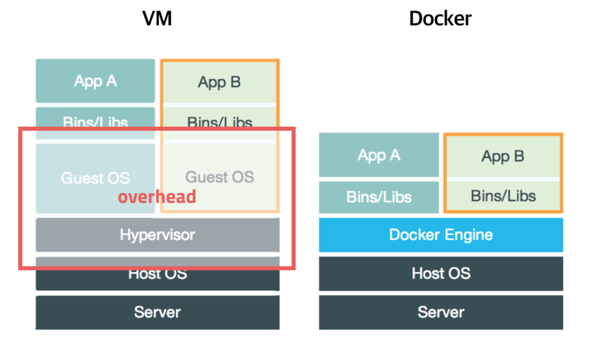

# 도커 개요

## 소개

### 도커란

- 컨테이너 기반 오픈소스 가상화 플랫폼

### 기존 서버 관리 문제

- 계속 바뀌는 개발 환경

### VM vs Docker

### 도커의 특징

- 확장성/이식성
  - 도커가 설치되어 있다면 어디서든 컨테이너 실행 O
  - 오픈 소스 
  - 간단한 서버 생성

- 표준성
  - 컨터이너라는 표준으로 서버를 배포 => 모든 서비스들의 배포 과정이 동일해짐
- 이미지
  - 이미지에서 컨테이너 생성 
  - Dockerfile을 이용하여 이미지를 만들고 처음부터 재현 O
  - 빌드 서버에서 이미지 생성 => 이미지 저장소에 저장 => 운영서버에서 불러 사용
- 설정 관리
  - 설정은 환경변수로 제어
  - MYSQL_PASS = password와 같이 컨터이너 띄울 때 환경변수를 같이 지정
  - 하나의 이미지가 환경변수에 따라 동적으로 설정 파일을 생성하도록 구성
- 자원관리
  - 컨테이너 삭제 후 새로 생성 => 데이터 초기화
  - 별도 저장소 필요
  - 세션/캐시를 memcached나 redis 같은 외부로 분리

### 도커가 가져온 변화

- 클라우드 이미지보다 관리 easy
- vm처럼 격리 O but, 성능 저하 x
- 사용 방법 쉬움
- 이미지 빌드 기록이 남음
- 코드와 설정 관리 => 재현 및 수정 O