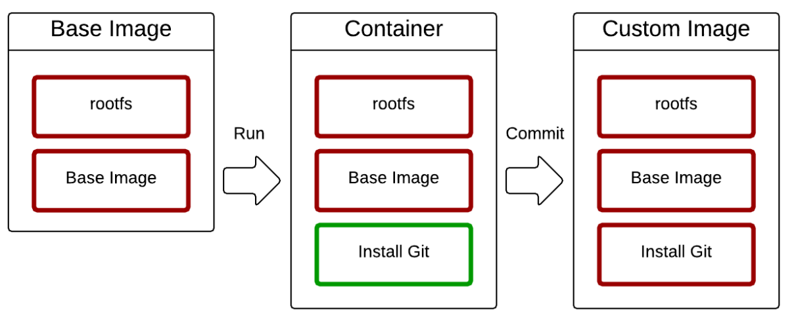

# 도커 이미지


## 개요


### 이미지란

- 도커는 레이어드 파일 시스템 기반
- AUFS, BTRFS, Overlayfs
- 프로세스가 실행되는 파일들의 집합(환경)
- 프로세스는 환경(파일)을 변경할 수 있음
- 이 환경을 저장해서 새로운 이미지 생성


### 상태 변화




## 생성


### 생성 코드

- `docker commit 컨테이너 이미지이름:태그`
  - 예시
    - ` docker commit git ubuntu:git`
- `docker build -t 이름공간/이미지이름:태그 빌드컨텍스트`
  - 예시
    - `docker build -t subicura/ubuntu:git01 .`
  - 방식
    - dockerfile을 생성한 디렉토리에서 위 코드 실행
      - `-f Dockerfile 위치` 를 사용해 다른 위치의 파일 사용 O
    - -t : 도커 이미지 이름 지정
    - 마지막에는 빌드 컨텍스트 위치 지정
      - 현재 디렉토리를 의미해 . 을 주로 사용
      - 다른 디렉토리 지정 O


### Dockerfile

- FROM : 기본 이미지
  - `FROM [--platform=] [:] [AS ]`
- RUN : 쉘 명령어 실행
  - `RUN <command>`
- CMD : 컨테이너 기본 실행 명령어 (Entrypoint의 인자로 사용)
  - `CMD ["executable","param1","param2"]`
- EXPOSE : 오픈되는 포트 정보
- ENV : 환경변수 설정
- ADD : 파일 또는 디렉토리 추가. URL/ZIP 사용가능
- COPY : 파일 또는 디렉토리 추가
  - `COPY [--chown=<user>:<group>] <src>... <dest> `
- ENTRYPOINT : 컨테이너 기본 실행 명령어
- VOLUME : 외부 마운트 포인트 생성
- USER : RUN, CMD, ENTRYPOINT를 실행하는 사용자
- WORKDIR : 작업 디렉토리 설정
  - `WORKDIR /path/to/workdir`
- ARGS : 빌드타임 환경변수 설정
- LABEL : key-value 데이터
- ONBUILD : 다른 빌드의 베이스로 사용될 때 사용하는 명령어


### RUN vs CMD vs ENTRYPOINT

- RUN
  - 도커 이미지를 빌드하는 순간 실행
  - 라이브러리 설치에 활용
- CMD 
  - 이미지로부터 컨테이너 생성 후 최초 실행 시 수행
  - 단, docker run 시 수정 O
- ENTRYPOINT
  - 이미지로부터 컨테이너 생성 후 최초 실행 시 수행
  - 단, docker run 시 수정 X ()


### .dockerignore

- gitignore 처럼 docker로 
- 도커 빌드 컨텍스트에서 지정된 패턴의 파일을 무시


### 캐시

- 이미지 빌드 시 캐시 생성 => 재빌드 시 빠름
- 소스 수정 시, 캐시 update => 속도 저하
- 최적화
  - 캐시 update 대상 아닌 코드의 순서를 바꿔 속도 상향 가능
    - 소스 복사 => 패키지 설치 : 소스 수정 시 소스 복사 및 패키지 설치 처음부터
    - 패키지 우선 설치 => 소스 복사 : 소스 복사만 처음부터


###  node.js Dokcerfile

```dockerfile
# 1. node 이미지 사용
FROM node:12 
# 2. 패키지 우선 복사
COPY ./package* /usr/src/app/ 
WORKDIR /usr/src/app 
RUN npm install 
# 3. 소스 복사
COPY . /usr/src/app 
# 4. WEB 서버 실행 (Listen 포트 정의) 
EXPOSE 3000 
CMD node app.js
```


## 이미지 원격 저장


### docker hub

- docker login
- docker push
- docker pull


