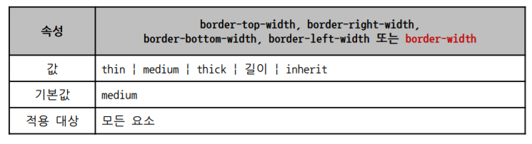

# CSS

## 목차

- 개요
- CSS Selector
- CSS 단위
- Selectors  심화
- Box model
- Display
- Position

## 개요

- 정의

  - CSS (Cascading Style Sheets)
  - 스타일, 레이아웃을 통해 문서를 표시하는 방법을 지정하는 언어

- CSS 구문

  ​	선택자 {

  ​		속성 : 값 ;	// 선언

  ​		속성 : 값 ;

  ​	}

- 정의 방법

  - 인라인 (inline)
  - 내부 참조 (embedding)
  - 외부 참조 (link file)

## CSS Selectors

### 기본 선택자

- 전체 선택자 (*) , 요소 선택자
- 클래스 선택자, id 선택자, 속성 선택자
  - 클래스(.) : 여러 곳 , 여러 개 사용 o (여러개 사용할 때에는 `공백`으로 클래스 간 구분 )
  - id(#) : 단 하나만 사용 

### 결합자

- 자식 결합자
  - `>` 사용
  - .box > p  : id가 box인 요소의 자식 요소들 중 p 태그에만 적용
- 자손 결합자
  - blank 사용
  - .box p : id가 box인 요소의 모든 하위 요소들 중 p 태그에만 적용
- 일반 형제 결합자, 
  - `~` 사용
  - selector A의 형제 요소 중 뒤에 위치하는 selector B 요소를 모두 선택
- 인접 형제 결합자
  - `+` 사용
  - selector A의 형제 요소 중 바로 뒤에 위치하는 selector B 요소를 선택
- 두개의 선택자를 이어붙여서 작성하면, 그 두가지 선택자를 모두 가진 요소를 골라올 수 있게 됨

### 속성 선택자

- 선택자[속성명]
  - 속성명의 속성이 포함된 요소
  - input[name]
- 선택자[ 속성명 = "값"]
  - 속성명의 속성값이 정확하게 '값'과 일치하는 요소
  - .userInput[type="text"]
- 선택자[속성명 ^= "값"]
  - 속성명의 속성값이 '값'으로 시작하는 요소
  - div[class^= "menu" ]
- 선택자[속성명 $= "값"]
  - 속성명의 속성값이 '값'으로 끝나는 요소
  - input[ name$= "Phone" ]
- 선택자[속성명 *= "값"]
  - 속성명의 속성값에 '값'이 포함되어 있는 요소
  - h1[class *= "title" ]

### 가상 클래스 선택자

- 스타일을 적용하는 대상을 `상황`에 따라 분류하여 사용
- 폼 요소나 링크의 상태에 대해서 스타일을 지정할 때 사용
- 링크 가상 클래스
  - 링크를 제어하기 위한 가상 클래스
  - `:link` 
    - 아직 열린 적 없는 페이지로의 링크에 적용
  - `:visted`
    - 이미 열린 적 있는 페이지로의 링크에 적용
- 다이나믹 가상 클래스
  - 사용자의 입력에 반응하여 스타일을 제어하기 위한 가상 클래스
  - `:hover` 
    - 특정 요소를 마우스 커서 등으로 가리키는 경우
  - `:active`
    - 마우스로 클릭하거나 실행 키를 누를 표시
  - `:focus`
    - 단축키나 탭키 등의 키보드 입력에 의한 포커스가 될 때 표시

### CSS 적용 우선순위

1.  중요도 (Importance)
   - !important
2. 우선 순위 (Specificity)
   - 인라인 > id 선택자 > class 선택자 > 요소 선택자
3. 소스 순서

  @ 주로 class로만 해결함. 

### CSS 상속

- CSS는 상속을 통해 부모 요소의 속성을 `일부` 자식에게 상속함
- 상속 되는 것
  - Text 관련 요소 (font, color, text-align), opacity , visibility
- 상속 되지 않는 것 
  - Box model 관련 요소 (width, height, margin, padding, border, box-sizing, display)
  - position 관련 요소 (position, top/right/bottom/left)

## CSS 단위

### 크기 단위

- px(픽셀)
  - 모니터 해상도의 한 화소
  - 고정적인 단위
  - 모니터의 해상도(픽셀 크기)에 따라 다르게 보일 수 있음
- %
  - 백분율 단위
  - 가변적인 레이아웃
- em
  - 상속의 영향을 받음
  - 배수 단위, 요소에 지정된 사이즈에 상대적인 사이즈를 가짐
- ex
  - 기본 font-size의 소문자 x의 높이를 1ex로 하여 상대적으로 계산된 크기

- rem
  - `최상위 요소`(html)의 사이즈를 기준(16px)으로 배수 단위를 가짐
- viewport
  - 웹 페이즈를 방문한 유저에게 바로 보이게 되는 웹 컨텐츠의 영역
  - 글자  그대로 디바이스의 viewport를 기준으로 상대적인 사이즈가 결정
  - 주로 스마트폰 or 태블릿 디바이스 화면을 말함
  - vw, vh, vmin, vmax
- 절대 단위
  - in, cm, mm, pt, pc

### 색상단위

- 색상 키워드

  - 대소문자 구분 x
  - red, blue 등 직접 글자로

- RGB 색상

  - '#' + 16진수 표기법

  - rgb() 함수형 표기

- HSL 색상

  - 색상, 채조, 명도

### CSS 기본 속성

- color
- background-color
- font-family
- font-weight
- font-size
- width
- height
- text-align

## CSS Box model

### 네모 세상

- 모든 HTML 요소는 box 형태로 되어있음
- 하나의 박스는 네 분분으로 구성
  - content
  - padding
  - border
  - margin
- short-hand
  - 적용 순서는 시계방향
  - border는 순서 상관 x
- box-sizing
  - content-box : 기준점이 안의 내용물.
  - border-box : 기준점이 테두리  ->  크기 설정하기 더 쉬워짐
  - 사용)  selector{ box-sizing :  ~~ ; }
- 마진 상쇄
  - block A의 top과 block B의 bottom에 적용된 각각의 margin이 둘 중에서 큰 마진 값으로 결합되는 현상

### border 두께

### border 스타일

### border 색

## CSS Display

### 인라인 / 블록 요소

- 블록 요소 
  - display : block
  - width를 전부 차지함
  - 다음 요소 다음 줄로 보냄
  - 블록 요소 안에 인라인 요소 들어갈 수 있음
  - div, ul, il, li, p, hr, form 등
- 인라인 요소
  - display : inline
  - 자신 요소의 크기만큼 차지
  - width, height, margin-top, margin-bottom 지정 x
  - 상하 여백은 line-height로 지정
  - span, a, img, input, label, b, em, i, strong
- inline-block
  - display : inline-block
  - 두개의 특징을 모두 가짐
  - inline 처럼 한 줄에 표시 가능하며, block 처럼 width, height, margin 속성을 모두 지정 o
- list-item
  - li 요소와 같이 블록 박스와 목록 항목의 인라인 박스로 표시

- inherit
- None
  - display : none
  - 해당 요소를 화면에 표시하지 않음 ( 공간조차 사라짐 )
  - visibility : hidden은 공간 차지 but 보이지 않음

### 속성에 따른 수평 정렬

- 블록 요소

  : 마진으로 정렬 조절

  - margin-right: auto;  => 왼쪽 정렬
  - margin-left: auto; margin-right: auto;  => 가운데 정렬
  - 부모의 maximum 가로를 가지며 , content의 세로를 가진다.

- 인라인 요소

  : text-align으로 정렬

  - text-align: left ; 
  - text-align: center; 

## CSS Position

### CSS Position

- 문서 상에서 요소를 배치하는 방법 지정
- static
  - 모든 태그의 기본 값
  - 일반적인 요소의 배치 순서에 따름
  - 부모 요소 내에서 배치될 때는 부모 요소의 위치를 기준으로 배치
- relative
  - 자기 자신의 static 위치를 기준으로 이동
  - 레이아웃에서 요소가 차지하는 공간은 static일 때와 같음
- absolute
  - 일반적인 문서 흐름에서 제거 -> 레이아웃에 공간을 차지하지 x
  -  static이 아닌 가장 가까이 있는 부모/조상 요소를 기준으로 이동 (없으면 body에 붙음)
- fixed
  - 일반적인 문서 흐름에서 제거 -> 레이아웃에 공간을 차지하지 x
  - viewport를 기준으로 이동
  - 스크롤 시에도 항상 같은 곳에 위치

### absoulute 특징

- 원래 위치해 있던 과거 위치 공간 사라짐
- 다른 모든 것과 별개로 독자적인 곳에 놓임
- 페이지의 다른 요소와 간섭되지 않는 격리된 사용자 인터페이스 기능을 만드는데 활용
  - 팝업 정보 상자, 제어 메뉴, 롤오버 패널, 등등