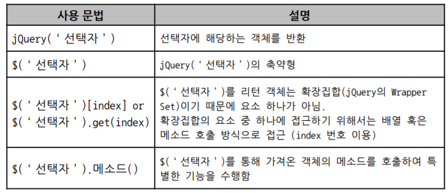

# jQuery 개요 및 특징

### jQuery란

- JavaScript로 미리 구현되어있는 라이브러리의 한 종류
- 주요 기능으로 DOM Management, Plug-In, Animate, Ajax가 있음

### jQuery 특징

- CSS 선택자
  - 짧고 명료한 선택자를  사용하여 가독성과 생산성이 높음
- 풍부한 플러그인과 참고 자료
  - 다양한 기능의 플러그인 배포
  - 인기 있는 라이브러리 => 참고 자료 多
- 코드 중복 회피
  - 메소드 체인
  - 묵시적 반복
- 크로스 브라우저
  - 브라우저에 대한 dependency를 jQuery 자체에서 해결
  - jQuery 버전에 따라 지원 가능한 브라우저를 확인해야 함

### jQuery 환경 설정

- 라이브러리 다운로드 방식
  - : http://jquery.com/
  - ``
- CDN 방식 경로 설정
  - ``
  - `jQuery CDN : http://code.jquery.com/jquery-최신버전.min.js`

### jQuery 사용방법

- 여기서 선택자는 `CSS 선택자`

- 선택된 HTML Element를 Wrapper Set으로 묶어, 여러 메소드 제공

  - 선택, 스타일, 탐색, 효과, 이벤트, 조작, 속성 

- Wrapper Set의 메소드는 Wrapper Set을 반환함

  => 메소드 체인 가능

### 문서 준비 핸들러

- `$(document).ready( function() { /*  함수 내용 */ } );`
- 문서가 모두 준비된 후 실행할 내용을 작성
- 문서의 준비란, DOM Tree의 로드를 의미
-  `<script>` 를 맨 아래에 두는 방식이 아닌 이벤트 핸들러로 조작
- vs ``$(window).load( function() { /*  함수 내용 */ } );``
  - 프레임, 객체, 이미지 등 외부자원까지 모두 로드 된 후 실행

### 축약 표현

- 기본형
  - `jQuery(document).ready( function() { /* 함수내용 */ } );`
- jQuery 축약**
  - `$(document).ready( function() { /* 함수내용 */ } );`
- 모두 생략
  - `$(function() { /* 함수내용 */ } );`

