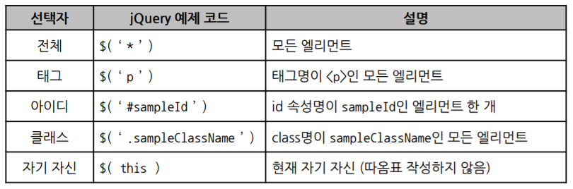
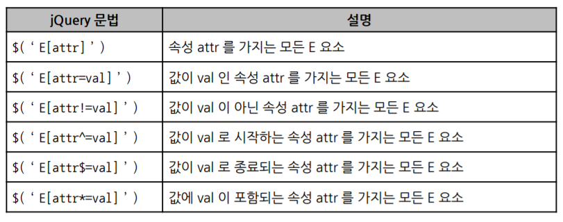

# jQuery 선택자

### 선택자

- this는 주로 event에서 사용

### 속성 선택자

- E는 선택자를 의미. 생략 시 *(전체) 의미
- [] 기호를 이용해, 특정 속성에 대한 요소를 선택할 수 있음

### 선택자 조합

### 위치 기반 필터 선택자

- 대부분 확장 집합에서 임의의 요소를 추출하는 데 사용

- `E:first-child`
  - E의 첫번째 자식 X
  - E 중 부모의 첫번째 자식인 Element O

### form 필터 선택자

- `$( ' : 필터선택자 ')`

- `$( ' :radio:checked')` 처럼 이어서 사용 O

