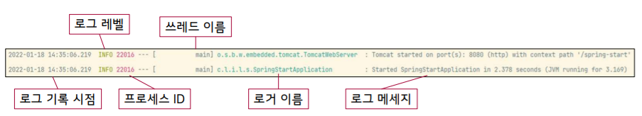
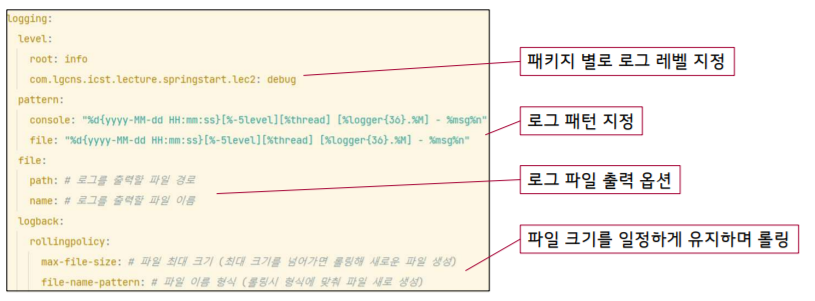
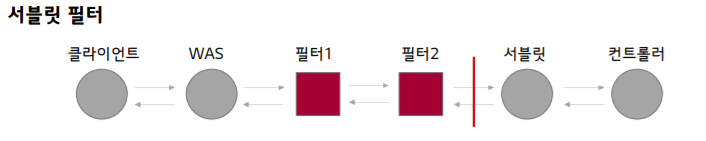
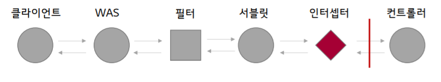
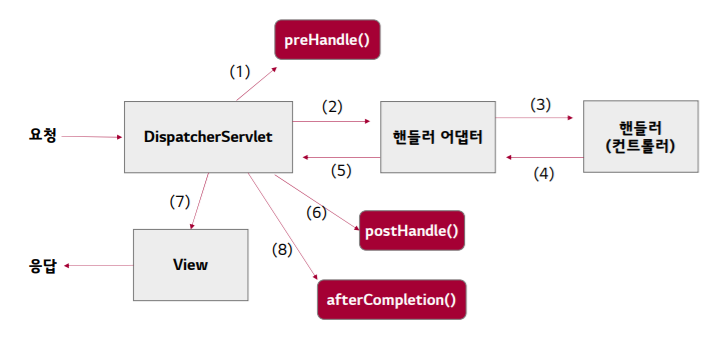
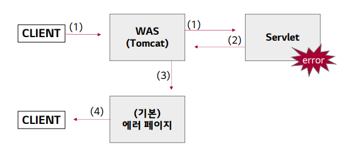
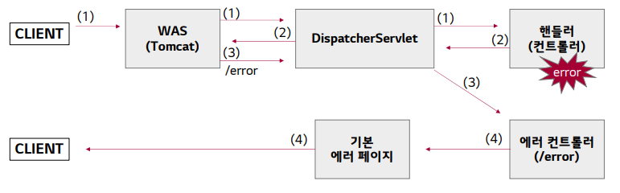
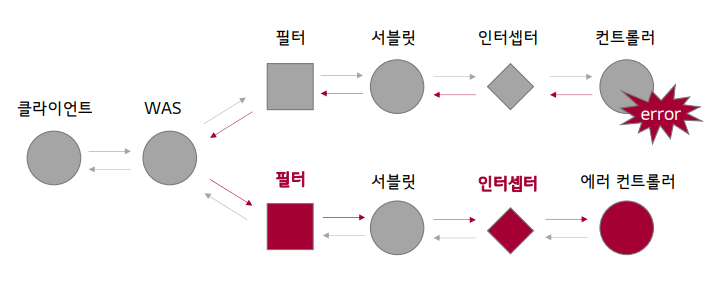

# 필터와 인터셉터


## 로깅


### Exception.printStackTrace()

- 예외가 발생한 지점과 관련 정보, 스택 추적 정보를 확인 O
- 주의
  - `throw new Exception(e.getMassage());` => trace 정보 모두 유실
  - `throw new Exception(e);` => trace 정보 유지


### System.out의 한계

- 속도 느림 => 성능 저하
- 사후 분석을 위해 별도의 파일 제공 X
- 출력 양식의 통일이 필요함 


### 로깅 라이브러리

- 손쉬운 출력 패턴 지정
- 로그 레벨을 통해 환경에 따라 출력 내용 지정
- 파일 출력 및 파일 롤링 기능 지원
- 외부 전송 혹은 업로드 
- ex) Logback (SLF4J의 실제 구현체)


### 로그 레벨

- 지정된 레벨 이상의 로그만 출력 가능
- 가벼움
  - TRACE : DEBUG 보다 세분화된 정보
  - DEBUG : 디버깅 시 유용한 세분화 정보
  - INFO : 진행 상황 등 일반적 정보
  - WARN : 잠재적 오류 원인이 될 수 있는 경고성 정보
  - ERROR : 오류 정보
- 심각함


### 로그 사용 방법

- LoggerFactory에서 로거 객체를 받아옴. 현재 클래스 정보를 넘겨줘야 한다(롬복 사용하면 간편)

```java
public class LogTest {
    private final Logger log = LoggerFactory.getLogger(LogTest.class());
```

```java
@Slf4j
public class LogTest {
```

- 로그 출력 시 로그 레벨 지정 O

```java
log.trace(~);
log.debug(~);
log.info(~);
log.warn(~);
log.error(~);
```

- 변수 출력 시 `+` 연산이 아니라 `{}` 사용
  - `+` : 로그 출력 X 되어도 연산 실행 => 리소스 낭비

```java
log.error("Error occurred during closing connection : {}", e.getMessage(), e);
```

- 줄바꿈 : `System.lineSeparator()`

```java
log.info("1번줄{}2번줄", System.lineSeparator());
```

- 에러 출력 시 에러 메시지와 함께 에러 상세 정보 출력


### 로그 설정 방법





- %Logger{length} : Logger name을 축약할 수 있다. {length}는 최대 자리 수, ex)logger{35} 
- %-5level : 로그 레벨, -5는 출력의 고정폭 값(5글자) 
- %msg : - 로그 메시지 (=%message)
-  ${PID:-} : 프로세스 아이디 
- %d : 로그 기록시간
- %p : 로깅 레벨 
- %F : 로깅이 발생한 프로그램 파일명 
- %M : 로깅일 발생한 메소드의 명 
- %l : 로깅이 발생한 호출지의 정보 • %L : 로깅이 발생한 호출지의 라인 수 • %thread : 현재 Thread 명 
- %t : 로깅이 발생한 Thread 명 
- %c : 로깅이 발생한 카테고리 
- %C : 로깅이 발생한 클래스 명 
- %m : 로그 메시지 
- %n : 줄바꿈(new line) 
- %% : %를 출력
- %r : 애플리케이션 시작 이후부터 로깅이 발생한 시점까지의 시간(ms)


## 필터와 인터셉터


### 공통 관심사

- 핵심 관심사
  - 각 Controller가 맡은 요청 처리
  - ex) 로그인, 회원 가입
- 공통 관심사
  - 여러 로직에서 공통으로 관심 가지는 것
  - 로깅, 로그인(인증)


### 필터

- 서블릿 필터
  - 서블릿에서 제공하는 기술
  - WAS에서 서블릿을 호출하기 전 필터를 걸쳐 호출
  - 특정 URL 패턴에 적용 O
  - 적절  X 요청 => 요청 넘기지 않고 종료
  - 체인 => 추가 및 순서 조정 O




### 필터

```java
@Slf4j
public class LoggingFilter implements Filter {
    
    @Override
    public void init(FilterConfig filterConfig) throws ServletException{
       // 필터 초기화 메서드, 서블릿 컨테이너가 생성될 때 호출
    }
    
    @Override
    public void destroy() {
       // 필터 종료 메서드, 서블릿 컨테이너가 종료될 때 호출
    }
    
    
    @Override
    public void doFilter(ServletRequest request, ServletResponse response, FilterChain chain) {
    
       // URL 패턴에 맞는 요청이 들어오면 호출. 필터 로직 구현
   		chain.doFilter(request, response);
    }
}

```

- chain.doFilter() 생략 시 요청 이후 체인으로 전달 X

```java
@Configuration
public class FilterConfig {
    @Bean
    public FilterRegistrationBean<LoggingFilter> loggingFilter() {
        FilterRegistrationBean<LoggingFilter> filterFilterRegistrationBean = new FilterRegistrationBean<>();
        filterFilterRegistrationBean.setFilter(new LoggingFilter());
        filterFilterRegistrationBean.setOrder(1);
        filterFilterRegistrationBean.addUrlPatterns("*");
        return filterFilterRegistrationBean;
    }
}

```

- setOrder()로 필터 체인 순서 지정
  - 낮은 순서 우선 순위
- @Bean으로 등록 => new LoggingFilter()여도 싱글톤으로 관리 됨


### 인터셉터

- 스프링 MVC에서 제공하는 기술
- 서블릿이 컨트롤러를 호출하기 전 인터셉터를 거쳐 호출
- 적절  X 요청 => 요청 넘기지 않고 종료
- 체인 => 추가 및 순서 조정 O
- **더 정밀하게 URL 패턴 지정**
- **더 구체적인 호출 시점 지정**




### 인터셉터 코드

```java
@Slf4j
public class LoggingInterceptor implements HandlerInterceptor {
    @Override
    public boolean preHandle(HttpServletRequest request, HttpServletResponse response, Object handler) throws Exception {
    
    // 컨트롤러 호출 전에 호출
    return true;
    }
    
    @Override
    public void postHandle(HttpServletRequest request, HttpServletResponse response, Object handler, ModelAndView modelAndView) throws Exception {
    
    // 컨트롤러 호출 후에 호출
    }
    
    @Override
    public void afterCompletion(HttpServletRequest request, HttpServletResponse response, Object handler, Exception ex) throws Exception {
    
    // 뷰가 렌더링 된 이후 호출
    }
    

}
```

- boolean을 응답 => 필터처럼 실수 여지 없음

```java
@Configuration
public class InterceptorConfig implements WebMvcConfigurer {
    @Override
    public void addInterceptors(InterceptorRegistry registry) {
        registry.addInterceptor(new LoggingInterceptor())
                .order(1)
                .addPathPatterns("/**")
                .excludePathPatterns("/css/**", "/js/**", "/**.ico");
    }
}
```

- excludePathPattern을 지정할 수 있기에 편리
- path pattern에 context path를 자동으로 적용


### 인터셉터 요청 흐름




### 스프링 URL 매핑 규칙

- ? 한 문자 일치 
- `*` 경로(/) 안에서 0개 이상의 문자 일치 
- `**` 경로 끝까지 0개 이상의 경로(/) 일치
- {spring} 경로(/)와 일치하고 spring이라는 변수로 캡처 
- {spring:[a-z]+} : regexp [a-z]+ 와 일치하고, "spring" 경로 변수로 캡처 
- {*spring} 경로가 끝날 때 까지 0개 이상의 경로(/)와 일치하고 spring이라는 변수로 캡처


## 에러 페이지


### 에러 페이지에 자세한 에러 내용을 노출하면 안되는 이유

- 웹 보안에 취약
- 사용자는 궁금하지 않음
  - 단, Validation 에러의 경우 자세히 내용을 노출하여 사용자가 다시 올바른 요청을 하게끔 유도


### 기존 forward 방식 문제점

- PRG 패턴 미적용
- 에러 내용이 사용자에게 노출

​	=> 에러 Controller로의 redirect를 통한 forward 


### 에러 페이지 노출 흐름



1. 요청이 WAS를 거쳐 Servlet에 전달
2. 에러 발생 시 Exception or sendError()
3. 에러 페이지 맵핑 정보를 찾아 에러 페이지 응답 (없다면 기본 페이지 응답)

- 에러 전달하는 방법
  - `HttpServletResponse.sendError(code, message)`
  - `throw new Exception(message)`


### [스프링 MVC] 에러 페이지 노출 흐름




### 스프링 에러 페이지 맵핑 방법

- BasicErrorController에는 기본적인 로직이 모두 개발되어 있음
- 에러가 발생하면 아래의 우선 순위에 따라 특정 경로의 에러 페이지를 응답
  1. 뷰 템플릿
     - /resources/templates/error/500.html
     - /resources/templates/error/5xx.html
  2. 정적 리소스
     - /resources/static/error/400.html
     - /resources/static/error/4xx.html
  3. 이름이 error인 뷰
     - /resources/templates/error.html
- 5xx와 같이 뷰 이름을 지정하면 상위코드 기준으로 맵핑
- 구체적인 뷰가 있다면, 구체적인 뷰가 우선


### 에러 페이지 샘플

```html
<!DOCTYPE html>
<html lang="ko" xmlns:th="http://www.thymeleaf.org">
<head>
    <meta charset="UTF-8">
    <link rel="stylesheet" type="text/css" href="../../../static/css/bootstrap.min.css" th:href="@{/css/bootstrap.min.css}">
    <title>오류</title>
</head>
<body>
    <h2 class="text-danger text-center" th:text="|${status} ${error}|">상태 코드</h2>
    <p class="text-center">
    다시 시도해보세요. 오류가 반복되면 관리자에게 문의해주세요.
    </p>
</body>
</html>
```


### 동적 에러페이지

```html
<ul>
    <li th:text="${timestamp}"></li>	<!--시간-->
    <li th:text="${path}"></li>			<!--클라이언트 요청 경로-->
    <li th:text="${status}"></li>		<!--상태 코드-->
    <li th:text="${message}"></li>		<!--에러 메시지-->
    <li th:text="${error}"></li>		<!--에러 이름-->
    <li th:text="${exception}"></li>	<!--예외 이름-->
    <li th:text="${erros}"></li>		<!--BindingResult Errors-->
    <li th:text="${trace}"></li>		<!--예외 trace 정보-->
</ul>
```


### 에러 페이지 관리

```yml
server:
	error:
		include-binding-errors : never
		include-message : never
		include-stacktrace :never
		include-exception : false
```

- never : 사용 X

- always

- on_param : 파라미터 있을 때만

  => 옵션을 꺼두면 Model에 아예 담기지 않음 (보안상 유용)


### 필터, 언터셉터와 에러페이지



- 에러 페이지에 대해 logging은 수행하고, 인증은 수행할 필요 X


### Dispatcher Type

- 서블릿에서 요청의 유형을 구분해 둔 것
- 요청의 유형에 따라 필터 호출 구분 O
- 기본 값 REQUEST
- 종류
  - FORWARD : 포워드
  - INCLUDE : 서블릿에서 다른 서블릿이나 JSP 결과 포함
  - REQUEST : 일반적인 클라이언트 요청
  - ASYNC : 서블릿 비동기 호출
  - ERROR : 오류 요청


### 필터 포함하기

```JAVA
//FileterConfig.java
@Bean
public FilterRegistrationBean<LoggingFilter> loggingFilter() {
    FilterRegistrationBean<LoggingFilter> filterFilterRegistrationBean = new FilterRegistrationBean<>();
    filterFilterRegistrationBean.setFilter(new LoggingFilter());
    filterFilterRegistrationBean.setOrder(1);
    filterFilterRegistrationBean.addUrlPatterns("*");
    
    filterFilterRegistrationBean.setDispatcherTypes(DispatcherType.ERROR, DispatcherType.REQUEST);
    return filterFilterRegistrationBean;
}

```

- DispatcherType 중 ERROR 를 지정하면 에러 요청( /error ) 에 대해서도 필터가 동작


### 인터셉터 제외하기

- `.excludePathPatterns("/error");` 추가

