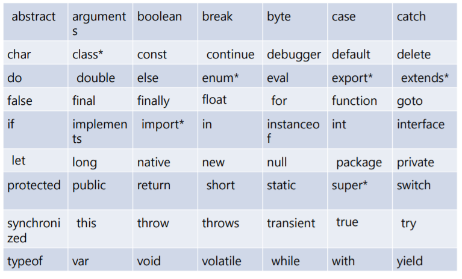
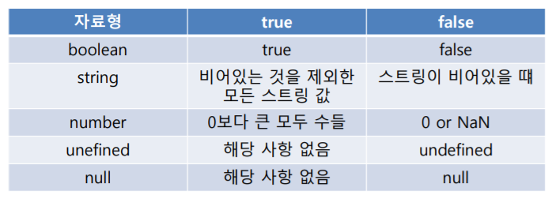

# 변수와 데이터 타입


## 변수 선언


### var

```javascript
var year; 	// undefined

year=365; 	// 365

var hour=24;
console.log(`일년은 ${year*hour} 시간이다`) 
```

- 백틱 : $ 기호 표시로 변수 활용 가능

-  js의 변수는 문자와 숫자의 형변환이 자유롭다


### 변수명 Naming Rule

- 헝가리안 표기법을 따름
- Java와 동일 방식


### JS 예약어

- 식별자 또는 상수 이름으로 프로그램에서 사용이 불가능한 예약어




## 기본 데이터 타입


### 종류

- number
- string
  - `" "`

- boolean
- null
  - 의도적으로 변수에 값이 없다는 것을 암시
- undefined
  - 값이 정의되지 않은 변수나 존재하지 않는 객체
- symbol
  - 변경 불가능한 원시 타입
  - ES6에서 추가됨


### number

- 정수, 부동소수점, 8진수, 16진수 지수형 상수 등 모든 숫자를 나타냄
- parseInt() 또는 parseFloat() 함수를 이용하여 문자열을 숫자로 변경
  - 숫자로 시작하는 문자열에서 정수 부분/부동소수점 수의 값을 반환

- Infinity

  - 매우 크거나 작은 수가 변수에 저장되었을 때 값을 표현

  ```javascript
  var bigNumber = 1e+209;		// Infinity
  var smallNumber = 5e-325;	// 0
  var wrongNumber = 6 / 0 	// Infinity
  
  alert( typeof Infinity)		// number
  ```

- NaN (Not a Number)

  - 숫자가 아닌 경우 표시

  ```js
  alert( parseInt( "asdfe") )	// NaN
  alert( typeof NaN)			// number
  
  alert( isNaN("abc"))		// true
  ```

  - isNaN을 통해서 number로 변경 가능한 string 판별

- Undefiend vs Null

    ```js
    var emptyVar;
    alert( Number( emptyVar ) );	// NaN
    
    emptyVar = null;
    alert( Number( emptyVar ) );	// 0
    ```


### String

- ' '  또는 " "


### boolean




