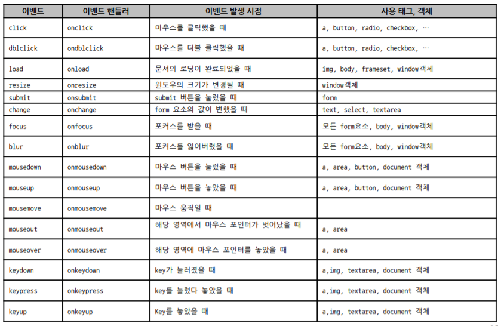

# 이벤트


## 이벤트란


### 정의

- 사용자가 수행한 행동, 웹 페이지가 로딩된 것 등의 정보를 제공
- ex
  - click
  - submit


## 이벤트 처리


### 이벤트 핸들러

- 발생한 이벤트를 처리하기 위한 태그의 속성
- 핸들러 이름은 `on`으로 시작하여 그 뒤에서 `이벤트명` 이 붙음
- 이름은 모두 소문자




### 이벤트 핸들러와 this

- this

  - 이벤트가 발생한 객체

  ```html
  <input type=“text” id=“exText” name=“myText” onblur=“printThisValue(this);”/>
  ```

  ```js
  function printThisValue( input ) {
  console.log( “이벤트가 발생한 객체의 id : ” + input.id );
  console.log( “이벤트가 발생한 객체의 name : ” + input.name );
  console.log( “이벤트가 발생한 객체의 값 : ” + input.value );
  }
  
  ```

  


### 대화상자

- JavaScript는 Alert, Confirm, Promt 세가지 종류의 대화상자를 제공함
- Alert
  - 메시지를 화면에 표현하며, 별도의 수행 결과 X
- Confirm
  - 사용자에게 확인을 입력 받을 때 사용하는 함수
  - 확인 => true  /  취소 => false
- Promt
  - 사용자에게 문자열을 입력 받을 때 사용하는 함수
  - 사용자의 입력 결과를 리턴
  - 디폴트 값 지정 가능