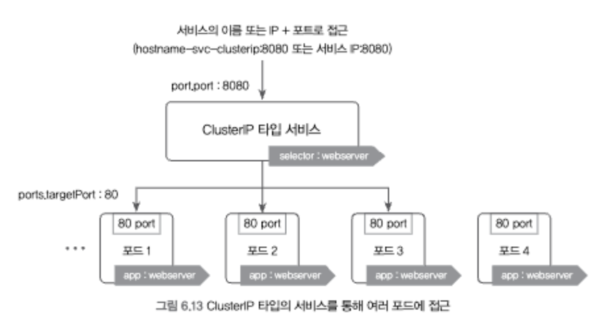
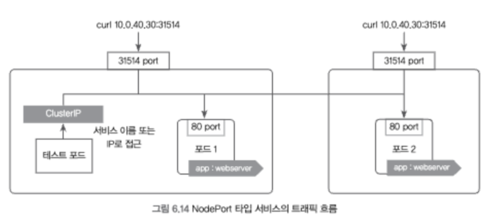
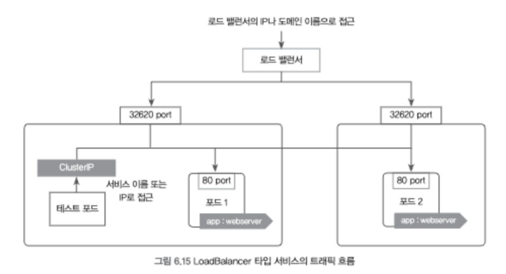

# 쿠버네티스


## 06 쿠버네티스 시작하기


### 개요

- 주요 특징

  - **모든 리소스는 오브젝트 형태로 관리**

    - 컨테이너의 집합(Pods), 컨트롤러(Replica Set), 사용자(Service Account), 노드(Node) 등 모두 하나의 오브젝트

  - **명령어도 가능하지만, 주로 YAML 파일 사용**

    - 실제 서비스를 배포할 때, 여러 개의 YAML 파일을 정의해 쿠버네티스에 적용시키는 방식으로 동작

  - **쿠버네티스는 여러 개의 컴포넌트로 구성**

    - [비교] 도커

      - 단일 도커 데몬 사용

    - 쿠버네티스

      - 마스터 노드: API 서버, 컨트롤러 매니저, 스케줄러, DNS 서버 등 실행

      - 공통 : 프락시, 네트워크 플러그인, kubelet

        :bulb: kubelet : 컨테이너의 생성, 삭제 및 마스터와 노드 간의 통신

    - 컴포넌트들은 기본적은 도커 컨테이너로 실행

- 쿠버네티스 YAML 구성

  - `apiVersion`
    - 오브젝트의 API 버전
  - `kind`
    - 리소스의 종류
  - `metadata`
    - 리소스의 부가 정보
  - `spec`
    - 생성하기 위한 자세한 정보

- 기본 명령어

  - `kubectl api-resources` : 사용 가능 오브젝트 확인
    - KIND 항목에서 리소스 종류 확인 O
  - `kubectl apply -f {yaml파일}` : YAML으로 쿠버네티스에 생성
  - `kubectl get {오브젝트 종류}` : 특정 오브젝트 목록 확인
    - `kubectl get {오브젝트 종류} {오브젝트 명}`  : 해당 오브젝트의 자세한 정보 출력
    - `-o yaml` 옵션 : yaml 형식으로 출력 (json도 가능)
  - `kubectl exec -it {오브젝트 명} {명령어}` : 명령어 전달
  - `kubectl logs {오브젝트 명}` : 로그 확인
  - `kubectl delete -f {yaml파일}` : yaml 파일로 생성된 오브젝트 전체 삭제

- 오브젝트 공통

  - 리소스의 고유한 이름은 모든 쿠버네티스 오브젝트에서 설정

  - 몇 가지 오브젝트는 줄임말로 사용 O

    - pods => po
    - replicasets => rs
    - namespace => ns

    


### 포드(Pod)

- 개요

  - 컨테이너 애플리케이션의 기본 단위

  - 1개 이상의 컨테이너로 구성된 컨테이너 집합

  - **포드 내부의 컨테이너들은 네트워크와 같은 리눅스 네임스페이스를 공유**

    => 같은 워커 노드에서 함께 실행

- YAML

  ```yaml
  apiVersion: v1
  kind: Pod
  metadata:
    name: my-nginx-pod
  spec:
    containers:
    - name: my-nginx-container
      image: nginx:latest
      ports:
      - containerPort: 80
        protocol: TCP
  
    - name: ubuntu-sidecar-container
      image: alicek106/rr-test:curl
      command: ["tail"]
      args: ["-f", "/dev/null"] # 포드가 종료되지 않도록 유지합니다
  ```

  - `-`는 여러 개의 항목을 정의할 수 있음을 의미

  - `command`와 `args`는 컨테이너 내부에서 가장 먼저 실행될 프로세스를 지정

  - `containerPort: 80` 

    - 애플리케이션이 사용할 내부 포트만 정의

    - 해당 설정으로 포드가 외부로 노출되는 것은 X

      


### 리플리카셋(Replica Set)

- 개요

  - 정해진 수의 동일판 포드가 항상 실행되도록 관리하는 컨트롤러
  - 노드 장애 등의 이유로 포드를 사용할 수 없다면, 다른 노드에서 다시 생성
  - 배경
    - YAML 파일에 포드만 정의해 생성할 경우, 해당 포드는 오직 쿠버네티스 사용자에 의해 관리
    - MSA 여러 개의 동일한 컨테이너를 생성한 뒤 외부 요청이 각 컨테이너에 적절히 분배될 수 있어야 함

- YAML

  ```yaml
  apiVersion: apps/v1
  kind: ReplicaSet
  metadata:
    name: replicaset-nginx
  spec:
    replicas: 3
    selector:
      matchLabels:
        app: my-nginx-pods-label
    template:
      metadata:
        name: my-nginx-pod
        labels: 
          app: my-nginx-pods-label
      spec:
        containers:
        - name: nginx
          image: nginx:latest
          ports:
          - containerPort: 80
  ```

  - `spec.replicas` : 동일한 포드를 몇 개 유지시킬 것인지 설정
  - `spec.templates` 
    - 포드를 생성할 때 사용할 템플릿을 정의
    - 포드를 사용했던 내용을 동일하게 리플리카에도 정의
    - 포드 스펙, 포드 템플릿
  - `spec.selector.matchLabel` : 정의된 라벨과 매칭되는 포드들을 관리

- 라벨 셀렉터

  - 포드와의 느슨한 연결 유지

  - 라벨

    - 쿠버네티스 리소스를 분류할 때 유용
    - 서로 다른 오브젝트가 서로를 찾아야 할 때 사용

  - 명시한 라벨과 일치하는 포드들의 개수를 유지

  - 표현식 기반으로 사용 O

    ```yaml
    selector:
      matchLabels:
      app: our-nginx-pods-label
      matchExpressions:
        - key: app2
          values:
            - my-nginx-pods-label
            - your-nginx-pods-label
          operator: In
    ```

    - `{key}`를 가지고 있는 포드들 중에서 `{values}`에 정의된 값들이 존재(`In`)하는 포드를 대상

- 실행 및 변경

  - [실행] `kubectl apply -f`
  - [변경] YAML 파일 수정 후 `kubectl apply -f` => `configured` 가 출력


### 디플로이먼트

- 개요

  - 애플리케이션을 배포하고 관리하는 역할
  - 업데이트할 대 변경 사항을 저장하는 리비전을 남겨 롤백 O
    - 업데이트트함으로써 새로운 레플리카셋과 포드를 생성했음에도 불구하고, 이전 버전의 레플리카셋을 삭제하지 않고 리비전으로 보존
  - 무중단 서비스를 위해 포드의 롤링 업데이트 전략을 지정

  => 공식적으로 디플로이먼트 사용을 권장 (디플로이먼트를 사용하면 포드와 레플리카셋을 직접 생성할 필요 X)

- YAML

  ```yaml
  apiVersion: apps/v1
  kind: Deployment
  metadata:
    name: my-nginx-deployment
  spec:
    replicas: 3
    selector:
      matchLabels:
        app: my-nginx
    template:
      metadata:
        name: my-nginx-pod
        labels:
          app: my-nginx
      spec:
        containers:
        - name: nginx
          image: nginx:1.10
          ports:
          - containerPort: 80
  ```

- 명령어

  - `kubectl set image deployment {deployment-name} {container-name}={new-image} [--record]`  : 이미지 변경
    - `--record=true` 옵션으로 해당 버전의 레플리카셋을 보존
    - `kubectl apply -f` 로도 변경  O
  - `kubectl rollout history deployment {deployment-name}` : 리비전 정보 확인
  - `kubectl rollout undo deployment {deployment-name} --to-revision={번호}` : 해당 리비전으로 롤백
  - `kubectl describe deploy {deployment-name}`
    - 디플로이먼트 정보 출력


### Service

- 개요

  - 포드를 연결하고 외부에 노출
  - 여러 개의 포드에 쉽게 접근할 수 있도록 고유한 도메인 이름 부여
  - 여러 개의 포드에 접근할 때 요청을 분산하는 로드 밸런서 기능

- 종류

  - `ClusterIp` 타입

    

    - k8s 내부에서만 포드들에 접근할 때 사용
      - 내부에서만 사용할 수 있는 고유한 IP(ClusterIP) 할당
      - 클러스터 노드 중 하나 접속해서 ClusterIP에 요청
    - 로드 밸런싱 수행
    - 내부 DNS 구동 => 서비스 명으로 ip 대체 
    - :memo: 여러 포드가 클러스터 내부에서 서로를 찾아 연결할 때는 서비스의 이름과 같은 도메인 이름을 사용하는 것이 일반적

  - `NodePort`

    

    - 포드들에 접근할 수 있는 포트를 클러스터의 모든 노드에 동일하게 개방
    - ClusterIP 기능 포함
      - 내부 네트워크와 외부 네트워크 양쪽에서 접근 O
    - 기본적으로 30000 ~ 32768 포트 중에 랜덤으로 선택
      - `spec.ports.nodePort`에서 지정 O
    - GKE, AWS 환경에서는 별도 규칙 설정하지 않으면 통신 실패 발생하기도 함
    - 실제 서비스에서는 지양

  - `LoadBalancer`

    

    - 로드 밸런서를 동적으로 프로비저닝해 포드에 연결
    - 클라우드 플랫폼에서만 사용할 수 있음
    - 클라우드 플랫폼에서 도메인 이름과 IP를 할당 => NodePort보다 더 쉽게 포드 접근  O
    - `kubectl get` 조회 시,
      - `EXTERNAL-IP` 항목 : 로드밸런스의 IP가 자동으로 할당되어, 해당 주소와 포트를 통해 포드 접근  O
      - `PORT` 항목: `{로드밸런서 포트}:{노드 포트}`

  - `ExternalName`

    - 쿠버네티스와 별개로 존재하는 외부 시스템과 연동시 사용
    - 서비스가 외부 도메인을 가리키도록 설정

- YAML

  ```yaml
  apiVersion: v1
  kind: Service
  metadata:
    name: hostname-svc-clusterip
  spec:
    ports:
      - name: web-port
        port: 8080
        targetPort: 80
    selector:
      app: webserver
    type: ClusterIP #NodePort #LoadBalancer
  ```

  - 공통
    - `spec.selector` : 어떤 라벨을 가지는 포드에 접근할 수 있게 만들지 결정
    - `spec.ports.port` : 개방될 service의 port
    - `spec.ports.targetPort` : 접근 대상이 된 포드들이 내부적으로 사용하고 있는 포트를 입력
    - `spec.type` : 서비스 종류 지정

  - `LoadBalancer`
    - `spec.externalTrafficPolicy: Local`
      - 포드가 생성된 노드에서만 해당 포드로 접근 가능
      - 기본값 : Cluster
        - 단점 : 노드 내부의 포드에 전달하지 않고, 외부 노드로 전달
          - 불필요한 네트워크 홉 발생
          - 노드 간 리다이렉트로 인한, 트래픽 출발지 loss
      - Local 단점 : 특정 노드에 부하 집중 가능성 O

- 기타

  - `endpoint` 오브젝트
    - 서비스의 라벨 셀렉터와 포드의 라벨이 매칭돼 연결되면 쿠버네티스는 자동으로 엔드포인트 오브젝트 생성
    - 서비스가 가리키고 있는 도착점을 나타냄


## 쿠버네티스 리소스의 관리와 설정


### 네임스페이스

- 개요

  - 리소스를 논리적으로 구분한하는 장벽
    - 물리적으로 격리 X
    - 서로 다른 네임스페이스에서 생성된 포드가 같은 노드에 존재 O
  - 사용자/용도에 따라 컨테이너와 그에 관련된 리소스들을 구분 지어 관리하는 일종의 논리적인 그룹
  - 네임스페이스는 라벨보다 더욱 넓은 용도
    - `ResourceQuota` 오브젝트 => 특정 네임스페이스의 포드의 자원 사용량 제한
    - 애드미션 컨트롤러 => 특정 네임스페이스의 포드에는 항상 사이드카 컨테이너 생성
  - != 리눅스 네임스페이스

- 기본 네임스페이스 3개

  - default
    - kubeconfig에서 변경 가능
  - kube-system : 쿠버네티스 클러스터 구성에 필수적인 컴포넌트들과 설정값 등이 존재하는 네임스페이스

- 명령어

  - `kubectl get namespace` : 조회
  - `kubectl get {service} --namespace {namespace}` : 특정 네임스페이스 내 해당 서비스만 조회
    - `--all-namespaces` : 전체 조회

  - `kubectl create namespace {namespace}` : 생성
  - `kubectl api-resources --namespaced={bool}` : 네임스페이스 종속/미종속 리소스 확인

- YAML

  ```yaml
  apiVersion: apps/v1
  kind: Deployment
  metadata:
    name: hostname-deployment-ns
    namespace: production
  spec:
    ...
  ---
  apiVersion: v1
  kind: Service
  metadata:
    name: hostname-svc-clusterip-ns
    namespace: production
  spec:
    ...
  ```

  - `---`를 명시해 여러 개의 리소스를 정의

- 접근

  - 다른 네임스페이스에 존재하는 서비스에는 이름만으로 접근 X
    - `{서비스}.{네임스페이스}.svc`
      - 다른 네임스페이스의 서비스에도 접근
    - FQDN(Fully Qualified Domain Name) : {서비스}.{네임스페이스}.svc.cluster.local

- 네임스페이스 종속

  - 종속 : 포드, 서비스, 레플리카셋, 디플로이먼트
  - 미종속 : 노드


### 컨피그맵

- 배경

  - 도커 이미지는 불변 상태이기에 상황에 따라 설정 옵션을 유연하게 변경 불가

- 개요

  - 유연하게 설정값 관리
  - 일반적인 설정값을 담아 저장하는 오브젝트
  - 네임스페이스에 속함

- 명령어

  - `kubectl create configmap {configmap 이름} {각종 설정들...}`
    - `--from-literal {키}={값}` (여러 번 지정 O)
    - `--from-file [키=]{파일}` : 파일 이름이 키, 내용이 값으로 저장
      - `{키}=`로 키 이름 지정 가능
    - `--from-env-file {파일}.env` : 키-값 형태의 내용으로 구성
    - `--dry-run -o yaml` : config 설정 내용을 yaml로 출력 => yaml 저장 후 `kubectl apply -f {파일}.yaml`로 배포 O
      - `--dry-run` : 특정 작업의 실행 가능 여부를 검토
  - `kubectl describe configmap` : 조회
    - `kubectl describe configmap -o yaml` : 조회 결과 yaml 출력
  - `kebectl exec {container} env` : 컨테이너 내 환경 변수 전부 출력

- configmap에 저장된 키-값 데이터를 컨테이너의 환경 변수로 사용하기

  ```yaml
  apiVersion: v1
  kind: Pod
  metadata:
    name: container-env-example
  spec:
    containers:
      - name: my-container
        image: busybox
        args: ['tail', '-f', '/dev/null']
  ############################################################## case 1
        envFrom:
        - configMapRef:
            name: log-level-configmap
        - configMapRef:
            name: start-k8s
  ############################################################## case 2
  			env:
        - name: ENV_KEYNAME_1     # 컨테이너에 새롭게 등록될 환경 변수 이름
          valueFrom: 
            configMapKeyRef:
              name: log-level-configmap
              key: LOG_LEVEL
        ...
  ```

  1. `envFrom` & `configMapRef`

     - `envFrom` : 하나의 컨피그맵에 여러 개의 키-값 쌍이 존재하더라도 모두 환경 변수로 가져옴

     - `configMapRef` : 컨피그맵 참조. name으로 대상 지정

  2. `valueFrom` & `configMapKeyRef`
     - `valueFrom` : 컨피그맵에서 특정 데이터만을 선택해 가져옴
     - `configMapRef` : 컨피그맵 특정 키 참조. name과 key로 대상 지정

- 컨테이너 내부의 특정 파일로 마운트해서 사용

  ```yaml
  apiVersion: v1
  kind: Pod
  metadata:
    name: configmap-volume-pod
  spec:
    containers:
      - name: my-container
        image: busybox
        args: [ "tail", "-f", "/dev/null" ]
        volumeMounts:
        - name: configmap-volume          # volumes에서 정의한 컨피그맵 볼륨 이름 
          mountPath: /etc/config             # 컨피그맵의 데이터가 위치할 경로
  
  ############################################################## case 1
    volumes:
      - name: configmap-volume            # 컨피그맵 볼륨 이름
        configMap:
          name: start-k8s
  ############################################################## case 2
    volumes:
      - name: configmap-volume
        configMap:
          name: start-k8s
          items:                       # 컨피그맵에서 가져올 키-값의 목록을 나열합니다.
          - key: k8s                    # k8s라는 키에 대응하는 값을 가져옵니다.
            path: k8s_fullname         # 최종 파일 이름은 k8s_fullname이 됩니다
  ```

  - `spec.volumes` : 볼륨 정의
    - `items` : 선택적으로 가져올 때 명시
  - `spec.containers.volumeMounts`  : 지정한 볼륨을 어떤 디렉토리에 마운트할지 결정

  :bulb: 투사(projection) : 이러한 리소스 데이터를 포드 내부에 위치시킬 때 사용하는 공식 문서 언어

  


### 시크릿

- 개요

  - 민감한 정보 저장
  - 네임스페이스에 저장
  - configmap과 기본적인 사용법은 동일
  - 값을 기본적으로 base64로 인코딩해서 저장
    - 환경 변수나 볼륨 파일로 가져오면 자동으로 디코딩된 원래 값 사용

- 생성

  - `kubectl create secret {타입} {시크릿} {각종 설정들...}`
    - `--from-literal`, `--from-file`, `--from-env-file` O

- 타입

  - `Opaque`

    - default type
    - 사용자 정의하는 데이터를 저장할 수 있는 일반적 목적의 시크릿
    - ex) generic

  - docker-registry

    - registry 인증 정보를 저장하는 별도의 시크릿 (`docker login` 대신하여 인증)

    ```bash
    kubectl create secret docker-registry {이름} \
    	--docker-username={ID} \
    	--docker-password={password} \
    	--docker-server={서버 주소 or 도메인 이름}
    ```

  - TLS

    - TLS 연결에 사용되는 공개키, 비밀키 등을 저장
    - `kubectl create secret tls {이름} --cert {인증서}.crt --key {키}.key`


**:bulb: kustomize**

- 자주 사용되는 YAML 파일의 속성을 별도로 정의해 재사용 or 여러 YAML 파일을 하나로 묶음

  => configmap과 secret 편리하게 사용 O

- p.365 참고

