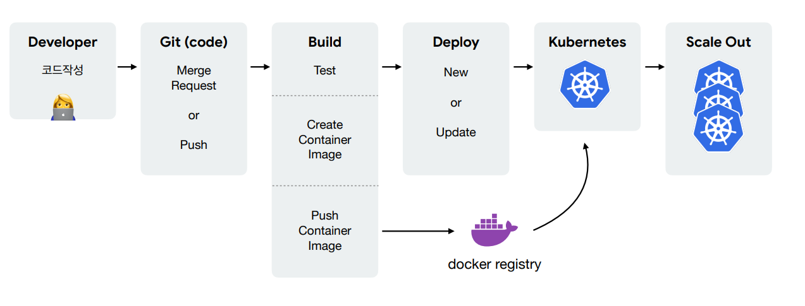

# 쿠버네티스 시작하기

## 컨테이너 오케스트레이션 배경

### 서버를 관리한다는 것

1. 문서화
   - 환경 / 버전 관리 어려움
2. 도구 사용
   - CHEF, PUPPET, ANSIBLE
   - 도구 사용 난이도 :arrow_up:
3. 가상 머신
   - 특정 벤더에 종속하게됨
   - 멀티 클라우드와 맞지 않음

=> 도커

### 도커의 등장

- 모든 실행 환경을 컨테이너로
- 컨테이너 특징
  - 가상머신과 비교하여 컨테이너 생성이 쉽고 효율적
  - 컨테이너 이미지를 이용한 배포와 롤백이 간단
  - 언어나 프레임워크에 상관없이 애플리케이션을 동일한 방식으로 관리
  - 개발, 테스팅, 운영 환경은 물론 로컬 피시와 클라우드까지 동일한 환경을 구축
  - 특정 클라우드 벤더에 종속적이지 않음
- 프로세스
  - Develope => Build => Ship => Run
- 단점
  - 관리해야 하는 컨테이너의 수가 증가하면 관리가 어려워짐

### 도커 그 이후

1. Deployment 배포
   - 각가의 컨테이너 버전 up/down을 해줘야 함
2. 서비스 검색
   - 서버 부하 & MSA로 인해 서버의 수가 많아지면 등록해야 하는  Load Balancer 및 서버 :arrow_up:
3. Gateway (서비스 노출)
   - 등록해야 하는 도메인 多
4. 서비스 이상, 부하 모니터링은 어떻게 할까
   - 관리 대상 증가 시 작업 부담 :arrow_up:
   - 이상 발견 & 조치에 대한 자동화된 절차 필요

=> Container Orchestration

## 컨테이너 오케스트레이션

### 목적

- 복잡한 컨테이너 환경을 효과적으로 관리하기 위한 도구

### 컨테이너 오케스트레이션 동작

- CLUSTER
  - 중앙제어 : 노드들을 추상화해서 클러스터 단위로 관리
  - 네트워킹 : 노드들끼리 네트워크 통신
  - 노드 스케일 : 노드의 개수가 수천개가 되더라도 잘 작동할 수 있도록 사전 설계 필요
- STATE (상태 관리)
  - 컨테이너 증감 자동화
  - 컨테이너 이상 시, 셧다운 & 개설 자동화
- SCHEDULING
  - 배포 관리 : 서버 상황에 맞춰 어플리케이션 동작 여부 판단 & 서버 증감 관리
- ROLLOUT/ROLLBACK 
  - 배포 버전 관리 : 중앙에서 버전 관리
- SERVICE DISCOVERY
  - 서비스 등록 및 조회 : 서비스 등록에 맞춰 PROXY의 설정 변경 및 프로세스 재시작 자동화
- VOLUME
  - 볼륨 스토리리 : 노드 별 스토리지 연결을 설정으로 관리

## 쿠버네티스

### 소개

- 컨테이너를 쉽고 빠르게 배포/확장하고 관리를 자동화해주는 오픈소스 플랫폼
- 구글의 컨테이너 배포 시스템을 기반으로 만든 오픈소스

### 왜 쿠버네티스인가

1. 오픈소스
2. 엄청난 인기
3. 무한한 확장성
   - 머신러닝, CI/CD, 서비스메시, 서버리스 등 플랫폼들의 플랫폼 역할
4. 사실상의 표준
   - 컨테이너 오케스트레이션 대표
   - Cloud Native의 핵심 역할

### 기본 프로세스

