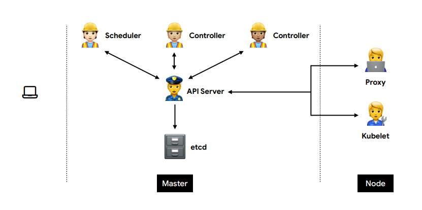
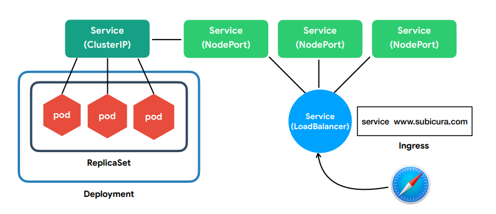
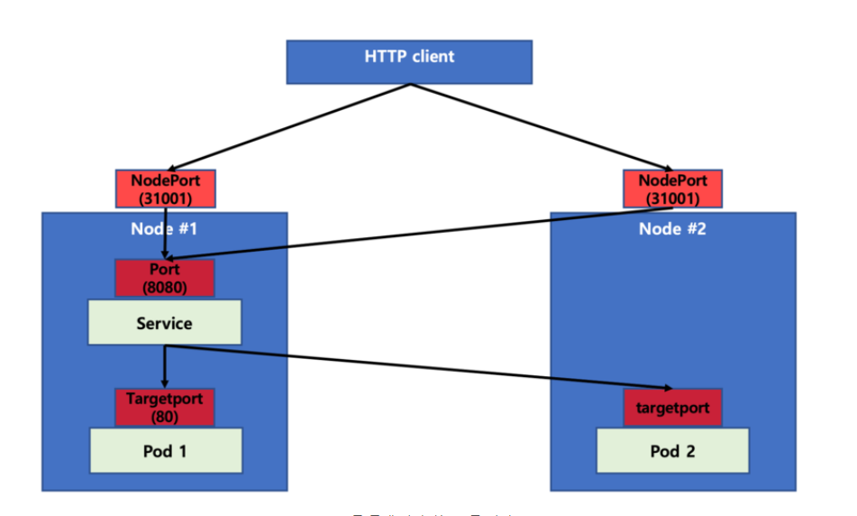

# 쿠버네티스 소개 및 아키텍처

## 소개

### 발음 정리

|   용어   |                발음                |
| :------: | :--------------------------------: |
|  master  |               마스터               |
|   node   |                노드                |
|   k8s    |  쿠버네티스, 케이엣츠, 케이팔에스  |
| kuberctl | 큐브 컨트롤, 큐브 시티엘, 큐브커들 |
|   etcd   |      엣지디, 엣시디, 이티시디      |
|   pod    |           팟, 파드, 포드           |
|  istio   |              이스티오              |
|   helm   |            헬름, 핾, 햄            |
| knative  |           케이 네이티브            |

### 구성/설계 Architecture

### Desired State

- `상태 체크 => 차이점 발견 => 조치` 의 반복을 통해 `현재 상태 == 원하는 상태`를 유지함

- 각각 역할에 맞는 Controller을 띄움으로써 각각의 기능의 상태 체크함

  - ex) Replication, Endpoint, Namespace, Custom, ML, CI/CD

  

### 아키텍처

- Master
  - etcd
    - 모든 상태와 데이터 저장
    - 분산 시스템 => 안정성 :arrow_up: (고가용성) + 가볍고 빠름
    - 정확하게 설계(일관성)
    - Key-Value 형태로 데이터 저장
    - 백업 필수
    - TTL(Time To Live), watch 등 부가 기능 제공
  - API Server
    - 상태를 바꾸거나 조회 요청
    - etcd와 유일하게 통신
    - REST API 형태로 제공
    - 권한 체크 => 요청 허용/차단
    - 관리자 요청 + 다양한 내부 모듈과 통신
    - 수평으로 확장 O
  - Scheduler
    - 새로 생성된 Pod 감지 및 실행할 노드 선택
    - 노드의 현재 상태와 Pod의 요구사항 체크
      - 노드에 라벨 부여 
  - Controller
    - 논리적으로 다양한 컨트롤러 존재
    - 끊임 없이 상태 체크 및 원하는 상태 유지
    - 복잡성을 낮추기 위해 단일 프로세스
- Node
  - kubelet
    - 각 노드에서 실행
    - Pod을 실행/중지 및 상태 체크
    - CRI (Container Runtime Interface)
  - proxy
    - 네트워크 프록시와 부하 분산 역할
    - 성능상의 이유로 프록시 프로그램 X, iptables 또는 IPVS 사용 (설정만 관리)

#### Pod

- 스트리지 및 네트워크를 공유하는 하나 이상의 컨테이너 그룹
- 쿠버네티스에서 생성하고 관리할 수 있는 배포 가능한 가장 작은 컴퓨팅 단위
- 특정 어플리케이션의 단일 인스턴스를 실행하기 위한 것
  - Replication
    - 더 많은 리소스 제공을 위해, 각 인스턴스에 여러 파드 사용
    - 담당 컨트롤러에 의해 그룹으로 생성 및 관리

### Addons

- CNI (네트워크)
- DNS (도메인, 서비스 디스커버리)
- 대시보드 (시각화)

## Objects

### 일반적인 구성

### 오브젝트

- Pod
  - 가장 작은 배포 단위
  - 한 개 이상의 컨테이너가 하나의 pod에 속함
  - 전체 클러스터에서 고유한 ip 할당

- ReplicaSet

  - 여러 개의 pod을 관리
  - 신규 Pod을 생성하거나 기존 Pod을 제거하여 원하는 수(Replicas)를 유지

- Deployment

  - 배포 버전을 관리
  - 파드를 기존 레플리카셋에서 새로운 레플리카셋으로 속도를 제어하며 이동하는 것을 관리
  - 각각의 새로운 레플리카셋은 수정 버전에 따라 업데이트
  - 현재 상태가 안정적이지 않은 경우 디플로이먼트의 이전 버전으로 롤백

- Service(ClusterIp)

  - pod는 동적이지만 서비스는 고유 IP 가짐
  - 클러스터 내부에서 서비스 연결은 DNS 이용 (포드 변경으로 ip가 변경되어도 연결 O)

- Nodeport

  - 노드를 port에 연결시켜 외부에서 접근 가능한 서비스

  - 모든 노드에 동일판 포트로 생성

    

- LoadBalancer
  - 하나의 IP 주소를 외부에 노출
- Ingress
  - 도메인 또는 경로별 라우팅
  - Nginx, HAProxy,.. 사용

### API 호출

### Object Spec 

- apiVersion 
  -  apps/v1, v1, batch/v1, networking.k8s.io/v1, ... 

- kind 
  - Pod, Deployment, Service, Ingress, ... 
- metadata 
  - name, label, namespace, ... 
- spec 
  -  각종 설정 (https://kubernetes.io/docs/reference/generated/kubernetes-api/v1.18) 
- status(read-only) 
  - 시스템에서 관리하는 최신 상태

