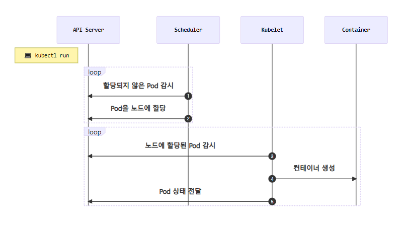
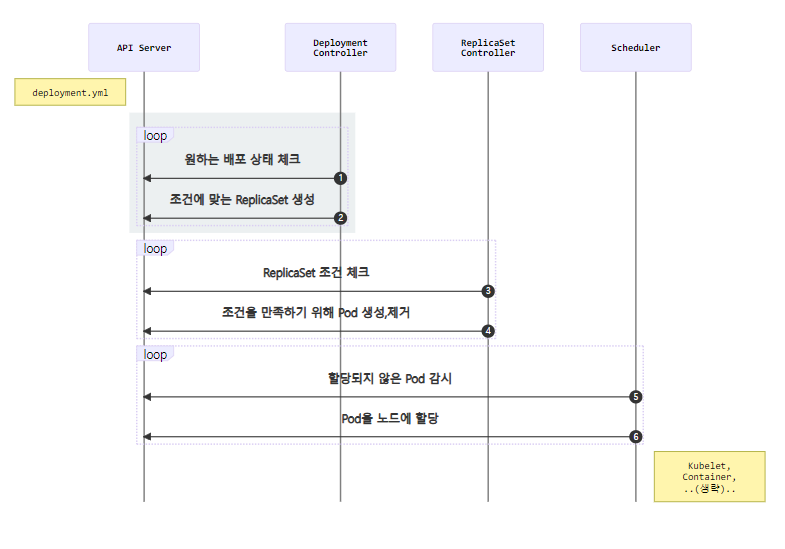
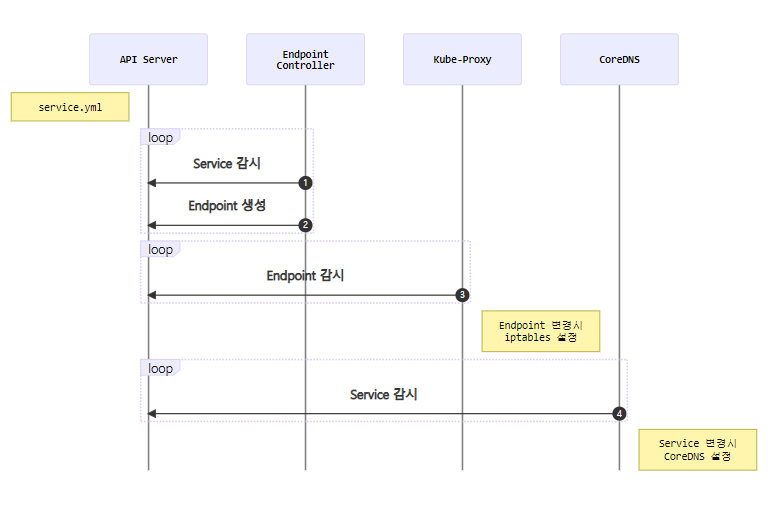

# Kubenetes 기본 실습

`https://subicura.com/k8s/guide/pod.html#%E1%84%88%E1%85%A1%E1%84%85%E1%85%B3%E1%84%80%E1%85%A6-pod-%E1%84%86%E1%85%A1%E1%86%AB%E1%84%83%E1%85%B3%E1%86%AF%E1%84%80%E1%85%B5`


## 기본 명령어


### kubectl 명령어

- apply : 원하는 상태 적용. -f 옵션으로 파일과 함께 사용
- get : 리소스 목록 보여줌
- describe : 리소스 상태 자세히
- delete : 리소스 제거
- logs : 컨테이너의 로그 확인
- exec : 컨테이너에 명령어 전달. 
- config : kubectl 설정 관리


#### tip. alias 설정

```sh
# alias 설정
alias k='kubectl'

# shell 설정 저장
echo "alias k=kubectl" >> ~/.bashrc
source ~/.bashrc
```


### apply

- `kubectl apply -f [파일명 또는 URL]`
- 파일 / URL을 이용해 yml 파일에 담긴 내용으로 배포 


### get

- `kubectl get [TYPE]`
- 쿠버네티스에 선언된 리소스 확인
- 예시

```sh
# Pod 조회
kubectl get pod

# 줄임말(Shortname)과 복수형 사용가능
kubectl get pods
kubectl get po

# 여러 TYPE 입력
kubectl get pod,service
#
kubectl get po,svc

# Pod, ReplicaSet, Deployment, Service, Job 조회 => all
kubectl get all

# 결과 포멧 변경
kubectl get pod -o wide
kubectl get pod -o yaml
kubectl get pod -o json

# Label 조회
kubectl get pod --show-labels
```


### describe

- `kubectl describe [TYPE]/[NAME] 또는 [TYPE] [NAME]`
- 선언된 리소스의 상세한 상태 확인

- 예시

```sh
# Pod 조회로 이름 검색
kubectl get pod

# 조회한 이름으로 상세 확인
kubectl describe pod/wordpress-5f59577d4d-8t2dg # 환경마다 이름이 다릅니다
```


### delete

- `kubectl delete [TYPE]/[NAME] 또는 [TYPE] [NAME]`
- 선언된 리소스 제거
- 예시

```sh
# Pod 조회로 이름 검색
kubectl get pod

# 조회한 Pod 제거
kubectl delete pod/wordpress-5f59577d4d-8t2dg

# 폴더 내 yml에 대응되는 pod 전부 제거
kubectl delete -f ./
```


### logs

- 컨테이너 로그 조회

- 예시

```sh
# Pod 조회로 이름 검색
kubectl get pod

# 조회한 Pod 로그조회
kubectl logs wordpress-5f59577d4d-8t2dg

# 실시간 로그 보기
kubectl logs -f wordpress-5f59577d4d-8t2dg
```

- 하나의 pod에 여러 개의 컨테이너가 있는 경우 `-c` 옵션으로 컨테이너 지정


### exec

- `kubectl exec [-it] [POD_NAME] -- [COMMAND]`
- 컨테이너에 접속하는 명령어

- 예시

```sh
# Pod 조회로 이름 검색
kubectl get pod

# 조회한 Pod의 컨테이너에 접속
kubectl exec -it wordpress-5f59577d4d-8t2dg -- bash
```

- `-it` : 쉘로 접속하여 컨테이너 상태 확인

- 하나의 pod에 여러 개의 컨테이너가 있는 경우 `-c` 옵션으로 컨테이너 지정


### config

```sh
# 현재 컨텍스트 확인
kubectl config current-context

# 컨텍스트 설정
kubectl config use-context minikube
```

- kubectl은 여러 개의 쿠버네티스 클러스터를 컨텍스트로 설정 => 선택 O


### 기타

```sh
# 전체 오브젝트 종류 확인
kubectl api-resources

# 특정 오브젝트 설명 보기
kubectl explain pod
```


## pod


### pod 생성 과정




### pod 생성 yml 파일

```yml
apiVersion: v1
kind: Pod
metadata:
  name: echo
  labels:
    app: echo
spec:
  containers:
    - name: app
      image: ghcr.io/subicura/echo:v1
```

- version : 오브젝트 버전

  - ex) v1, app/v1, networking.k8s.io/v1, ...

- kind : 종류

  - ex) Pod, ReplicaSet, Deployment, Service, ...

- metadata : 메타 데이터

  - ex) name과 label, annotation(주석)으로 구성

- spec : 상세명세

  

### 컨테이너 동작 체크 옵션

- 컨테이너 생성 후 서비스 준비까지 시간 필요 => 접속 가능한지 확인

- livenessProbe

  - 동작 체크 => 정상 동작 X => 컨테이너 재시작

  ```yml
  apiVersion: v1
  kind: Pod
  metadata:
    name: echo-lp
    labels:
      app: echo
  spec:
    containers:
      - name: app
        image: ghcr.io/subicura/echo:v1
        livenessProbe:
          httpGet:
            path: /not/exist
            port: 8080
          initialDelaySeconds: 5
          timeoutSeconds: 2 # Default 1
          periodSeconds: 5 # Defaults 10
          failureThreshold: 1 # Defaults 3
  ```

  - httpGet : 정상 체크 방식 중 1
  - periodSeconds : 체크 확인 주기
  - failureThreshold : 재시작까지 시도 횟수

- readinessProbe

  - 동작 체크 => 정상 동작 X => Pod로 요청 제외

  ```yml
  apiVersion: v1
  kind: Pod
  metadata:
    name: echo-rp
    labels:
      app: echo
  spec:
    containers:
      - name: app
        image: ghcr.io/subicura/echo:v1
        readinessProbe:
          httpGet:
            path: /not/exist
            port: 8080
          initialDelaySeconds: 5
          timeoutSeconds: 2 # Default 1
          periodSeconds: 5 # Defaults 10
          failureThreshold: 1 # Defaults 3
  ```

=> 보통 두개다 세팅


### 다중 컨테이너

```yml
apiVersion: v1
kind: Pod
metadata:
  name: counter
  labels:
    app: counter
spec:
  containers:
    - name: app
      image: ghcr.io/subicura/counter:latest
      env:
        - name: REDIS_HOST
          value: "localhost"
    - name: db
      image: redis
```

- 각각의 컨테이너는 서로 localhost를 통해 접근 O


## ReplicaSet


### 생성 yml

```yml
apiVersion: apps/v1
kind: ReplicaSet
metadata:
  name: echo-rs
spec:
  replicas: 1
  selector:
    matchLabels:
      app: echo
      tier: app
  template:
    metadata:
      labels:
        app: echo
        tier: app
    spec:
      containers:
        - name: echo
          image: ghcr.io/subicura/echo:v1
```

- selector - matchLabels : 해당 label에 일치하는 pod들을 관리하겠다
- template : 관리하는 pod들의 수가 설정 수와 일치하지 않으면 해당 template 참조하여 pod 생성


## Deployment


### Deployment 생성

```yml
apiVersion: apps/v1
kind: Deployment
metadata:
  name: echo-deploy
spec:
  replicas: 4
  selector:
    matchLabels:
      app: echo
      tier: app
  template:
    metadata:
      labels:
        app: echo
        tier: app
    spec:
      containers:
        - name: echo
          image: ghcr.io/subicura/echo:v1
```


### 배포 프로세스




### 버전 관리

```sh
# 히스토리 확인
kubectl rollout history deploy/echo-deploy

# revision 1 히스토리 상세 확인
kubectl rollout history deploy/echo-deploy --revision=1

# 바로 전으로 롤백
kubectl rollout undo deploy/echo-deploy

# 특정 버전으로 롤백
kubectl rollout undo deploy/echo-deploy --to-revision=2
```


### 배포 전략 설정 : RollingUpdate 방식

```yml
apiVersion: apps/v1
kind: Deployment
metadata:
  name: echo-deploy-st
spec:
  replicas: 4
  selector:
    matchLabels:
      app: echo
      tier: app
  minReadySeconds: 5
  strategy:
    type: RollingUpdate
    rollingUpdate:
      maxSurge: 3
      maxUnavailable: 3
  template:
    metadata:
      labels:
        app: echo
        tier: app
    spec:
      containers:
        - name: echo
          image: ghcr.io/subicura/echo:v1
          livenessProbe:
            httpGet:
              path: /
              port: 3000
```

- strategy : 전략 추가
  - maxSurge : 의도한 파드의 수를 넘겨 생성할 수 있는 최대 파드의 수
  - maxUnavailable : 한번에 비활성화 가능 pod 수 (default 25%)


## Service


### ClusterIp

- 클러스터 내부에서 새로운 ip 할당 + 여러 개의 Pod 바라보는 로드밸런서 기능
- DNS : 서비스 이름을 도메인 서버에 등록 => 서비스 이름으로 통신 O

```yml
apiVersion: apps/v1
kind: Deployment
metadata:
  name: redis
spec:
  selector:
    matchLabels:
      app: counter
      tier: db
  template:
    metadata:
      labels:
        app: counter
        tier: db
    spec:
      containers:
        - name: redis
          image: redis
          ports:
            - containerPort: 6379
              protocol: TCP

---
apiVersion: v1
kind: Service
metadata:
  name: redis
spec:
  ports:
    - port: 6379
      protocol: TCP
  selector:
    app: counter
    tier: db
```

- spec.ports.port : 서비스의 port
- spec.ports.targetPort : 서비스가 접근할 pod의 port (서비스와 동일하면 생략)
- spec.selector : 서비스가 관리하는 pod의 label


### NodePort

- 클러스터 외부에서 접근 O

```yml
apiVersion: v1
kind: Service
metadata:
  name: counter-np
spec:
  type: NodePort
  ports:
    - port: 3000
      protocol: TCP
      nodePort: 31000
  selector:
    app: counter
    tier: app
```

- spec.ports.nodePort : node의 port (미지정시 30000-32768 중에 자동 할당)


### LoadBalancer

- 노드가 사라졌을 때 자동으로 다른 노드를 통해 접근이 불가능함 => 노드 관리하는 LoadBalancer
- Service 당 LoadBalancer 1 필요 => Service 생성 시 추가 생성 필요

```yml
apiVersion: v1
kind: Service
metadata:
  name: counter-lb
spec:
  type: LoadBalancer
  ports:
    - port: 30000
      targetPort: 3000
      protocol: TCP
  selector:
    app: counter
    tier: app
```


### Service 생성 흐름



1. `Endpoint Controller`는 `Service`와 `Pod`을 감시하면서 조건에 맞는 Pod의 IP를 수집
2. `Endpoint Controller`가 수집한 IP를 가지고 `Endpoint` 생성
3. `Kube-Proxy`는 `Endpoint` 변화를 감시하고 노드의 iptables을 설정
4. `CoreDNS`는 `Service`를 감시하고 서비스 이름과 IP를 `CoreDNS`에 추가

- endpoint : 서비스의 접속 정보 가지고 있음
