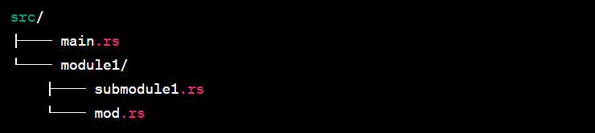

# Introduction

[TOC]


## 소개


### 분류

- systems programming language

:bulb: 특징 : able to reach low-level stuff, getting close to the real hardware world


### 강점

- safety

- concurrency

- speed


## Fundamentals


### cargo

- 역할
  - pacakge manager
  - build system
  - test runner
  - docs generator
- 명렁어
  - `cargo new hello`
    - `hello` 라는 package 생성
    - 생성 파일
      - `Cargo.toml` : config file
      - `main.rs` : rust source file
  - `cargo run`
    - 프로젝트 실행
  - `cargo build`
  - `cargo test`
  
  - `cargo doc`
    - build documentation for your project
  - `cargo publish`
    - publish a library to crates.io
  - `cargo add {crate_name}`
    - Add the crate to your `dependencies` section in `Cargo.toml`
    - `cargo add {crate_name} --features {sub_feature1},{sub_feature2}`
      - optional한 feature은 cargo add로 했을 때 포함이 안 될 수 있음. 이 경우, 직접 명시
    - `cargo-edit` is needed  `cargo install cargo-edit`

:link: [rust-get-started](https://www.rust-lang.org/learn/get-started)


### Cargo.toml

- name : 프로젝트 이름
- version
  - sementic versioning(.으로 구분된 3자리 수)로 버전 표기
    - `MAJOR.MINOR.PATCH`
      - MAJOR (주 버전) : 호환되지 않는 API 변경이 있을 때 증가
      - MINOR (부 버전) : 하위 호환이 유지되는 새로운 기능 추가 시 증가.
      - PATCH (수정 버전) : 하위 호환이 유지되는 버그 수정 시 증가.
- authors
  - 주로 연결된 git으로 자동 생성
- edition


### Cargo Run

- 진행 단계
  - Compiling
    - 코드 변경 X 재실행 => 생략
  - Finished
  - Running
- Debug 모드
  - default로 실행
-  Release 모드
  - Debug보다 빠른 Run 타임 but, 느린 Compile
  - `cargo run --release`


### Variables

- 특징

  - Strongly Typed Language

  - Default Immutable
    - Safety
    - Concurrency
    - Speed

- 기본 선언

    ```rust
    let var = 2;
    ```

    - let : declare

- Type 지정

    ```rust
    let var: i32 = 4;
    ```

- 다중 변수 선언

    ```rust
    let (var1, var2) = (8,50);
    ```

- Mutable 선언

    ```rust
    let mut var = 32;
    var - 2;
    ```

- Const 선언

    ```rust
    const CONST_VAR: f64 = 9.9;
    ```

    - 선언 방법
      - `const`로 선언
      - 변수명 : Screaming snake case로 선언
      - 변수 타입 필수
      - 값은 constant expression
        - compile 시, 알 수 있는 값
    - 사용 이점
      - Function Outside에서 선언되었어도, 어디서든 사용 O
      - compile 시 선언 => REALLY FAST


### Scope

- No Garbage Collector => Block 종료 시, Block 내 선언된 모든 변수 삭제

- Shadowed

  1. 외부 블록 변수에 대한 Shadow

     - 외부 블록의 변수와 같은 이름으로 내부에서 선언 시, 블록 내 변수 사용

     - Variable is always local to the scope

  2. 같은 블록 내 변수에 대한 Shadow

     - 같은 블록 내에서도 선언된 변수에 대해서 재선언 가능

     ```rust
     let mut x = 5;
     let x = x; // now immutable
     ```

     - 다른 타입으로 재선언

     ```rust
     let var = "Sample String";
     let var = make_different(var);
     ```

     :bulb: Data Transform 후 이전 변수 제거 목적으로 자주 사용


### Memory Safety

- Complie 시, 확인

- 모든 변수들은 사용전 Initialize 되어야 함


### Functions

```rust
fn do_stuff(param1: f64, param2: f64) -> f64{
    return param1 * param2; // param1 * param2
}
```

- 선언
  - `fn` 키워드
- naming convention
  - snake_case
- 인자 값
  - `파라미터: 타입` 
  - 다중 인자 시, `,`로 구분
- Return 타입
  - `-> 타입`
- `return` 및 `;` 생략 가능
  - `{return true;}` = `{true}` 

:bulb: 호출 시 인자명으로 지정 X => 선언된 정확한 순서대로 인자 입력

:link: [naming convention](https://rust-lang.github.io/api-guidelines/naming.html)


### 프로젝트 구조

```
my_project/
├── Cargo.toml         # Project metadata and dependencies
├── src/
│   ├── main.rs        # Entry point for the binary crate
│   ├── lib.rs         # Entry point for the library crate (optional)
│   ├── math/
│   │   ├── mod.rs     # Module file for the `math` module
│   │   ├── add.rs     # Submodule for addition functionality
│   │   └── sub.rs     # Submodule for subtraction functionality
│   ├── utils.rs       # A standalone module for utility functions
│   ├── tests/         # Integration tests
│   │   ├── test_foo.rs
│   │   └── test_bar.rs
```

- Libraries
  - **Definition**: A library is a **crate** meant to provide reusable functionality that can be consumed by other projects(crates).
  - **Purpose**: Libraries are designed for external use, often shared via platforms like [crates.io](https://crates.io).
  - **Scope**: Libraries expose functionality through `pub` interfaces that can be imported by other crates.

- Modules

  - **Definition**: Modules (`mod`) are used to organize and encapsulate code **within a single crate**.

  - **Purpose**: They help break down the project into logical parts, improving readability and maintainability.

  - **Scope**: Modules exist only within the crate where they are defined and are not directly reusable outside that crate.

  - 사용법

    - you must declare it in `main.rs` or `lib.rs` using `mod`

      ```rust
      mod {module_directory_name}; // Declare the module
      ```

    - if module is a directory containing submodules, ensure it has a `mod.rs` file

      ```rust
      pub mod sub_module;
      ```

- tests

  - 통합 테스트 작성
  - 모듈의 단위 테스트는 작성된 개별 파일안에 작성 (ex. mod.rs 내 함수들에 대한 단위테스트는 mod.rs 내에 작성)


### Module System

- 자체 Library 추가

  - project root/src/`lib.rs` 생성

  - Library 내 모든 항목은 Default 값으로 Private

    - `pub` : public 

    ```rust
    pub fn greet(){
    	println!("Hi!");
    }
    ```

- 모듈 사용

  - Absolute Path로 Library의 함수 사용 O
    - Absolute Path = Library Name = Name of project In Cargo.toml

      ```rust
      fn main(){
          hello::greet();
      }
      ```

  - `use` 키워드로 모듈 Import 시, Absolute Path 생략 O

      ```rust
      use hello::great;
      
      fn main(){
          greet();
      }
      ```

      - `모듈::*` 시, 모든 메소드 사용 O

  - Rust Standard Library : `std`
  
    - Rust 자체 제공 기본 Library
    - ex) `use std::collections::HashMap;`
    - 해당 Library 관련 정보는 구글에 `rust std {찾는 이름}` 검색
  
  - Rust Package Registry : `crates.io`
  
    - standard에서 미제공하는 Library 등록된 사이트
  
    - `Cargo.toml`에 dependency 추가
  
      - `패키지 이름 = "버전"`
  
      - ex) `rand = "0.6.5"`
    
    - :bulb: **dependency를 추가하더라도 모든 features가 import 되지 않음**
      - defualt로 지정된 feature들만 import가 됨
      - 추가적으로 지정이 필요
        - `tokio = { version = "1", features = ["time", "io", "macros"] }`


#### :bulb: 프로젝트 내 module로 분리하기



- `submodule1.rs`

  ```rust
  // 함수 작성
  ```

- `mod.rs`

  ```rust
  pub mod submodule1; // 모듈화 시킬 파일명 작성
  ```

- `main.rs`

  ```rust
  mod module1; // mod.rs가 있는 상위 폴더명 작성
  // ...
  ```


## Primitive Types & Control Flow


### Scalar Types

- Integer Types

  | Unsigned(부호 없는) | Signed (부호있는) |
  | :-----------------: | :---------------: |
  |         u8          |        i8         |
  |         u16         |        i16        |
  |         u32         |   i32 (default)   |
  |         u64         |        i64        |
  |        u128         |       i128        |
  |        usize        |       isize       |

  - u/i size

    - 메모리 크기와 연관될 때 사용
      - 객체의 크기, 벡터의 인덱싱 등
    - 32bit 환경 => 4byte / 64bit 환경 => 8byte

  - 진법

    |     진법      |  표기   |
    | :-----------: | :-----: |
    |    Decimal    | 1000000 |
    |      Hex      |  0x~~   |
    |     Octal     |  0o~~   |
    |    Binary     |  0b~~   |
    | Byte(u8 only) |  b'A'   |

  - 특징

    - 중간 _ 넣어도 무시됨

- Float

  - f32
  - f64 (default)
    - 64bit 미만 환경에서는 많이 느려짐

- Floating Point Literals

  - statndard :IEEE-754
  - suffix는 필요 없지만, `.` 앞에 숫자 필요

:bulb: Numerical Numbers는 suffix로 타입 명시 O. 

- 다음 두 식 중 선택 O
  - `let x: u16 = 5;`  
  - `let x = 5u16;` or `let x = 5_u16;`

- Boolean

  - type 명시 : `bool`
  - 값 : `true`, `false`

- Character

  - type 명시 이름 x

    - `' '`으로 initiate

  - 크기

    - 4 bytes (32 bits)

      => make array of characters `USC-4` or `UTF-32` string

      => String은 거의 `utf-8` 이기 때문에, character 타입 쓸 일 거의 X


### Compound Types

- 여러 타입의 값들을 하나의 타입으로 모임
- Tuple
  - stores multiple values of any type
  - 선언
    - `let info = (1, 3.3, 999);`
    - `let info: (u8, f64, i32) = (1, 3.3, 999);`
  - 값 접근
    - dot syntax
      - `let var1 = info.0;`
    - destructure
      - `let (var1, var2, var3) = info;`
  - 최대 크기
    - `12` 를 넘어가면, 사용은 가능하지만 제한된 기능 사용
- array

  - stores multiple values of same type
  - 선언
    - `let arr = [1,2,3];`
    - `let arr = [0;3];` 
      - 값;개수
    - `let arr: [f32;2] = [0.0;2];`
  - 접근
    - `let var1 = arr[0];`
  - 최대 크기
    - `32` 를 넘어가면, 사용은 가능하지만 제한된 기능 사용
    
    :bulb: array 자체에는 최대 크기 제한이 없지만, array을 implement하는 traits들이 최대 array 32까지 지원하는 경우가 있음. 
    
    => 32가 넘어가면 해당 trait는 사용 불가
- Vec


### slice

- 개요
  - reference a contiguous sequence of elements in a collection rather than the whole collection
  - A slice is a kind of reference, so it does not have ownership
- 형태
  - `&[T]` (or `&mut [T]`)


### Control Flow

- 조건문

  - if문 사용시 `( )` 필요 X. `if`와 `{}` 사이가 조건식
  - 조건식에는 `boolean` 타입만 허용 (type coercion X)
  - if문은 `expression` 취급 (statement X)

      ```rust
      msg = if num == 5 {
          "five"
      } else if num == 4 {
          "four"
      } else {
          "other"
      };
      ```

      1. `;` 생략으로 return 표현
      2. return 사용 불가
         - return은 function body에만 사용되기에 사용 시 현재 function에서 return out
      3. 모든 block은 같은 type return
      4. 마지막에 `;`
        - if문의 값을 사용할 경우에만 `;` 필요
      
      
      :bulb: expression : 평가가 가능하여 하나의 값으로 환원 O 
     
     :bulb: statement : 실행 가능한 최소의 독립적인 코드 조각.  expression < statement
     
  - `{ }` 는 필수
  
  - 삼항 연산자 없음


- unconditional loop

  ```rust
  loop {
      loop {
          break;
      }
  }
  ```

  - 특정 loop 지정으로 `break` 또는 `continue` 할 loop도 선택 O

  ```rust
  'bob: loop {
      loop {
          break 'bob;
      }
  }
  ```

- conditional loop

  ```rust
  while 조건 {
      
  }
  ```

- for loop

  - iterate : `.iter()`
  	  ```rust
      for num in [7,8,9].iter() {
  	  
      }
      ```

    - collection이 ordered라면 순서대로, 아닐 시 랜덤

  - destructure 가능

    ```rust
    let array = [(1,2), (3,4)];
    for (x,y) in array.iter(){
        // do sth
    }
    ```

  - range : `..`

    ```rust
    for num in 0..50{
        // 0 ~ 49
    }
    ```

    - = 명시시, inclusive
      - `0..=50` 
    - 역순 : `.rev()`
      - `for num in (0..50).rev() {...}`


### String

- at least 6 types in standard library, but 2 are most used
- str
  - called as string slice. In most case, called as borrowed string slice
  - 비교 (vs String)
    - cannot be modified`&str`
  - String type으로 변환
    - `str변수.to_string()` 메소드
    - `String::from(str변수)`
  - 구조
    - ptr (pointer)
    - len

- String

  - can be modified

  - 구조

    - ptr
    - len
    - capacity

    :bulb: str은 String의 subset구조

- 공통점

  - Valid UTF-8
  - can not be indexed by character position (like `my_string[3]`)
    - 서로 다른 언어에서 공통적으로 indexing 하는 것이 불가능
      - grapheme(자소)의 존재 정확하게 byte로 나누기 X

- 인덱싱

  - `~.bytes()` 

    - String을 byte array로 전환
    - ASC2 인 영어라면 사용성 O

  - `~.chars()`

    - Unicode scalars iterate

  - package : `unicode-segmentation`

    - `graphemes(문자열, true)`
      - return iterators that handle graphemes of various types

    :bulb: 인덱싱만 가능하다면, fase, constant-time operation O

  - iterator method : `.nth(숫자)`
    - String의 index 대신 사용


## Ownership


### Ownership

- 의미있는 컴파일 에러 메시지 생성
- 3 Rules
  
  1. Each value has an owner
  2. Only one owner
  3. Value gets dropped if its owner goes out of scope
  
- 동작

  ```rust
  let s1 = String::from("abc");
  let s2 = s1;
  ```

  1. `Stack`에 s1에 대한 ptr, len, capacitry가 저장되며, ptr은 Heap에 저장된 abc 가르킴

  2. `Stack`에 s2에 대한 ptr, len, capacitry가 저장되며, ptr은 Heap에 저장된 abc 가르킴

  3. s1의 Heap value에 대한 연결 해제 시킴. Stack에는 s1 그대로 존재 but 사용 X

     :bulb: shallow copy X. move O

  - Deep Copy

    ```rust
    let s1 = String::from("abc");
    let s2 = s1.clone();
    ```

```rust
let s1 = String::from("abc");
do_stuff(s1);


fn do_stuff(s: String) {
    
}
```

- s1 계속 사용 방법

  1. make s1 mutable

     ```rust
     let mut s1 = String::from("abc");
     s1 = do_stuff(s1);
     
     fn do_stuff(s: String) -> String {
         // ... 
     }
     ```

     - 보통의 경우 사용 X

  2. **Reference & Borrowing**

:bulb: Stack vs heap

| Stack     | Heap          |
| --------- | ------------- |
| In order  | Unordered     |
| Fixed-siz | Variable-size |
| LIFO      | Unordered     |
| Fast      | Slow          |


### Reference & Borrowing

```rust
let s1 = String::from("abc");
do_stuff(&s1);
println!("{}",s1);


fn do_stuff(s: &String) {
    
}
```

- 동작
  - value가 아닌 reference가 do_stuff로 moved/ dropped => s1에 대해서 계속 사용  O

- Lifetimes
  - Rust가 pointer을 자동으로 관리해주는 개념
  - rule : `references must always be valid`
    - valid 하지 않은 reference 사용 X
    - null 값 point X


### Mutable Reference

- reference는 기본적으로 immutable

- muttable 설정

  ```rust
  let mut s1 = String::from("abc");
  do_stuff(&mut s1);
  println!("{}",s1);
  
  
  fn do_stuff(s: &mut String) {
      s.insert_str(0, "Hi, ");
      *s = String::from("Replacement");
  }
  ```

  - muttable value에 대한 muttable reference 설정

  - `.`operator for a method or a field auto-dereferences down to the actual value

    => `.` operator 사용 시, 해당 값이 value, reference, reference of reference 인지 신경 쓸 필요 X

    :bulb: manually dereference : `(*s).insert_str(0, "Hi, ");` 
    
    :bulb: dereference : 주소를 통해 그 값에 접근

- Rule

  - 다음 둘 중 한가지만 가능

    1. Exactly one mutable reference

    2. Any number of immutable references

       => multi thread 환경에서도 적용


## 자료구조

### Structs

- 구성

  - data fields
  - methods
  - associated functions

- 예시

  ```rust
  struct RedFox {
      enemy: bool,
      life: u8,
  }
  ```

  :bulb: 마지막 field에도 , 부착 가능

- Implementation

  ```rust
  impl RedFox {
      fn new() -> Self {
          Self {
              enemy: true,
              life: 70,
          }
      }
  }
  ```

  - associated function을 constructor 처럼 활용
  - parameter로 form of self가 들어가지 않는 메소드가 `associated functions` = class method
  - `Self`는 implementation block 안에서 Struct 이름 대신하여 사용 O

- 생성

  ```rust
  let fox = RedFox::new();
  ```

  - `::` Struct의 associate function 접근

- 필드 접근

  - `.` syntax로  get / set 가능

  ``` rust
  let liff_left = fox.life;
  fox.enemy = false;
  ```

- methods

  ```rust
  impl RedFox {
      fn move(self) ...
      fn borrow(&self) ... 
  }
  ```

  - Method always take some form of self as their `first argument`


### Traits

- similar with interface

- Rust takes composition over inheritance approach

- defines required behavior

  ```rust
  trait Noisy {
      fn get_noise(&self) -> &str;
  }
  
  impl Noisy for RedFox {
      fn get_noise(&self) -> &str {"Meow?"}
  }
  ```

- can start writing `generic functions` that accept any value that implements the traits

  ```rust
  fn print_noise<T: Noisy>(item: T){
      println!("{}", item.get_noise());
  }
  
  fn main() {
      print_noise(fox)
  }
  ```

  - can implement your traits on any types from anywhere including built-in types

  ```rust
  impl Noisy for u8 {
      fn get_noise(&self) -> &str {"BYTE!"}
  }
  
  fn main() {
      print_noise(5_u8); // prints "BYTE!"
  }
  ```

- Define default behavior

  ```rust
  trait Run {
     fn run(&self) {
         println!("I'm running!");
      } 
  }
  
  struct Robot{}
  impl Run for Robot{}
  ```

  - don't need to provide a new definition for the method

- can't define fields as part of traits


### Copy

- special trait
- if implements Copy, it will be copied instead of moved in move situations


### Collections

- `Vec<T>`

  - holds a bunch of one type
  - 선언

      ```rust
      let mut v: Vec<i32> = Vec::new();
      ```

  - 메소드

    ````rust
    v.push(2);
    v.push(4);
    v.push(6);
    let x = v.pop(); // x is 6
    println!("{}", v[1]); // print "4"
    ````

    - `push`
      - appends  things to the end
    - `pop()`
      - removes the item at the end and returns it
    - 등등 다 있음

  - macro

    ```rust
    let mut v = vec![2,4,6];
    ```

    - create vectors from literal values much more ergonomic
    
    :bulb: macro : a way to write code that writes other code, enabling **metaprogramming**

- `HashMap<K, V>`

  - 생성

    ```rust
    let mut h: HashMap<u8, bool> = HashMap::new();
    ```

  - 메소드

    ```rust
    h.insert(5, true);
    h.insert(6, false);
    let have_five = h.remove(&5).unwrap();
    ```

    - also have methods for getting references to values and iterating through keys, values, or (keys, values), 

- 기타 collection

  - `VecDeque`
    - uses a ring buffer => implement a double-ended queue

  - `LinkedList`
  - `HashSet`
  - `BinaryHeap`
    - priority queue

  - `BTreemap`
  - `BTreeSet`
    - needed when map keys or set values to always be sorted


### Enums

- 비교

  - more like algebraic Data Types in Haskell > enums in C
  - simliar with a union in C

  ```rust
  enum Color {
      Red,
      Green,
      Blue,
  }
  ```

  - Enum name은 camel-case

  ```rust
  let color = Color:;Red;
  ```

- 강점

  - Associating data and methods with the variants

    ```rust
    enum DispenserItem {
        Empty, // variant with no data
        Ammo(u8), // variant with single type of data
        Things(String, i32), // variant with tuple
        Place {x: i32, y:i32} // variant with anonymous struct of data
    }
    ```

  - can be any one of those, but only one at a time


  ```rust
  use DispenserItem::*;
  let item1 = Empty;
  let item2 = Ammo(69);
  ```

  - implement functions and methods for an enum

    ```rust
    impl DispenserItem{
        fn display(&self) {      
        }
    }
    ```

  - use enums with generics

    - `Option` is a generic enum in the std library

    ```rust
    enum Option<T> {
        Some(T),
        None,
    }
    ```

    - `Option` enum represents when sth is either absent or present
    - `NULL` 사용하고 싶을 때, Option 사용

- patterns to examine variants in Enum

    - `if let`

        - check single variant

        ```rust
        if let Some(x) = my_variable {
            println!("value is {}", x);
        }
        ```

        - pattern matches => conditon is true => variabls inside the pattern are created

    - `match`

        - check multi variants

        ```rust
        match my_variable {
            Some(x) => {
                println!("value is {}", x);
            },
            
            None => {
                println!("no value");
            },
            
            _ => {
                println!("defualt");
            }
        }
        ```

        - write a branch arm for every possible outcome
          - = match expression must be exhaustive
        - `single unscore` : matches anything => used for defualt / anything-else branch
        - 모든 branch arm은 `같은 타입 return` or `return 값 X` 이어야 함


### Option

- Initiate

  ```rust
  let mut x: Option<i32> = None;
  ```

- 특징

  - Once you use Option with concrete type, compiler infer the type.

    => leave the type annotation off

    ```rust
    let mut x = None;
    x = Some(5);
    ```

- method

  - `is_some()`

    ```rust
    x.is_some(); // true
    ```

  - `is_none()`

    ```rust
    x.is_none(); // false
    ```

- implements Iterator trait

  ```rust
  for i in x {
      println!("{}", i); 
  }
  ```

  

### Result

- 사용

  - whenever sth might have a useful result or might have an error
  - Functions return `Result` whenever errors are expected and recoverable.
  - io module 사용 시, 자주 사용

- Definition

  ```rust
  #[must_use]
  enum Result<T, E> {
      Ok(T),
      Err(E),
  }
  ```

  - `type wrapped by Ok`, and `the type wrapped by Err` are both generic but independent of each other

  - `#[must_use]` annotation makes it a compiler warning to silently drop a result

    => Rust strongly encourages you to look at all possible erros and make a conscious choise what to do with each one

- method
  - `is_ok()`
  - `is_err()`

- 예시

  ```rust
  use std::fs::File;
  
  fn main() {
      let res = File::open("foo");
      let f = res.unwrap();	// If Result is Ok, give you File struct. If Err, crashes the program
  }
  ```

  ```rust
  use std::fs::File;
  
  fn main() {
      let res = File::open("foo");
      let f = res.expect("error message"); // unwrap과 같은 동작. crash 일 때, error message 표시
  }
  ```

  ```rust
  use std::fs::File;
  
  fn main() {
      let res = File::open("foo");
      if res.is_ok() {
          let f = res.unwrap();
      }
  }
  ```


### Closures

- when you spawn a thread, or when you want to do functional programming

- 정의

  - anonymous functions that can borrow or capture some data from the scope it is nested in

- systax

  ```rust
  // with paraemeter
  |x, y| {x+y}
  
  // no parameter
  || {x+y}
  
  // 극단적으로 parameter와 return 둘다 없이도 가능
  || {}
  ```

  - types or arguments and the return value are all inferred from how you use the arguments and what you return

- Borrow Reference

  ```rust
  let s = "sample".to_string();
  let f = || {
      println!("{}", s);
  };
  f(); // print "sample"
  ```

  - closure가 참조하는 변수 보다 오래 살지 않는 이상, 계속 참조 가능
    - 참조 변수가 closure보다 오래 지속됨이 보장되지 않으면 compile X
  - 다른 Thread로 보내는 것은 불가능
    - 현재 Thread가 해당 Thread 보다 일찍 종료될 수 있으므로, 컴파일러가 막음

- Move Semantics

  ```rust
  let s = "sample".to_string();
  let s2 = s.clone();
  let f = move || {
      println!("{}", s2);
  };
  f(); // print "sample"
  ```

  - can force the closure to move any variables it uses into itself and take ownership of them

    => closure와 해당 변수의 수명이 같아짐

    => 다른 Thread로 보내는 것이 가능해짐

  - `clone()`을 통해서, 복제품을 closure에 보낼 수 있음

- Functional Programming

  ```rust
  let mut v = vec![2,4,6];
  
  v.iter()	// java의 stream
  	.map(|&x| x*3)
  	.filter(|x| *x > 10)
  	.fold(0, |acc,x| acc+x); // java의 reduce
  ```

  :bulb: The argument passed to the closure will be reference

- pass closures to or from functions

  - need traits of `std::ops`
    - Fn
    - FnMut
    - FnOnce


### Threads

```rust
use std::thread;

fn main() {
    let thread1 = thread::spawn(move || {
        
    })
    
    thread1.join().unwrap();
}
```

- `thread::spawn` : thread 생성
- `move || {}` : thread의 메인 동작 부분
- `join` : pause the thread until the thread has completed and exited

:bulb: Thread는 비싼 작업. 독립적인 메모리 할당 및 전환 시에는 비싼 context 전환을 해야함


### Future trait

- 개요

  - Rust에서 `async` programming을 다룰 때 사용하는 trait
  - it represents a value that will be available at some point

- 비동기를 사용하기 위한 구성 요소

  - **`async` Functions**
    - `Future`를 반환하는 함수는 `async`로 지정
    - `async`는 lazy하기 때문에 `Future`가 awaited되기 전까지 수행되지 않음

  - **`await` Keyword**:
    - Use `.await` to suspend execution and wait for the `Future` to complete.
    - Other tasks can continue running during this time, enabling concurrency
    - `await` Keyword는 `async` Function 혹은 asynchronous runtime 안에서만 사용할 수 있음
  - **Runtime**:
    - Rust requires an asynchronous runtime to execute `async` functions and poll `Future` instances
    - ex) **Tokio**, **async-std**

  - **Combining Futures**:
    - Use combinators like `.then()`, `.and_then()`, `.map()` to chain and compose `Future` instances.

- 사용

  1. Ensure Runtime Setup

     - Use `#[tokio::main]` or `#[tokio::test]` to initialize the runtime

     - or manually create runtime

       ```rust
       // Create a tokio runtime
       let runtime = Runtime::new().expect("Failed to create Tokio runtime");
       
       // Run the bot
       runtime.block_on(
         // async function
       );
       ```

  2. Always Await Futures

     - Call `.await` for any `async` method or combinator to ensure it completes.

  3. Error Handling

     - Wrap calls in `match` or `?` to gracefully handle errors.


## Code Practice


### Varaibles

```rust
const STARTING_MISSILES: i32 = 8;
const READY_AMOUNT: i32 = 2;

fn main() {
    
    let (mut missiles, ready)  = (STARTING_MISSILES, READY_AMOUNT);
    // let ready = READY_AMOUNT;

    println!("Firing {} of my {} missiles...", ready, missiles);

    missiles = missiles - ready;
    println!("{} missiles left", missiles);
   
}
```


### Functions

```rust
// Silence some warnings so they don't distract from the exercise.
#![allow(unused_variables)]

fn main() {
    let width = 4;
    let height = 7;
    let depth = 10;
    // 1. Try running this code with `cargo run` and take a look at the error.
    //
    // See if you can fix the error. It is right around here, somewhere.  If you succeed, then
    // doing `cargo run` should succeed and print something out.
    
    let area = area_of(width, height);
    
    println!("Area is {}", area);

    // 2. The area that was calculated is not correct! Go fix the area_of() function below, then run
    //    the code again and make sure it worked (you should get an area of 28).

    // 3. Uncomment the line below.  It doesn't work yet because the `volume` function doesn't exist.
    //    Create the `volume` function!  It should:
    //    - Take three arguments of type i32
    //    - Multiply the three arguments together
    //    - Return the result (which should be 280 when you run the program).
    //
    // If you get stuck, remember that this is *very* similar to what `area_of` does.
    //
    println!("Volume is {}", volume(width, height, depth));
}

fn area_of(x: i32, y: i32) -> i32 {
    // 2a. Fix this function to correctly compute the area of a rectangle given
    // dimensions x and y by multiplying x and y and returning the result.
    //
    x*y
    // Challenge: It isn't idiomatic (the normal way a Rust programmer would do things) to use
    //            `return` on the last line of a function. Change the last line to be a
    //            "tail expression" that returns a value without using `return`.
    //            Hint: `cargo clippy` will warn you about this exact thing.
}

fn volume(width: i32, height: i32, depth: i32) -> i32{
    width*height*depth
}
```


### Types

- main.rs

```rust
// Silence some warnings so they don't distract from the exercise.
#![allow(dead_code, unused_variables)]
use ding_machine::*;

fn main() {
    let coords: (f32, f32) = (6.3, 15.0);
    // 1. Pass parts of `coords` to the `print_difference` function. This should show the difference
    // between the two numbers in coords when you do `cargo run`.  Use tuple indexing.
    //
    // The `print_difference` function is defined below the `main` function. It may help if you look
    // at how it is defined.
    //
    let (x, y) = coords;
    print_difference( x, y );   // Uncomment and finish this line


    // 2. We want to use the `print_array` function to print coords...but coords isn't an array!
    // Create an array of type [f32; 2] and initialize it to contain the
    // information from coords.  Uncomment the print_array line and run the code.
    //
    let coords_arr: [f32;2] = [0.0;2];               // create an array literal out of parts of `coord` here
    print_array(coords_arr);        // and pass it in here (this line doesn't need to change)


    let series = [1, 1, 2, 3, 5, 8, 13];
    // 3. Make the `ding` function happy by passing it the value 13 out of the `series` array.
    // Use array indexing.  Done correctly, `cargo run` will produce the additional output
    // "Ding, you found 13!"
    //
    ding(series[6]);


    let mess = ([3, 2], 3.14, [(false, -3), (true, -100)], 5, "candy");
    // 4. Pass the `on_off` function the value `true` from the variable `mess`.  Done correctly,
    // `cargo run` will produce the additional output "Lights are on!" I'll get you started:
    //
    on_off(mess.2[1].0);

    // 5.  What a mess -- functions in a binary! Let's get organized!
    //
    // - Make a library file (src/lib.rs)
    // - Move all the functions (except main) into the library
    // - Make all the functions public with `pub`
    // - Bring all the functions into scope using use statements. Remember, the name of the library
    //   is defined in Cargo.toml.  You'll need to know that to `use` it.
    //
    // `cargo run` should produce the same output, only now the code is more organized. 🎉

    // Challenge: Uncomment the line below, run the code, and examine the
    // output. Then go refactor the print_distance() function according to the
    // instructions in the comments inside that function.

    print_distance(coords);
}

```

- lib.rs

```rust
pub fn print_difference(x: f32, y: f32) {
    println!("Difference between {} and {} is {}", x, y, (x - y).abs());
}

pub fn print_array(a: [f32; 2]) {
    println!("The coordinates are ({}, {})", a[0], a[1]);
}

pub fn ding(x: i32) {
    if x == 13 {
        println!("Ding, you found 13!");
    }
}

pub fn on_off(val: bool) {
    if val {
        println!("Lights are on!");
    }
}

pub fn print_distance((x,y): (f32, f32)) {
    // Using z.0 and z.1 is not nearly as nice as using x and y.  Lucky for
    // us, Rust supports destructuring function arguments.  Try replacing "z" in
    // the parameter list above with "(x, y)" and then adjust the function
    // body to use x and y.
    println!(
        "Distance to the origin is {}",
        ( x.powf(2.0) + y.powf(2.0) ).sqrt());
}
```


### Control Flow

```rust
// Silence some warnings so they don't distract from the exercise.
#![allow(dead_code, unused_mut, unused_variables)]

fn main() {
    // This collects any command-line arguments into a vector of Strings.
    // For example:
    //
    //     cargo run apple banana
    //
    // ...produces the equivalent of
    //
    //     vec!["apple".to_string(), "banana".to_string()]
    let args: Vec<String> = std::env::args().skip(1).collect();

    // This consumes the `args` vector to iterate through each String
    for arg in args {
        // 1a. Your task: handle the command-line arguments!
        //
        // - If arg is "sum", then call the sum() function
        // - If arg is "double", then call the double() function
        // - If arg is anything else, then call the count() function, passing "arg" to it.
        if arg == "sum"{
            sum();
        } else if arg == "double" {
            double();
        } else {
            count(arg);
        }


        // 1b. Now try passing "sum", "double" and "bananas" to the program by adding your argument
        // after "cargo run".  For example "cargo run sum"
    }
}

fn sum() {
    let mut sum = 0;
    // 2. Use a "for loop" to iterate through integers from 7 to 23 *inclusive* using a range
    // and add them all together (increment the `sum` variable).  Hint: You should get 255
    // Run it with `cargo run sum`

    for i in 7..=23 {
        sum += i;
    }


    println!("The sum is {}", sum);
}

fn double() {
    let mut count = 0;
    let mut x = 1;
    // 3. Use a "while loop" to count how many times you can double the value of `x` (multiply `x`
    // by 2) until `x` is larger than 500.  Increment `count` each time through the loop. Run it
    while x <= 500 {
        x *= 2;
        count+=1;
    }
    // with `cargo run double`  Hint: The answer is 9 times.


    println!("You can double x {} times until x is larger than 500", count);
}

fn count(arg: String) {
    // Challenge: Use an unconditional loop (`loop`) to print `arg` 8 times, and then break.
    // You will need to count your loops, somehow.  Run it with `cargo run bananas`
    let mut count = 0;
    
    'myLoop: loop {
        print!("{} ", arg);
        count += 1;
        if count == 8{
            break 'myLoop;
        }
    }
     // Execute this line 8 times, and then break. `print!` doesn't add a newline.


    println!(); // This will output just a newline at the end for cleanliness.
}

```


### ownership_reference

```rust
// Silence some warnings so they don't distract from the exercise.
#![allow(unused_mut, unused_variables)]

fn main() {
    // This fancy stuff either gets the first argument as a String, or prints
    // usage and exits if an argument was not supplied to the program.
    let mut arg: String = std::env::args().nth(1).unwrap_or_else(|| {
        println!("Please supply an argument to this program.");
        std::process::exit(-1);
    });

    // 1. Write a function `inspect` that takes a reference to a String, returns nothing, but
    // prints whether the contents of the String is plural or singular. Then uncomment and run this
    // code with `cargo run apple` and `cargo run apples'.  Hint: use `.ends_with("s")` on the
    // String reference
    //
    inspect(&arg);

    // 2. Write a function `change` that takes a *mutable* reference to a String and adds an "s" to
    // the String if it doesn't already end with "s". Then uncomment and run the code below with
    // `cargo run apple`.  Hint: use `.push_str("s")` on the mutable String reference to add an "s".
    //
    change(&mut arg);
    println!("I have many {}", arg);

    // 3. Write a function `eat` that accepts ownership of (consumes) a String and returns a bool
    // indicating whether or not the String both starts with a "b" AND contains an "a".
    // Hint 1: use `.starts_with("b")` and `.contains("a")`
    // Hint 2: `&&` is the boolean "AND" operator
    //
    if eat(arg) {
        println!("Might be bananas");
    } else {
        println!("Not bananas");
    }

    // Try running this program with "boat", "banana", and "grapes" as the arguments :-)

    // Challenge: Write a function "bedazzle" that takes a mutable reference to a String and
    // ignores what is in the string and replaces the contents of the string with the String
    // "sparkly". Then uncomment the code below.
    //
    // Hint: You will need to dereference the mutable reference in order to assign it a
    // new value.
    //
    let mut material = "mud".to_string();
    println!("This material is just `{}`.", material);
    bedazzle(&mut material);
    println!("Wow! Now the material is `{}`!", material);
}


fn inspect( x: &str){
    if !x.ends_with("s"){
        println!("singular");
    } else {
        println!("plural");
    }
    
}

fn change( x: &mut String){

    if !x.ends_with("s"){
        x.push_str("s");
    } 
}

fn eat( x: String) -> bool {
    x.starts_with("b") && x.contains("a")
}

fn bedazzle (x : &mut String) {
    *x = String::from("sparkly");
}
```


### Collections_Enums

```rust
// Silence some warnings that could distract from the exercise
#![allow(unused_variables, unused_mut, dead_code)]

// Someone is shooting arrows at a target.  We need to classify the shots.
//
// 1a. Create an enum called `Shot` with variants:
// - `Bullseye`
// - `Hit`, containing the distance from the center (an f64)
// - `Miss`
enum Shot {
    Bullseye,
    Hit(f64),
    Miss,
}

// You will need to complete 1b as well before you will be able to run this program successfully.
impl Shot {
    // Here is a method for the `Shot` enum you just defined.
    // 1b. Implement this method to convert a Shot into points
        // - return 5 points if `self` is a `Shot::Bullseye`
        // - return 2 points if `self` is a `Shot::Hit(x)` where x < 3.0
        // - return 1 point if `self` is a `Shot::Hit(x)` where x >= 3.0
        // - return 0 points if `self` is a Miss
    
    fn points(self) -> i32 {
        match self {
           Shot::Bullseye => {
                5
            },
            Shot::Hit(x) => {
                if x < 3.0 {
                    2
                } else {
                    1
                }
            },
            Shot::Miss => {
                0
            },
        }
        
    }
}

fn main() {
    // Simulate shooting a bunch of arrows and gathering their coordinates on the target.
    let arrow_coords: Vec<Coord> = get_arrow_coords(5);
    let mut shots: Vec<Shot> = Vec::new();

    // 2. For each coord in arrow_coords:
    //
    //   A. Call `coord.print_description()`
    //   B. Append the correct variant of `Shot` to the `shots` vector depending on the value of
    //   `coord.distance_from_center()`
    //      - Less than 1.0 -- `Shot::Bullseye`
    //      - Between 1.0 and 5.0 -- `Shot::Hit(value)`
    //      - Greater than 5.0 -- `Shot::Miss`

    for coord in arrow_coords {
        coord.print_description();
        let distance = coord.distance_from_center();
        if distance < 1.0 {
            shots.push(Shot::Bullseye)
        } else if distance >= 1.0 && distance < 5.0 {
            shots.push(Shot::Hit(distance))
        } else {
            shots.push(Shot::Miss)
        }
    }


    let mut total = 0;
    // 3. Finally, loop through each shot in shots and add its points to total
    for shot in shots {
        total += shot.points();
    }

    println!("Final point total is: {}", total);
}

// A coordinate of where an Arrow hit
#[derive(Debug)]
struct Coord {
    x: f64,
    y: f64,
}

impl Coord {
    fn distance_from_center(&self) -> f64 {
        (self.x.powf(2.0) + self.y.powf(2.0)).sqrt()
    }
    fn print_description(&self) {
        println!(
            "coord is {:.1} away, at ({:.1}, {:.1})",
            self.distance_from_center(),
            self.x,
            self.y);
    }

}

// Generate some random coordinates
fn get_arrow_coords(num: u32) -> Vec<Coord> {
    let mut coords: Vec<Coord> = Vec::new();
    for _ in 0..num {
        let coord = Coord {
            x: (rand::random::<f64>() - 0.5) * 12.0,
            y: (rand::random::<f64>() - 0.5) * 12.0,
        };
        coords.push(coord);
    }
    coords
}
```


### Closure Thread

```rust
// Silence some warnings so they don't distract from the exercise.
#![allow(dead_code, unused_imports, unused_variables)]
use crossbeam::channel;
use std::thread;
use std::time::Duration;

fn expensive_sum(v: Vec<i32>) -> i32 {
    pause_ms(500);
    println!("Child thread: just about finished");
    // 1a. Between the .iter() and the .sum() add a .filter() with a closure to keep any even
    // number (`x % 2` will be 0 for even numbers).
    // 1b. Between the .filter() and the .sum() add a .map() with a closure to square the values
    // (multiply them by themselves)
    //
    // In the closures for both the .filter() and .map() the argument will be a reference, so you'll
    // either need to dereference the argument once in the parameter list like this: `|&x|` or you
    // will need to dereference it each time you use it in the expression like this: `*x`
    v.iter()
        .filter(|x| *x%2==0) // .filter() goes here
        .map(|&x| x*x) // .map() goes here
        .sum()
}

fn pause_ms(ms: u64) {
    thread::sleep(Duration::from_millis(ms));
}

fn main() {
    let my_vector = vec![2, 5, 1, 0, 4, 3];

    // 2. Spawn a child thread and have it call `expensive_sum(my_vector)`.  Store the returned
    // join handle in a variable called `handle`. Once you've done this you should be able to run
    // the code and see the Child thread output in the middle of the main thread's letters
    //
    let handle = thread::spawn(move || {
        expensive_sum(my_vector)
    });

    // While the child thread is running, the main thread will also do some work
    for letter in vec!["a", "b", "c", "d", "e", "f"] {
        println!("Main thread: Letter {}", letter);
        pause_ms(200);
    }

    // 3. Let's retrieve the value returned by the child thread once it has exited.  Using the
    // `handle` variable you stored the join handle in earlier, call .join() to wait for the thread
    // to exit with a `Result<i32, Err>`.  Get the i32 out of the result and store it in a `sum`
    // variable.  Uncomment the println.  If you did 1a and 1b correctly, the sum should be 20.
    //
    let result = handle.join();
    let sum: i32 = if result.is_ok() {
        result.unwrap()
    } else {
        -1
    };
    
    println!("The child thread's expensive sum is {:?}", sum);

    // Time for some fun with threads and channels!  Though there is a primitive type of channel
    // in the std::sync::mpsc module, I recommend always using channels from the crossbeam crate,
    // which is what we will use here.
    //
    // 4. Uncomment the block comment below (Find and remove the `/*` and `*/`).  Examine how the
    // flow of execution works.  Once you understand it, alter the values passed to the `pause_ms()`
    // calls so that both the "Thread B" outputs occur before the "Thread A" outputs.

    
    let (tx, rx) = channel::unbounded(); // Sender<i32>, Receiver<i32>
    // Cloning a channel makes another variable connected to that end of the channel so that you can
    // send it to another thread.
    let tx2 = tx.clone();

    let handle_a = thread::spawn(move || {
        pause_ms(200);
        tx2.send("Thread A: 1").unwrap();
        pause_ms(200);
        tx2.send("Thread A: 2").unwrap();
    });

    pause_ms(100); // Make sure Thread A has time to get going before we spawn Thread B

    let handle_b = thread::spawn(move || {
        pause_ms(0);
        tx.send("Thread B: 1").unwrap();
        pause_ms(0);
        tx.send("Thread B: 2").unwrap();
    });

    // Using a Receiver channel as an iterator is a convenient way to get values until the channel
    // gets closed.  A Receiver channel is automatically closed once all Sender channels have been
    // closed.  Both our threads automatically close their Sender channels when they exit and the
    // destructors for the channels get automatically called.
    for msg in rx { // sending side가 전부 닫히기 전까지 계속 loop를 돌고 있음
        println!("Main thread: Received {}", msg);
    }

    // Join the child threads for good hygiene.
    handle_a.join().unwrap();
    handle_b.join().unwrap();
    

    // Challenge: Make two child threads and give them each a receiving end to a channel.  From the
    // main thread loop through several values and print each out and then send it to the channel.
    // On the child threads print out the values you receive. Close the sending side in the main
    // thread by calling `drop(tx)` (assuming you named your sender channel variable `tx`).  Join
    // the child threads.
    println!("Main thread: Exiting.");

    let (ts, tr) = channel::unbounded();
    let tr2 = tr.clone();

    for i in vec![2,4,6,8,10] {
        println!("{}", i);
        ts.send(i).unwrap();
    }
    drop(ts);

    let handle_c = thread::spawn( || {
        for msg in tr2 {
            pause_ms(200);
            println!("thread c: Received {}", msg);
        }
    });

    let handle_d = thread::spawn( || {
        for msg in tr {
            pause_ms(200);
            println!("thread d: Received {}", msg);
        }
    });
    handle_c.join().unwrap();
    handle_d.join().unwrap();

}

```

