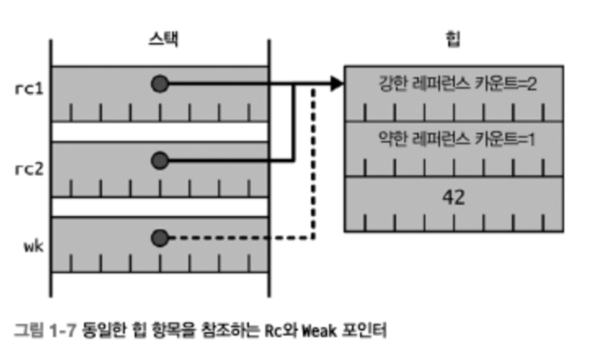

# Effective Rust


# Item 1. 데이터 구조를 타입 시스템으로 표현하라


### 튜플 구조체

구조체 전체에 대해서는 이름을 붙일 수 있지만, 개별 필드에는 이름이 없고, s.0, s.1 등과 같은 숫자로 표현


### enum 사용법

- enum을 사용하여 파라미터를 지정하면 호출 지점의 가독성과 타입 안정성을 높일 수 있음

  - 올바르지 않은 코드

    ```rust
    pub fn print_page(both_sides: bool, color:bool) { }
    ```

  - 올바른 코드

    ```rust
    pub enum Sides {
      Both,
      Single,
    }
    pub enum Output {
      BlackAndWhite,
      Color,
    }
    
    pub fn print_page(sides: Sides, color: Output) {
      //…
    }
    ```

    - bool 타입 인수를 받도록 정의할 때와 달리, 라이브러리 사용자가 실수로 인수의 순서를 바꿔적으면 컴파일러가 즉시 오류 메시지를 출력

    - 항상 bool 타입임을 나타낸다면 뉴타입 패턴을 사용하고, 새로운 대안이 나올 가능성이 있다면 enum을 사용하는 것이 좋음

- enum에 대한 타입 안정성은 match 표현식으로도 보장 가능하다.

  - 컴파일러는 enum으로 표현되는 모든 경우의 수를 프로그래머가 반드시 검토하도록 요구

  - 모든 가능성을 고려해야 한다는 특성 때문에 기존 enum에 배리언트를 새로 추가하는 것은 중대한 변경에 해당

- 유효하지 않은 상태가 타입에 표현될 수 없게 만들어야 함

  - 올바르지 않은 코드

    ```rust
    pub struct DisplayProps {
      pub x: u32,
      pub y: u32,
      pub monochrome: bool,
      // monochrome 이 참이면 fg_color는 반드시 (0, 0, 0) 이어야 한다.
      pub fg_color: Rgbcolor,
    }
    ```

  - 올바른 코드

    ```rust
    pub enum Color 1
      Monochrome,
      Foreground (RgbColor),
    }
    
    pub struct DisplayProps {
      pub x: u32,
      pub y: u32,
      pub color: Color,
    }
    ```

    - '데이터를 담을 수 있는 enum' 으로 표현하는 것이 바람직


### 흔히 사용하는 enum 타입

- `Option<T>`

  - 특정 타입의 값이 있을 수도 있고, 없을 수도 있음을 나타냄

  - **값이 없을 수도 있는 경우는 반드시 Option으로 표현**
    - ex) 값이 없을 수 있는 String을 다룰 때, `""`보단 `Option<String>`이 더 명확하게 표현 가능

  - 고려할 점. 컬렉션을 다룰 때, 원소가 없는 경우와 컬렉션이 없는 경우가 같은 의미인지 결정 필요

- `Result<T,E>`

  - 오류 처리에서 흔히 사용

  - **실패할 수 있는 연산 결과는 항상 Result로 인코딩**


### :bulb: TIP

- 러스트의 타입 시스템은 엄격하기 때문에 항상 대상을 명확히 표현해야 한다.

- Rust allows inline comments like this anywhere in the code
  - `print_page(/* both_sides= */ true, /* color= */ false);`


## Item 2. 공통 동작은 타입 시스템으로 표현하라


### 함수와 메서드

- 반환값을 `-> ()`로도 표현할 수 있음
- enum 타입에도 메서드를 정의할 수 있음
  - 메서드 시그니처는 입력과 출력에 대한 타입 정보를 제공

- 메서드는 첫 번째 입력으로 다양한 형태의 self를 받는데, 이를 통해 작업의 성격을 나타냄

  - `&self` 매개변수는 데이터 구조의 내용을 읽을 수는 있지만 수정할 수는 없음

  - `&mut self` 매개변수는 메서드가 데이터 구조의 내용을 수정할 수 있음을 나타냄

  - `self` 매개변수는 메서드가 데이터 구조를 소비함을 나타냄


### 함수 포인터

- 개념
  - 특정 코드(함수)를 가리키는 포인터로서 타입은 함수의 시그니처로 정의
  - 프로그램이 실행될 시점에는 포인터의 크기에 맞는 값만 오게 된다.
- 함수 vs 함수 포인터

  ```rust
  fn sum(x: i32, y: i32) -> 132 {
    x + y
  }
  // ' f n 타입으로 명시적 강제 변환(coercion)해야 한다.
  Let op: fn(i32, i32) -> i32 = Sum;
  ```
  
  - 함수 (`sum`)
    - sum의 타입은 컴파일러 내부에서만 사용하는 타입(`fn(i32, i32) -> i32 {main::sum}`)
    - 최적화를 위해 함수의 시그니처와 위치를 모두 인코딩한다.
      - 함수와 함수 시그니처를 식별하는데 사용
    - 값으로 취급 불가능
  - 함수 포인터 (`op`)
    - 사용자 코드에서 작성할 수 있는 타입
    - 값으로 취급 가능
      - 다른 변수에 `Copy`, 혹은  `==`와 같은 비교 수행 가능

- 한계
  - 매개변수를 통해 명시적으로 지정한 값만 호출된 함수의 입력값으로 전달할 수 있음
  - 외부 상태를 기반으로 수정해야 할 때, 그 상태를 함수 포인터로 전달할 방법이 없음

  ```rust
  // 오류
  let amount_to_add = 3;
  fn add_n(v: U32) -> U32 {
    v + amount_to_add
  }
  ```


### 클로저

- 개념

  - 함수 정의의 본문(람다 표현식)과 같은 코드 블록으로 다음과 같은 차이가 있음

    - 표현식의 일부로 만들 수 있어서 이름을 붙일 필요가 없음

    - 입력 매개변수는 `|param1, param2|`와 같이 파이프로 묶는다 (타입은 대부분 컴파일러 자동으로 추론)

    - 주변 환경을 캡처할 수 있다.

  - 캡처 동작

    1. 컴파일러는 람다 표현식으로 언급하는 환경을 구성하는 모든 부분에 대해 일회용 내부 타입을 생성
       - 개념적인 컨텍스트에 저장된 값은 레퍼런스인 경우가 많음
       - 단, 환경에 있는 것에 대한 가변 레퍼런스이거나, 입력 매개변수 앞에 move 키워드를 사용해 환경에서 이동된 값일 수 있음
    2. 클로저가 생성되는 시점에 앞서 만들어 둔 일회용 타입의 인스턴스를 생성해 환경값을 보관
    3. 클로저가 호출되면 해당 인스턴스를 컨텍스트에 추가해서 사용

- 사용
  - 함수 포인터를 받는 자리에 클로저를 바로 전달할 수는 없음
  - 클로저를 받게 하려면 Fn* 트레이트 인스턴스를 받도록 수정

- Fn* 트레이트

  - 종류

    - `FnOnce`
      - 한 번만 호출할 수 있는 클로저
      - move를 통해 환경의 일부를 콜로저의 컨텍스트로 이동 
    - `FnMut`
      - 여러 번 반복 호출 가능
      - 값들을 가변형으로 대여

    - `Fn`
      - 여러 번 반복 호출
      - 값을 환경에서 불변형으로만 빌려옴

  - 구현
    - 컴파일러는 코드에 나온 람다 표현식을 모두 적절한 Fn* 트레이트로 자동으로 구현
      - `FnOnce` : 이동된 값이 있을 때
      - `FnMut` : 값에 대한 가변 레퍼런스(&mut T)가 있을 때
      - `Fn` : 값에 대한 일반 레퍼런스(&T)가 있을 때
    - 단, Fn* 트레이트를 직접 구현할 수는 없음

  - 특징

    - FnMut와 Fn 트레이트는 각각 FnOnce와 FnMut 트레이트를 트레이트 바운드로 갖음
    - 원시 함수 포인터 타입인 fn 역시 개념상 Fn 트레이트에 해당

    => 결론적으로 클로저를 받는 코드를 작성할 때는 가장 범용적인 Fn* 트레이트를 사용해 호출자의 자유도를 극대화하는 것이 좋음


:triangular_flag_on_post: **원시 함수 포인터(fn)보다는 Fn* 트레이트 바운드를 사용하는 것이 좋다**


### 트레이트

- 개념
  - 트레이트는 내부 항목을 외부에서 사용할 수 있게 공개하는데 관련된 함수들의 집합을 정의 (인터페이스 유사)
    - 단, 사용될 데이터도 함께 제공할 수 있음
  - 대부분 self 또는 그 변형을 첫 번째 인수로 받는 메서드로 정의
  - 객체 지향 스타일로 코드와 데이터를 하나로 캡슐화한 공통 추상화를 제공
    - 유연성이 필요할 것 같으면, **구체적인 타입보다는 트레이트 타입을 받게 만들어라**

- **마커 트레이트**
  - 간혹 어떤 동작을 타입 시스템으로 구분하고 싶은데, 함수 시그니처로는 표현할 수 없는 경우

    ```rust
    pub trait Sort {
      // 내용을 순서에 맞게 정렬한다.
      fn sort(&mut self);
    }
    /// ['Sort ['Sort]가 안정적으로 정렬된다고 알려 주는 마커 트레이트
    pub trait StableSort: Sort 0
    ```
    
    - '내 구현은 안정적으로 정렬됨을 엄숙히 선언'을 의미

  - 불변성을 유지하는 신뢰 관계 형성

    :triangular_flag_on_post: **트레이트 함수 시그니처로 표현할 수 없는 동작은 마커 트레이트로 구분**

- **트레이트 바운드**
  
  - 타입 T를 매개변수로 받도록 정의한 제네릭 코드에서, 타입 T가 특정한 트레이트를 구현하는 경우에만 받을 수 있게 제한
  - 제네릭이 단형화되는 컴파일 타임에 수행
    - 단형화 : 임의의 타입 T에 대해 처리하도록 정의된 제네릭 코드가 특정한 타입을 처리하도록 변환되는 것
  - 트레이트 바운드가 없으면 모든 타입(T)에 적용되는 연산만 수행할 수 있음 
    - (그렇게 되면 기본 연산 외에는 할 수 있는 것이 많지 않다.)
  
  ```rust
  pub fn dump_sorted<T>(mut collection: T)
  where
    T: Sort + Intolterator,
    T:: Item: std:: fmt:: Debug,
  {
    // 다음 줄을 위해서는 'T: Sort 라는 트레이트 바운드를 붙여야 한다.
    collection.sort;
    // 다음 줄을 위해서는 'T: IntoIterator°라는 트레이트 바운드를 붙여야 한다.
    for item i n collection {
      // 다음 줄을 위해서는 'T::Item : Debug' 라는 트레이트 바운드를 붙여야 한다.
      printin! ("{:?)", item);
    }
  }
  ```
  
  :triangular_flag_on_post: **제네릭에서 사용하는 타입에 대한 조건은 트레이트 바운드로 표현하라**
  
- **트레이트 객체**
  
  - **동적 디스패치**
    - 다양한 트레이트 구현 중에서 하나를 선택하는 시점이 컴파일 타임이 아닌 런타임
    - 동적인 특성 때문에 트레이트 객체를 레퍼런스나 포인터 등으로 간접적으로 처리 (컴파일 시점에는 객체의 크기를 알 수 없기 때문)
  - **객체 안정성**
    - Self와 제네릭 함수를 사용할 없다는 제약 사항을 묶어서 **객체 안정성**이라 부름
      - Self 사용 불가 : Self의 크기를 알지 못해, Self를 반환하거나 수신자 이외에 Self를 사용하는 인수 X (레퍼런스는 O)
      - 제네릭 사용 불가 : 제네릭 포함 시, 컴파일러가 객체를 단일 타입으로 고정할 수 없음
    - 객체 안정성을 만족하는 트레이트만 트레이트 객체로 사용할 수 있음


:bulb: **트레이트 바운드** vs **트레이트 객체**

| **특징**             | **트레이트 바운드**            | **트레이트 객체**                  |
| -------------------- | ------------------------------ | ---------------------------------- |
| **디스패치 방식**    | 정적 디스패치 (컴파일 시 결정) | 동적 디스패치 (런타임에 결정)      |
| **성능**             | 빠르고, 런타임 비용 없음       | 느리며, 런타임 비용 발생           |
| **유연성**           | 제한적 (고정된 타입에 적합)    | 유연함 (다양한 타입 처리 가능)     |
| **사용 방법**        | `T: Trait`                     | `&dyn Trait` 또는 `Box<dyn Trait>` |
| **코드 크기**        | 제네릭 타입마다 코드 증가 가능 | 동일한 코드 사용                   |
| **객체 안전성 요구** | 필요 없음                      | 필요                               |

```rust
// [트레이트 바운드 제한 예시]
fn draw_all<T: Drawable>(shapes: Vec<T>) { // 에러!
    // 컴파일러는 Vec의 타입이 고정되기를 기대함
    for shape in shapes {
        shape.draw();
    }
}
```

```rust
/*
[트레이트 객체 예시]
Circle과 Rectangle 모두 Drawable를 구현할 때 다음과 같이 다양한 타입을 처리할 수 있음
*/
fn draw_all(shapes: Vec<Box<dyn Drawable>>) {
    for shape in shapes {
        shape.draw(); // 실행 시점에 타입 결정
    }
}

fn main() {
    let shapes: Vec<Box<dyn Drawable>> = vec![Box::new(Circle), Box::new(Rectangle)];
    draw_all(shapes);
}
```


## Item3. 명시적인 match 표현식보다 Option과 Result 변환을 사용하라


명시적인 match 표현식이 바람직하지 않은 경우


### 1. 값이 있을 때만 중요하고, 값이 없거나 오류가 발생할 때는 무시해도 되는 경우

- Option과 Result에서 제공하는 `unwrap()`과 `expect()` 사용
  - expect를 사용하면 실패한 경우에 출력할 오류 메시지를 별도로 정의
  - 어느 것을 사용해도 코드를 짧게 간결하게 작성 가능

:memo: 가급적 Result를 사용

- 오류를 넘겨 받은 쪽에서 쉽게 처리할 수 있게 만듬

- 오류에 유용한 정보를 전달


### 2. 오류 전파를 위한 보일러플레이가 발생되는 경우

- **물음표 연산자(?)**를 사용하면 match 사용으로 인한 Go 언어스러운 보일러플레이트를 확 줄일 수 있음

- 물음표 연산자

  - 개요

    - Err 갈래를 표현하는 편의 구문
    - 오류 타입 변환이 필요하다면 수행하고, return Err(...) 표현식을 구성하는 작업을 문자 하나로 표현

  - 동작 케이스

    - `Result`의 경우:

      - `Ok(value)`이면 값을 추출하여 사용

      - `Err(error)`이면 현재 함수에서 즉시 반환(`return`)하여 오류를 전달

    - `Option`의 경우:

      - `Some(value)`이면 값을 추출하여 사용

      - `None`이면 현재 함수에서 즉시 반환

  - 예시

    - match 사용

    ```rust
    pub fn find_user (username: &str) -> Result<UserId, std::io::Error> {
      let f = match std::fs::File::open("/etc/passwd") {
        Ok(f) => f,
        Err(e) => return Err(From::from(e)),
      };
      // ...
    }
    ```
		- **?** 사용

    ```rust
    pub fn find_user(username: &str)-> Result(UserId, std::10::Error> {
      let f= std::fs::File::open("/etc/passwd")?;
    }
    ```

- 여러 하위 라이브러리부터 반환된 다양한 오류를 처리할 때는 `.map_err()` 변환을 이용하면 좀 더 간결하고 관용적으로 표현 O

  ```rust
  pub fn find_user(username: &str) -> Result<UserId, String> {
  	let f = std::fs::File::open("/etc/passwd")
  			.map_err(|e| format!("Failed to open password file: {:?)", e))?;
    // ...
  }
  ```

- 더 좋은 방법은 아예 이렇게 할 일이 없도록, 표준 트레이트인 `From` 구현을 이용해 내부 오류 타입에서 외부 오류 타입을 생성

​	


###  :bulb: `as_ref()` 메서드

- Option에 대한 레퍼런스를 레퍼런스에 대한 Option으로 변환

- 예시
  - 오류 케이스. Option에 대한 레퍼런스

    ```rust
    // payload : Option<Vec<u8>> 타입인 self에 대한 필드
    pub fn encrypted(&self) -> Vec<u8> {
      encrypt(&self.payload.unwrap_or (vec! []))
    }
    ```

	- 정상 케이스. 레퍼런스에 대한 Option

    ```rust
    pub fn encrypted(&self) - Vec<u8> {
      encrypt(self.payload.as_ref).unwrap_or(&vec! [)))
    }
    ```


### 기억할 사항

- Option과 Result 변환을 익히고, 가급적 Option보다는 Result를 사용하라. 레퍼런스 관련 변환이 필요하다면, `.as_ref()`를 사용하라
- Option과 Result에 대해 명시적인 match 연산보다는 Option과 Result 변환을 사용하라
- 특히 이러한 변환을 사용해 결과 타입을 물음표 연산자를 적용할 수 있는 형태로 바꿔라


## Item4. 가급적 관용적인 Error 타입을 사용하라


Result<T, E>의 두 번째 타입 인수인 E로 전달되는 다양한 오류 타입을 처리하는 최선의 방법

만약, 함수에서 발생하는 다양한 오류를 모두 한 가지 타입으로 표현할 수 있다면, 그 타입을 반환하면 된다


### Error 트레이트 - `std::error::Error`

- 개요
  - 오류 타입은 가급적 Error를 구현하는 것이 좋다
  - wrapper로 적절한 트레이트 바운드를 표현할 수 있기 때문에 Error를 구현하는 것이 일반적인 관례

- 구현 사항

  - `Display` 트레이트

  - `Debug` 트레이트
  - Error 트레이트의  `source` 메소드
    - 내부 중첩 오류를 외부에 드러냄
    - 구현은 선택 사항이며, 비구현 시 디폴트로  `None` 반환


### 오류 최소화

- 개요

  - 오류 정보가 중첩될 필요가 없다면 `String`으로 처리
  - 단, String은 Error을 구현할 수 없는데, 둘 다 표준 라이브러리에 속해 있기 때문 (고아 규칙)

  - Error 트레이트를 구현하기 위해선, String 타입을 래핑하는 튜플 구조체를 정의

- String 튜플 구조체

  ```rust
  #[derive(Debug)]
  pub struct CrawlError(String);
  
  impl std::fmt::Display for CrawlError {
      // '_는 익명 수명을 나타내며, 컴파일러가 자동으로 추론하는 수명을 명시적으로 나타냄
      fn fmt(&self, f: &mut std::fmt::Formatter<'_>) -> std::fmt::Result {
          write!(f, "{}", self.0)
      }
  }
  
  impl std::error::Error for CrawlError{}
  
  impl From<String> for CrawlError {
      fn from(msg: String) -> Self{
          Self(msg)
      }
  }
  ```
  
  - `From<String>` 트레이트를 구현하면 편리
  
    - 컴파일러는 물음표 연산자를 발견하면 대상 오류 반환 타입에 도달하는 데 필요한 From 트레이트 구현을 찾아서 적용
  
    - 물음표 연산자를 사용하면 코드를 더욱 간결하게 가능


### 오류 중첩

- 개요
  - 중첩된 오류의 내용을 보관해야 하는 경우, `enum`을 통해 타입 시스템으로 표현 가능
  - enum을 사용하면 다양한 오류 클래스에 대한 타입 정보를 모두 보존하면서, 오류 처리 코드도 간결하게 작성
- 구현
  - (1) `derive(Debug)` 지정 (2) `Display` 구현 (3) `source()` 구현을 오버라이드
  - 또한, 모든 하위 오류 타입에 대해 From 트레이트를 구현하면 좋다

  ```rust
  use std: error::Error;
  
  #[derive(Debug)]
  pub enum MyError {
      Io(std::io::Error),
      Utf8(std::string::FromUtf8Error),
      General(String),
  }
  
  impl std::fmt::Display for MyError {
    fn fmt(&self, f: &mut std::fmt::Formatter<'_>) -> std::fmt::Result {
      match self {
        MyError::Io(e) => write!(f, "I0 error: {}", e),
        MyError::Utf8(e) => write! (f, "UTF-8 error: {}", e),
        MyError::General(s) => write!(f, "General error: {}", s),
      }
    }
  }
  
  impl Error for MyError {
    fn source(&self) -> Option<&(dyn Error + 'static)> {
      match self {
        MyError::Io(e) => Some(e),
        MyError::Utf8(e) => Some(e),
        MyError::General(_) => None,
      }
    }
  }
  
  impl From<std::io::Error> for MyError {
    fn from(e: std::io::Error) -> Self {
      Self::Io(e)
    }
  }
  
  impl From<std::string::FromUtf8Error> for MyError {
    fn from(e: std::string::FromUtf8Error) -> Self {
      Self::Utf8(e)
    }
  }
  ```
  
  - 단, 모든 오류 타입에 대해 코드를 작성하면 보일러플레이트 코드가 상당히 많아진다.
  - 그래서 derive 매크로를 이용해 자동화하는 것이 좋음. `thiserror` 크레이트를 사용하면 됨


### 트레이트 객체

- 개요

  - 하위 오류 정보는 보존하면서, 발생 가능한 오류 타입 정보를 직접 나열할 필요 없게 하는 방식
  - 하위 오류 정보를 **트레이트 객체**로 인코딩하면 발생 가능한 모든 경우에 대해 enum 배리언트를 작성하지 않아도 되지만, 내부 오류 타입에 대한 세부 정보가 사라짐

  ```rust
  pub enum WrappedError {
      Wrapped(Box<dyn Error>),
      General(String),
  }
  // ....
  ```

- 구현

  - 직접 `Box<dyn std::error::Error>`를 이용해 **타입을 뭉개**는 enum을 구현하기는 상당히 까다로움
    1. 트레이트 객체에 대한 안정성 제약
    2. 러스트의 일관성 규칙 (타입에 대한 트레이트 구현은 최대 하나만 있어야 한다)
    3. From에 대한 포괄적 재귀 구현과의 충돌

  - :triangular_flag_on_post: **애플리케이션 오류를 처리할 때 anyhow 크레이트를 사용하는 것을 고려하라**
    - anyhow는 Box를 이용한 간접 참조 단계 추가를 통해 문제들을 해결해 두었음


### 라이브러리 대 애플리케이션

- 개요
  - 라이브러리에서 재사용하기 위해 작성된 코드와 최상위 애플리케이션을 위한 코드는 서로 다르게 취급
- 라이브러리 코드
  - 실행 환경을 미리 알 수 없으므로, 오류 정보를 구체적이고 상세하게 제공해 호출자가 그 정보를 잘 활용할 수 있게 함
  - 중첩 오류에 대해서는 enum 스타일이 더 좋음
  - :memo: 라이브러리의 공개 API에서는 anyhow에 대한 의존성이 없어야 함
- 애플리케이션 코드
  - 오류를 사용자에게 표시하는 방법에 좀 더 집중
  - `anyhow::Error`와 같은 동적 오류 타입을 사용하면 오류 처리를 더 간단하고 일관성 있게 작성


### 기억할 사항

- 표준 Error 트레이트를 사용하면 사용자가 할 일이 거의 없다. 따라서 원하는 오류 타입에 대해 Error 트레이트를 구현하는 것이 좋음
- 다양한 오류 타입을 다룰 때는 해당 타입을 보존할 필요가 있는지 따져본다.
  - 보존할 필요가 없다면 anyhow를 사용해 애플리케이션 코드에서 하위 오류를 모두 담음
  - 보존할 필요가 있다면 enum으로 인코딩해서 변환 기능을 제공한다. 이 과정에서 thiserror를 사용하면 도움 된다.
- 애플리케이션 코드에서 anyhow 크레이트를 사용하면 오류 처리 코드를 간편하고 관용적으로 작성할 수 있다
- 어떻게 결정하든지 타입 시스템으로 인코딩하라


## Item 5. 타입 변환을 이해하라


**타입 변환 3가지**

1. 수동 : From과 Into 트레이트 구현
2. 반자동 : as 키워드
3. 자동 : 새로운 타입에 대한 암묵적인 강제 변환

:memo: 반자동과 자동은 사용자 정의 타입 변환에 잘 사용하지 않음


### 사용자 정의 타입 변환

- 타입 변환 트레이트 4가지

  1. `From<T>` : T 타입 항목으로부터 항상 변환에 성공
  2. `TryFrom<T>` : T 타입 항목으로부터 구성하지만, 변환에 성공 못할 수 있음

  3. `Into<T>` : T 타입 항목으로의 변환에 항상 성공

  4. `TryInto<T>` : T 타입 항목으로 변환하지만, 변환에 성공 못할 수 있음

     :memo: Try... 트레이트는 Result를 반환하며, 문제가 발생할 경우 생성할 오류 타입 E를 정의해야 함

- 타입 변환 조언
  1. **변환에 실패할 가능성이 있다면 Try... 트레이트만 구현**
  2. **From 트레이트로 변환을 구현**
     - From 구현에서 Into를 자동으로 제공
  3. **트레이트 바운드에 대해서는 Into 트레이트를 사용하라**
     - 만약 함수가 `T: From<U>`를 트레이트 바운드로 요구하면, 함수 호출자는 **반드시 변환된 타입**을 직접 전달해야함 => 제약이 생김
     - `T: Into<U>`를 사용하면, 함수 호출자가 다양한 타입을 전달할 수 있으며, 함수 내부에서 알아서 변환
     - Into를 직접 구현하는 것과 From만 직접 구현하는 것 모두 트레이트 바운드를 만족

- 정수 변환

  - 모든 값을 포괄하는 정수 변환은 From 구현을 제공

  - 대상 타입이 원본 타입을 포괄할 수 없는 정수 변환은 TryFrom 구현을 제공

- 포괄적 구현
  - From만 구현하여도 Into를 자동으로 제공
  - TryFrom 트레이트는 Into 트레이트를 구현하고 있는 모든 타입에 대해서도 포괄적인 구현을 제공
    - 이런 변환은 항상 성공하기 때문에 오류 타입을 Infallible이라 부름


### 반사적 구현

- 개요

  ```rust
  impl<T> From<T〉 for T {
    fn from(t: T) -> T {
      t
    }
  }
  ```
  
  - T가 주어지면 T를 받을 수 있다

- 용도
  - 암묵적 변환처럼 보이게 코드 작성 가능

    ```rust
    pub struct IanaAllocated(pub u64);
    
    pub fn is_iana_reserved<T>(s: T) -> bool
    where
      T: Into<IanaAllocated>,
    {
      let s = s. into();
      s.0 = 0 1| 5.0 = 65535
    }
    ```
  
  - 안전하고 명시적인 변환을 수행하는 코드
  
  - 레퍼런스 타입과 관련 변환 트레이트가 결합될 때 더욱 강력한 힘 발휘


### 캐스트

- as 키워드를 사용하면 명시적으로 캐스트

- 손실 변환도 지원

- **as 변환보다는 가급적 from/into 변환을 사용하는 것이 좋다**


### 강제 변환

- 개요
  - 포인터와 레퍼런스 타입을 합리적이고 편리한 방식으로 변환할 수 있게 함

- 종류
  - 가변 레퍼런스를 불변 레퍼런스로 변환
  - 레퍼런스를 원시 포인터로 변환
  - 아무런 변수도 캡처하지 않는 클로저를 원시 함수 포인터로 변환
  - 배열을 슬라이스로 변환
  - 구체적인 항목을 트레이트 객체로 변환
  - 수명이 '더 짧은' 항목으로 변환

- 사용자 정의 타입에 의해 동작이 영향을 받을 수 있는 강제 변환은 2가지뿐 :heavy_check_mark: Todo

  1. 사용자 정의 타입이 Deref나 DerefMut 트레이트를 구현하는 경우
     - 사용자 정의 타입이 일종의 스마트 포인터 역할 수행
     - 스마트 포인터 항목에 대한 레퍼런스를 스마트 포인터가 포함하는 타입의 항목에 대한 레퍼런스로 강제 변환

  2. 구체적인 항목이 트레이트 객체로 변환되는 경우
     - 구체적인 항목을 트레이트 객체로 변환할 때 해당 항목에 대한 **팻 포인터**를 생성
     - 메모리 위치에 대한 포인터뿐만 아니라, 구체적인 타입에 대한 구현을 위한 vtable에 대한 포인터도 포함


## Item 6. 뉴타입 패턴을 적극 활용하라


### 뉴타입 패턴

- 개요

  - 튜플 구조체 중에서도 기존 타입으로 된 항목 하나만을 가지면서 그 타입과 정확히 같은 범위의 값을 갖는 타입을 생성
    - 튜플 구조체의 필드에 이름을 붙일 수는 없고 번호로 참조
  - 기존 동작에 다른 의미를 추가

- 활용

  1. **단위 변환 방지**

     - 뉴타입은 말 그대로 새로운 타입으로, 타입이 일치하지 않으면 컴파일 오류가 발생

       => 함수 파라미터를 뉴타입으로 지정함으로써, 기본 타입에 단위 등의 추가적인 의미를 부여함

     - 인수를 기본 타입으로만 표현할 때보다 의미의 모호함을 줄일 수 있음

     - 대표적인 예시 - 화성 기후 탐사 인공위성

       - NewtonSeconds 값을 받을 곳에 PoundForceSeconds가 사용되어 실패로 끝난 프로젝트
       - 단순 float 형태로는 NewtonSeconds 값을 받을 곳에 PoundForceSeconds 값을 사용하는 것을 막을 방법이 없음

  2. **트레이트의 고아 규칙 우회하기**

     - 고아 규칙

       - 트레이트(특성)의 구현을 제한하는 규칙으로 다음 두 경우에 해당될 때만 타입에 대한 트레이트를 크레이트가 구현할 수 있음
         1. 크레이트에서 트레이트를 정의
         2. 크레이트에서 타입을 정의
       - 외부 타입에 대해 외부 트레이트를 구현할 경우 컴파일러 오류 발생

     - 뉴타입 패턴은 현재 크레이트 안에 새로운 타입을 정의하기 때문에, 외부 트레이트를 구현할 수 있음

       ```rust
       struct MyRng(rand::rngs::StdRng);
       
       impl fmt::Display for MyRng {
         fn fmt(&self, f: &mut fmt::Formatter<'_>) -> Result<(), fmt::Error> {
         	write!(f, "<MyRng instance>")
         }
       }
       ```

- 한계

  - 뉴타입과 관련된 모든 연산을 내부 타입으로 전달해야 하는 불편함이 존재
  - 내부 타입에 대한 트레이트 구현이 사라짐
  - 좀 더 정교한 트레이트에서 내부 타입에 대한 구현을 복구하려면 이를 포워딩하기 위한 보일러플레이트 코드가 필요


## Item 7. 복잡한 타입에는 빌더를 적용하라


### 빌더 패턴

- 배경

  - 러스트는 구조체의 인스턴스를 생성하려면 필드를 모두 채워야 함 (초기화되지 않은 값은 존재할 수 없음)

    - 코드 안정성을 보장 but 보일러플레이트 코드가 많이 생김

  - 구조체에 필드를 새로 추가할 때마다 해당 구조체의 인스턴스를 생성하는 모든 코드를 수정

    :bulb: Default 트레이트를 활용하면 builder없이 보일러플레이트를 크게 줄임

    ```rust
    let dizzy = Details {
      given_name: "Dizzy".to_owned(),
      family_name: "Mixer".to_owned(),
      ..Default::default()
    }
    ```
    
    - 단, 새로 추가할 필드가 Default를 구현하는 타입이어야 함
    - 그렇지 않은 필드가 하나라도 있으면 derive(파생) 단계에서 오류가 발생

- 개요

  - 복잡한 데이터 구조체의 인스턴스를 쉽게 생성할 수 있도록 빌더 타입을 함께 지정하는 패턴
  - 가장 간단한 형태의 빌더 패턴은 항목 구성에 필요한 정보를 저장할 구조체를 별도로 두는 것

  

### 빌더 패턴 양식

- 작성 방식

  - 초기 항목의 필드를 채우는 헬퍼 메서드를 빌더 타입에 제공

    ```rust
    pub struct DetailsBuilder (Details);
    
    impl DetailsBuilder {
      pub fn new(
        given_name: &str,
        family_name: &str,
        date_of_birth: time::Date,
      ) → Self {
            DetailsBuilder(Details {
              given_name: given_name.to_owned(),
              preferred_name: None,
              middle_name: None,
              family_name: family_name.to_owned(),
              mobile_phone: None,
            	date_of_birth, 
        			last_seen: None,
        	})
      }
    }
    ```

  - 헬퍼 메서드는 각자 self를 소비하지만, 실행 결과로 새로운 Self를 생성 => 생성 메서드를 체인처럼 연결 가능

    ```rust
    // 원하는 가운데 이름 ( 미들 네임 ) 을 설정한다.
    pub fn middle_name(mut self, middle_name:&str)-> Self {
    	self.0.middle_name = Some(middle_name. to _owned);
    	self
    }
    ```

    - 헬퍼 메서드로 만드는 것이 간단한 세터보다 훨씬 유용

  - 이 빌더에서 마지막으로 호출될 메서드는 이 빌더를 소비해서 만든 항목을 반환

    ```rust
    // 빌더 객체를 소비해서 완성된 ['Details'] 객체를 반환한다.
    pub fn build(self) -> Details {
    	self.0
    }
    ```

- 단점

  - 빌드 프로세스 단계를 따로 분리할 수 없음

    => 소비했던 빌더를 같은 변수에 다시 할당하는 방식으로 해결

    ```rust
    // 오류 코드
    let builder = DetailsBuilder::new();
    if informal {
    	builder= builder.preferred_name("Bob");
    }
    let bob = builder.build);
    ```
  
  - 항목을 단 하나만 만들 수 있음
  
    => 빌더의 메서드에서 `&mut self`를 받아서 `&mut Self`를 반환 + 내부 항목이 Clone을 구현하여 `clone()` 호출
  
    - 내부 항목이 Clone을 구현하지 않는다면 build()를 호출할 때마다 내부 항목의 인스턴스를 수동을 만들 수 있도록 상태 정보를 충분히 가지고 있어야함
  


:triangular_flag_on_post: **어떤 빌더 패턴이더라도 보일러플레이트 코드는 빌더에만 존재하고 내부 타입을 사용하는 다른 곳에는 발생하면 안됨**


### Item 8. 레퍼런스와 포인터 타입에 익숙해져라


### 포인터

- 개념

  - 포인터는 메모리 주소를 값으로 갖음

  - 고수준 언어는 포인터에 대한 정보를 타입 시스템으로 인코딩하는 경향이 있음

    => 자신이 가리키는 메모리 주소 지점에 나올 수 있는 데이터 구조의 타입 정보도 담고 있음

- 원시 포인터

  - 기본적인 포인터 정보(메모리 위치 + 데이터 레이아웃) 
  - 원시 포인터보다 안전 보장과 제약 조건이 강화된 포인터와 레퍼런스를 주로 사용

- 특징

  - 포인터의 크기는 8바이트

  - 러스트는 기본적으로 항목을 스택에 할당하지만, `Box<T>` 포인터 타입을 사용하면 힙에 할당

    


### 레퍼런스

- 개념

  - 어떤 데이터 구조를 직접 소유한 변수를 사용하지 않고 그 데이터 구조에 간접적으로 접근하는 수단
  - 포인터에 몇 가지 제약 조건을 적용하여 구현
    - 메모리 주소는 가상 또는 실제 메모리 범위 안에 있어야 한다
    - 메모리 주소는 정렬돼야 한다
    - T 타입에 대해 올바르고 정확하게 정렬된 인스턴스를 가르킨다
    - 수명이 사용 기간보다 길다
    - 대여 검사 규칙을 준수한다

  


### 포인터 트레이트

- 개요

  - 레퍼런스 타입 인수(`&Point`)를 받도록 정의된 메서드는 `&Bot<Point>`도 받을 수 있음
  - Target = T인 Deref 트레이트가 `Box<T>`에 구현돼 있기 때문

- `Deref` 트레이트 & `DerefMut` 트레이트

  - 정의

    ```rust
    pub trait Deref {
        type Target: ?Sized;
    
        fn deref(&self) -> &Self::Target;
    }
    ```

    - `Deref` 트레이트를 구현하면 그 안에 있는 `deref()` 메서드를 사용해 Target 타입 레퍼런스를 생성 O
    - `DerefMut` 트레이트는 Target 타입에 대한 가변 레퍼런스를 생성

  - 동작

    - 역참조 표현식(`*x`)을 발견하면, 역참조 대상의 수정 가능 여부에 따라 적절한 구현을 찾아서 적용
    - Deref 강제 변환 덕분에 다양한 스마트 포인터 타입을 일반 레퍼런스처럼 작동
      - Deref 강제 변환은 암묵적 타입 변환을 허용

  - 참고 : Deref 트레이트가 대상 타입에 대한 제네릭(`Deref<Target>`)이 될 수 없는 이유

    - 제네릭이 될 수 있었다면, 컴파일러는 `*x`와 같은 표현식에 대해 한 가지 고유 타입으로 추론할 수 없음

- `AsRef`트레이트 & `AsMut` 트레이트

  - 정의

    ```rust
    pub trait AsRef<T: ?Sized> {
        fn as_ref(&self) -> &T;
    }
    ```

    - 어떤 타입을 참조 타입으로 변환하기 위함
      - 트레이트에서 제공하는 함수 (`as_ref()` or `as_mut()`)를 명시적으로 호출해서 레퍼런스나 가변 레퍼런스로 변환 O
    - `Deref` 트레이트 & `DerefMut` 트레이트와 대조적으로 대상 타입에 대한 제네릭 허용
      - `T`는 제네릭 매개변수로, 호출 시점에서 구체적인 타입으로 바인딩
      - `AsRef`와 `AsMut`는 특정 타입으로의 변환을 반복적으로 정의할 수 있어, 다형성을 제공

  - 동작

    - 타입 매개변수(ex. `AsRef<Point>`)로 인코딩되므로 컨테이너 타입 하나로 여러 대상을 지원 O

    - ex) String은 Target = str에 대해 Deref 트레이트를 구현

      - `&my_string`과 같은 표현식을 `&str`로 강제 변환 O
      - 해당 타입은 아래 기능도 구현
        - `AsRef<[u8]>` : 바이트 슬라이스인 `&[u8]`로 변환할 수 있음
        - `AsRef<OsStr>` : OS 문자열로 변환할 수 있음
        - `AsRef<Path>` : 파일 시스템 경로로 변환할 수 있음
        - `AsRef<str>` : Deref처럼 문자열 슬라이스 `&str`로 변환할 수 있음

      ```rust
      let s = String::from("hello");
      let slice: &str = s.as_ref(); // &String -> &str
      let bytes: &[u8] = s.as_ref(); // &String -> &[u8]
      ```

      

### 팻 포인터 타입

- 개요

  - 포인터 동작 + 포인터가 가리키는 대상에 대한 추가 정보도 제공
  - ex) 슬라이스와 트레이트 객체

- 슬라이스

  - 개념

    - 연속된 값 집합을 표현
    - 소유권이 없는 단순 포인터에 길이 필드가 추가 => 크기가 단순 포인터의 두 배
    - T 타입 값이 연속적으로 모여 있음을 나타내는 개념 타입
      - `&[T]`로 표기

  - 특징

    - 인스턴스화할 수 없는 대신, 이를 구현한 두 컨테이너가 제공

      - 첫 번째 컨테이너는 연달아 저장된 값의 묶음인 배열로, 크기가 컴파일 타임에 정해짐

        => 슬라이스는 배열의 부분 집합

      - 두 번째 컨테이터는 `Vec<T>`

        - Vec을 구성하는 내용은 크기가 달라질 수 있는 힙에 저장되지만, 항상 연달아 저장
        - 벡터의 일부분을 참조하는 슬라이스를 만들 수 있음

- 트레이트 객체

  - 개념
    - 특정 트레이트를 구현하는 항목에 대한 레퍼런스
    - 해당 타입의 `vtable`에 대한 내부 포인터로 구성 => 크기는 16바이트(64비트 플랫폼 기준)
      - `vtable`은 각 메서드 구현에 대한 함수 포인터를 갖고 있어서 런타임에 동적으로 호출

  :bulb: **vtable** (virtual table)

  - a table of function pointers that corresponds to the methods of a trait
  - When you use a trait object (e.g., `&dyn Trait` or `Box<dyn Trait>`), Rust uses the vtable to call the appropriate method for the underlying type at runtime.
    - dyn 키워드는 동적으로 호출 (동적 디스패치)


:bulb: `&vector[1..3]` 표현식의 동작 순서

1. 범위 표현식(1..3)을 `Range<usize>` 타입 인스턴스로 변환
2. Range 타입은 임의의 T 타입 슬라이스에 대한 인덱싱 작업을 표현 => Output 타입은 `[T]`가 됨
3. 인덱싱 표현식(`vector[ ]`)을 역참조가 붙은 vector에 대해 Index 트레이트의 index 메서드를 호출하는 문장으로 변환 (`*vector.index( )`)
4. `Index<I>` 구현을 호출. 여기서 `I`는 `SliceIndex<[u64]>`의 인스턴스
5. `&vector[1..3]`은 역참조를 취소하므로, 최종 타입은 `&[u64]`가 됨


### 그 밖의 포인터 트레이트

- `Pointer`

  - 출력용 포인터 값의 형식을 지정
  - `{:p}` 라는 서식 지정자를 발견하면 자동으로 이 트레이트 찾음

- `Borrow` & `BorrowMut` 트레이트

  - Borrow 개요

    - is used to create a standardized way to borrow data in a generic context
    - particularly useful when working with collections and ensures that keys of a collection can be borrowed as a reference type
    - allows using borrowed types (like `&str`) as keys in collections that store owned types (like `String`)

  - 두 트레이트의 주된 용도 차이는 표준 라이브러리가 제공하는 포괄적 구현을 통해 확인 O

    - 레퍼런스 `&T`에 대해 `AsRef`와 `Borrow` 모두에 대한 포괄적 구현이 있음
    - 가변 레퍼런스인 `&mut T`에 대해 `AsMut`와 `BorrowMut` 모두에 대한 포괄적 구현이 있음

  - `Borrow`에는 **레퍼런스가 아닌 타입에 대한 포괄적 구현도 있음**

    - 즉, Borrow 트레이트를 받는 메서드는 T에 대한 레퍼런스 뿐만 아니라, T 타입 인스턴스도 똑같이 처리 O

      ```rust
      fn add_four<T: std::borrow::Borrow<i32>(v: T) -> i32 {
      	v.borrow)() + 4
      }
      assert_eq! (add_four (&2), 6);
      assert_eq! (add_four (2), 6);
      ```

- `ToOwned` 트레이트

  - `Borrow` 트레이트에 `to_owned()` 메서드 추가
    - 기존 타입으로 된 소유 항목을 새로 생성
  - Clone 트레이트를 일반화함
    - `Clone`은 러스트 레퍼런스 (`&T`) 를 요구
    - `ToOwned`는 Borrow를 구현하는 것들을 다룸
  - 레퍼런스와 이동 항목을 통합된 방식으로 다양하게 처리 
    - 레퍼런스 뿐만 아니라 이동 항목에 대해서도 호출
    - 소유 항목에 대해 작동하는 함수는 ToOwned를 받을 수 있어서 레퍼런스로도 호출

- `Cow` 타입

  - 수정이 필요 시점까지 입력은 대여 데이터로 유지

  - 데이터를 변경해야 하는 시점에는 소유 데이터의 복제본이 됨


### 스마트 포인터 타입

- 개요
  - 포인터처럼 작동하는 타입을 다양하게 제공
  - 각각 특정한 의미와 보장을 제공 
    - 장) 조합하여 포인터 동작을 세밀하게 제어 가능
    - 단) 결과 타입이 굉장히 복잡해질 수 있음
  - 아래 소개되는 `Rc<T>`, `Weak<T>`, `RefCall<T>` 모두 싱글 스레드 환경에만 적합
    - 내부에 대한 동시 접근이 발생하지 않는다는 가정하에 구현

1. `Rc<T>`

   - 개요

     - 레퍼런스 카운트를 제공하는 포인터
     - 항목 소유자는 단 하나라는 소유권에 대한 러스트의 핵심 규칙에 어긋남
       - 이 규칙을 완화하면 누수 현상이 발생할 수 있음

   - 특징

     - 순환 데이터 구조 지원

       - 항목 A가 항목 B에 대한 Rc 포인터를 가지고 있고 , 항목 B가 A에 대한 RC 포인터를 가짐

       - 이 쌍이 절대 드롭될 수 없음 (단, 여전히 안전)

     - Rc는 주로 RefCell과 함께 사용 (p.91)

2. `Weak<T>`

   - 개요

     - 내부 항목에 대한 비소유 레퍼런스를 보유

   - 특징

     - 누수 위험을 어느 정도 줄일 수 있음

     - 약한 레퍼런스를 갖고 있다고 해서 강한 레퍼런스가 모두 제거될 때 내부 항목이 드롭되는 것을 막을 수는 없음

     => Weak<T>`를 사용하려면 `Rc<T>`로 업그레이드해야 하는데, 그럴 수 없는 경우가 발생할 수 있음

3. `RefCell<T>`

   - 항목을 소유하거나, 항목에 대한 유일한 가변 레퍼런스를 보유한 코드만 해당 항목을 변경할 수 있다는 규칙을 살짝 피함

   => 내부 가변성에 의해 유연성이 크게 높아짐

   - 저장 공간이 증가 + 정상 대여 검사 시점도 컴파일 타임에서 런타임으로 변경

     - 이러한 특정으로 두 가지 옵션 중 하나 선택 (둘 다 유쾌하지 않음)

       1. 대여 연산이 얼마든지 실패할 수 있음을 인정하고 Result 값을 처리

       2. 런타임에 panic!이 발생할 위험을 감수


#### `Rc` & `Weak` 구조 예시

```rust
use std::rc::Rc;
let rc1: Rc<u64> = Rc::new(42);
let rc2 = rc1.clone();
let wk = Rc::downgrade(&rc1);
```



:bulb: 강한 레퍼런스 카운트가 0이 되면 내부 항목이 드롭되지만 , 참조 정보가 담긴 내부 구조체는 약한 레퍼런스 카운트도 0이 돼야 제거


