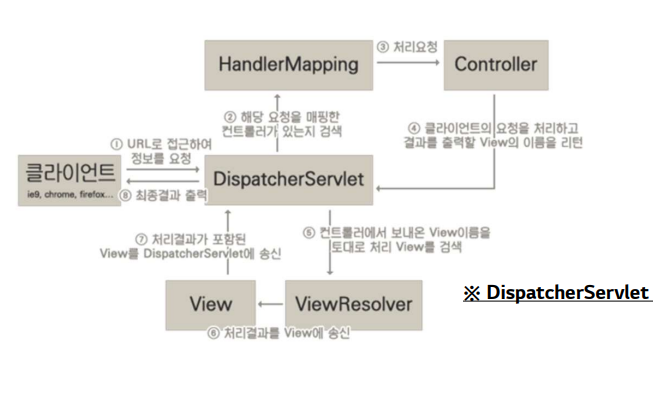

# Spring MVC


## MVC 프레임워크


### 기존 한계점

- 코드의 중복
  - Forward 코드가 중복 사용
  - Dispatcher path에서 중복 발생
- 사용하지 않는 코드
  - HttpServletResponse 객체는 거의 사용 X
  - HttpServletRequest 객체에서도 사용하지 않는 항목 多
- 공통 로직 처리의 어려움
  - 인증 처리와 같은 공통 로직의 처리가 쉽지 않음


### 프론트 컨트롤러 패턴

- 다른 컨트롤러 앞에 `프론트 컨트롤러`라는 컨트롤러를 두고, 해당 컨트롤러가 요청을 받아 다른 컨트롤러에게 요청을 전달하는 방식

- 프론트 컨트롤러 만들기 및 Forward 공통화

```java
@WebServlet(name = "frontController-v4", urlPatterns = "/lec1/*")
public class FrontControllerV4 extends HttpServlet {
    private final Map<String, ControllerV4> urlMap;
    
    @Autowired
    public FrontControllerV4(LoginControllerV4 loginControllerV4, FreeBoardListControllerV4 freeBoardListControllerV4) {
        urlMap = new HashMap<>();
        urlMap.put("/lec1/member/login", loginControllerV4);
        urlMap.put("/lec1/free-board/list", freeBoardListControllerV4);
    }
    
    @Override
    protected void service(HttpServletRequest req, HttpServletResponse resp) throws ServletException, IOException {
    // 인증처리
    // 로깅
    String requestURI = req.getRequestURI().replace(req.getContextPath(), "");
    if (urlMap.containsKey(requestURI)) {
        String method = req.getMethod();
        Map<String, Object> model = new HashMap<>();
        ControllerV4 controllerV4 = urlMap.get(requestURI);
        if (method.equals("GET")) {
            String viewName = controllerV4.doGet(model, getParamMap(req), req.getSession());
            MyModelAndView myModelAndView = new MyModelAndView(viewName, model);
            myModelAndView.render(req, resp);
        } else if (method.equals("POST")) {
            String viewName = controllerV4.doPost(model, getParamMap(req), req.getSession());
            MyModelAndView myModelAndView = new MyModelAndView(viewName, model);
            myModelAndView.render(req, resp);
        } else {
            System.out.println("Method unmatched! : " + method);
            resp.sendError(HttpServletResponse.SC_METHOD_NOT_ALLOWED);
        }
    } else {
        // NOT_FOUND 에러
        System.out.println("URI unmatched! : " + requestURI);
        resp.sendError(HttpServletResponse.SC_NOT_FOUND);
    }
    // 에러처리
    }
    
    private Map<String, String> getParamMap(HttpServletRequest request) {
        Map<String, String> paramMap = new HashMap<>();
        Enumeration<String> parameterNames = request.getParameterNames();
        while (parameterNames.hasMoreElements()) {
            String paramName = parameterNames.nextElement();
            paramMap.put(paramName, request.getParameter(paramName));
        }
        return paramMap;
    }
}


```

- MyModelAndView객체를 통해 forward 작업 공통화

```java
public class MyModelAndView {
    private String viewName;
    private final Map<String, Object> model;

    public MyModelAndView(String viewName, Map<String, Object> model) {
        this.viewName = viewName;
        this.model = model;
    }

    public void render(HttpServletRequest request, HttpServletResponse response) throws ServletException, IOException {
        if (viewName.startsWith("redirect:")) {
            String redirectUrl = request.getContextPath() + viewName.replace("redirect:", "");
            response.sendRedirect(redirectUrl);
        } else {
            for (String s : model.keySet()) {
            	request.setAttribute(s, model.get(s));
            }
            RequestDispatcher requestDispatcher = request.getRequestDispatcher("/WEB-INF/views/lec1/" + viewName + ".jsp");
            requestDispatcher.forward(request, response);
        }
    }
}

```
- render 메소드를 통해 View Path의 중복되는 부분 제거
- redirect 별도 처리
- model에 담겨 잇는 데이터 HttpServletRequest에 옮겨담음

```java
public interface ControllerV4 {
    String doGet(Map<String, Object> model, Map<String, String> paramMap, HttpSession session);
    String doPost(Map<String, Object> model, Map<String, String> paramMap, HttpSession session);
}
```

- controller는 viewName 리턴함

```java
@Controller
public class LoginControllerV4 implements ControllerV4 {
    private final MemberBiz memberBiz;
    
    @Autowired
    public LoginControllerV4(MemberBiz memberBiz) {
    	this.memberBiz = memberBiz;
    }
    
    @Override
    public String doGet(Map<String, Object> model, Map<String, String> paramMap, HttpSession session) {
    	return "member/login";
    }
    
    @Override
    public String doPost(Map<String, Object> model, Map<String, String> paramMap, HttpSession session) {
        
        String memberId = paramMap.get("memberId");
        String memberPw = paramMap.get("memberPw");
        
        try {
            MemberDTO memberDTO = memberBiz.login(memberId, memberPw);
            session.setAttribute(SessionKey.MEMBER_ID, memberDTO.getMemberId());
            session.setAttribute(SessionKey.MEMBER_NAME, memberDTO.getMemberName());
            return "redirect:/lec1/free-board/list";
        } catch (Exception e) {
            model.put("errorMessage", e.getMessage());
            return "errorPage";
        }
    }
}


```


### 어댑터 패턴

- 클래스의 인터페이스를 사용자가 기대하는 다른 인터페이스로 변환하는 패턴
- 호환성이 없는 인터페이스 때문에 함께 동작할 수 없는 클래스들이 함께 동작하도록 해줌
- 적합한 어댑터 선택해서 처리
  - supports() 메서드를 통해 지원 여부 확인
  - 지원하는 경우 handle() 메서드를 통해 처리

```java
@WebServlet(name = "frontController-v5", urlPatterns = "/lec1/*")
public class FrontControllerV5 extends HttpServlet {
    private final Map<String, Object> urlMap;
    private final List<Adapter> adapters;
    
    @Autowired
    public FrontControllerV5(FreeBoardListControllerV4 freeBoardListControllerV4, LoginControllerV3 loginControllerV3) {
        urlMap = new HashMap<>();
        adapters = new ArrayList<>();
        urlMap.put("/lec1/free-board/list", freeBoardListControllerV4);
        urlMap.put("/lec1/member/login", loginControllerV3);
        adapters.add(new ControllerV3Adapter());
        adapters.add(new ControllerV4Adapter());
    }
    
    @Override
    protected void service(HttpServletRequest req, HttpServletResponse resp) throws ServletException, IOException {
        String requestURI = req.getRequestURI().replace(req.getContextPath(), "");
        if (urlMap.containsKey(requestURI)) {
            Object handler = urlMap.get(requestURI);
            for (Adapter adapter : adapters) {
                if (adapter.supports(handler)) {
                    MyModelAndView myModelAndView = adapter.handle(handler, req.getMethod(), getParamMap(req), req.getSession());
                    myModelAndView.render(req, resp);
                    return;
                }
            }
            throw new RuntimeException("Adapter unmatched!");
        } else {
            System.out.println("URI unmatched! : " + requestURI);
            resp.sendError(HttpServletResponse.SC_NOT_FOUND);
        }
    }
    
    private Map<String, String> getParamMap(HttpServletRequest request) {
        
        Map<String, String> paramMap = new HashMap<>();
        Enumeration<String> parameterNames = request.getParameterNames();
        
        while (parameterNames.hasMoreElements()) {
            String paramName = parameterNames.nextElement();
            paramMap.put(paramName, request.getParameter(paramName));
        }
        return paramMap;
    }
}
```

- 어댑터의 호환여부에 따라 다른 어댑터로 처리함

```java
public interface Adapter {
	boolean supports(Object handler);
    MyModelAndView handle(Object handler, String method, Map<String, String> paramMap, HttpSession session);
}

```

```java
public class ControllerV3Adapter implements Adapter {
    @Override
    public boolean supports(Object handler) {
    	return handler instanceof ControllerV3;
    }
    
    @Override
    public MyModelAndView handle(Object handler, String method, Map<String, String> paramMap, HttpSession session) {
        ControllerV3 controllerV3 = (ControllerV3) handler;
        if (method.equals("GET")) {
       		return controllerV3.doGet(paramMap, session);
        } else if (method.equals("POST")) {
        	return controllerV3.doPost(paramMap, session);
        } else {
        	throw new MethodNotAllowedException();
        }
    }
}
```


## 스프링 MVC


### 스프링 MVC 요청 흐름



- DispatcherServlet = 프론트 컨트롤러


### 스프링의 Handler와 Adapter

- Handler
  0. RequestMappingHandlerMapping : @RequestMapping에서 사용
  1. BeanNameUrlHandlerMapping : 스프링 빈의 이름으로 핸들러 찾음
- Adapter
  0. RequestMappingHandlerAdapter : @RequestMapping에서 사용
  1.  HttpRequestHandlerAdapter : HttpRequestHandler를 처리
  2. SimpleControllerHandlerAdapter : Controller 인터페이스 처리


### @RequestMapping

```java
@Controller
@RequestMapping("/lec2/member/login")
public class LoginController {
    ...
    
    RequestMapping(value = "/login", method = RequestMethod.GET)
    public ModelAndView loginPage() {
    	// ...
    }

    
    @RequestMapping(value = "/login", method = RequestMethod.POST)
    public ModelAndView login(HttpServletRequest request) {
    	//...
    }
}

```

- 클래스에 @Component와 @RequestMapping 어노테이션이 선언되어 있어야 함
- @RequestMapping의 value와 method를 통해 요청을 매핑
- 클래스에 @RequestMapping 을 통해 baseURI 를 정의 => 핸들러들은 baseURI를 기준으로 맵핑


### @Controller

- @Component와 @RequestMapping 어노테이션을 붙인 것과 동일한 효과
- 클래스 단위로 url 매칭하고 싶을 땐, @RequestMapping 추가로 선언


### View Resolver

- 스프링은 기본적으로 InternalResourceViewResolver 라는 객체를 View Resolver로 자동으로 등록
- application.yml에서 설정 정보를 읽어와 등록

```yml
spring:
	mvc:
		view:
			prefix: /WEB_INF/views/
			suffix: .jsp
```

- 자동 등록 사용 X 경우 별도로 Bean 등록


### 스프링 MVC의 리다이렉트

- ViewName에 "redirect:/" 키워드를 넣으면 해당 주소로 리다이렉트
  - `/`가 없으면 상대 경로로, 기존 경로의 마지막 위치에서 경로가 시작됨
- Context Path는 자동으로 포함
- Context Path 없이 리다이렉트 하는 경우(어플리케이션 외부에서 리다이렉트)
  - 기존의 `response.sendRedirect()` 사용 
  - RedirectView 객체 사용
    - 기본적으로 Context Path 추가 X
    - StatusCode 설정 O (302가 기본값)


### (참고) 리다이렉션

- 영구
  - 301 Moved Permanently : GET 요청 + 본문 제거될 수 있음
  - 308 Permanent Redirect : 요청 메서드와 본문 유지
- 일시
  - 302 Found : GET 요청 + 본문 제거될 수 있음
  - 307 Temporary Redirect : 요청 메서드와 본문 유지
  - 303 See Other : Get으로 변경


### Model

- 핸들러 파라미터에 Model을 선언하면 스프링이 Model 객체를 넣어줌

```java
@Controller
@RequestMapping("/lec2/free-boards")
public class FreeBoardController {
    
    ...
    
    @RequestMapping(method = RequestMethod.GET)
    public String list(Model model, HttpServletRequest request) {
        HttpSession session = request.getSession();
        String memberId = session.getAttribute(SessionKey.MEMBER_ID);
        
        if (memberId == null) {
        	return "redirect:/lec2/member/login";
        }
        try {
            List<FreeBoardDTO> freeBoards = freeBoardBiz.findAll();
            model.addAttribute("freeBoards", freeBoards);
            return "lec2/freeBoard/list";
        } catch (Exception e) {
        	model.addAttribute("errorMessage", e.getMessage());
        	return "lec2/errorPage";
        }
    }

```

- model.addAttribute()로 값 저장


### @RequestParam

```java
@RequestMapping(value = "/sign-up", method = RequestMethod.POST)
public String parameterTest(@RequestParam(value="memberId", required = false, defaultValue="test") String memberId){
    // ...
}
```

- value (=name)
  - 매핑 될 파라미터 이름
  - 생략 시, 변수의 이름으로 매핑
- required
  - 필수 값 여부
  - 기본 : true
  - true 일 때, 파마미터가 없으면 BAD_REQUEST
- defaultValue
  - 요청 파라미터가 없으면 해당 값이 들어감


### @ModelAttribute

```java
@RequestMapping(value = "/sign-up", method = RequestMethod.POST)
public ModelAndView signUp(@ModelAttribute(value="member", binding= false) MemberDTO memberDTO) {
    try {
    	memberBiz.signUp(memberDTO);
		...
```

- 요청 파라미터들을 객체에 바인딩 해서 전달함
  - 바인딩은 해당 객체의 setter을 통해서 이루어짐 (setter 선언 필수)
  - 객체의 멤버 변수 이름과 요청 파라미터 이름이 동일해야 함
- value (=name)
  - 이름을 지정하면 해당 객체를  Request Attribute (Model Attribute)에 자동으로 등록
  - 별도로, model.setAttribute() 필요 X

- binding 
  - 파라미터들을 객체에 자동 바인딩 여부
  - false시 빈 객체가 넘어옴


### @SessionAttribute

```java
@RequestMapping(value = "/update", method = RequestMethod.GET)
public ModelAndView updatePage(@SessionAttribute(name = SessionKey.MEMBER_ID, required = false) String memberId) {
    
    ...
    try {
        MemberDTO member = memberBiz.findById(memberId);
    //...
}

```

- value( =name)
  - 매핑 될 세션 속성 이름
  - 생략 시 변수의 이름으로 매핑 (즉, 변수의 이름과 매핑될 파라미터 이름이  같으면 생략 O)
  - 상수 (static final)인 String 변수 넣을 수 O
- required
  - 필수 값 여부


### @PathVariable

```java
@GetMapping("/{id}/delete")
public String deleteFreeBoard(@PathVariable Long id, Model model) {
    
    // ...
    try {
        freeBoardBiz.delete(id);
        return "redirect:/lec2/free-boards";
    // ...
}
```

- URL을 통해 변수를 전달 받을 수 있음
  - URI는 자원의 식별자
  - ex) /members/3 은 3번 멤버 의미
  - Mapping URL에 `{}`를 통해 변수 이름 지정
- value(=name)
  - 매핑 될 path vaiable 지정
  - 매핑 기준은 `{}`를 통해 지정된 path variable 이름
  - 생략 시 변수 이름을 통해 매핑 (즉, path variable 이름과 변수 이름이 같다면 생략 O)
- required
  - 필수 값 여부
