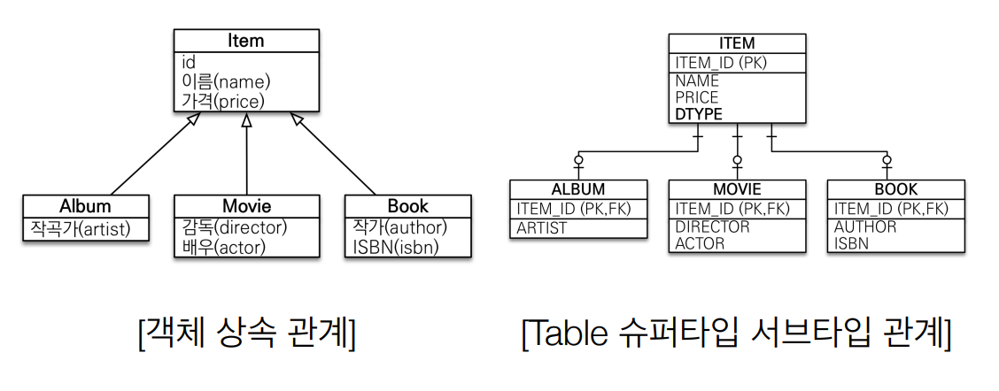
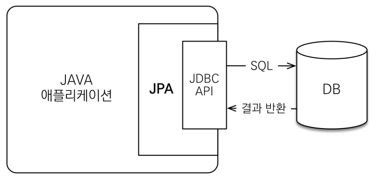
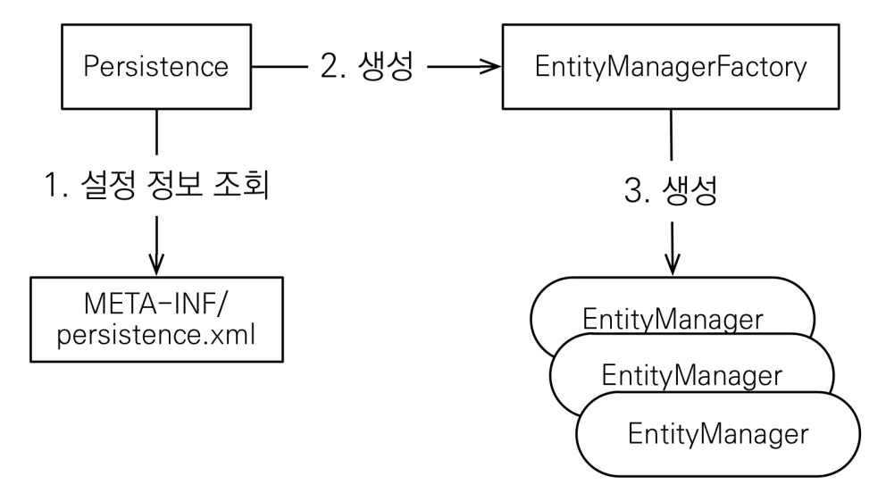

# 자바 ORM 표준 JPA 프로그래밍 - 기본편


## JPA 소개

### SQL 중심적인 개발의 문제점

- SQL에 의존적인 개발
  - 객체는 일반적으로 관계형 DB에 보관
  - 수 많은 SQL이 필요
  - 자바 객체를 SQL로, SQL을 자바 객체로 바꾸는 작업의 무한 반복

- 패러다임의 불일치 : 객체 vs 관계형 데이터베이스

  - 개요

    - 객체 지향 프로그래밍은 추상화, 캡슐화, 정보은닉,  상속, 다형성 등 시스템의 복잡성을 제어할 수 있는 다양한 장치들을 제공

    - 객체를 영구 보관하는 다양한 저장소 (ex. RDB, NoSQL, FILE, ..) 中 현실적인 대안은 관계형 DB

      => 개발자 ≒ SQL 매퍼

  - 객체와 관계형 데이터베이스의 차이

    1. 상속

       

       - 객체	: 상속 관계

       - Table  : 슈퍼타입 서브타입 관계

         => Insert 시, 객체를 분해하여 두 개 이상의 테이블에 Insert 

         ​	 Select 시, 조인 SQL을 통해 조회 후 각각의 객체 생성 필요

         :heavy_check_mark: 자바 컬럭센 사용의 경우

         ```java
         // 저장
         list.add(album);
         // 조회
         Album album = list.get(albumId) ;
         Item item = list.get(albumId) ;
         ```

    2. 연관관계

       - 객체 : 참조

         ```java
         // 객체 다운 모델링
         class Member {
          String id; //MEMBER_ID 컬럼 사용
          Team team; //참조로 연관관계를 맺는다. 
          String username;//USERNAME 컬럼 사용
          
          Team getTeam() {
          	return team;
          }
         }
         class Team {
          Long id; //TEAM_ID PK 사용
          String name; //NAME 컬럼 사용
         }
         ```

       - 테이블 : 외래 키

         ```java
         // 객체를 테이블에 맞추어 모델링
         class Member {
          String id; //MEMBER_ID 컬럼 사용
          Long teamId; //TEAM_ID FK 컬럼 사용 
          String username;//USERNAME 컬럼 사용
         }
         
         class Team {
          Long id; //TEAM_ID PK 사용
          String name; //NAME 컬럼 사용
         }
         
         ```

       => 객체 다운 모델링을 할 경우,

       			- Member Insert 시, `Team`의 Id에 대한 별도 접근 필요 `member.getTeam().getId()`
  			
       			- Member Select 시, `Member`와 `Team`을 모두 조회 & 관계 설정 필요

       :heavy_check_mark: 자바 컬럭센 사용의 경우

       ```java
       list.add(member);
       
       Member member = list.get(memberId);
       Team team = member.getTeam();
       ```

    3. 데이터 타입

    4. 데이터 식별 방법

- 문제점

  - 엔티티 신뢰 문제
    - `Member member = memberDAO.find(memberId);` 를 했을 경우, 객체 그래프에서 어디까지 가져오는 지 알 수 없다
  - 모든 객체를 미리 로딩할 수는 없다
    - 한번에 모든 연관관계를 가져오는 쿼리는 성능상 떨어짐
    - 상황에 따라 동일한 회원 조회 메서드를 여러벌 생성
  - 객체 그래프 탐색 제한
    - 객체 그래프 탐색 : 객체는 자유롭게 참조 관계로 이어진 객체 그래프를 탐색 할 수 있어야 함

  => 진정한 의미의 계층 분할이 어렵다. (물리적으론 분리, 논리적으론 엮여있음)


### JPA

- JPA

  - Java Persistence API
  - 자바 진영의 ORM 기술 표준

- ORM

  - Object-relational mapping
  - 객체는 객체대로 설계
  - 관계형 DB는 관계형 DB대로 설계
  - ORM 프레임워크가 중간에서 매핑

  - JPA는 애플리케이션과 JDBC 사이에서 동작

    

- JPA 동작

  - 저장(`persist`)
    - Entity 분석
    - Insert SQL 생성
    - JDBC API 사용
    - 패러다임 불일치 해결
  - 조회(`find`)
    - Select SQL 생성
    - JDBC API 사용
    - ResultSet 매핑
    - 패러다임 불일치 해결

- JPA 소개

  - 개요
    - EJB라는 자바 표준 엔터티의 빈의 불편함에서 Hibernate가 오픈 소스로 개발됨 => 이를 바탕으로 자바 표준 JPA 개발
  - 표준 명세
    - JPA는 인터페이스의 모음
    - 특정 기능 수행하는 라이브러리 X. ORM 사용방식을 정의한 기술 명세 O
    - JPA 2.1의 표준 명세를 구현한 3가지 구현체 : 하이버네이트, EclipseLink, DataNucleus

- JPA 장점

  - SQL 중심적인 개발에서 객체 중심으로 개발

  - 생산성

    - 저장: `jpa.persist(member)`
    - 조회: `Member member = jpa.find(memberId)`
    - 수정: `member.setName(“변경할 이름”)`
    - 삭제: `jpa.remove(member)`

  - 유지보수

    - SQL 의존적인 개발에서는 엔터티의 필드 변경 시 모든 SQL 수정해야함
    - JPA의 경우, 필드만 수정. SQL은 JPA가 생성

  - 패러다임의 불일치 해결

    - JPA와 상속

      - JPA가 상속과 슈퍼-서브타입 관계의 차이에서 오는 다중 SQL 및 조인 쿼리 처리

      - 저장 : `jpa.persist(album);` => `INSERT INTO ITEM ...` , `INSERT INTO ALBUM ..` 

      - 조회 : `Album album = jpa.find(Album.class, albumId);` 

        => `SELECT I.*, A.* FROM ITEM I JOIN ALBUM A ON I.ITEM_ID = A.ITEM_ID`

    - JPA와 연관관계, 객체 그래프 탐색

      - 연관관계 저장과 객체 그래프 탐색에 있어서 자유로움
      - 신뢰할 수 있는 엔터티, 계층

    - JPA와 비교하기

      - JPA 동일한 트랜잭션에서 조회한 엔티티는 같음(`==`)을 보장
      - 캐시

  - 성능

    - 1차 캐시와 동일성(identity) 보장

    - 트랜잭션을 지원하는 쓰기 지연(transactional write-behind)

      - 트랜잭션을 커밋할 때까지 SQL을 모음

        => 비즈니스 로직 수행 동안 DB 로우 락이 걸리지 않는다.

    - 지연 로딩(Lazy Loading)

  - 데이터 접근 추상화와 벤더 독립성

  - 표준


## JPA 시작

### [프로젝트 설정]

#### H2 데이터베이스 설치와 실행

- H2
  - 가볍다.(1.5M)
  -  MySQL, Oracle 데이터베이스 시뮬레이션 기능
  - 시퀀스, AUTO INCREMENT 기능 지원
  - 설치 시 주의사항
    - 처음 실행 시, Generic H2(Embedded) 모드로 실행 후 => Server 모드 실행


#### 라이브러리 추가

```xml
<?xml version="1.0" encoding="UTF-8"?> 
<project xmlns="http://maven.apache.org/POM/4.0.0" 
 xmlns:xsi="http://www.w3.org/2001/XMLSchema-instance" 
 xsi:schemaLocation="http://maven.apache.org/POM/4.0.0 http://maven.apache.org/xsd/maven-4.0.0.xsd"> 
	 <modelVersion>4.0.0</modelVersion> 
     <groupId>jpa-basic</groupId> 
     <artifactId>ex1-hello-jpa</artifactId> 
     <version>1.0.0</version> 
     <dependencies> 
     <!-- JPA 하이버네이트 --> 
         <dependency> 
             <groupId>org.hibernate</groupId> 
             <artifactId>hibernate-entitymanager</artifactId> 
             <version>5.3.10.Final</version> 
         </dependency> 
     <!-- H2 데이터베이스 --> 
         <dependency> 
             <groupId>com.h2database</groupId> 
             <artifactId>h2</artifactId> 
             <version>1.4.199</version> 
         </dependency> 
     </dependencies> 
</project>
```

- 라이브러리 버전 선택
  - Spring.io => Project => Spring Boot => 내가 사용할 Spring 버전의 `Reference Doc` => `Dependency Version` => 사용할 의존성 명 검색
- H2 의존성
  - 다운받은 버전과 일치시키는 것 권장


#### JPA 설정

```xml
<?xml version="1.0" encoding="UTF-8"?>
<persistence version="2.2"
             xmlns="http://xmlns.jcp.org/xml/ns/persistence" xmlns:xsi="http://www.w3.org/2001/XMLSchema-instance"
             xsi:schemaLocation="http://xmlns.jcp.org/xml/ns/persistence http://xmlns.jcp.org/xml/ns/persistence/persistence_2_2.xsd">
    <persistence-unit name="hello">
        <properties>
            <!-- 필수 속성 -->
            <property name="javax.persistence.jdbc.driver" value="org.h2.Driver"/>
            <property name="javax.persistence.jdbc.user" value="sa"/>
            <property name="javax.persistence.jdbc.password" value=""/>
            <property name="javax.persistence.jdbc.url" value="jdbc:h2:tcp://localhost/~/test"/>
            <property name="hibernate.dialect" value="org.hibernate.dialect.H2Dialect"/>

            <!-- 옵션 -->
            <property name="hibernate.show_sql" value="true"/>
            <property name="hibernate.format_sql" value="true"/>
            <property name="hibernate.use_sql_comments" value="true"/>
            <!--<property name="hibernate.hbm2ddl.auto" value="create" />-->
        </properties>
    </persistence-unit>
</persistence>
```

- resources//META-INF/persistence.xml
- `persistence-unit`
  - 이름 지정(주로 DB 이름)
  - DataBase 별로 하나씩 생성
- 필수속성
  - DB  접속 정보
- 옵션
  - `hibernate.show_sql` : 실행되는 SQL 콘솔 출력
  - `hibernate.format_sql` : 출력되는 SQL를 예쁘게 만들어서 출력
  - `hibernate.use_sql_comments` : `/* */` 주석안에 ... 포함해서 SQL 출력


#### JPA Dialect 지정

- 데이터베이스 방언
  - 방언: SQL 표준을 지키지 않는 특정 데이터베이스만의 고유한 기능
    - 가변 문자: MySQL은 VARCHAR, Oracle은 VARCHAR2 
    - 문자열을 자르는 함수: SQL 표준은 `SUBSTRING()`, Oracle은 `SUBSTR() `
    - 페이징: MySQL은 LIMIT , Oracle은 ROWNUM 
- JPA는 특정 데이터베이스에 종속 X
  - 지정된 Dialect에 맞게 SQL문을 생성
  - `hibernate.dialect` 속성에 지정


### [Hello JPA - 애플리케이션 개발]


#### JPA 구동 방식



- **엔티티 매니저 팩토리**는 하나만 생성해서 애플리케이션 전체에서 공유함

- 주의 사항

  - **엔티티 매니저**는 쓰레드간에 공유 X (사용하고 버려야 한다). 
  - **JPA의 모든 데이터 변경은 트랜잭션 안에서 실행**

- 샘플 코드

  ```java
  EntityManagerFactory emf = Persistence.createEntityManagerFactory("hello");
  EntityManager em = emf.createEntityManager();
  EntityTransaction transaction = em.getTransaction();
  transaction.begin();
  
  Member member1 = new Member();
  member1.setId(1L);
  member1.setName("HelloA");
  em.persist(member1);
  transaction.commit();
  em.close();
  emf.close();
  ```

  


### JPQL 소개

- 필요 이유
  - JPA의 메소드만으로는 복잡한 조건을 가진 쿼리를 실행할 수 X
- 개요
  - JPA는 SQL을 추상화한 JPQL이라는 객체 지향 쿼리 언어 제공
  - SQL과 문법 유사, SELECT, FROM, WHERE, GROUP BY,  HAVING, JOIN 지원
  - **JPQL은 엔티티 객체**를 대상으로 쿼리
    - SQL은 데이터베이스 테이블을 대상으로 쿼리


