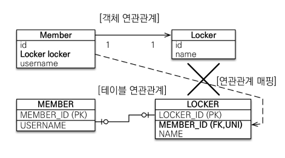

# 자바 ORM 표준 JPA 프로그래밍 - 기본편


## JPA 소개

### SQL 중심적인 개발의 문제점

- SQL에 의존적인 개발
  - 객체는 일반적으로 관계형 DB에 보관
  - 수 많은 SQL이 필요
  - 자바 객체를 SQL로, SQL을 자바 객체로 바꾸는 작업의 무한 반복

- 패러다임의 불일치 : 객체 vs 관계형 데이터베이스

  - 개요

    - 객체 지향 프로그래밍은 추상화, 캡슐화, 정보은닉,  상속, 다형성 등 시스템의 복잡성을 제어할 수 있는 다양한 장치들을 제공

    - 객체를 영구 보관하는 다양한 저장소 (ex. RDB, NoSQL, FILE, ..) 中 현실적인 대안은 관계형 DB

      => 개발자 ≒ SQL 매퍼

  - 객체와 관계형 데이터베이스의 차이

    1. 상속

       

       - 객체	: 상속 관계

       - Table  : 슈퍼타입 서브타입 관계

         => Insert 시, 객체를 분해하여 두 개 이상의 테이블에 Insert 

         ​	 Select 시, 조인 SQL을 통해 조회 후 각각의 객체 생성 필요

         :heavy_check_mark: 자바 컬럭센 사용의 경우

         ```java
         // 저장
         list.add(album);
         // 조회
         Album album = list.get(albumId) ;
         Item item = list.get(albumId) ;
         ```

    2. 연관관계

       - 객체 : 참조

         ```java
         // 객체 다운 모델링
         class Member {
          String id; //MEMBER_ID 컬럼 사용
          Team team; //참조로 연관관계를 맺는다. 
          String username;//USERNAME 컬럼 사용
          
          Team getTeam() {
          	return team;
          }
         }
         class Team {
          Long id; //TEAM_ID PK 사용
          String name; //NAME 컬럼 사용
         }
         ```

       - 테이블 : 외래 키

         ```java
         // 객체를 테이블에 맞추어 모델링
         class Member {
          String id; //MEMBER_ID 컬럼 사용
          Long teamId; //TEAM_ID FK 컬럼 사용 
          String username;//USERNAME 컬럼 사용
         }
         
         class Team {
          Long id; //TEAM_ID PK 사용
          String name; //NAME 컬럼 사용
         }
         
         ```

       => 객체 다운 모델링을 할 경우,

       			- Member Insert 시, `Team`의 Id에 대한 별도 접근 필요 `member.getTeam().getId()`
  			
       			- Member Select 시, `Member`와 `Team`을 모두 조회 & 관계 설정 필요

       :heavy_check_mark: 자바 컬럭센 사용의 경우

       ```java
       list.add(member);
       
       Member member = list.get(memberId);
       Team team = member.getTeam();
       ```

    3. 데이터 타입

    4. 데이터 식별 방법

- 문제점

  - 엔티티 신뢰 문제
    - `Member member = memberDAO.find(memberId);` 를 했을 경우, 객체 그래프에서 어디까지 가져오는 지 알 수 없다
  - 모든 객체를 미리 로딩할 수는 없다
    - 한번에 모든 연관관계를 가져오는 쿼리는 성능상 떨어짐
    - 상황에 따라 동일한 회원 조회 메서드를 여러벌 생성
  - 객체 그래프 탐색 제한
    - 객체 그래프 탐색 : 객체는 자유롭게 참조 관계로 이어진 객체 그래프를 탐색 할 수 있어야 함

  => 진정한 의미의 계층 분할이 어렵다. (물리적으론 분리, 논리적으론 엮여있음)


### JPA

- JPA

  - Java Persistence API
  - 자바 진영의 ORM 기술 표준

- ORM

  - Object-relational mapping
  - 객체는 객체대로 설계
  - 관계형 DB는 관계형 DB대로 설계
  - ORM 프레임워크가 중간에서 매핑

  - JPA는 애플리케이션과 JDBC 사이에서 동작

    

- JPA 동작

  - 저장(`persist`)
    - Entity 분석
    - Insert SQL 생성
    - JDBC API 사용
    - 패러다임 불일치 해결
  - 조회(`find`)
    - Select SQL 생성
    - JDBC API 사용
    - ResultSet 매핑
    - 패러다임 불일치 해결

- JPA 소개

  - 개요
    - EJB라는 자바 표준 엔터티의 빈의 불편함에서 Hibernate가 오픈 소스로 개발됨 => 이를 바탕으로 자바 표준 JPA 개발
  - 표준 명세
    - JPA는 인터페이스의 모음
    - 특정 기능 수행하는 라이브러리 X. ORM 사용방식을 정의한 기술 명세 O
    - JPA 2.1의 표준 명세를 구현한 3가지 구현체 : 하이버네이트, EclipseLink, DataNucleus

- JPA 장점

  - SQL 중심적인 개발에서 객체 중심으로 개발

  - 생산성

    - 저장: `jpa.persist(member)`
    - 조회: `Member member = jpa.find(memberId)`
    - 수정: `member.setName(“변경할 이름”)`
    - 삭제: `jpa.remove(member)`

  - 유지보수

    - SQL 의존적인 개발에서는 엔터티의 필드 변경 시 모든 SQL 수정해야함
    - JPA의 경우, 필드만 수정. SQL은 JPA가 생성

  - 패러다임의 불일치 해결

    - JPA와 상속

      - JPA가 상속과 슈퍼-서브타입 관계의 차이에서 오는 다중 SQL 및 조인 쿼리 처리

      - 저장 : `jpa.persist(album);` => `INSERT INTO ITEM ...` , `INSERT INTO ALBUM ..` 

      - 조회 : `Album album = jpa.find(Album.class, albumId);` 

        => `SELECT I.*, A.* FROM ITEM I JOIN ALBUM A ON I.ITEM_ID = A.ITEM_ID`

    - JPA와 연관관계, 객체 그래프 탐색

      - 연관관계 저장과 객체 그래프 탐색에 있어서 자유로움
      - 신뢰할 수 있는 엔터티, 계층

    - JPA와 비교하기

      - JPA 동일한 트랜잭션에서 조회한 엔티티는 같음(`==`)을 보장
      - 캐시

  - 성능

    - 1차 캐시와 동일성(identity) 보장

    - 트랜잭션을 지원하는 쓰기 지연(transactional write-behind)

      - 트랜잭션을 커밋할 때까지 SQL을 모음

        => 비즈니스 로직 수행 동안 DB 로우 락이 걸리지 않는다.

    - 지연 로딩(Lazy Loading)

  - 데이터 접근 추상화와 벤더 독립성

  - 표준


## JPA 시작

### [프로젝트 설정]

#### H2 데이터베이스 설치와 실행

- H2
  - 가볍다.(1.5M)
  -  MySQL, Oracle 데이터베이스 시뮬레이션 기능
  - 시퀀스, AUTO INCREMENT 기능 지원
  - 설치 시 주의사항
    - 처음 실행 시, Generic H2(Embedded) 모드로 실행 후 => Server 모드 실행


#### 라이브러리 추가

```xml
<?xml version="1.0" encoding="UTF-8"?> 
<project xmlns="http://maven.apache.org/POM/4.0.0" 
 xmlns:xsi="http://www.w3.org/2001/XMLSchema-instance" 
 xsi:schemaLocation="http://maven.apache.org/POM/4.0.0 http://maven.apache.org/xsd/maven-4.0.0.xsd"> 
	 <modelVersion>4.0.0</modelVersion> 
     <groupId>jpa-basic</groupId> 
     <artifactId>ex1-hello-jpa</artifactId> 
     <version>1.0.0</version> 
     <dependencies> 
     <!-- JPA 하이버네이트 --> 
         <dependency> 
             <groupId>org.hibernate</groupId> 
             <artifactId>hibernate-entitymanager</artifactId> 
             <version>5.3.10.Final</version> 
         </dependency> 
     <!-- H2 데이터베이스 --> 
         <dependency> 
             <groupId>com.h2database</groupId> 
             <artifactId>h2</artifactId> 
             <version>1.4.199</version> 
         </dependency> 
     </dependencies> 
</project>
```

- 라이브러리 버전 선택
  - Spring.io => Project => Spring Boot => 내가 사용할 Spring 버전의 `Reference Doc` => `Dependency Version` => 사용할 의존성 명 검색
- H2 의존성
  - 다운받은 버전과 일치시키는 것 권장


#### JPA 설정

```xml
<?xml version="1.0" encoding="UTF-8"?>
<persistence version="2.2"
             xmlns="http://xmlns.jcp.org/xml/ns/persistence" xmlns:xsi="http://www.w3.org/2001/XMLSchema-instance"
             xsi:schemaLocation="http://xmlns.jcp.org/xml/ns/persistence http://xmlns.jcp.org/xml/ns/persistence/persistence_2_2.xsd">
    <persistence-unit name="hello">
        <properties>
            <!-- 필수 속성 -->
            <property name="javax.persistence.jdbc.driver" value="org.h2.Driver"/>
            <property name="javax.persistence.jdbc.user" value="sa"/>
            <property name="javax.persistence.jdbc.password" value=""/>
            <property name="javax.persistence.jdbc.url" value="jdbc:h2:tcp://localhost/~/test"/>
            <property name="hibernate.dialect" value="org.hibernate.dialect.H2Dialect"/>

            <!-- 옵션 -->
            <property name="hibernate.show_sql" value="true"/>
            <property name="hibernate.format_sql" value="true"/>
            <property name="hibernate.use_sql_comments" value="true"/>
            <!--<property name="hibernate.hbm2ddl.auto" value="create" />-->
        </properties>
    </persistence-unit>
</persistence>
```

- resources//META-INF/persistence.xml
- `persistence-unit`
  - 이름 지정(주로 DB 이름)
  - DataBase 별로 하나씩 생성
- 필수속성
  - DB  접속 정보
- 옵션
  - `hibernate.show_sql` : 실행되는 SQL 콘솔 출력
  - `hibernate.format_sql` : 출력되는 SQL를 예쁘게 만들어서 출력
  - `hibernate.use_sql_comments` : `/* */` 주석안에 ... 포함해서 SQL 출력


#### JPA Dialect 지정

- 데이터베이스 방언
  - 방언: SQL 표준을 지키지 않는 특정 데이터베이스만의 고유한 기능
    - 가변 문자: MySQL은 VARCHAR, Oracle은 VARCHAR2 
    - 문자열을 자르는 함수: SQL 표준은 `SUBSTRING()`, Oracle은 `SUBSTR() `
    - 페이징: MySQL은 LIMIT , Oracle은 ROWNUM 
- JPA는 특정 데이터베이스에 종속 X
  - 지정된 Dialect에 맞게 SQL문을 생성
  - `hibernate.dialect` 속성에 지정


### [Hello JPA - 애플리케이션 개발]


#### JPA 구동 방식


- **엔티티 매니저 팩토리**는 하나만 생성해서 애플리케이션 전체에서 공유함

- 주의 사항

  - **엔티티 매니저**는 쓰레드간에 공유 X (사용하고 버려야 한다). 
  - **JPA의 모든 데이터 변경은 트랜잭션 안에서 실행**

- 샘플 코드

  ```java
  EntityManagerFactory emf = Persistence.createEntityManagerFactory("hello");
  EntityManager em = emf.createEntityManager();
  EntityTransaction transaction = em.getTransaction();
  transaction.begin();
  
  Member member1 = new Member();
  member1.setId(1L);
  member1.setName("HelloA");
  em.persist(member1);
  transaction.commit();
  em.close();
  emf.close();
  ```

  


### JPQL 소개

- 필요 이유
  - JPA의 메소드만으로는 복잡한 조건을 가진 쿼리를 실행할 수 X
- 개요
  - JPA는 SQL을 추상화한 JPQL이라는 객체 지향 쿼리 언어 제공
  - SQL과 문법 유사, SELECT, FROM, WHERE, GROUP BY,  HAVING, JOIN 지원
  - **JPQL은 엔티티 객체**를 대상으로 쿼리
    - SQL은 데이터베이스 테이블을 대상으로 쿼리


## 영속성 관리


### 영속성 컨텍스트

- JPA에서 가장 중요한 2가지

  - 객체와 관계형  DB 매핑하기
  - **영속성 컨텍스트**

- 개요

  - 엔티티를 영구 저장하는 환경
  - `EntityManager.persist(entity);`
  - 눈에 보이지 않는 논리적인 개념으로, 엔티티 매니저를 통해서 영속성 컨텍스트에 접근

- 엔티티의 생명주기

  

  - 비영속(new/transient) : 영속성 컨텍스트와 전혀 관계가 없는 새로운 상태
  - 영속(managed) : 영속성 컨텍스에 관리되는 상태
  - 준영속(detached) : 영속성 컨텍스트 저장되었다가 분리된 상태
  - 삭제(removed) : 삭제된 상태

- 장점

  - 1차 캐시
    - Map<PK, 엔티티 > 구조로 되어있어, DB 조회 전에 1차 캐시에서 먼저 검색함
    - 1차 캐시는 트랜잭션 단위로 생성 => 쓰레드간 공유 X & 트랜잭션간 공유 X
  - 동일성 보장
    - 1차 캐시로 반복 가능한 읽기(REPEATABLE READ) 등급의 트랜잭 션 격리 수준을 데이터베이스가 아닌 애플리케이션 차원에서 제공
  - 트랙잭을 지원하는 쓰기 지연
    - 커밋하는 순간 데이터베이스에 SQL을 보낸다
    - `<property name = "hibernate.jdbc.batch_size" value="10" />` 설정을 통해, 배치로 한꺼번에 SQL문을 날릴 수 있
  - 변경 감지(Dirty Checking)
    - 영속성 컨텍스트에는 1차 캐시 뿐만 아니라, 스냅샷을 통해 엔티티의 초기 상태를 저장함
    - `flush` 요청이 올 때, 현재 엔티티와 스냅샷을 비교
    - 변경이 있을 경우, 차이나는 필드 뿐 아니라 모든 필드에 대한 Update 쿼리 생성
  - 지연 로딩


### 플러시 (flush)

- 개념

  - 영속성 컨텍스트의 변경내용을 데이터베이스에 반영

- 동작

  1. 변경 감지

  2. 수정된 엔티티 쓰기 지연 SQL 저장소에 등록

  3. 쓰기 지연 SQL 저장소의 쿼리를 데이터베이스에 전송 

- 수행 방법

  - `em.flush()` : 직접 호출

  - 트랜잭션 커밋 : 플러시 자동 호출

  - JPQL 쿼리 실행 : 플러시 자동 호출

    - 자동 호출 이유

      ```java
      em.persist(memberA);
      em.persist(memberB);
      em.persist(memberC);
      //중간에 JPQL 실행
      query = em.createQuery("select m from Member m", Member.class);
      List<Member> members= query.getResultList();
      
      ```

      - 플러시가 수행되지 않았다면, JPQL이 의미없이 사용됨

    - 플러시 모드 옵션

      - `em.setFlushMode(FlushModeType.AUTO)`
        - 기본값 (사용 권장)
      - `em.setFlushMode(FlushModeType.COMMIT)`
        - Commit할 때만 수행되는 것으로 변경

- 특징

  - 영속성 컨텍스트를 비우지 않음
    - flush 이후 변경사항이 없으면 재flush할 때 작업 X
    - `flush` 후 snapshot이 갱신되는 것인지, 아니면 현재까지의 작업 내용을 저장하고 반복 수행 안 하는 것인지는 불확실
  - 영속성 컨텍스트의 변경내용을 데이터베이스에 동기화
  - 트랜잭션이라는 작업 단위가 중요 => 커밋 직전에만 동기화  하면 됨


### 준영속 상태

- 개념

  - 영속 상태의 엔티티가 영속성 컨텍스트에서 분리
  - 영속 => 준영속

  - 영속성 컨텍스트가 제공하는 기능을 사용 못함

- 만드는 법

  - `em.detach(entity)` : 특정 엔티티만 전환
  - `em.clear()` : 영속성 컨텍스트 초기화
  - `em.close()` : 영속성 컨텍스트 종료


## 엔티티 매핑


### 객체와 테이블 매핑

- `@Entity`

  - 개요
    - @Entity가 붙은 클래스는 JPA가 관리, 엔티티라 한다
    - JPA를 사용해서 테이블과 매핑할 클래스는 @Entity 필수
  - 주의
    - 기본 생성자 필수(파라미터가 없는 public 또는 protected 생성자)
    - final 클래스, enum, interface, inner 클래스 사용X
    - 저장할 필드에 final 사용 X
  - 속성
    - `name`
      - JPA에서 사용할 엔티티 이름을 지정
      - 기본값: 클래스 이름을 그대로 사용
      - 같은 클래스 이름이 없으면 가급적 기본값을 사용

- `@Table`

  - 개요

    - 엔티티와 매핑할 테이블 지정

  - 속성

    | 속성                   | 기능                                | 기본값      |
    | ---------------------- | ----------------------------------- | ----------- |
    | name                   | 매핑할 테이블 이름                  | 엔티티 이름 |
    | catalog                | 데이터베이스 catalog 매핑           |             |
    | schema                 | 데이터베이스 schema 매핑            |             |
    | uniqueConstraints(DDL) | DDL 생성 시에 유니크 제약 조건 생성 |             |


:bulb: 엔티티에 Setter를 모든 필드에 다 추가할 경우, 데이터 변경 트래킹에 어려움이 있음. 가급적 생성자로 값 세팅


### 데이터베이스 스키마 자동 생성

- 개요

  - DDL을 애플리케이션 실행 시점에 자동 생성
  - 테이블 중심 -> 객체 중심 개발 O
  - 데이터베이스 방언을 활용해서 데이터베이스에 맞는 적절한 DDL 생성
  - 개발 장비에서만 사용 강력 권장
  - 생성된 DDL은 운영서버에서는 사용하지 않거나, 적절히 다듬은 후 사용

- 설정

  - `<property name="hibernate.hbm2ddl.auto" value="create" />`

- 속성

  | 옵션        | 설명                                         |
  | ----------- | -------------------------------------------- |
  | create      | 기존테이블 삭제 후 다시 생성 (DROP + CREATE) |
  | create-drop | create + 종료시점에 DROP                     |
  | update      | 변경분만 반영                                |
  | validate    | 엔티티와 테이블이 정상 매핑되었는지만 확인   |
  | none        | 사용 X                                       |

:bulb: 웹 어플리케이션 계정은 Alter, Drop을 못 하도록 분리하는 것이 맞다


### DDL 생성 기능

- 개요
  - DDL 생성 기능은 DDL을 자동 생성할 때만 사용되고 JPA의 실행 로직에는 영향을 주지 않음
- 예시
  - 제약조건 추가
    - `@Column(nullable = false, length = 10) `
  - 유니크 제약조건 추가
    - `@Table(uniqueConstraints = {@UniqueConstraint( name = "NAME_AGE_UNIQUE", columnNames = {"NAME", "AGE"} )})`


### 필드와 컬럼 매핑

- 샘플

  ```java
  @Entity 
  public class Member { 
       @Id 
       private Long id; 
      
       @Column(name = "name") 
       private String username; 
      
       private Integer age; 
      
       @Enumerated(EnumType.STRING) 
       private RoleType roleType; 
      
       @Temporal(TemporalType.TIMESTAMP) 
       private Date createdDate; 
      
       @Temporal(TemporalType.TIMESTAMP) 
       private Date lastModifiedDate; 
      
       @Lob 
       private String description; 
       //Getter, Setter… 
  }
  ```

- 매핑 어노테이션 정리

  - `@Column` : 컬럼 매핑

    | 속성                   | 설명                                                         | 기본값                 |
    | ---------------------- | ------------------------------------------------------------ | ---------------------- |
    | name                   | 필드와 매핑할 테이블의 컬럼 이름<br />Spring boot에서 jpa 사용하면, 카멜 => 스네이크 자동 변환(소문자) | 객체의 필드 이름       |
    | insertable,updatable   | 등록, 변경 가능 여부                                         | TRUE                   |
    | nullable(DDL)          | null 값의 허용 여부 설정<br />false => DDL 생성 시 not null 제약조건 |                        |
    | unique(DDL)            | @Table의 uniqueConstraints와 같지만 한 컬럼에 간단히 유니크 제약조건을 걸 때 사용한다 |                        |
    | columnDefinition (DDL) | 데이터베이스 컬럼 정보를 직접 줄 수 있다.  ex) varchar(100) default ‘EMPTY |                        |
    | length(DDL)            | 문자 길이 제약조건, String 타입에만 사용한다.                | 255                    |
    | precision,  scale(DDL) | BigDecimal 타입(혹은 BigInteger)에서 사용<br />    - precision :소수점을 포함한 전체 자릿수를, <br />    - scale :소수의 자릿수<br />참고로 double, float 타입에는 적용되지 X | precision=19,  scale=2 |

  - `@Temporal` : 날짜 타입 매핑

    | 속성  | 매핑                                                         | 기본값 |
    | ----- | ------------------------------------------------------------ | ------ |
    | value | `TemporalType.DATE` : 날짜, 데이터베이스 date 타입과 매핑 (예: 2013–10–11) <br />`TemporalType.TIME` : 시간, 데이터베이스 time 타입과 매핑 (예: 11:11:11) <br />`TemporalType.TIMESTAMP` : 날짜와 시간, 데이터베이스 timestamp 타입과 매핑(예: 2013–10–11 11:11:11) |        |

    - :bulb: LocalDate, LocalDateTime을 사용할 때는 생략 가능

  - `@Enumerated` : enum 타입 매핑

    | 속성  | 설명                                                         | 기본값           |
    | ----- | ------------------------------------------------------------ | ---------------- |
    | value | `EnumType.ORDINAL` : enum 순서를 데이터베이스에 저장<br />`EnumType.STRING`   : enum 이름을 데이터베이스에 저장 | EnumType.ORDINAL |

    - :bulb: **주의! ORDINAL 사용X**
      - Enum에 신규 추가로 순서 꼬일 경우, DB 전체 update 필요

  - `@Lob` : BLOB, CLOB 매핑
    - 매핑하는 필드 타입이 문자면 CLOB 매핑, 나머지는 BLOB 매핑
    - 속성 X
  - `@Transient` : 특정 필드를 컬럼에 매핑하지 않음(매핑 무시)
    - 주로 메모리상에서만 임시로 어떤 값을 보관하고 싶을 때 사용


### 기본 키 매핑

- 기본 키 매핑 어노테이션

  - `@Id`

  - `@GenratedValue`

    ```java
    @Id @GeneratedValue(strategy = GenerationType.AUTO)
    private Long id;
    ```

- 기본 키 매핑 방법

  - 직접 할당 : `@Id`만 사용

  - 자동 생성 : `@GenratedValue`

    - `IDENTITY` : 데이터베이스에 위임

      - 주로 MySQL, PostgreSQL, SQL Server, DB2에서 사용
        - MySQL => AUTO_INCREMENT

      - JPA는 보통 커밋 시점에 INSERT문을 실행하지만, IDENTITY 전략은 `persist` 시점에 즉시 INSERT 실행 후 DB에서 식별자 조회

    - `SEQUENCE` : 데이터베이스 시퀀스 오브젝트 사용

      - 유일한 값을 순서대로 생성하는 특별한 DB 오브젝트

      - 오라클, PostgreSQL, DB2, H2 데이터베이스에서 사용

      - `@SequenceGenerator` 필요

        - 속성

          | 속성            | 설명                                                         | 기본값             |
          | --------------- | ------------------------------------------------------------ | ------------------ |
          | name            | 식별자 생성기 이름                                           | 필수               |
          | sequenceName    | 데이터베이스에 등록되어 있는 시퀀스 이름                     | hibernate_sequence |
          | initialValue    | DDL 생성 시에만 적용<br />처음 시작하는 수 지정              | 1                  |
          | allocationSize  | 시퀀스 한 번 호출에 증가하는 수(성능 최적화)<br />**시퀀스 값이 하나씩 증가하도록 설정되어 있다면 반드시 1로 설정** | ****               |
          | catalog, schema | 데이터베이스 catalog, schema 이름                            |                    |

        - 샘플

            ```java
            @Entity 
            @SequenceGenerator( 
             name = “MEMBER_SEQ_GENERATOR", 
             sequenceName = “MEMBER_SEQ", //매핑할 데이터베이스 시퀀스 이름
             initialValue = 1, allocationSize = 1) 
            public class Member { 
             @Id 
             @GeneratedValue(strategy = GenerationType.SEQUENCE, generator = "MEMBER_SEQ_GENERATOR") 
             private Long id; 
            ```

    - `TABLE` : 키 생성용 테이블 사용

      - 키 생성 전용 테이블을 하나 만들어서 DB 시퀀스를 흉내내는 전략

      - 모든 DB에서 사용 O
    
      - Lock 등의 이유로 **성능상 단점**이 존재하여 운영 단계에서 잘 사용 X
    
      - `@TableGenerator` 필요
    
        - 속성
    
          | 속성                   | 설명                                 | 기본값              |
          | ---------------------- | ------------------------------------ | ------------------- |
          | name                   | 식별자 생성기 이름                   | 필수                |
          | table                  | 키생성 테이블명                      | hibernate_sequences |
          | pkColumnName           | 시퀀스 컬럼명                        | sequence_name       |
          | valueColumnName        | 시퀀스 값 컬럼명                     | next_val            |
          | pkColumnValue          | 키로 사용할 값 이름                  | 엔티티 이름         |
          | initialValue           | 초기 값, 마지막으로 생성된 값이 기준 | 0                   |
          | allocationSize         | 시퀀스 한 번 호출에 증가하는 수      | **50**              |
          | catalog, schema        | 데이터베이스 catalog, schema 이름    |                     |
          | uniqueConstraint (DDL) | 유니크 제약 조건 지정                |                     |
    
        - 샘플
    
          ```java
          @Entity 
          @TableGenerator( 
           name = "MEMBER_SEQ_GENERATOR", 
           table = "MY_SEQUENCES", 
           pkColumnValue = “MEMBER_SEQ", allocationSize = 1) 
          public class Member { 
           @Id 
           @GeneratedValue(strategy = GenerationType.TABLE, 
           generator = "MEMBER_SEQ_GENERATOR") 
           private Long id; 
          ```
    
          ```sql
          create table MY_SEQUENCES ( 
           sequence_name varchar(255) not null, 
           next_val bigint, 
           primary key ( sequence_name ) 
          )
          ```
    
    - `AUTO` : 방언에 따라 자동 지정. 기본값


### :bulb: 권장하는 식별자 조합

- null 아니고, 유일하며, 변하면 안된다

- **미래까지 이 조건을 만족하는 자연키는 찾기 어려움**

  => **대리키 사용**

- ex) 주민번호도 적절 X

- 권장 : **Long형 + 대체키 + 키 생성전략 사용**


:bulb: DDL을 사용하지 않더라도, 엔티티에 Index, Column 제약조건 등을 명시해 두는 것이 유지보수성이 좋음 

​	=> 엔티티만 보고 테이블 정보 파악 O


## 연관관계 매핑 기초


### 목표

- 객체와 테이블 연관관계의 차이를 이해
- 객체의 참조와 테이블의 외래 키를 매핑
- 용어
  - 방향 : 단방향, 양방향
  - 다중성(Multiplicity) : 다대일, 일대다 , 다대다 이해
  - 연관관계의 주인 (Owner) : 객체 양방향 연관관계는 관리 주인이 필요


### 연관관계가 필요한 이유

- 객체지향 설계의 목표는 자율적인 객체들의 협력 공동체를 만드는 것이다. by 조영호 (객체지향의 사실과 오해)
- 객체를 테이블에 맞추어 데이터 중심으로 모델링하면, 협력관계를 만들 수 없다.
  - **테이블은 외래 키로 조인**을 사용해서 연관된 테이블을 찾음
  - **객체는 참조**를 사용해서 연관된 객체를 찾음
  - 테이블과 객체 사이에는 큰 간격 존재


### 단방향 연관관계


- 객체 지향 모델링

  - 객체의 참조와 테이블의 외래 키를 매핑

  ```java
  @Entity
  public class Member { 
       @Id @GeneratedValue
       private Long id;
  
       @Column(name = "USERNAME")
       private String name;
  
       private int age;
  
      // @Column(name = "TEAM_ID")
      // private Long teamId;
  
       @ManyToOne
       @JoinColumn(name = "TEAM_ID")
       private Team team;
       …
  ```

  


### 양방향 연관관계와 연관관계의 주인


- 객체 지향 모델링

  ```java
  @Entity
  public class Member {  // 단방향과 동일
       @Id @GeneratedValue
       private Long id;
  
       @Column(name = "USERNAME")
       private String name;
  
       private int age;
  
       @ManyToOne
       @JoinColumn(name = "TEAM_ID")
       private Team team;
       …
  ```

  ```java
  @Entity
  public class Team {
      @Id @GeneratedValue
      private Long id;
      
      private String name;
      
      @OneToMany(mappedBy = "team")
      List<Member> members = new ArrayList<Member>();
  	// … 
  }
  ```

- 연관관계의 주인과 `mappedBy`

  - 객체와 테이블이 관계를 맺는 차이
    - 객체 연관관계 = 2개
      - 서로가 서로를 참조하는 2개의 단방향 필요
    - 테이블 연관관계 = 1개
      - 외래키 하나로 두 테이블의 연관관계를 관리 
  - 연관관계의 주인
    - 양방향 매핑 규칙
      - 객체의 두 관계중 하나를 연관관계의 주인으로 지정
      - **연관관계의 주인만이 외래 키를 관리(등록, 수정)** 
      - **주인이 아닌쪽은 읽기만 가능**
      - 주인이 아니면 mappedBy 속성으로 주인 지정 (주인은 mappedBy 속성 사용X)
    - 누구를 주인으로?
      - 외래 키가 있는 있는 곳을 주인
      - 1 : N 관계에서 N쪽이 주인을 담당


### 양방향 연관관계 주의

- 연관관계의 주인에 값을 입력하지 않음
  - 주인에 값이 입력되어야, DB에 반영
- 순수한 객체 관계를 고려하면 항상 양쪽다 값을 입력해야 함
  - 연관관계 편의 메소드를 생성
    - 단순 세터 이름 그대로 사용 x. 바꿔야 별도 로직 있음을 알 수 있음
    - 한쪽에만 생성 => 한 쪽에서 양쪽에 모두 입력
- 양방향 매핑 시 무한 루프 발생 주의
  - ex) `toString()`, `lombock`, JSON 생성 라이브러리
  - :bulb: 컨트롤러에서는 엔티티 반환하지마!!
    - 무한루프 위험 + 엔티키 변경시 API 스펙이 바뀌게 됨
- 설계 시, 단방향 매핑만으로 연관관계 매핑 완성
  - 양방향은 필요할 때 추가 O (DB 영향 X)
  - 단, JPQL에서 역방향으로 탐색할 경우 사전 세팅이 유용한 경우 有


## 다양한 연관관계 매핑


### 연관관계 매핑시 고려사항 3가지

- 다중성
  - 다대일 : @ManyToOne
  - 일대다 : @OneToMany
  - 일대일 : @OneToOne
  - 다대다  : @ManyToMany
- 단방향, 양방향 
  - 테이블
    - 외래 키 하나로 양쪽 조인 가능
    - 사실 방향이라는 개념 X
  - 객체
    - 참조용 필드가 있는 쪽으로만 참조 가능
    - 한쪽만 참조하면 단방향
    - 양쪽이 서로 참조하면 양방향
- 연관관계의 주인
  - 테이블은 **외래 키 하나**로 두 테이블이 연관관계를 맺음
  - 객체 양방향 관계는 A->B, B->A처럼 **참조가 2군데**
  - 연관관계의 주인 : 외래 키를 관리하는 참조


### 다대일


- `@ManyToOne`

  | 속성         | 설명                                                         | 기본값         |
  | ------------ | ------------------------------------------------------------ | -------------- |
  | optional     | false로 설정하면 연관된 엔티티가 항상 있어야 함              | TRUE           |
  | fetch        | 글로벌 페치 전략을 설정한다                                  | FetchTyp.EAGER |
  | cascade      | 영속성 전이 기능을 사용                                      |                |
  | targetEntity | 연관된 엔티티의 타입 정보를 설정<br />컬렉션을 사용해도 제네릭으로 타입 정보를 알 수 있음<br />거의 사용 X |                |


:bulb: **@JoinColumn**

| 속성                                                         | 설명                                    | 기본값                                        |
| ------------------------------------------------------------ | --------------------------------------- | --------------------------------------------- |
| name                                                         | 매핑할 외래 키 이름                     | 필드명 + _ + 참조하는 테이블의 기본 키 컬럼명 |
| referencedColumnName                                         | 외래 키가 참조하는 대상 테이블의 컬럼명 | 참조하는 테이블의 기본키 컬럼명               |
| foreingKey(DDL)                                              | 외래 키 제약조건을 직접 지정 O          |                                               |
| unique<br />nullable <br />insertable<br />updatable<br />columnDefinition<br />table | @Column의 속성과 동일                   |                                               |


### 일대다

- 일대다 단방향

  

  - 일대다 단방향은 일대다(1:N)에서 **일(1)이 연관관계의 주인**

  - 테이블 일대다 관계는 항상 **다(N) 쪽에 외래 키가 있음**

  - 객체와 테이블의 차이 때문에 반대편 테이블의 외래 키를 관리하는 특이한 구조

    => 연관관계 관리를 위해 추가로 UPDATE SQL 실행

  - `@JoinColumn`을 꼭 사용해야 함. 그렇지 않으면 조인 테이블 방식 사용

  - **가급적 다대일 양방향 매핑 사용**

- 일대다 양방향

  - 공식적으로 존재 X
  - 읽기 전용 필드를 사용해서 양방향처럼 사용하는 방법 존재
    - `@JoinColumn(insertable=false, updatable=false)`

  - **다대일 양방향 매핑 사용**하자
  
- `@OneToMany`

  | 속성         | 설명                        | 기본값         |
  | ------------ | --------------------------- | -------------- |
  | mappedBy     | 연관관계의 주인 필드를 선택 |                |
  | fetch        | 글로벌 페치 전략을 설정한다 | FetchType.LAZY |
  | cascade      | 상동                        |                |
  | targetEntity | 상동                        |                |

  


### 일대일 (1:1)

- 일대일 관계

  - 일대일 관계는 그 반대도 일대일
  - 주 테이블이나 대상 테이블 중에 외래 키 선택 가능
  - 외래 키에 DB 유니크(UNI) 제약조건 추가
  - 일대일 양방향은 다대일 양방향 매핑 처럼 **외래 키가 있는 곳이 연관관계의 주인**
  - 반대편은 mappedBy 적용

- 주 테이블에 외래 키

  

  - 주 객체가 대상 객체의 참조를 가지는 것처럼, 주 테이블에 외래 키 둠
  - 객체 지향 개발자 선호
  - JPA 매핑 편리
  - 장점 : 주 테이블만 조회해도 대상 테이블에 데이터가 있는지 확인 O
  - 단점 : 값이 없으면 외래 키에 null 허용

- 대상 테이블에 외래 키

  

  - 대상 테이블에 외래 키가 존재
  - 전통적인 DB 개발자 선호
  - 장점 : 주 테이블과 대상 테이블을 일대일에서 일대다 관계로 변경할 때 테이블 구조 유지

  - 단점 : 주 객체 조회 시, 프록시 기능의 한계로 **지연 로딩을 설정해도 항상 즉시 로딩됨**

    - 1:1 관계에선 연관관계의 **주인이 아닌 곳에서 호출한다면 지연 로딩이 아닌 즉시 로딩**으로 동작

    - 프록시는 해당 객체 값이 있는지 없는지에 대한 확인 필요

      => 확인하려고 조회한 순간 지연 로딩 의미 X

:bulb: 대상 테이블에 외래키 단방향은 지원하지 않음




### 다대다 매핑

- 개요

  - 관계형 데이터베이스는 정규화된 테이블 2개로 다대다 관계를 표현할 수 없음
  - 연결 테이블을 추가해서 일대다, 다대일 관계로 풀어내야함

- 실무 사용 X 이유

  - JPA 다대다 매핑에선 중간 테이블에 별도 컬럼 추가 X
    - 실무에선 별도 컬럼 필요 경우 多
  - 쿼리 동작 방식도 예측 안됨

- 방법

  - `@ManyToMany` 사용

  - 연관관계의 주인 쪽에 `@JoinTable`로 연결 테이블 지정

    ```java
    @ManyToMany
    @JoinTable(name = "CATEGORY_ITEM",
               joinColumns = @JoinColumn(name = "CATEGORY_ID"),
               inverseJoinColumns = @JoinColumn(name = "ITEM_ID"))
    private List<Item> items = new ArrayList<>();
    ```
  
  - 다대다 매핑: 단방향, 양방향 가능
  
  - 양방향 매핑 시, 대상에는 `mappedBy` 지정 필요


## 고급 매핑


### 상속관계 매핑

- 개요

  - 관계형 데이터베이스는 상속 관계 X
  - 슈퍼타입 서브타입 관계라는 모델링 기법이 객체 상속과 유사
  - 상속관계 매핑 : 객체의 상속 구조를 DB의 슈퍼타입 서브타입 관계를 매핑

- 매핑 방법

  - 조인 전략 : 각각 테이블로 변환

    - 장점
      - 테이블 정규화
      - 외래 키 참조 무결성 제약조건 활용 가능
      - 저장공간 효율화
    - 단점
      - 조회시 조인을 많이 사용 => 성능 :arrow_down:
      - 복잡한 조회 쿼리
      - 데이터 저장 시 INSERT 2번 필요

    :bulb: 비지니스적으로 중요하거나 복잡한 경우 사용

  - 단일 테이블 전략 : 통합 테이블로 변환

    - 장점
      - 조인 필요 없음 => 성능 :arrow_up:
      - 단순한 조회 쿼리
    - 단점
      - 자식 엔티티가 매핑한 컬럼은 모두 null 허용
      - 테이블이 커질 경우, 오히려 성능 :arrow_down:

    :bulb: 테이블이 단순하고 중요도가 낮은 경우 사용

  - 구현 클래스마다 테이블 전략 : 서브타입 테이블로 변환(슈퍼타입 테이블이 없음)

    - 장점
      - 서브 타입을 명확하게 구분해서 처리할 때 효과적
      - not null 제약조건 가능
    - 단점
      - 부모 클래스로 Enity 받을 때 UNION SQL이 강제됨 => 성능 느림

    :bulb: **쓰지마**

- 주요 어노테이션

  - `@Inheritance(strategy=InheritanceType.XXX)`
    
    - `JOINED` : 조인 전략
    - `SINGLE_TABLE` : 단일 테이블 전략
    - `TABLE_PER_CLASS` : 구현 테이블마다 테이블 전략
    
    :heavy_check_mark: 부모 클래스에 지정
    
  - `@DiscriminatorColumn(name="DTYPE")`
    
    - 서브 클래스 분류하는 컬럼명 지정
    - default : `DTYPE`
    
    :heavy_check_mark: 부모 클래스 엔티티에 부착
    
  - `@DiscriminatorValue("XXX")`
    
    - 타입 값 명시
    - default : 엔티티이름
    
    :heavy_check_mark:서브 타입 엔티티 클래스에 지정 

- 주의점

  - 부모 Entity가 독단적으로 사용되는 지 확인 

    => 독단적으로 쓸일이 없다면 가급적 부모 클래스 abstract로 선언


### @MappedSuperclass

- 개요

  - 공통 매핑 정보가 필요할 때 사용(id, name, lastModifiedBy, CrteDttm)
  - 테이블과 관계 없고, 단순히 엔티티가 공통으로 사용하는 매핑 정보를 모으는 역할
  - 주로 등록일, 수정일, 등록자, 수정자 같은 전체 엔티티 공통 적용 정보 적용 용도

  :bulb: `@Entity` 클래스는 엔티티나 `@MappedSuperclass`로 지정한 클래스만 상속 O

- 특징

  - 상속관계 매핑 X
  - 엔티티 X
    - 테이블과 매핑 X
    - 조회, 검색 불가
    - 직접 사용 X => 추상 클래스 권장
  - 부모 클래스(`@MappedSuperclass`)를 상속받는 자식 클래스에 매핑 정보만 제공
    - @MappedSuperClass의 필드들에 대해서도 @Column으로 컬럼명 지정 O

  - 상속관계에서 자식 클래스 Entity에는 @MappedSuperClass Entity 상속하지 않고, 부모클래스에서 상속하면 모두 적용


## 프록시와 연관관계 관리


### 프록시

- 개념

  - 데이터베이스 조회를 미루는 가짜(프록시) 엔티티 객체 조회

- 특징

  - 실제 클래스를 상속받아서 만들어짐

    - 타입 비교시, `==` 로 하면 실패. `instance of` 사용 필

  - 실제 클래스와 겉 모양이 같음

    - 사용하는 입장에서는 진짜인지 프록시인지 구분할 필요 X (이론상)

  - 프록시 객체는 실제 객체의 참조(target)를 보관 (초기엔 target에 null)

    

    - 프록시 객체를 호출하면 프록시 객체는 실제 객체의 메소드 호출
    - 프록시 객체는 처음 사용할 때 한 번만 초기화

  - 영속성 컨텍스트에 실제 엔티티가 이미 존재한다면, `em.getReference()`시 에도 실제 엔티티 반환

    - 이유
      1. 이미 영속성 컨텍스트에 있는 것은 프록시로 가져올 이점이 없음
      2. Jpa에서는 **한 영속성 컨텍스트에서 같은 pk로 조회해온 값에 대해서 ==임을 보장**함
    - 마찬가지로 먼저 프록시를 가져왔다면, 다음에 `find`로 진짜 객체를 가져오려해도 프록시를 반환

  - 영속성 컨텍스트의 도움을 받을 수 없는 준영속 상태일 때, 프록시를 초기화하면 문제 발생

    - 하이버네이트는 org.hibernate.LazyInitializationException 예외를 터트림

  :bulb: 프록시 객체의 동작 방법은 jpa 표준이 아닌, 구현체에 따라 다름

- 프록시 객체 호출

  - `em.getReference()`

- 프록시 객체의 초기화

  ```java
  Member member = em.getReference(Member.class, "id1");
  member.getName();
  ```

  

- 프록시 확인

  - 프록시 인스턴스의 초기화 여부 확인

    - `emf.getPersistenceUnitUtil.isLoaded(Object entity)`

  - 프록시 클래스 확인 방법

    - `entity.getClass().getName()`

  - 프록시 강제 초기화

    - `org.hibernate.Hibernate.initialize(entity);`

    :bulb: JPA 표준은 강제 초기화 없음


### 즉시 로딩과 지연 로딩

- 즉시 로딩과 지연 로딩

  - 즉시 로딩

    - 엔티티 조회 시, 연관관계를 가진 모든 엔티티 즉시 조회 (JOIN)

      ```java
      @ManyToOne(fetch = FetchType.EAGER)
      @JoinColumn(name = "TEAM_ID")
      private Team team;
      ```

  - 지연 로딩

    - 엔티티 조회 시, 연관관계 엔티티는 프록시로 대체. 프록시 객체가 사용될 때, 실제 객체 조회

      ```java
      @ManyToOne(fetch = FetchType.LAZY)
      @JoinColumn(name = "TEAM_ID")
      private Team team;
      ```

- 프록시와 즉시로딩 주의

  - 실무에서는 **가급적 지연로딩만 사용**
  - 즉시 로딩 사용시, 예상치 못한 SQL 발생
    - 즉시 로딩은 JPQL에서 N+1 문제를 일으킴 (최초 쿼리 (1) 날리면, 추가 쿼리 n 개가 나감)
    - 즉시로딩으로 여러개의 테이블 연결되어 있을 경우, SQL 성능 저하

  - `@ManyToOne`, `@OneToOne`은 기본이 즉시 로딩 -> LAZY로 설정 필요
    - `@OneToMany`, `@ManyToMany`는 기본이 지연 로딩

- 지연 로딩 활용 (실무)
  - **모든 연관관계에 지연 로딩을 사용**
  - 거의 같이 사용되거나, 성능상 즉시 로딩이 필요한 경우에 대해서만 아래 선택지 활용
    1. 특수한 경우에 대해서만 즉시 로딩 사용
    2. FETCH JOIN : 동적으로 원하는 테이블들 선택해서 조인해서 가져옴
    3. 엔티티 그래프 기능


### 영속성 전이 : CASCADE

- 개념
  - 특정 엔티티를 영속 상태로 만들 때 연관된 엔티티도 함께 영속 상태로 만들도 싶을 때
  - ex) 부모 엔티티를 저장할 때 자식 엔티티도 함께 저장
- 주의
  - 영속성 전이와 연관관계 매핑은 관련 X
    - 엔티티를 영속화할 때, 연관된 엔티티도 함께 영속화하는 편리함을 제공하기 위함
  -  **소유자가 하나** (하나의 객체에서만 연관관계를 관리할 때)**일 때만 사용**

- 사용 예시
  - `@OneToMany(mappedBy="parent", cascade=CascadeType.PERSIST)`
- `CascadeType` 종류
  - **ALL: 모두 적용**
  - **PERSIST: 영속**
  - **REMOVE: 삭제**
  - MERGE: 병합
  - REFRESH: REFRESH
  - DETACH: DETACH


### 고아객체

- 개념

  - 고아 객체 제거: 부모 엔티티와 연관관계가 끊어진 자식 엔티티를 자동으로 삭제
  - 참조가 제거된 엔티티는 다른 곳에서 참조하지 않는 고아 객체로 보고 삭제

- 예시

  ```java
  // Parent class
  
  @OneToMany(mappedBy = "parent", cascade = CascadeType.ALL, orphanRemoval = true)
  private List<Child> childList = new ArrayList<>();
  ```

  ```java
  Parent parent1 = em.find(Parent.class, id); 
  parent1.getChildren().remove(0);
  ```

  =>  list에서 제거된 Child 엔티티는 child 테이블에서 삭제됨

- 주의

  - **참조하는 곳이 하나일 때 사용**
    - 특정 엔티티가 개인 소유할 때 사용

  :bulb: 부모를 제거해도 자식은 고아가 되어 함께 제거됨 (`CascadeType.REMOVE`처럼 동작)

  - `@OneToOne`, `@OneToMany`만 가능

-  영속성 전이 + 고아 객체 

  - 부모 엔티티를 통해서 자식의 생명 주기를 관리
  - 도메인 주도 설계(DDD)의 Aggregate Root개념을 구현할 때 유용


