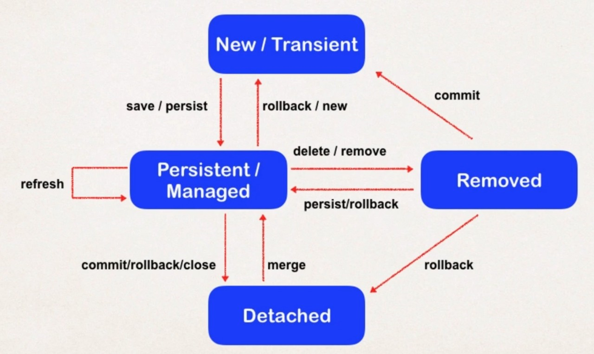

# OneToOne Mapping


## 필요 개념


### Entity Lifecycle

- Detach
  - not associated with a hibernate session
- Merge
  - When detached, merge will reattach to session
- Persist
  - Transitions new instances to managed state
  - Next flush / commit will save in db
- Remove
  - Transitions managed entity to be removed
  - Next flush / commit will delete from db
- Refresh
  - Reload / synch object with data from db
  - Prevents stale data




## Uni-directional


### Development Process

1. Define database tables
2. Create Entity class
3. Create Main App


### 1. Define database tables

- 참조되는 table은 foreign key 필요 x
- 다른 table을 참조하는 쪽에서만 해당 table의 primary key를 foreign key로 가져옴


### 2. Create Entity class

- foreign key를 가지는 table의 entity에만 @OneToOne Mapping 함

  ```java
  @Entity
  @Table(name = "instructor")
  public class Instructor {
  
  	@Id
  	@GeneratedValue(strategy = GenerationType.IDENTITY)
  	@Column(name="id")
  	private int id;
  	
  	@Column(name="first_name")
  	private String firstName;
  	
  	@Column(name="last_name")
  	private String lastName;
  	
  	@Column(name="email")
  	private String email;
  	
  	// setting up mapping to InstructorDetail entity
  	@OneToOne(cascade = CascadeType.ALL)
  	@JoinColumn(name = "instructor_detail_id")
  	private InstructorDetail instructorDetail;
      
  	// create constructors
  	// generate getter/setter methods
  	// generate toString() method
  }
  ```

- By default, no operations are cascaded

- @JoinColumn은 외래키를 매핑할 때 사용됨


### Configure Multiple Cascade Types

```java
@OneToOne(cascade = {CascadeType.DETACH, CascadeType.MERGE,
                     CascadeType.PERSIST, CascadeType.REFRESH, CascadeType.REMOVE})
```


### 3.Create Main App

```java
Instructor tempInstructor = new Instructor("Hong", "Youngjae", "yadang@naver.com");
			
InstructorDetail tempInstructorDetail = new InstructorDetail("www.yadang.com/youtube", "pingpong");

// associate the objects
tempInstructor.setInstructorDetail(tempInstructorDetail);

// start a transaction
session.beginTransaction();

// save the instructor object + also save detail object
session.save(tempInstructor); 


// commit transaction
session.getTransaction().commit();
```


## Bi-directional


### Development Process

1. Make updates to class
   - Add new field
   - Add getter / setter
   - Add @OneToOne annotation
2. Create Main App


### Make update to class

```java
@Entity
@Table(name="instructor_detail")
public class InstructorDetail {

	// define the fields
	// annotate the fields with db column names
	@Id
	@GeneratedValue(strategy = GenerationType.IDENTITY)
	@Column(name="id")
	private int id;
	
	@Column(name="youtube_channel")
	private String youtubeChannel;
	
	@Column(name="hobby")
	private String hobby;
	
	@OneToOne(mappedBy="instructorDetail", cascade=CascadeType.ALL)
	private Instructor instructor;
	
	// create constructors
	// generate getter/setter methods
	// generate toString() method
}
```


### mappedBy

- Look at the `instructorDetail` property in the `Instructor` class
- Use information from the `Instructor` class @JoinColumn
- To help find associated instructor
- !! mappedby = "~~" 에서 ~~은 자신을 참조하는 클래스의 **@OneToOne mapping한 필드명** 이여야 함.