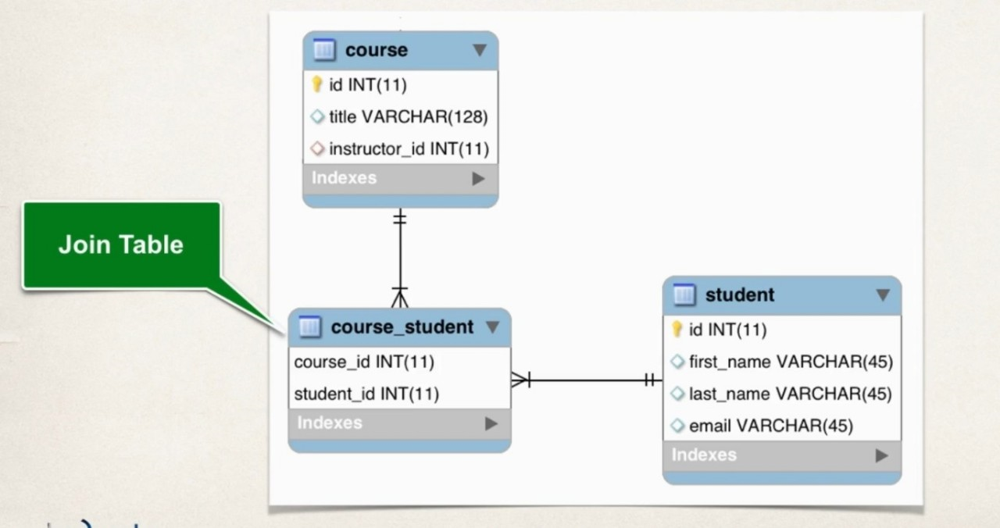

# Many To Many Mapping


## Many To Many


### Keep track of relationships

- Need to track which student is in which course and vice-versa

  => Join Table


### Join Table

- A table that provides a mapping between two tables
- has foreign keys for each table to define the mapping relationship




### Development Process

1. Define database tables
2. Update Course class
3. Update Student class
4. Create Main App


### 1. Define database tables : course_student

- course_id 와 student_id 가 묶여서 PRIMARY KEY로 작동

  ```sql
  CREATE TABLE 'course_student' (
      ...
      PRIMARY KEY ('course_id ', 'student_id '),
      ...
  )
  ```

- 각각에 연결되는 table의 primary키로 foreign key 설정


### 2. Update Course : reference students

```java
@Entity
@Table(name="course")
public class Course {

	...
	
	@ManyToMany(fetch=FetchType.LAZY,
                cascade= {CascadeType.PERSIST , CascadeType.MERGE ,
                          CascadeType.DETACH , CascadeType.REFRESH} )
	@JoinTable(name="course_student" ,
               joinColumns=@JoinColumn(name="course_id"), 
			   inverseJoinColumns = @JoinColumn(name = "student_id") )
	private List<Student> students;
    
    ...
    public void addStudent(Student theStudent){
		if(students == null) {
			students = new ArrayList<>();
		}
		
		students.add(theStudent);
	}
}
```

- @JoinTable
  - 'course_student' table의 'course_id'를 확인해서 나를 참조하는 객체를 확인해라
  - 또한 역으로, 'course_student' table의 'student_id'를 확인해서 최종적으론 나른 참조하는 Student 객체를 받아와라
- inverse
  - refers to the 'other side' of the relationship
  - 지금 Course 쪽에 있다면, inverse는 반대쪽인 Student


### 3. Update Student class : reference courses

```java
@Entity
@Table(name="student")
public class Student {

	...
	
	@ManyToMany(fetch=FetchType.LAZY,
                cascade= {CascadeType.PERSIST ,CascadeType.MERGE ,
                          CascadeType.DETACH , CascadeType.REFRESH} )
	@JoinTable(name="course_student",
               joinColumns=@JoinColumn(name="student_id"),
			   inverseJoinColumns = @JoinColumn(name = "course_id") )
	private List<Course> courses;
}
```

