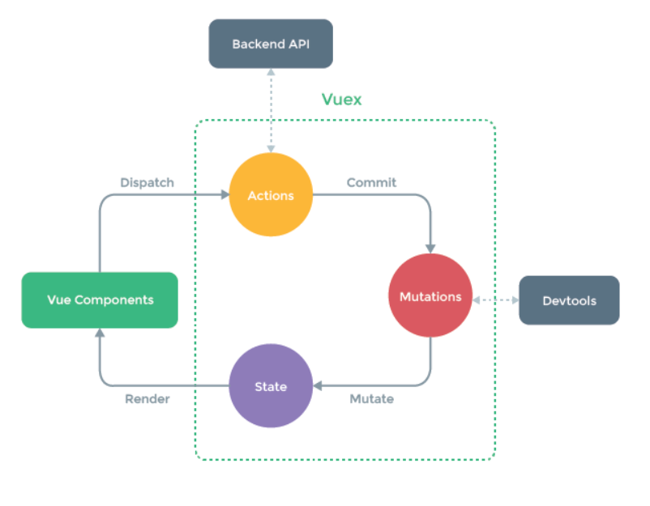

# Vuex


## Vuex Intro


### Vuex

- 'Statement management pattern + Library' for vue.js
  - 상태 관리 패턴 + 라이브러리
- 상태(state = data)를 전역 저장소로 관리할 수 있도록 지원하는 라이브러리
  - 상태가 예측 가능한 방식으로만 변경될 수 있도록 보장하는 규칙 설정
  - 애플리케이션의 모든 컴포넌트에 대한 `중앙 집중식 저장소` 역할
- Vue 공식 devtools와 통합되어 기타 고급 기능을 제공


### State

- state는 곧 data이며 해당 애플리케이션의 핵심이 되는 요소
- 중앙에서 관리하는 모든 상태 정보


### 상태 관리 패턴

- 컴포넌트의 공유된 상태를 추출하고 이를 전역에서 관리 하도록 함
- 컴포넌트는 커다란 view가 되며 모든 컴포넌트는 트리에 상관없이 상태에 액세스 하거나 동작을 트리거 할 수 있음
- 상태 관리 및 특정 규칙 적용과 관련된 개념을 정의하고 분리함으로써 코드의 유지와 유지 관리 기능 향상


### 기존 Pass props & Emit event

- 각 컴포넌트는 독립적으로 데이터를 관리
- 데이터는 단방향 흐름으로 부모 => 자식 간의 전달만 가능하며 반대의 경우 이벤트를 트리거
- 장점
  - 데이터의 흐름을 직관적으로 파악 가능
- 단점
  - 컴포넌트 중첩이 깊어지는 경우 동위 관계의 컴포넌트의 데이터 전달이 불편해짐
- 공통의 상태를 공유하는 여러 컴포넌트가 있는 경우 데이터 전달 구조가 매우 복잡해짐
  - ex) 지나치게 중첩된 컴포넌트를 통과하는 prop
- 단방향 데이터 흐름
  - state는 앱을 작동하는 원본 소스
  - view는 state의 선언적 매핑
  - action은 view에서 사용자 입력에 대해 반응적으로 state를 바꾸는 방법


### Vuex management pattern

- 중앙 저장소(store)에 state를 모아놓고 관리
- 규모가 큰 (컴포넌트 중업이 깊은) 프로젝트에서 매우 효율적
- 각 컴포넌트에서는 중앙 집중 저장소의 state만 신경 쓰면 됨
  - 동일한 state를 공유하는 다른 컴포넌트들도 동기화 됨


## Vuex Core Concepts


### Vuex 핵심 컨셉

1. state
2. Mutaions
3. Actions
4. Getter



### State

- 중앙에서 관리하는 모든 상태 정보 (data)
  - Vuex는 single state tree를 사용
  - 즉, 이 단일 객체는 모든 애플리케이션 상태를 포함하는 '원본 소스'의 역할을 함
  - 이는 각 애플리케이션마다 하나의 저장소만 갖게 된다는 것을 의미함
- 여러 컴포넌트 내부에 있는 특정 state를 중앙에서 관리하게 됨
  - 이전의 방식은 state를 찾기 위해 각 컴포넌트를 직접 확인해야 했음
  - Vuex를 활용하는 방식은 Vuex Store에서 각 컴포넌트에서 사용하는 state를 한 눈에 파악 가능
- State가 변화하면 해당 state를 공유하는 여러 컴포넌트의 DOM은 알아서 렌더링
- 각 컴포넌트는 이제 Vuex Store에서 state 정보를 가져와 사용


### Mutations

- '실제로 state를 변경하는 유일한 방법'
- mutation의 handler(핸들러 함수)는 반드시 동기적이어야 함
  - 비동적 로직(콜백 함수)은 state가 변화하는 시점이 의도한 것과 달라질 수 있으며, 콜백이 실제로 호출 될 시기를 알 수 있는 방법이 없음 (추적할 수 없음)
- 첫번째 인자로 항상 `state` 받음
- Actions에서 `commit()` 메서드에 의해 호출됨


### Actions

- Mutations와 유사하지만 다음과 같은 차이점이 있음

  - state를 변경하는 대신 mutations를 `commit( )` 메서드로 호출해서 실행

  - mutations와 달리 비동기 작업이 포함될 수 있음

    (Backend API와 통신하여 Data Fetching 등의 작업 수행 )

- `context` 객체 인자 받음

  - context 객체를 통해 store.js 파일 내에 있는 모든 요소의 속성 접근 & 메서드 호출이 가능
  - 단, state 직접 변경하진 x (가능은 함) => `명확한 역할 분담`

- 컴포넌트에서 `dispatch( )` 메서드에 의해 호출됨


### Getters

- state를 변경하지 않고 활용하여 계산을 수행 (computed 속성과 유사)
  - 실제 계산된 값을 사용하는 것처럼 getters는 저장소의 상태를 기준으로 계산
  - 예를 들어, state에 todoList라는 해야 할 일의 목록의 경우 완료된 todo 목록만을 필터링해서 출력해야 하는 경우가 있음
  - 이때 getters에 completed(완료 여부 변수)의 값이 true인 요소를 필터링 해서 계산된 값을 담아 놓을 수 있음
- computed 속성과 마찬가지로 getters의 결과는 state 종속성에 따라 캐시(cached)되고, 종속성이 변경된 경우에만 다시 재계산 됨
- getters 자체가 state를 변경하지는 않음
  - state를 특정한 조건에 따라 구분만 함
  - 즉, 계산된 값을 가져옴


## Set project & components


### Init project

1. Create Project

   ```
   $ vue create todo-vuex-app
   $ cd todo-list-vuex-app
   ```

2. Add Vuex plugin in Vue CLI

   ```
   $ vue add vuex
   ```


### Vuex로 인한 변환

1. store 디렉토리 생성
2. index.js 생성


@ Vuex를 사용한다고 해서 Vuex Store에 모든 상태를 넣어야 하는 것은 아님


