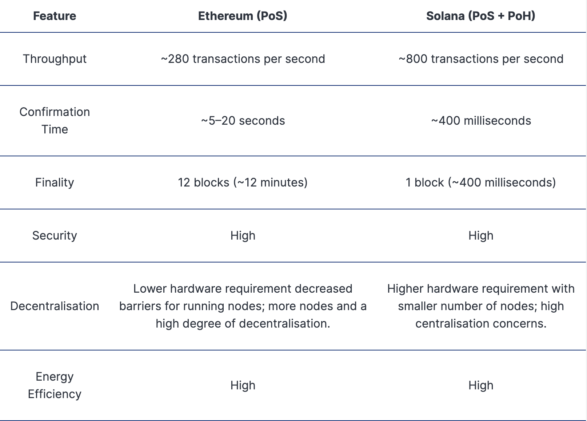

# 개발 용어 정리


[TOC]

## OS & Device

### window architecture

- x86 : 32비트.
- x64(=amd64) : 64비트. 일반적인 데스크탑 / 노트북 전용
- ARM64 : 64비트. 주로 모바일, 임베디드 시스템 혹은 클라우드 컴퓨터

:bulb: 확인 방법 : cmd => `systeminfo`


### mac 주소

- Media Access Control address
- 네트워크 장치에 할당되는 고유 식별자로, 제조 과정에서 하드웨어에 할당되며, 변경이 불가능
- MAC 주소는 각 네트워크 장치의 고유한 "주민등록번호"와 같고, IP 주소는 "주소"와 같다고 할 수 있음

:bulb: many modern devices use a feature called MAC address randomization to create a unique, temporary MAC address for each network


### network 장치 이름 체계

- `wl` : 무선 랜(Wireless LAN)
- `en` : 유선 이더넷
- `p{n}`: PCI 버스 n번 슬롯에 연결된 장치를 의미합니다.
- `s{n}`: 그 슬롯에 있는 장치 n번을 의미합니다. 


## Web Application


### Hateoas (헤이티오스)

- Hypermedia As The Engine of Application State
- API를 실제로 RESTful하게 만드는 REST Appilcation Architecture의 제약 조건
- Hypermedia(링크)를 통해서 애플리케이션의 상태 전이가 가능해야 함
- 자기 자신에 대한 정보를 포함해야 함


### Interrupt vs Dispatch

- Interrupt
  - 어떤 장치가 다른 장치의 일을 잠시 중단 => 자신의 상태 변환 인지시킴
- Dispatch
  - 준비 상태에서 실행 상태로 상태 전이시킴

:bulb: Dispatcher-Servlet

- Dispatch : 보내다
- HTTP 프로토콜로 들어오는 모든 요청을 가장 먼저 받아 적합한 컨트롤러에 위임해주는 Front Controller


### Nginx

- 경량 웹 서버
  - 클라이언트로부터 요청을 받았을 때 요청에 맞는 정적 파일을 응답해주는 HTTP Web Server
  - Reverse Proxy Server로 활용하여 WAS 서버의 부하를 줄일 수 있는 로드 밸런서
- 특징
  - **Event-Driven** 구조로 동작하기 때문에 한 개 또는 고정된 프로세스만 생성하여 사용하고, 비동기 방식으로 요청들을 Concurrency 하게 처리


### proxy

- 클라이언트와 서버 사이에 데이터를 전달해 주는 서버

  - intermediary or an intermediate entity that acts on behalf of another entity or client to access a resource or perform an action

- 프록시 서버를 통해 다른 네트워크 서비스에 간접적으로 접속 O

  


### Web Server & WAS

- 주요 개념

  - web server
    - 웹 브라우저 클라이언트로부터 HTTP 요청을 받아들이고 HTML 문서와 같은 **정적인** 웹 페이지를 반환하는 컴퓨터 프로그램
    - 웹 서버가 동적 컨텐츠를 요청 받으면 WAS에게 해당 요청을 넘겨주고, WAS에서 처리한 결과를 클라이언트에게 전달
  - WAS (web application server)
    - 인터넷 상에서 HTTP 프로토콜을 통해 사용자 컴퓨터나 장치에 애플리케이션을 수행해주는 미들웨어
    - 주로 **동적 서버 컨텐츠를 수행**하는 것으로 웹 서버와 구별이 되며, 주로 데이터베이스 서버와 같이 수행
    - 주로 Web Server + Web Container (Servlet container)

- 별도 web server 필요 이유

  - 서버 부하 방지 
    - WAS는 DB 조회 및 다양한 로직을 처리하는 데 집중해야 한다. 따라서 단순한 정적 컨텐츠는 웹 서버에게 맡기며 기능을 분리시킴
    - 역할
      - **SSL/TLS termination** : let Nginx handle HTTPS certificates
      - **Load balancing** : distribute requests across multiple Spring instances
      - **Static file efficiency** : Nginx serves images/CSS/JS faster and lighter than Spring Boot
      - **Reverse proxy** : hide internal WAS ports, expose only port 80/443

- workflow

  ```
    [ Browser (React, etc.) ]
               |
               v
     -----------------------
     |      Web Server     |   (e.g., Nginx, Apache)
     -----------------------
     | Serves static files |
     | (JS, CSS, images)   |
     | Routes API requests |
     -----------------------
               |
               v
     ---------------------------
     |           WAS           |   (e.g., Tomcat, JBoss, WebLogic)
     ---------------------------
     | Runs backend code       |
     | (Java, Spring, etc.)    |
     | Executes business logic |
     ---------------------------
              |
              v
     -----------------
     |   Database     |
     -----------------
  ```

- backend code와의 동작

  - 기본적인 backend framework들(Spring, fiber)은 WAS로써 동작 가능하며, web server 역할도 수행이 가능하긴 함
  - 다만, web server를 두었을 때의 장점들로 인하여 추가적으로 web server를 두는 경우가 많음


### Web Container (Servlet Container)

- Java 웹 애플리케이션에서 서블릿과 JSP의 생명주기를 관리하고 HTTP 요청을 처리하는 런타임 환경

:bulb: servlet : HTTP 요청을 받아서 동적으로 응답을 생성하는 Java 클래스


## Infrastructure


### 서비스 메시

- 서비스 간의 통신을 제어 / 표시 / 관리 할 수 있게 하는 MSA를 위한 인프라 계층

- 기존 : 서비스간 직접 호출 방식 => 서비스의 proxy끼리 호출 방식 

  ==>서비스의 트래픽을 네트워크단에서 통제 O

- 주요 기능

  - 요청 라우팅 제어
  - 계단식 장애 방지 (서킷 브레이커)
  - 부하 분산 (로드 밸런싱)

  - 보안


### multi-tenancy

- a **single instance (logically) of an application** serves **multiple customers (tenants)**
- 특징
  - Each tenant’s data is isolated and remains invisible to other tenants, but they share the same application and infrastructure.
- Pros
  - Cost-efficient (shared infrastructure)
  - Easier updates and maintenance
  - Centralized control
- Cons
  - More complex to build securely
  - Harder to scale for large tenants
  - Risk of data leakage if not properly isolated


## Database


### DB 종류

- Relational Database
  - uses a relational model to organize and store data
  - data is stored in tables with rows and columns, and relationships between tables are established using keys or identifiers
  - flexibility, scalability, and ability to handle complex data relationships.
- NoSQL (Not only SQL)
  -  document-oriented databases. ex) MongoDB
  -  Key-value stores. ex) Redis
  -  그래프 db
  -  시계열 db


### Trigger

- 데이터베이스 관리 시스템(DBMS)에서 데이터베이스의 특정 이벤트가 발생할 때 자동으로 실행되는 일종의 저장 프로시저(Stored Procedure)
- 데이터 일관성 유지, 로그 기록


### Mysql vs oracle

- mysql
  - open-source RDBMS
  - have limitations in handling very large databases or high concurrent loads => small to medium-sized applications
- oracle
  - commercial RDBMS
  - scalability and performance capabilities (partitioning, parallel processing, and caching) => handling enterprise-level workloads


### N:M mapping 사용 X

- Complexity
  - use of intermediate tables or junction tables to represent the relationship between two
- Performance
  - lead to performance issues in JDBC
- 중복된 데이터 (한 개의 학생이 여러 개의 과목을 수강하는 경우, 학생 정보와 과목 정보가 중복되어 중간 테이블), 복잡한 쿼리


### 정규화

- 제 1 정규형
  - 모든 속성(컬럼)은 원자값(Atomic Value)을 가지며, 모든 속성은 중복이 없는 유일한 값
- 2차 정규화(2NF)
  - 부분 종속(Partial Dependency)을 제거하여 테이블의 키(Primary Key)에 대해서만 의존성
- 3차 정규화
  - 이행적 함수적 종속을 제거하여 테이블의 컬럼 간에 종속성을 최소화


## Build / Packaging / Deploy

### Jenkins

- 소프트웨어 개발 시 지속적으로 통합 서비스 제공 툴
  - CI (Continous Integration)
  - 다수 개발자들이 작업할 때 버전 충돌을 방지하기 위해 각자 작업한 내용을 공유 저장소에 빈번히 업로드
- Git 과 같은 버전관리시스템과 연동하여 소스의 커밋을 감지하면 자동적으로 자동화 테스트가 포함된 빌드가 작동되도록 설정


### Maven

- 소스코드 파일을 컴퓨터에서 실행할 수 있는 독립 소프트웨어 가공물로 변환하는 과정 / 결과물
- Build Tool, Dependency Management, Repository system, Plugin framework, 
- Goals < Phases < Lifecycle


### Jar & War

- Jar
  - used for packaging Java class files, resources, and metadata into a single archive file
- War
  - used for packaging and distributing Java web applications.
  - contains web components such as servlets, JSP (JavaServer Pages) files, HTML, CSS, JavaScript, and other web resources
  - be deployed on a Java web server, such as Apache Tomcat or Java EE application servers


## 개발론


### DDD

- Domain Driven Development
  - Domain : 비지니스 Domain으로, 유사한 업무의 집합
  - placing a strong emphasis on the domain or business logic of the application. 

- 특징

  - 현업에서 IT로의 일방향 소통 X, 양방향 지향
    - Loosly Coupling, Highly Cohesive

  - Hexagonal (헥사고날) 아키텍처
    - 비즈니스 로직을 중심에 두고 외부 의존성(데이터베이스, UI, 외부 API 등)을 포트와 어댑터를 통해 분리하여 테스트 가능하고 유연한 시스템을 만드는 소프트웨어 설계 패턴


### programming paradigm

- 절차지향적
  - 절차 지향은 **기능중심**으로 바라보는 방식으로, 무엇을 어떤 절차로 할 지에 초점을 맞춰서 설계한다.
- 객체지향적
  - 객체가 데이터와 로직을 수행하는 함수를 가지게 하여 해당 객체들의 상호작용을 통해 프로그램을 설계


### 주요 디자인 패턴 (java)

- DAO 패턴
  - DAO
    - DB처리를 전문으로 하는 객체
    - 테이블 당 1개씩
  - DTO
    - transferring data between different layers or components of an application, typically across different tiers or services
    - contains only data and has no behavior or business logic.
  - VO
    - represent a value or a piece of data with a specific meaning or behavior 
    - represents a value or a piece of data within the domain model of an application. It may contain behavior, validation logic
- MVC 패턴
  - Model - View - Controller
  - 소프트웨어 시스템을 세 가지 타입의 컴포넌트로 분할하는 소프트웨어 패턴
  - MVC
    - Model : 비지니스 로직 및 데이터 담당
      - encapsulates the data and provides methods
      - responsible for retrieving data from databases or other data sources, performing business logic operations, and updating the data
    - View : 사용자 인터페이스 담당
      - rendering the user interface and displaying the data
    - Controller : 시스템 흐름제어 담당
      - intermediary between the Model and the View
      - receives input from the user through the View =>  processes it, and updates the Model 
- Pojo
  - Plain Old Java Object
  - a simple Java class that does not rely on any particular framework or technology
- 팩토리 패턴
  - creational design pattern in Java that provides an interface for creating objects in a super class, but allows subclasses to alter the type of objects that will be created.
  - 종류
    - Simple Factory
      - a factory class has a static method that creates objects based on some input or parameter, and returns the created objects to the client.
    - Factory Method
      - a factory interface is defined with a method that creates objects, and concrete factory classes implement this interface and provide their own implementation of the factory method
      - Each concrete factory class is responsible for creating objects of a specific type or class.
    - Abstract Factory
      - an abstract factory interface is defined with multiple factory methods that create objects belonging to different families or groups of related objects. 
      - Concrete factory classes implement this interface and provide their own implementation of the factory methods to create objects of specific families or groups.


## 동시성


### process vs thread

- process

  - a unit of execution that has its own memory space (heap)
  - 하나의 프로세서는 한번에 스레드 1개만 실행 가능

- thread

  - a unit of excecution within a process
  - Every thread in a process shares the process's memory

  

### lock

- dead lock 
  - two or more threads are blocked indefinitely, waiting for each other to release a resource
  - 조건 
    - 상호 배제
    - 점유 대기
    - 비선점
    - 순환 대기
  - 참고) https://chanhuiseok.github.io/posts/cs-2/
- Starvation
  - 여러 Thread가 자원을 가질 동안 특정 Thread가 가지지 못하는 경우
- Live Lock
  - 타 Thread가 활성화 되어 있으면, 해당 자원 양도  => 반복적인 양도로 작업 수행 X 경우
  - repeated and unsuccessful attempt to pass each other
- Slipped Condition
  - 멀티 스레드 환경에서 thread가 접근한 자원이 true 상태였지만, 더 이상 자원을 들고 있는게 없는 경우
- Atomic Action
  - 실행 도중 지연되지 않고 한번에 실행
  - 완벽하게 끝내거나 실행되지 않거나만 존재


## Blockchain


### Web3

- 특징

  - 탈중앙화 웹

  - 기존 중앙 집중식 웹 (모든 정보 혹은 분산된 서버의 권한을 한곳에서 관리)과 반대되는 개념

  - 서버(노드)를 수많은 독립형 참여자들이 소유하고 운용
  - 블록체인과 암호화폐 기반


  - 장점
    - 보안성 (암호화)
    - 회복탄력성
    - 검열저항성
    - 개방성 (참여에 대한 허가 X)
    - 프라이버스 보호 (분산된 서버 관리하는 권력자 X)


### Defi

- 슬리피지

  - 주문이 요청 가격과 다른 가격으로 개설 

  - ex. 시장가 주문이 요청된 시점과 주문이 거래소에서 실행된 시점이 다르면 **매수호가/매도호가**가 변경되면서 슬리피지가 발생
- 유니스왑

  - 이더리움 블록체인에서 운영되는 탈중앙 거래소(DEX) 프로토콜로 탈중앙화된 가격 결정 메커니즘을 제공
  - A/B 유동성 풀에서 A,B가 차지하는 비중을 x, y라 할 때 `x*y=k`에서 k 값은 항상 일정하게 유지
  - 선형적으로 확장되지 않고, 더 큰 주문일수록 기하급수적으로 비싸져 더 큰 슬리피지 발생
- 아비트라지 : 무위험 차익 거래
- PGA (Priority Gas Auction)

  - 블록 스페이스 경매

  - **블록에 포함되기 위해 경쟁적으로 가스 가격(gas price)을 올리는 현상**
- 프론트러닝(Front-Running)

  - 수익성 높은 트랜잭션(예: 아비트라지)이 멤풀에 포착될 경우 동일한 트랜잭션을 생성한 채 가스비만 더 높게 제출하여 기회를 가로채는 행위
  - MEV(Miner Extractable Value) 봇들이 이를 수행
- 백러닝(Back-Running)

  - 프론트러닝과 반대로 타겟 트랜잭션 직후에 주문을 넣어 수익을 창출하는 행위
  - ex) 거래 규모가 큰 트랜잭션에 의해 일시적으로 높은 슬리피지가 발생하면 MEV 봇이 그 즉시 반대 주문을 넣어 시세 차익을 챙김
- 샌드위치 공격(Sandwich Attack)

  - 샌드위치 공격은 프론트러닝과 백러닝을 동시에 수행하는 MEV 공격 유형으로 성공했을 경우 두 차례에 결처 수익 발생
  - ex. MEV봇이 유니스왑에서 알트코인A를 대량 구매하는 주문을 포착하면 곧바로 동일한 트랜잭션을 생성하여 주문자를 프론트러닝한다. 이후 기존 주문자가 더 높은 가격에 A를 구매하면 즉시 구매하였던 토큰을 매도하여 시세 차익 챙김
- staking
  - leasing your crypto to the blockchain
  - involves locking up your crypto for a certain period of time to generate passive income
  - pledging your crypto to support the blockchain network
    - validators are chosen based on their stake to create new blocks and validate transactions. By leasing your crypto, you support these validators, who rely on staked assets to maintain network performance
- lending
  -  leasing your crypto to a borrower
  -  pledging your crypto to a certain platform to earn more crypto but with three key differences.
     1. how the crypto is used
        - The platform charges those borrowers interest and splits the earnings with you
     2. let you withdraw your earnings anytime you lik
     3. U.S. regulators perceive them. 
        - They don't seem to view staking as a big threat, but they hate crypto lending.
- Lido
  - 탈중앙화 staking 서비스
  - 이더리움 검증인 자격 기준 : 32ETH
  - 진입장벽은 낮추기 위해 가능한 만큼만 Lido에 스테이킹하면 토큰으로 자격 지분 증정 및 지분에 따른 수익 분배


### DEX

- **Bin steps**

  - **"Bin"**: A price range or bucket where liquidity is deposited.

  - **"Step"**: The difference in price between two adjacent bins.

  - **"10 bps"**: This means **10 bps(basis points)**, or **0.10%**.


### transaction

- MEV 보상
  - Maximal Extractable Value
  - 트랜잭션의 순서를 추가, 제외, 재정렬 함으로써 채굴자(Miner) 또는 검증인(Validator)이 블록 보상 및 거래 수수료 외 블록 생산에서 획득할 수 있는 최대 가치
  - MEV encompasses all the value that can be extracted from block production beyond the standard block reward. This includes:
    1. **Transaction fees** - The base fees paid by users for transaction inclusion
    2. **Arbitrage opportunities** - Profiting from price differences across DEXs
    3. **Liquidations** - Being first to liquidate undercollateralized positions in DeFi protocols
    4. **Sandwich attacks** - Front-running and back-running user transactions to extract value
    5. **Front-running** - Placing transactions ahead of others to benefit from known future price movements


### 통신

- layerzero

  - not a blockchain or ledger. It is a **messaging protocol**.

  - a communication layer — that enables **smart contracts on different blockchains** to send messages to each other.

  - Internet for blockchains

- SATP

  - 개요
    - Secure Asset Transfer Protocol
    - 이기종 블록체인 간의 자산 이전을 안전하게 수행하기 위한 표준 프로토콜
    - 블록체인 간 자산 이전 시 필요한 **상호 인증**, **합의 상태 확인**, **전송 실패 복구 처리** 등을 정의
  - 특징
    - **중립적 구조**: 특정 체인에 종속되지 않고, 여러 구현체에 적용 가능.
    - **안정성 강화**: 두 체인 모두에서 전송 상태를 확인하고 확정 처리하여 자산 손실 방지.
  - 단계
    1. Initialization (초기화)
    2. Lock (자산 잠금)
    3. Verification (검증)
    4. Transfer/Unlock (이전 또는 해제)
    5. Acknowledgment (승인 확인)
    6. Completion or Rollback (완료 또는 롤백)

- HTLC (Hashed Timelock Contract)

  - 개요

    - **양방향 블록체인 간 안전한 자산 교환**을 위한 **스마트 계약 구조**로 **해시 잠금(Hashed Lock)**과 **시간 제한(Time Lock)**을 조합하여, **조건부 지불**을 구현
    - **SATP의 구현 방식 중 하나**

  - 특징

    - 암호화폐의 결제 기술 중 하나로 계약을 일정 시간까지로 제한한 타임락(Timelock)과 일정한 해시값이 제시돼야 계약이 성사되는 해시락(hashlock)이 결합된 형태

    - 수취인은 다음 두 가지를 수행해야 fund에 접근 가능 (**Lock → Verify → Unlock 구조를 실현**)

      1. enter the correct passphrase

      2. claim payment within a specific timeframe

  | **항목**           | **SATP**                                                     | **HTLC**                                            | **LayerZero**                                               |
  | ------------------ | ------------------------------------------------------------ | --------------------------------------------------- | ----------------------------------------------------------- |
  | **정의**           | 블록체인 간 자산 이전을 위한 **표준 프로토콜 (IEEE P2140.1)** | 조건부 지불을 위한 **스마트 계약 구조 (기술 기법)** | 체인 간 메시지 전송을 위한 **인터체인 메시징 프로토콜**     |
  | **역할**           | 프로토콜 설계 표준 (상위 프레임워크)                         | SATP에서 사용 가능한 **실제 구현 방법 중 하나**     | SATP와는 별개로 **상용화된 크로스체인 메시징/통신 솔루션**  |
  | **자산 이전 방식** | Lock → Verify → Unlock / Mint                                | 해시 + 타임락 기반 자산 이전                        | 메시지 전송 후 수신 체인에서 실행 (send + receive)          |
  | **보안 모델**      | 중재자 / 증명 기반 / 서명 검증 등 다양하게 설정 가능         | Preimage + Timeout 기반 **조건부 보안**             | Oracle + Relayer (ULN: Ultra Light Node) 사용               |
  | **지원 체인**      | 체인 불문 (이기종 체인 포함)                                 | 주로 UTXO ↔ EVM 등 양방향 대응                      | EVM 위주 + 일부 비EVM 체인도 지원                           |
  | **활용 예시**      | 정부/기관 간 CBDC 송금, 금융기관 간 Cross-chain 자산 이전    | 비신뢰 환경의 P2P 토큰 스왑                         | DeFi 간 메시지 기반 자산 이동 (ex. Stargate, SushiXSwap 등) |
  | **표준화 상태**    | IEEE 표준화 진행 중                                          | 기술적으로 일반화됨                                 | 상용 제품 (LayerZero Labs, 자체 토큰 ZRO 발행)              |

- CCTP (Cross-Chain Transfer Protocol)

  - 개요

    - coinbase사에서 만든 여러 체인간 USDC 전송 프로토콜
    - 소각-발행 방식으로 동작

    :bulb: **공식적으로 SATP를 따르고 있진 않지만**, **SATP의 개념적 모델에 부합**

  - [비교] 브릿지

    - 대표 예시
      - 웜홀(**Wormhole**)
    - 동작 방식
      - 보통 웹 애플리케이션으로 제작되어 사용자가 직접 서명
      - 잠금-발행 방식으로 동작
      - 주로 브릿지를 만든 업체 또는 가디언들에 의해 관리

| **항목**      | **브릿지 발행 USDC.e**        | **CCTP 네이티브 USDC**       |
| ------------- | ----------------------------- | ---------------------------- |
| 발행 주체     | 브릿지 운영사 / 가디언        | Circle                       |
| 발행 방식     | lock + mint                   | burn + mint                  |
| 유동성 통합성 | 체인 별 분리                  | 1:1 native, 자산 통합        |
| 신뢰 대상     | 브릿지 운영자                 | Circle, 중앙화된 옵저버      |
| UX            | UI 중심, 다소 복잡            | API 중심, 단순·개발자 친화적 |
| 수수료 구조   | LP스왑, 브릿지 운영 비용 발생 | 온체인 가스비만 발생         |

- 웜홀

  - 개요

    - 대표적인 크로스체인 브릿지
    - **“Guardian Network”** 라는 것을 운영함.

  - 가디언

    - 크로스체인 브릿지에서 트랜잭션을 감시하고 검증하며, 새로운 체인에서 토큰을 발행하거나 해제하는 역할을 맡은 신뢰 주체 (노드)

    - **브릿지 시스템에서 두 체인 간의 상태 변화(예: 토큰 락업)를 감지하고, 그에 따라 반대편 체인에서 mint 또는 unlock을 수행하는 역할**

  - Guardian Network

    - 이 네트워크는 19개의 독립된 가디언 노드로 구성되어 있음.
    - 이들은 다음과 같은 일을 수행함:

      1. 체인 A에서 USDC가 락업되었는지 감시
      2. 이를 관찰 후 서명된 메시지(VAA: Verifiable Action Approval)를 생성

       3. 체인 B에서 이 메시지를 기반으로 USDC를 mint


  - 보안 취약점
    - Guardian Network 서명에 취얌점이 발견되어 수십억 탈취 사건 존재


### 지갑

- 수탑형 vs 비수탑형
  - 수탑형 - 지갑에 대한 관리를 제 3자에게 위임 (ex. 거래소)
  - 비수탑형 - 개인키를 본인이 직접 관리
- 핫 vs 콜드
  - 핫 월렛 : 인터넷 연결이 되어 온라인으로 암호화폐를 주고 받을 수 있는 지갑 (ex. 메타마스트)
  - 콜드 월렛 : 인터넷이 차단된 하드웨어 장치에 개인키를 보관 (ex. 디세트, 나노렛저)


### 네트워크

- 솔라나

  - Pos + PoH 합의 알고리즘으로 이더리움보다 더 빠른 처리 속도

    

  - based on the **Berkeley Packet Filter (BPF)**, an efficient virtual machine optimized for high-performance and **parallel execution**.

  - BPF is compatible with Rust and C

  :bulb: 하지만 이미 이더리움이 Defi와 NFT등의 영역에서 압도적인 시장 점유자

- tron

  - TRON is a public blockchain dedicated to providing the underlying infrastructure that enables developers to **create smart contracts and decentralized applications**, freely publish, own, and store data & other content.
  - TRON deploys a **Delegated Proof-of-Stake (DPoS) consensus mechanism** to avoid the issue of low transaction throughput times and high transaction fees amongst Proof-of-Work (PoW) public blockchains (e.g., Bitcoin).
  - 거래소간 송금 시 사용됨
  - why is it fast
    - DPoS
      - **27 Super Representatives (SRs)** are elected
      - prioritizes **speed over decentralization**.
    - TVM
      - Tron Virtual Machine (TVM) is optimized for speed.

- L2 (Layer 2)

  - Base
    - Coinbase가 개발한 L2 블록체인 (Optimism 기반).
    - Ethereum과 호환되며, Coinbase 생태계와 통합.
  - Polygon
    - Ethereum의 확장 솔루션을 제공하는 프로젝트.
    - PoS 체인, zkEVM, CDK 등 다양한 L2 기술 보유.
  - Arbitrum
    - (Optimistic Rollup 방식).
    - 빠르고 저렴한 트랜잭션, Ethereum 메인넷 보안 유지.
  - Blast


    - Scroll


- BNB Chain

  - **BNB Beacon Chain(관리 및 거버넌스)** + **BNB Smart Chain(BSC)**로 구성
    - **BSC (Binance Smart Chain)**
      - 바이낸스에서 개발한 EVM 호환 블록체인.
      - 빠른 트랜잭션 처리와 저렴한 수수료가 장점.

  - 바이낸스 생태계 전반을 포괄하며, DeFi, GameFi, SocialFi 등 다양한 프로젝트 포함

- 카이아

  - 카카오 + 라인 통합 네트워크
  - SNS 통합된 dApp 서비스 제공


### 주요 표준

- **EIP-1559**

  - 이더리움의 **가스 수수료 구조를 근본적으로 개편**한 제안

  | **항목**           | **EIP-1559 이전**       | **EIP-1559 이후**            |
  | ------------------ | ----------------------- | ---------------------------- |
  | 수수료 결정 방식   | **경매식(PGA)**         | **기본 수수료 + 팁**         |
  | 수수료 예측 가능성 | 낮음                    | 높음                         |
  | 채굴자 수익        | 사용자가 낸 전체 가스비 | 팁(Tip)만 가져감             |
  | ETH 공급량         | 일정                    | **일부 수수료 소각(Burn)**됨 |

- ERC1967 - Standard Proxy Storage Slots

:bulb: EIP vs ERC

- EIP (Ethereum Improvement Proposal): 이더리움의 전체적인 기술 제안서
- ERC (Ethereum Request for Comments) : EIP 중에서 스마트컨트랙트 인터페이스로 정리된 것


